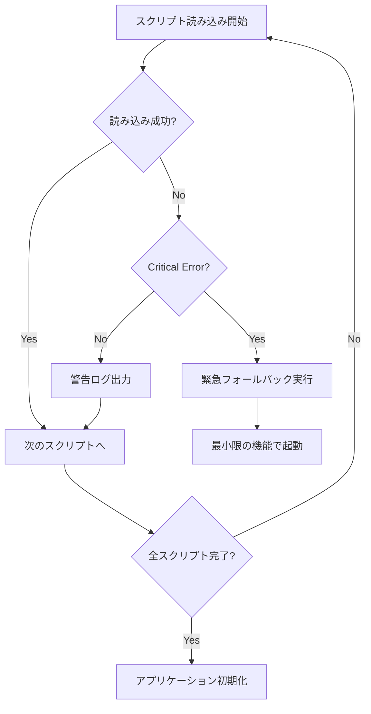

# 設計書

## 概要

HaQei Analyzer の JavaScript モジュール読み込みエラーとデータ読み込み失敗を解決するための包括的な設計。ES6 モジュール構文の互換性問題、MIME タイプエラー、データファイル読み込み失敗、スクリプト依存関係の問題を体系的に解決する。

## アーキテクチャ

### 全体構成

```
HaQei Analyzer
├── HTML Entry Point (analyzer.html)
├── Script Loading Manager
├── Data Loading System
├── Error Handling System
├── Module Compatibility Layer
└── Performance Monitoring
```

### 主要コンポーネント

1. **Script Loading Manager**: スクリプトの読み込み順序と依存関係を管理
2. **Module Compatibility Layer**: ES6 と ES5 の互換性を提供
3. **Data Loading System**: データファイルの読み込みとフォールバック処理
4. **Error Handling System**: 詳細なエラー追跡とデバッグ情報
5. **Performance Monitor**: 読み込み時間とパフォーマンスの監視

## コンポーネントとインターフェース

### 1. Script Loading Manager

```javascript
class ScriptLoadingManager {
    constructor(options = {}) {
        this.loadingQueue = [];
        this.loadedScripts = new Set();
        this.dependencies = new Map();
        this.options = options;
    }

    // スクリプトの依存関係を定義
    defineDependencies(scriptPath, dependencies = [])

    // スクリプトを読み込みキューに追加
    enqueueScript(scriptPath, options = {})

    // 依存関係に基づいてスクリプトを順次読み込み
    loadScripts()

    // 読み込み状態の確認
    getLoadingStatus()
}
```

### 2. Module Compatibility Layer

```javascript
class ModuleCompatibilityLayer {
    constructor() {
        this.moduleRegistry = new Map();
        this.exportRegistry = new Map();
    }

    // ES6 importをES5互換に変換
    transformImport(importStatement)

    // ES6 exportをES5互換に変換
    transformExport(exportStatement)

    // モジュールの登録
    registerModule(moduleName, moduleObject)

    // モジュールの取得
    getModule(moduleName)
}
```

### 3. Data Loading System

```javascript
class DataLoadingSystem {
    constructor(options = {}) {
        this.dataRegistry = new Map();
        this.loadingPromises = new Map();
        this.fallbackData = new Map();
        this.options = options;
    }

    // データファイルの読み込み
    loadDataFile(filePath, fallbackData = null)

    // 全データファイルの一括読み込み
    loadAllDataFiles()

    // データの存在確認
    validateDataAvailability()

    // フォールバックデータの設定
    setFallbackData(dataKey, fallbackValue)
}
```

### 4. Error Handling System

```javascript
class ErrorHandlingSystem {
    constructor() {
        this.errorLog = [];
        this.warningLog = [];
        this.debugMode = false;
    }

    // エラーの記録と処理
    handleError(error, context = {})

    // 警告の記録
    handleWarning(warning, context = {})

    // デバッグ情報の出力
    logDebugInfo(info, level = 'info')

    // エラーレポートの生成
    generateErrorReport()
}
```

## データモデル

### スクリプト読み込み設定

```javascript
const SCRIPT_LOADING_CONFIG = {
  // 読み込み順序の定義
  loadingOrder: [
    "utilities", // validators.js, animations.js
    "data", // data_box.js, questions.js, vectors.js
    "base", // BaseComponent.js
    "core", // DataManager.js, StorageManager.js
    "engines", // Calculator.js, TripleOSEngine.js
    "components", // WelcomeScreen.js, QuestionFlow.js
    "app", // app.js
  ],

  // 依存関係の定義
  dependencies: {
    "DataManager.js": ["data_box.js", "questions.js"],
    "TripleOSEngine.js": ["DataManager.js", "Calculator.js"],
    "QuestionFlow.js": ["BaseComponent.js", "DataManager.js"],
    "app.js": ["*"], // すべてのスクリプトに依存
  },

  // タイムアウト設定
  timeouts: {
    scriptLoading: 5000,
    dataLoading: 10000,
    initialization: 15000,
  },
};
```

### データファイル設定

```javascript
const DATA_FILES_CONFIG = {
  required: [
    {
      path: "js/data/data_box.js",
      globalVar: "HAQEI_DATA",
      fallback: "createEmptyHaqeiData()",
      critical: true,
    },
    {
      path: "js/data/questions.js",
      globalVar: "WORLDVIEW_QUESTIONS",
      fallback: "createEmptyQuestions()",
      critical: true,
    },
    {
      path: "js/data/vectors.js",
      globalVar: "H64_8D_VECTORS",
      fallback: "createEmptyVectors()",
      critical: true,
    },
  ],

  optional: [
    {
      path: "js/data/hexagram_details.js",
      globalVar: "HEXAGRAM_DETAILS",
      fallback: null,
      critical: false,
    },
  ],
};
```

## エラーハンドリング

### エラー分類

1. **Critical Errors**: アプリケーションの動作を停止させるエラー

   - 必須クラスの読み込み失敗
   - 重要なデータファイルの読み込み失敗

2. **Warning Errors**: 機能制限はあるが動作継続可能

   - オプショナルデータの読み込み失敗
   - 非重要機能の初期化失敗

3. **Info Messages**: 正常動作の確認情報
   - 読み込み完了通知
   - パフォーマンス情報

### エラー処理フロー



## テスト戦略

### 1. ユニットテスト

- **ScriptLoadingManager**: 依存関係解決の正確性
- **ModuleCompatibilityLayer**: ES6/ES5 変換の正確性
- **DataLoadingSystem**: データ読み込みとフォールバック
- **ErrorHandlingSystem**: エラー分類と処理

### 2. 統合テスト

- **完全起動シーケンス**: 全スクリプトの正常読み込み
- **エラー回復**: 各種エラー状況での回復動作
- **パフォーマンス**: 読み込み時間の測定

### 3. ブラウザ互換性テスト

- **モダンブラウザ**: Chrome, Firefox, Safari, Edge
- **レガシーブラウザ**: IE11, 古いモバイルブラウザ
- **ES6 サポート**: モジュール機能の利用可否

## 実装戦略

### Phase 1: 緊急修正（Critical Path）

1. **ES6 構文の修正**

   - RelationshipVisualizationEngine.js の import 文を削除
   - CompatibilityDataLoader.js の export 文を削除
   - グローバル変数による依存関係に変更

2. **データファイル読み込み修正**
   - data_box.js の正しいパス設定
   - 必須データファイルの存在確認
   - フォールバックデータの実装

### Phase 2: 構造改善（Stability）

1. **Script Loading Manager の実装**

   - 依存関係に基づく読み込み順序制御
   - 読み込み状態の詳細追跡
   - タイムアウト処理の改善

2. **エラーハンドリングの強化**
   - 構造化されたエラー情報
   - ユーザーフレンドリーなメッセージ
   - デバッグ情報の充実

### Phase 3: 最適化（Performance）

1. **パフォーマンス改善**

   - 非同期読み込みの活用
   - 不要な処理の削除
   - キャッシュ機能の実装

2. **開発者体験の向上**
   - 詳細なログ出力
   - 開発モードの実装
   - 自動テスト環境

## セキュリティ考慮事項

1. **スクリプトインジェクション防止**

   - 動的スクリプト読み込み時の検証
   - CSP（Content Security Policy）の適用

2. **データ検証**
   - 読み込みデータの構造検証
   - 不正データの検出と除外

## パフォーマンス最適化

1. **読み込み時間の短縮**

   - 並列読み込みの活用
   - 重要度に基づく優先順位付け
   - 遅延読み込みの実装

2. **メモリ使用量の最適化**
   - 不要なデータの解放
   - キャッシュサイズの制限
   - ガベージコレクションの考慮

## 監視とメトリクス

1. **読み込み時間の測定**

   - スクリプト別読み込み時間
   - 総初期化時間
   - ユーザー体験指標

2. **エラー率の追跡**
   - エラー発生頻度
   - エラー種別の分析
   - 回復成功率

## 今後の拡張性

1. **モジュールシステムの段階的導入**

   - ES6 モジュールへの移行計画
   - バンドラーの導入検討
   - TypeScript への移行準備

2. **開発ツールの整備**
   - 自動テスト環境
   - CI/CD パイプライン
   - コード品質管理
