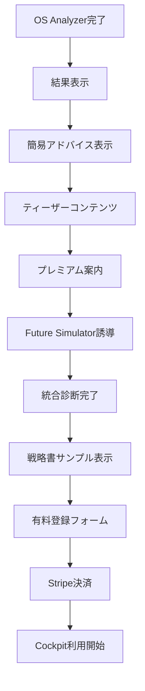

# HAQEI詳細戦略 Part4: プロダクト機能詳細要件とUX設計

## 全体アーキテクチャ設計

### システム構成
```
無料版（LP機能）
├─ os_analyzer.html（改良版）
├─ future_simulator.html（改良版）
└─ index.html（導線強化版）

有料版（収益化機能）
├─ cockpit.html（戦略生成）
├─ dashboard.html（履歴管理）
└─ settings.html（プラン管理）

共通システム
├─ authentication.js（JWT認証）
├─ payment.js（Stripe統合）
└─ analytics.js（行動分析）
```

## 無料版改善の詳細要件

### OS Analyzer改善要件

#### 1. 簡易アドバイス機能
**実装場所**: 結果画面の Triple OS 表示直後

**データ構造**
```javascript
const quickAdvice = {
  engineOS: {
    "乾為天": {
      title: "天のリーダーシップ",
      advice: "大胆な決断力を活かし、新しい挑戦をリードする時期。恐れずに前進を。",
      action: "今週、延ばしていた重要な決断を1つ実行してみましょう",
      premium_teaser: "詳細な行動戦略と最適タイミングはプレミアム版で"
    },
    "坤為地": {
      title: "地の包容力",
      advice: "協調性と忍耐力で周囲をサポートする役割を果たす時期。",
      action: "チームメンバーとの対話時間を意識的に増やしてみましょう",
      premium_teaser: "あなたの影響力を最大化する具体的な方法をプレミアム版で"
    },
    // ... 8パターン全て
  },
  interfaceOS: {
    // 同様の構造
  },
  safeModeOS: {
    // 同様の構造
  }
};
```

**表示UI**
```html
<!-- 各OS表示の下に追加 -->
<div class="quick-advice-section">
  <h4 class="advice-title">{title}</h4>
  <p class="advice-text">{advice}</p>
  <div class="action-suggestion">
    <strong>今すぐできること:</strong>
    <p>{action}</p>
  </div>
  <div class="premium-teaser">
    <p class="teaser-text">{premium_teaser}</p>
    <button class="premium-btn">詳細戦略を見る ¥2,980/月</button>
  </div>
</div>
```

#### 2. 統計的位置づけ表示
**実装内容**
```javascript
const osStatistics = {
  "乾為天": { percentage: 12, rarity: "rare", description: "リーダータイプは全体の12%" },
  "坤為地": { percentage: 18, rarity: "common", description: "サポータータイプは最多の18%" },
  // ... 全パターン
};

function displayStatistics(osType) {
  const stats = osStatistics[osType];
  return `
    <div class="statistics-display">
      <div class="percentage-circle">${stats.percentage}%</div>
      <p class="stats-description">${stats.description}</p>
      <span class="rarity-badge rarity-${stats.rarity}">${stats.rarity}</span>
    </div>
  `;
}
```

#### 3. ティーザーコンテンツ実装
**結果表示の20%をぼかし加工**
```css
.result-teaser {
  position: relative;
}

.result-blur {
  filter: blur(3px);
  opacity: 0.6;
}

.unlock-overlay {
  position: absolute;
  top: 0;
  left: 0;
  width: 100%;
  height: 100%;
  background: linear-gradient(transparent 60%, rgba(59, 130, 246, 0.9) 100%);
  display: flex;
  align-items: flex-end;
  justify-content: center;
  padding: 20px;
}

.unlock-btn {
  background: #3B82F6;
  color: white;
  padding: 12px 24px;
  border-radius: 8px;
  font-weight: bold;
  cursor: pointer;
}
```

#### 4. 結果保存機能
**localStorage実装**
```javascript
class ResultStorage {
  static save(result) {
    const storage_key = `haqei_os_result_${Date.now()}`;
    const data = {
      timestamp: Date.now(),
      result: result,
      expires: Date.now() + (30 * 24 * 60 * 60 * 1000) // 30日
    };
    localStorage.setItem(storage_key, JSON.stringify(data));
    this.updateIndex(storage_key);
  }

  static getHistory() {
    const keys = this.getValidKeys();
    return keys.map(key => JSON.parse(localStorage.getItem(key)));
  }

  static cleanup() {
    // 30日経過したデータを自動削除
    const keys = Object.keys(localStorage).filter(key => 
      key.startsWith('haqei_os_result_'));
    keys.forEach(key => {
      const data = JSON.parse(localStorage.getItem(key));
      if (Date.now() > data.expires) {
        localStorage.removeItem(key);
      }
    });
  }
}
```

### Future Simulator改善要件

#### 1. シナリオ推奨度システム
**スコア算出ロジック**
```javascript
function calculateScenarioRecommendation(scenario, userContext) {
  const factors = {
    osCompatibility: calculateOSMatch(scenario.hexagram, userContext.tripleOS),
    situationAlignment: analyzeSituationMatch(scenario.theme, userContext.situation),
    personalityFit: assessPersonalityAlignment(scenario.approach, userContext.personality),
    timingRelevance: evaluateTimingFactor(scenario.timing, userContext.currentPhase)
  };

  const weightedScore = 
    factors.osCompatibility * 0.4 +
    factors.situationAlignment * 0.3 +
    factors.personalityFit * 0.2 +
    factors.timingRelevance * 0.1;

  return {
    score: Math.round(weightedScore * 100),
    badge: getRecommendationBadge(weightedScore),
    reason: generateRecommendationReason(factors)
  };
}

function getRecommendationBadge(score) {
  if (score > 0.8) return "最適";
  if (score > 0.6) return "おすすめ";
  if (score > 0.4) return "検討推奨";
  return "参考程度";
}
```

**UI実装**
```html
<!-- 各シナリオカードに追加 -->
<div class="scenario-card">
  <div class="recommendation-header">
    <span class="recommendation-badge badge-optimal">最適</span>
    <span class="recommendation-score">適合度: 87%</span>
  </div>
  
  <h3 class="scenario-title">{scenario.title}</h3>
  <p class="scenario-description">{scenario.description}</p>
  
  <div class="recommendation-reason">
    <p><strong>推奨理由:</strong> {reason}</p>
  </div>
  
  <div class="premium-teaser">
    <p>詳細な選択戦略と実行プランは<a href="#premium">プレミアム版</a>で</p>
  </div>
</div>
```

#### 2. OSタイプ連携ティーザー
**実装内容**
```javascript
function generateOSConnectionTeaser(scenario, userOS) {
  const connections = {
    "乾為天": {
      "天雷无妄": "あなたのリーダーシップ（乾為天）とこのシナリオの純粋性（天雷无妄）が共鳴",
      "火天大有": "天のエネルギー同士の相性は抜群。大きな成果が期待できます"
    },
    // ... 他のOSパターン
  };

  return {
    connection_text: connections[userOS.engine][scenario.hexagram],
    compatibility_level: calculateCompatibility(userOS, scenario),
    detailed_analysis_teaser: "この相性の詳細分析と活用法はプレミアム版で確認できます"
  };
}
```

#### 3. 決断サポートヒント
**各シナリオに1行ヒント追加**
```javascript
const decisionHints = {
  "天雷无妄": {
    hint: "直感を信じて素直に行動する局面",
    situation: "迷いが生じた時ほど、最初の純粋な気持ちに戻る"
  },
  "火天大有": {
    hint: "大胆な計画を立てて実行に移すタイミング", 
    situation: "小さく考えず、理想を現実にする大きなビジョンを描く"
  },
  // ... 全384パターン
};
```

#### 4. 時系列予測グラフ（簡易版）
**Chart.js実装**
```javascript
function createTimelinePreview(scenario) {
  const ctx = document.getElementById('timelineChart').getContext('2d');
  const chart = new Chart(ctx, {
    type: 'line',
    data: {
      labels: ['現在', '1ヶ月後', '3ヶ月後', '6ヶ月後', '1年後'],
      datasets: [{
        label: 'このシナリオの展開予測',
        data: scenario.timeline_data,
        borderColor: '#3B82F6',
        backgroundColor: 'rgba(59, 130, 246, 0.1)',
        tension: 0.4
      }]
    },
    options: {
      responsive: true,
      plugins: {
        legend: { display: false },
        tooltip: {
          callbacks: {
            afterLabel: function(context) {
              return '詳細な変化要因はプレミアム版で';
            }
          }
        }
      }
    }
  });
}
```

## 有料版（Cockpit）の詳細機能仕様

### 核心機能: 個別戦略書生成

#### Gemini API統合システム
**プロンプトテンプレート設計**
```javascript
const STRATEGIC_PROMPT_TEMPLATE = `
# HAQEI個別戦略生成システム v1.0

## 分析対象データ
- Engine OS: {engine_os} - {engine_description}
- Interface OS: {interface_os} - {interface_description}  
- Safe Mode OS: {safe_mode_os} - {safe_mode_description}
- 現在状況: {user_situation}
- 状況卦: {situation_hexagram} - {hexagram_meaning}
- 変爻: {changing_lines}
- 選択シナリオ: {chosen_scenario}

## 出力フォーマット（15ページ構成）

### 1. エグゼクティブサマリー（1ページ）
あなたの戦略的ポジション3行要約

### 2. Triple OS統合分析（3ページ）
#### 2.1 Engine OS深層分析
- 根源的動機と価値観
- 意思決定パターン
- エネルギー源泉

#### 2.2 Interface OS適応戦略  
- 対外的コミュニケーション最適化
- 状況別対応パターン
- 関係性構築戦略

#### 2.3 Safe Mode OS危機管理
- ストレス反応パターン
- リスク回避戦略
- 回復力強化方法

### 3. 現状状況分析（2ページ）
#### 3.1 易経的状況把握
{hexagram_name}の状況における立ち位置

#### 3.2 変化の兆しと対応
変爻{changing_lines}が示す変化への準備

### 4. 個別行動戦略（6ページ）
#### 4.1 短期戦略（1-3ヶ月）
明日からできる具体的アクション15項目

#### 4.2 中期戦略（3-12ヶ月）  
四半期ごとのマイルストーン設定

#### 4.3 長期戦略（1-3年）
人生ビジョンの実現ロードマップ

### 5. リスク対策（2ページ）
#### 5.1 想定リスクと対策
#### 5.2 Triple OS別ストレス管理法

### 6. 成功指標とモニタリング（1ページ）
#### 6.1 KPI設定
#### 6.2 定期見直しポイント

## HaQei哲学統合指示
- 易経の変化思想を現代的に解釈
- 5000年の知恵を実用的アドバイスに変換
- 論理性と直感性のバランス
- 個別性と普遍性の融合

## 文体・トーン
- 権威的すぎず、親しみやすく
- 具体的で実践的
- 励ましと現実的視点のバランス
- あなた専用感の強調

以上の構成で、{user_name}さん専用の戦略書を生成してください。
`;
```

#### PDF生成システム
**jsPDF実装**
```javascript
class StrategicReportGenerator {
  constructor(geminiResponse, userData) {
    this.content = geminiResponse;
    this.user = userData;
    this.pdf = new jsPDF({
      format: 'a4',
      unit: 'mm'
    });
  }

  async generatePDF() {
    await this.addCoverPage();
    await this.addExecutiveSummary(); 
    await this.addTripleOSAnalysis();
    await this.addSituationAnalysis();
    await this.addActionStrategy();
    await this.addRiskManagement();
    await this.addKPISection();
    
    return this.pdf.output('blob');
  }

  async addCoverPage() {
    this.pdf.addPage();
    this.pdf.setFillColor(59, 130, 246);
    this.pdf.rect(0, 0, 210, 297, 'F');
    
    this.pdf.setTextColor(255, 255, 255);
    this.pdf.setFontSize(28);
    this.pdf.text('あなた専用戦略書', 105, 100, { align: 'center' });
    
    this.pdf.setFontSize(16);
    this.pdf.text(`${this.user.name}様`, 105, 120, { align: 'center' });
    
    this.pdf.setFontSize(12);
    this.pdf.text(`生成日: ${new Date().toLocaleDateString('ja-JP')}`, 105, 140, { align: 'center' });
    
    // ロゴやブランディング要素を追加
    await this.addLogo();
  }
}
```

### 継続価値提供システム

#### 月次アップデート機能
**更新スケジューリング**
```javascript
class MonthlyUpdateSystem {
  constructor(userId) {
    this.userId = userId;
    this.lastUpdate = this.getLastUpdateDate();
  }

  async checkForUpdates() {
    const daysSinceUpdate = this.daysSince(this.lastUpdate);
    
    if (daysSinceUpdate >= 30) {
      await this.generateMonthlyUpdate();
    }
  }

  async generateMonthlyUpdate() {
    const currentData = await this.getCurrentUserState();
    const lastAnalysis = await this.getLastAnalysis();
    
    const updatePrompt = `
    ## 月次戦略アップデート
    
    前回分析: ${lastAnalysis.date}
    前回の戦略書のポイント: ${lastAnalysis.keyPoints}
    
    今月の振り返り質問:
    1. 前回の行動計画の実行状況は？
    2. 新たに生じた課題や機会は？
    3. Triple OSの変化や気づきは？
    
    現在の状況: ${currentData.situation}
    
    今月のフォーカス戦略を200文字で提案してください。
    `;

    const monthlyStrategy = await this.callGeminiAPI(updatePrompt);
    await this.saveMonthlyUpdate(monthlyStrategy);
    await this.notifyUser();
  }
}
```

#### AI質問機能（月10回制限）
**チャットボット実装**
```javascript
class AIConsultationChat {
  constructor(userId, planType) {
    this.userId = userId;
    this.monthlyLimit = planType === 'premium' ? 10 : 0;
    this.usedQuestions = this.getMonthlyUsage();
  }

  async askQuestion(question) {
    if (this.usedQuestions >= this.monthlyLimit) {
      throw new Error('月間質問回数上限に達しました');
    }

    const context = await this.getUserContext();
    const consultationPrompt = `
    ## HAQEI AI コンサルテーション
    
    ユーザー情報:
    - Triple OS: ${context.tripleOS}
    - 最新戦略書のポイント: ${context.latestStrategy}
    - 過去の質問履歴: ${context.questionHistory}
    
    質問: ${question}
    
    HaQei哲学に基づいた実践的なアドバイスを200文字以内で提供してください。
    必要に応じて、易経の知恵や具体的アクションを含めてください。
    `;

    const response = await this.callGeminiAPI(consultationPrompt);
    await this.recordQuestionUsage(question, response);
    
    return response;
  }
}
```

## UX設計・画面遷移フロー

### 無料版→有料版転換フロー

#### 転換ポイント設計


#### 決済フロー詳細設計
**Stripe統合**
```javascript
class PaymentFlow {
  constructor() {
    this.stripe = Stripe(process.env.STRIPE_PUBLISHABLE_KEY);
  }

  async initiateSubscription(planId, userEmail) {
    const { error, paymentMethod } = await this.stripe.createPaymentMethod({
      type: 'card',
      card: this.cardElement,
      billing_details: {
        email: userEmail,
      },
    });

    if (error) {
      throw new Error(error.message);
    }

    const response = await fetch('/api/create-subscription', {
      method: 'POST',
      headers: { 'Content-Type': 'application/json' },
      body: JSON.stringify({
        payment_method: paymentMethod.id,
        email: userEmail,
        price_id: planId
      }),
    });

    const subscription = await response.json();
    
    if (subscription.error) {
      throw new Error(subscription.error.message);
    }

    return subscription;
  }
}
```

### 有料版UX設計

#### Dashboard設計
**情報アーキテクチャ**
```html
<div class="dashboard-layout">
  <aside class="sidebar">
    <nav class="nav-menu">
      <a href="/dashboard" class="nav-item active">ダッシュボード</a>
      <a href="/cockpit" class="nav-item">戦略コックピット</a>
      <a href="/history" class="nav-item">分析履歴</a>
      <a href="/consultation" class="nav-item">AI相談 (7/10回)</a>
      <a href="/settings" class="nav-item">設定</a>
    </nav>
  </aside>
  
  <main class="main-content">
    <header class="content-header">
      <h1>戦略ダッシュボード</h1>
      <div class="user-status">
        <span class="plan-badge">プレミアム</span>
        <span class="next-update">次回更新: 2月15日</span>
      </div>
    </header>
    
    <div class="dashboard-grid">
      <section class="current-strategy">
        <h2>今月の戦略フォーカス</h2>
        <div class="strategy-card">
          {現在の戦略要約}
          <button class="action-btn">詳細を見る</button>
        </div>
      </section>
      
      <section class="progress-tracking">
        <h2>進捗トラッキング</h2>
        <div class="progress-items">
          {KPI進捗表示}
        </div>
      </section>
      
      <section class="quick-actions">
        <h2>クイックアクション</h2>
        <button class="quick-btn">新しい状況を分析</button>
        <button class="quick-btn">AI に質問</button>
        <button class="quick-btn">戦略書をダウンロード</button>
      </section>
    </div>
  </main>
</div>
```

## 技術仕様・API設計

### 認証システム
**JWT実装**
```javascript
class AuthenticationSystem {
  generateToken(user) {
    const payload = {
      userId: user.id,
      email: user.email,
      plan: user.plan,
      exp: Math.floor(Date.now() / 1000) + (24 * 60 * 60) // 24時間
    };
    
    return jwt.sign(payload, process.env.JWT_SECRET);
  }

  validateToken(token) {
    try {
      const decoded = jwt.verify(token, process.env.JWT_SECRET);
      return decoded;
    } catch (error) {
      throw new Error('Invalid token');
    }
  }

  async refreshToken(oldToken) {
    const decoded = this.validateToken(oldToken);
    const user = await this.getUserById(decoded.userId);
    return this.generateToken(user);
  }
}
```

### API エンドポイント設計
```javascript
// GET /api/user/profile
// POST /api/analysis/os-analyzer
// POST /api/analysis/future-simulator  
// POST /api/strategy/generate
// GET /api/strategy/history
// POST /api/consultation/ask
// POST /api/payment/create-subscription
// POST /api/payment/cancel-subscription
// GET /api/analytics/usage
```

### パフォーマンス最適化
**レスポンス時間目標**
- 無料診断完了: 3秒以内
- 有料戦略書生成: 30秒以内
- ダッシュボード表示: 2秒以内
- AI質問回答: 10秒以内

**実装手法**
```javascript
// キャッシュ戦略
class ResponseCache {
  constructor() {
    this.cache = new Map();
    this.ttl = 30 * 60 * 1000; // 30分
  }

  get(key) {
    const item = this.cache.get(key);
    if (!item || Date.now() > item.expires) {
      this.cache.delete(key);
      return null;
    }
    return item.data;
  }

  set(key, data) {
    this.cache.set(key, {
      data: data,
      expires: Date.now() + this.ttl
    });
  }
}
```

記録日時：2025年8月7日