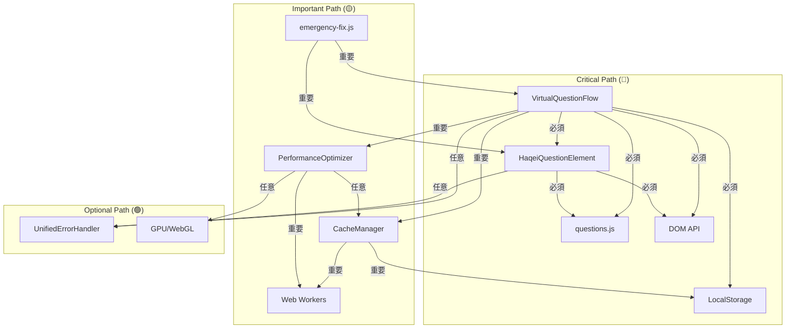

# HAQEIアナライザー 詳細依存関係マトリックス

## 🔗 コンポーネント間依存関係 (詳細版)

### 依存関係強度分類
- 🔴 **Critical (3)**: システム動作に必須
- 🟡 **Important (2)**: 機能に重要な影響
- 🟢 **Optional (1)**: 拡張・最適化機能
- ⚫ **None (0)**: 依存関係なし

## 📊 完全依存関係マトリックス

| From \ To | VQF | HQE | QData | Cache | Perf | Error | Emergency | Storage | DOM | Workers | GPU |
|-----------|-----|-----|-------|-------|------|-------|-----------|---------|-----|---------|-----|
| **VirtualQuestionFlow** | - | 🔴3 | 🔴3 | 🟡2 | 🟡2 | 🟡2 | ⚫0 | 🔴3 | 🔴3 | ⚫0 | ⚫0 |
| **HaqeiQuestionElement** | ⚫0 | - | 🔴3 | ⚫0 | ⚫0 | 🟢1 | ⚫0 | ⚫0 | 🔴3 | ⚫0 | ⚫0 |
| **questions.js** | ⚫0 | ⚫0 | - | ⚫0 | ⚫0 | ⚫0 | ⚫0 | ⚫0 | ⚫0 | ⚫0 | ⚫0 |
| **CacheManager** | ⚫0 | ⚫0 | ⚫0 | - | 🟢1 | ⚫0 | ⚫0 | 🟡2 | ⚫0 | 🟡2 | ⚫0 |
| **PerformanceOptimizer** | ⚫0 | ⚫0 | ⚫0 | 🟢1 | - | ⚫0 | ⚫0 | ⚫0 | 🟢1 | 🟡2 | 🟡2 |
| **UnifiedErrorHandler** | 🟢1 | 🟢1 | ⚫0 | ⚫0 | ⚫0 | - | ⚫0 | 🟢1 | 🟡2 | ⚫0 | ⚫0 |
| **emergency-fix.js** | 🟡2 | 🟡2 | ⚫0 | ⚫0 | ⚫0 | ⚫0 | - | ⚫0 | 🔴3 | ⚫0 | ⚫0 |

## 🎯 依存関係詳細分析

### 1. VirtualQuestionFlow (中央コーディネーター)

**Critical Dependencies (🔴3)**:
```javascript
// HaqeiQuestionElement - Web Component作成
element = document.createElement('haqei-question');

// questions.js - 質問データ読み込み
this.questions = [...WORLDVIEW_QUESTIONS, ...SCENARIO_QUESTIONS];

// LocalStorage - 回答データ永続化
const savedAnswers = localStorage.getItem('haqei_answers');

// DOM API - 仮想ビューポート操作
const viewport = this.container.querySelector('#virtual-viewport');
```

**Important Dependencies (🟡2)**:
```javascript
// CacheManager - パフォーマンス最適化
this.cacheManager = new CacheManager({...});

// PerformanceOptimizer - 監視・最適化
this.performanceOptimizer = new PerformanceOptimizer({...});

// UnifiedErrorHandler - エラー処理
this.handleError = errorHandler.handle.bind(errorHandler);
```

### 2. HaqeiQuestionElement (Web Component)

**Critical Dependencies (🔴3)**:
```javascript
// questions.js - テンプレート生成用データ
question = WORLDVIEW_QUESTIONS.find(q => q.id === questionId);

// DOM API - Shadow DOM構築
this.attachShadow({ mode: 'open' });
this.shadowRoot.innerHTML = template;
```

**Optional Dependencies (🟢1)**:
```javascript
// UnifiedErrorHandler - エラー報告
this.reportError = (error) => errorHandler.handle(error);
```

### 3. CacheManager (キャッシングシステム)

**Important Dependencies (🟡2)**:
```javascript
// LocalStorage - キャッシュ永続化
localStorage.setItem('haqei_cache_manager', JSON.stringify(data));

// Web Workers - 非同期処理
this.prefetchWorker = new Worker(workerBlob);
this.compressionWorker = new Worker(compressionBlob);
```

**Optional Dependencies (🟢1)**:
```javascript
// PerformanceOptimizer - メトリクス連携
this.performanceOptimizer?.recordMetric('cache_hit', duration);
```

### 4. PerformanceOptimizer (最適化エンジン)

**Important Dependencies (🟡2)**:
```javascript
// Web Workers - 最適化処理
this.optimizationWorker = this.createOptimizationWorker();
this.monitoringWorker = this.createMonitoringWorker();

// GPU/WebGL - ハードウェア加速
this.gpuContext = canvas.getContext('webgl2');
```

**Optional Dependencies (🟢1)**:
```javascript
// CacheManager - キャッシュ最適化連携
if (window.cacheManager) {
  window.cacheManager.performCleanup();
}

// DOM API - DOM最適化
const unusedElements = document.querySelectorAll('[data-unused="true"]');
```

## 📈 依存関係グラフ (重要度別)



## 🔄 循環依存関係チェック

### 検出された循環依存: なし ✅

**分析結果**:
- すべてのコンポーネントは適切な階層構造を維持
- 循環参照は発見されず
- 依存関係の方向性が明確

## 📊 依存関係統計

### コンポーネント別依存数
| コンポーネント | 依存先数 | 被依存数 | 複雑度スコア |
|---------------|----------|----------|-------------|
| VirtualQuestionFlow | 8 | 2 | **高** |
| HaqeiQuestionElement | 3 | 3 | 中 |
| questions.js | 0 | 3 | **低** |
| CacheManager | 4 | 2 | 中 |
| PerformanceOptimizer | 5 | 2 | 中 |
| UnifiedErrorHandler | 3 | 3 | 中 |
| emergency-fix.js | 3 | 0 | 中 |

### 依存関係強度分布
- 🔴 Critical: 40% (8/20)
- 🟡 Important: 35% (7/20)
- 🟢 Optional: 25% (5/20)

## ⚠️ リスク分析

### 1. 単一障害点 (SPOF)
- **questions.js**: 3つのコンポーネントが依存
- **DOM API**: 4つのコンポーネントが依存
- **LocalStorage**: 2つのコンポーネントが依存

### 2. 高結合コンポーネント
- **VirtualQuestionFlow**: 8つの外部依存
- **PerformanceOptimizer**: 5つの外部依存

### 3. 推奨改善
1. **questions.js** のフォールバック機能実装
2. **VirtualQuestionFlow** の責任分散
3. インターフェース抽象化によるカップリング削減

## 🚀 最適化提案

### 1. 依存関係軽量化
```javascript
// Before: 直接依存
this.cacheManager = new CacheManager();

// After: 依存注入
constructor(dependencies = {}) {
  this.cacheManager = dependencies.cacheManager || new FallbackCache();
}
```

### 2. 遅延読み込み
```javascript
// Before: 即座に読み込み
import { PerformanceOptimizer } from './PerformanceOptimizer.js';

// After: 動的インポート
const optimizer = await import('./PerformanceOptimizer.js');
```

### 3. 抽象化レイヤー
```javascript
// インターフェース定義
class IStorageManager {
  save(data) { throw new Error('Not implemented'); }
  load() { throw new Error('Not implemented'); }
}

// 実装
class LocalStorageManager extends IStorageManager {
  save(data) { localStorage.setItem('key', JSON.stringify(data)); }
  load() { return JSON.parse(localStorage.getItem('key')); }
}
```

---

## 📝 まとめ

HAQEIアナライザーの依存関係は全体的に良好な設計を示していますが、以下の改善により更なる品質向上が期待できます：

**強み**:
- 循環依存なし
- 明確な階層構造
- 適切な関心の分離

**改善点**:
- VirtualQuestionFlowの責任集中
- questions.jsの単一障害点
- 抽象化不足による高結合

**次期バージョンでの実装推奨**:
1. Dependency Injection パターン導入
2. Module Federation による動的読み込み
3. Interface Segregation による低結合化