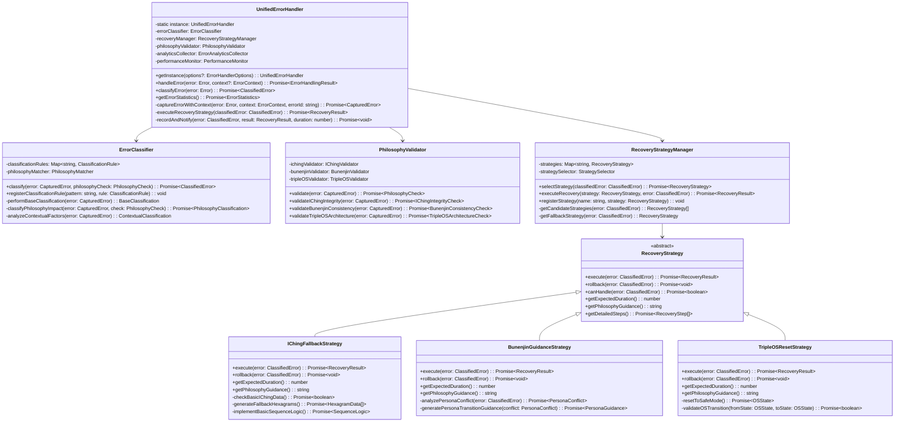

# HAQEIアナライザー - エラーハンドリングクラス設計仕様書

## 🏗️ クラス階層構造



---

## 📋 Core Classes

### 1. UnifiedErrorHandler

```typescript
/**
 * 統一エラーハンドリングシステムの中核クラス
 * Singleton パターンで実装され、全システムのエラー処理を統括
 */
export class UnifiedErrorHandler {
  private static instance: UnifiedErrorHandler;
  
  // Core components
  private errorClassifier: ErrorClassifier;
  private recoveryManager: RecoveryStrategyManager;
  private philosophyValidator: PhilosophyValidator;
  private analyticsCollector: ErrorAnalyticsCollector;
  private performanceMonitor: PerformanceMonitor;
  private cacheManager: CacheManager;
  
  // Configuration and state
  private config: ErrorHandlerConfig;
  private isInitialized: boolean = false;
  private errorHistory: Map<string, CapturedError> = new Map();
  private activeRecoveries: Map<string, RecoveryOperation> = new Map();

  /**
   * Singleton instance getter
   */
  public static getInstance(options?: ErrorHandlerOptions): UnifiedErrorHandler {
    if (!UnifiedErrorHandler.instance) {
      UnifiedErrorHandler.instance = new UnifiedErrorHandler(options);
    }
    return UnifiedErrorHandler.instance;
  }

  private constructor(options: ErrorHandlerOptions = {}) {
    this.config = this.mergeWithDefaultConfig(options);
    this.initializeComponents();
    this.setupGlobalHandlers();
    this.initializePhilosophyIntegration();
  }

  /**
   * メインエラーハンドリングエントリーポイント
   * @param error - 処理するエラー
   * @param context - エラーコンテキスト
   * @returns エラーハンドリング結果
   */
  public async handleError(
    error: Error, 
    context: ErrorContext = {}
  ): Promise<ErrorHandlingResult> {
    const startTime = performance.now();
    const errorId = this.generateErrorId();

    try {
      // 1. Error Capture & Enrichment
      const capturedError = await this.captureErrorWithContext(error, context, errorId);
      this.errorHistory.set(errorId, capturedError);

      // 2. Philosophy Alignment Validation
      const philosophyCheck = await this.philosophyValidator.validate(capturedError);

      // 3. Error Classification
      const classifiedError = await this.errorClassifier.classify(capturedError, philosophyCheck);

      // 4. Recovery Strategy Selection & Execution
      const recoveryResult = await this.executeRecoveryStrategy(classifiedError);

      // 5. Analytics & Performance Recording
      const handlingDuration = performance.now() - startTime;
      await this.recordAndNotify(classifiedError, recoveryResult, handlingDuration);

      return {
        success: recoveryResult.success,
        errorId: errorId,
        classification: classifiedError,
        recoveryResult: recoveryResult,
        philosophyCheck: philosophyCheck,
        handlingDuration: handlingDuration,
        timestamp: new Date().toISOString()
      };

    } catch (handlingError) {
      console.error('Critical error in error handling:', handlingError);
      return await this.executeBasicFallback(error, handlingError, errorId);
    }
  }

  /**
   * エラー分類のみを実行
   */
  public async classifyError(error: Error, context?: ErrorContext): Promise<ClassifiedError> {
    const capturedError = await this.captureErrorWithContext(error, context || {}, this.generateErrorId());
    const philosophyCheck = await this.philosophyValidator.validate(capturedError);
    return await this.errorClassifier.classify(capturedError, philosophyCheck);
  }

  /**
   * エラー統計の取得
   */
  public async getErrorStatistics(timeRange?: TimeRange): Promise<ErrorStatistics> {
    return await this.analyticsCollector.generateStatistics(timeRange);
  }

  /**
   * パフォーマンス監視の開始
   */
  public startPerformanceMonitoring(): void {
    this.performanceMonitor.startMonitoring();
  }

  /**
   * 設定の更新
   */
  public async updateConfiguration(config: Partial<ErrorHandlerConfig>): Promise<void> {
    this.config = { ...this.config, ...config };
    await this.reinitializeWithNewConfig();
  }

  // Private methods...
  private async captureErrorWithContext(
    error: Error, 
    context: ErrorContext, 
    errorId: string
  ): Promise<CapturedError> {
    return {
      id: errorId,
      originalError: error,
      context: {
        ...context,
        timestamp: Date.now(),
        userAgent: navigator?.userAgent,
        url: window?.location?.href,
        viewport: this.getViewportInfo(),
        stackTrace: this.parseStackTrace(error.stack),
        executionContext: this.captureExecutionContext()
      },
      captureTime: Date.now()
    };
  }

  private async executeRecoveryStrategy(classifiedError: ClassifiedError): Promise<RecoveryResult> {
    const strategy = await this.recoveryManager.selectStrategy(classifiedError);
    const recoveryId = this.generateRecoveryId();
    
    this.activeRecoveries.set(recoveryId, {
      id: recoveryId,
      strategy: strategy,
      error: classifiedError,
      startTime: Date.now(),
      status: 'in-progress'
    });

    try {
      const result = await this.recoveryManager.executeRecovery(strategy, classifiedError);
      this.activeRecoveries.get(recoveryId)!.status = result.success ? 'completed' : 'failed';
      return result;
    } catch (recoveryError) {
      this.activeRecoveries.get(recoveryId)!.status = 'failed';
      throw recoveryError;
    } finally {
      setTimeout(() => this.activeRecoveries.delete(recoveryId), 300000); // 5分後にクリーンアップ
    }
  }

  private generateErrorId(): string {
    return `error_${Date.now()}_${Math.random().toString(36).substr(2, 9)}`;
  }

  private generateRecoveryId(): string {
    return `recovery_${Date.now()}_${Math.random().toString(36).substr(2, 9)}`;
  }
}
```

### 2. ErrorClassifier

```typescript
/**
 * エラー分類エンジン
 * エラーを多角的に分析し、適切な分類と優先度を決定
 */
export class ErrorClassifier {
  private classificationRules: Map<string, ClassificationRule>;
  private philosophyMatcher: PhilosophyMatcher;
  private contextAnalyzer: ContextAnalyzer;
  private severityCalculator: SeverityCalculator;

  constructor() {
    this.classificationRules = new Map();
    this.philosophyMatcher = new PhilosophyMatcher();
    this.contextAnalyzer = new ContextAnalyzer();
    this.severityCalculator = new SeverityCalculator();
    this.initializeDefaultRules();
  }

  /**
   * エラーの包括的分類
   * @param error - キャプチャされたエラー
   * @param philosophyCheck - 哲学的整合性チェック結果
   * @returns 分類されたエラー
   */
  public async classify(
    error: CapturedError, 
    philosophyCheck: PhilosophyCheck
  ): Promise<ClassifiedError> {
    
    // 並列で各種分類を実行
    const [
      baseClassification,
      philosophyClassification,
      contextualClassification,
      severityAssessment
    ] = await Promise.all([
      this.performBaseClassification(error),
      this.classifyPhilosophyImpact(error, philosophyCheck),
      this.analyzeContextualFactors(error),
      this.assessSeverity(error, philosophyCheck)
    ]);

    return this.mergeClassifications({
      error,
      philosophyCheck,
      baseClassification,
      philosophyClassification,
      contextualClassification,
      severityAssessment,
      classificationTime: Date.now()
    });
  }

  /**
   * 新しい分類ルールの登録
   */
  public registerClassificationRule(pattern: string, rule: ClassificationRule): void {
    this.classificationRules.set(pattern, rule);
  }

  /**
   * 基本的なエラー分類
   */
  private async performBaseClassification(error: CapturedError): Promise<BaseClassification> {
    const errorMessage = error.originalError.message.toLowerCase();
    const stackTrace = error.originalError.stack?.toLowerCase() || '';

    // JavaScript Runtime Errors
    if (this.isJavaScriptRuntimeError(error)) {
      return {
        category: 'javascript-runtime',
        subcategory: this.classifyJavaScriptError(error),
        confidence: 0.95,
        indicators: this.extractJavaScriptErrorIndicators(error)
      };
    }

    // Network Errors
    if (this.isNetworkError(error)) {
      return {
        category: 'network',
        subcategory: this.classifyNetworkError(error),
        confidence: 0.90,
        indicators: this.extractNetworkErrorIndicators(error)
      };
    }

    // Data Processing Errors
    if (this.isDataProcessingError(error)) {
      return {
        category: 'data-processing',
        subcategory: this.classifyDataError(error),
        confidence: 0.85,
        indicators: this.extractDataErrorIndicators(error)
      };
    }

    // HAQEI-specific Errors
    if (this.isHAQEISpecificError(error)) {
      return {
        category: 'haqei-specific',
        subcategory: this.classifyHAQEIError(error),
        confidence: 0.98,
        indicators: this.extractHAQEIErrorIndicators(error)
      };
    }

    // Fallback to generic classification
    return {
      category: 'generic',
      subcategory: 'unknown',
      confidence: 0.50,
      indicators: ['unknown-error-pattern']
    };
  }

  /**
   * 哲学的影響の分類
   */
  private async classifyPhilosophyImpact(
    error: CapturedError, 
    philosophyCheck: PhilosophyCheck
  ): Promise<PhilosophyClassification> {
    const [ichingImpact, bunenjinImpact, tripleOSImpact] = await Promise.all([
      this.assessIChingImpact(error, philosophyCheck.ichingIntegrity),
      this.assessBunenjinImpact(error, philosophyCheck.bunenjinConsistency),
      this.assessTripleOSImpact(error, philosophyCheck.tripleOSArchitecture)
    ]);

    return {
      ichingImpact,
      bunenjinImpact,
      tripleOSImpact,
      overallPhilosophyImpact: this.calculateOverallPhilosophyImpact(
        ichingImpact, bunenjinImpact, tripleOSImpact
      ),
      requiresPhilosophyGuidance: this.requiresPhilosophyGuidance(
        ichingImpact, bunenjinImpact, tripleOSImpact
      )
    };
  }

  /**
   * 文脈的要因の分析
   */
  private analyzeContextualFactors(error: CapturedError): ContextualClassification {
    return {
      operationContext: this.analyzeOperationContext(error.context),
      userInteractionContext: this.analyzeUserInteractionContext(error.context),
      systemStateContext: this.analyzeSystemStateContext(error.context),
      timingContext: this.analyzeTimingContext(error.context),
      environmentContext: this.analyzeEnvironmentContext(error.context)
    };
  }

  /**
   * エラー重要度の評価
   */
  private async assessSeverity(
    error: CapturedError, 
    philosophyCheck: PhilosophyCheck
  ): Promise<SeverityAssessment> {
    const factors = {
      systemImpact: this.assessSystemImpact(error),
      userImpact: this.assessUserImpact(error),
      dataIntegrityRisk: this.assessDataIntegrityRisk(error),
      philosophyViolationSeverity: this.assessPhilosophyViolationSeverity(philosophyCheck),
      recoverabilityComplexity: this.assessRecoverabilityComplexity(error)
    };

    const calculatedSeverity = this.severityCalculator.calculate(factors);

    return {
      level: calculatedSeverity.level,
      score: calculatedSeverity.score,
      factors: factors,
      justification: calculatedSeverity.justification,
      escalationRequired: calculatedSeverity.level === 'critical'
    };
  }

  // Helper methods for error type detection
  private isJavaScriptRuntimeError(error: CapturedError): boolean {
    const jsErrorPatterns = [
      /reference.*error/i,
      /type.*error/i,
      /syntax.*error/i,
      /range.*error/i,
      /eval.*error/i
    ];
    
    return jsErrorPatterns.some(pattern => 
      pattern.test(error.originalError.message) || 
      pattern.test(error.originalError.name)
    );
  }

  private isNetworkError(error: CapturedError): boolean {
    const networkErrorPatterns = [
      /network/i,
      /fetch/i,
      /cors/i,
      /timeout/i,
      /connection/i,
      /offline/i
    ];
    
    return networkErrorPatterns.some(pattern => 
      pattern.test(error.originalError.message) ||
      error.context.operation?.includes('network') ||
      error.context.operation?.includes('api')
    );
  }

  private isDataProcessingError(error: CapturedError): boolean {
    const dataErrorPatterns = [
      /json.*parse/i,
      /invalid.*data/i,
      /parsing.*error/i,
      /validation.*error/i,
      /schema.*error/i
    ];
    
    return dataErrorPatterns.some(pattern => 
      pattern.test(error.originalError.message)
    ) || error.context.operation?.includes('data-processing');
  }

  private isHAQEISpecificError(error: CapturedError): boolean {
    const haqeiErrorPatterns = [
      /hexagram/i,
      /iching/i,
      /bunenjin/i,
      /triple.*os/i,
      /persona/i,
      /philosophy/i
    ];
    
    return haqeiErrorPatterns.some(pattern => 
      pattern.test(error.originalError.message) ||
      pattern.test(error.context.operation || '') ||
      error.context.hexagramId !== undefined ||
      error.context.personaState !== undefined
    );
  }
}
```

### 3. PhilosophyValidator

```typescript
/**
 * 哲学的整合性検証エンジン
 * HAQEI三大哲学（易経・bunenjin・Triple OS）との整合性を検証
 */
export class PhilosophyValidator {
  private ichingValidator: IChingValidator;
  private bunenjinValidator: BunenjinValidator;
  private tripleOSValidator: TripleOSValidator;
  private philosophyCache: Map<string, PhilosophyCheck>;

  constructor() {
    this.ichingValidator = new IChingValidator();
    this.bunenjinValidator = new BunenjinValidator();
    this.tripleOSValidator = new TripleOSValidator();
    this.philosophyCache = new Map();
  }

  /**
   * 包括的哲学整合性検証
   * @param error - キャプチャされたエラー
   * @returns 哲学的整合性チェック結果
   */
  public async validate(error: CapturedError): Promise<PhilosophyCheck> {
    const cacheKey = this.generateCacheKey(error);
    
    if (this.philosophyCache.has(cacheKey)) {
      return this.philosophyCache.get(cacheKey)!;
    }

    const [ichingCheck, bunenjinCheck, tripleOSCheck] = await Promise.all([
      this.ichingValidator.validateIntegrity(error),
      this.bunenjinValidator.validateConsistency(error),
      this.tripleOSValidator.validateArchitecture(error)
    ]);

    const overallAlignment = this.calculateOverallAlignment(
      ichingCheck, bunenjinCheck, tripleOSCheck
    );

    const philosophyCheck: PhilosophyCheck = {
      ichingIntegrity: ichingCheck,
      bunenjinConsistency: bunenjinCheck,
      tripleOSArchitecture: tripleOSCheck,
      overallAlignment,
      violatedPrinciples: this.identifyViolatedPrinciples(ichingCheck, bunenjinCheck, tripleOSCheck),
      guidanceRequired: overallAlignment < 0.8,
      validationTime: Date.now()
    };

    this.philosophyCache.set(cacheKey, philosophyCheck);
    return philosophyCheck;
  }

  /**
   * 易経整合性の個別検証
   */
  public async validateIChingIntegrity(error: CapturedError): Promise<IChingIntegrityCheck> {
    return await this.ichingValidator.validateIntegrity(error);
  }

  /**
   * bunenjin整合性の個別検証
   */
  public async validateBunenjinConsistency(error: CapturedError): Promise<BunenjinConsistencyCheck> {
    return await this.bunenjinValidator.validateConsistency(error);
  }

  /**
   * Triple OSアーキテクチャの個別検証
   */
  public async validateTripleOSArchitecture(error: CapturedError): Promise<TripleOSArchitectureCheck> {
    return await this.tripleOSValidator.validateArchitecture(error);
  }

  /**
   * 哲学的ガイダンスの生成
   */
  public async generatePhilosophyGuidance(philosophyCheck: PhilosophyCheck): Promise<PhilosophyGuidance> {
    const guidanceComponents = await Promise.all([
      this.ichingValidator.generateGuidance(philosophyCheck.ichingIntegrity),
      this.bunenjinValidator.generateGuidance(philosophyCheck.bunenjinConsistency),
      this.tripleOSValidator.generateGuidance(philosophyCheck.tripleOSArchitecture)
    ]);

    return {
      ichingGuidance: guidanceComponents[0],
      bunenjinGuidance: guidanceComponents[1],
      tripleOSGuidance: guidanceComponents[2],
      integratedGuidance: this.integrateGuidance(guidanceComponents),
      actionableSteps: this.generateActionableSteps(philosophyCheck),
      expectedOutcome: this.predictOutcome(philosophyCheck)
    };
  }

  private calculateOverallAlignment(
    ichingCheck: IChingIntegrityCheck,
    bunenjinCheck: BunenjinConsistencyCheck,
    tripleOSCheck: TripleOSArchitectureCheck
  ): number {
    const weights = { iching: 0.4, bunenjin: 0.3, tripleOS: 0.3 };
    
    return (
      ichingCheck.overallIntegrity * weights.iching +
      bunenjinCheck.overallConsistency * weights.bunenjin +
      tripleOSCheck.overallArchitectureHealth * weights.tripleOS
    );
  }

  private identifyViolatedPrinciples(
    ichingCheck: IChingIntegrityCheck,
    bunenjinCheck: BunenjinConsistencyCheck,
    tripleOSCheck: TripleOSArchitectureCheck
  ): string[] {
    const violations: string[] = [];

    if (ichingCheck.violatedPrinciples.length > 0) {
      violations.push(...ichingCheck.violatedPrinciples);
    }

    if (bunenjinCheck.violatedPrinciples.length > 0) {
      violations.push(...bunenjinCheck.violatedPrinciples);
    }

    if (tripleOSCheck.violatedPrinciples.length > 0) {
      violations.push(...tripleOSCheck.violatedPrinciples);
    }

    return violations;
  }

  private generateCacheKey(error: CapturedError): string {
    const keyComponents = [
      error.originalError.name,
      error.originalError.message,
      error.context.operation || 'unknown',
      error.context.hexagramId || 'none',
      error.context.personaState || 'none'
    ];
    
    return keyComponents.join('|');
  }
}
```

### 4. RecoveryStrategyManager

```typescript
/**
 * 復旧戦略管理エンジン
 * エラーの特性に応じて最適な復旧戦略を選択・実行
 */
export class RecoveryStrategyManager {
  private strategies: Map<string, RecoveryStrategy>;
  private strategySelector: StrategySelector;
  private executionMonitor: ExecutionMonitor;
  private recoveryHistory: RecoveryHistory;

  constructor() {
    this.strategies = new Map();
    this.strategySelector = new StrategySelector();
    this.executionMonitor = new ExecutionMonitor();
    this.recoveryHistory = new RecoveryHistory();
    this.initializeDefaultStrategies();
  }

  /**
   * 最適復旧戦略の選択
   * @param classifiedError - 分類されたエラー
   * @returns 選択された復旧戦略
   */
  public async selectStrategy(classifiedError: ClassifiedError): Promise<RecoveryStrategy> {
    // 過去の成功例から学習
    const historicalSuccess = await this.recoveryHistory.getSuccessfulStrategies(classifiedError);
    
    // 候補戦略の取得
    const candidateStrategies = this.getCandidateStrategies(classifiedError);
    
    // 戦略の評価・選択
    const bestStrategy = await this.strategySelector.selectBest(
      candidateStrategies, 
      classifiedError, 
      historicalSuccess
    );

    // フォールバック戦略の確保
    if (!bestStrategy || !(await bestStrategy.canHandle(classifiedError))) {
      return this.getFallbackStrategy(classifiedError);
    }

    return bestStrategy;
  }

  /**
   * 復旧戦略の実行
   * @param strategy - 実行する戦略
   * @param error - 対象エラー
   * @returns 復旧結果
   */
  public async executeRecovery(
    strategy: RecoveryStrategy, 
    error: ClassifiedError
  ): Promise<RecoveryResult> {
    const executionId = this.generateExecutionId();
    const timeout = strategy.getExpectedDuration() * 1.5; // 50% バッファ

    try {
      // 実行監視の開始
      this.executionMonitor.startMonitoring(executionId, strategy, error);

      // タイムアウト付き実行
      const result = await Promise.race([
        this.executeWithMonitoring(strategy, error, executionId),
        this.createTimeoutPromise(timeout, strategy)
      ]);

      // 実行履歴の記録
      await this.recoveryHistory.recordExecution({
        strategy: strategy.constructor.name,
        error: error,
        result: result,
        duration: this.executionMonitor.getDuration(executionId),
        timestamp: Date.now()
      });

      return result;

    } catch (executionError) {
      // 実行失敗時のロールバック
      await this.performRollback(strategy, error, executionError);
      throw executionError;
    } finally {
      this.executionMonitor.stopMonitoring(executionId);
    }
  }

  /**
   * 新しい復旧戦略の登録
   */
  public registerStrategy(name: string, strategy: RecoveryStrategy): void {
    this.strategies.set(name, strategy);
  }

  /**
   * 戦略実行統計の取得
   */
  public async getExecutionStatistics(): Promise<StrategyExecutionStatistics> {
    return await this.recoveryHistory.generateStatistics();
  }

  private initializeDefaultStrategies(): void {
    // HAQEI 固有戦略
    this.strategies.set('iching-fallback', new IChingFallbackStrategy());
    this.strategies.set('bunenjin-guidance', new BunenjinGuidanceStrategy());
    this.strategies.set('triple-os-reset', new TripleOSResetStrategy());
    
    // 汎用戦略
    this.strategies.set('cache-recovery', new CacheRecoveryStrategy());
    this.strategies.set('offline-mode', new OfflineModeStrategy());
    this.strategies.set('graceful-degradation', new GracefulDegradationStrategy());
    this.strategies.set('system-restart', new SystemRestartStrategy());
    
    // 高度な戦略
    this.strategies.set('adaptive-recovery', new AdaptiveRecoveryStrategy());
    this.strategies.set('machine-learning-recovery', new MLBasedRecoveryStrategy());
  }

  private getCandidateStrategies(classifiedError: ClassifiedError): RecoveryStrategy[] {
    const candidates: RecoveryStrategy[] = [];

    // エラーカテゴリーに基づく戦略選択
    switch (classifiedError.baseClassification.category) {
      case 'haqei-specific':
        candidates.push(
          this.strategies.get('iching-fallback')!,
          this.strategies.get('bunenjin-guidance')!,
          this.strategies.get('triple-os-reset')!
        );
        break;
      
      case 'network':
        candidates.push(
          this.strategies.get('offline-mode')!,
          this.strategies.get('cache-recovery')!
        );
        break;
      
      case 'data-processing':
        candidates.push(
          this.strategies.get('cache-recovery')!,
          this.strategies.get('graceful-degradation')!
        );
        break;
      
      default:
        candidates.push(
          this.strategies.get('graceful-degradation')!,
          this.strategies.get('adaptive-recovery')!
        );
    }

    // 重要度に基づく追加戦略
    if (classifiedError.severityAssessment.level === 'critical') {
      candidates.push(this.strategies.get('system-restart')!);
    }

    // 哲学的影響に基づく戦略追加
    if (classifiedError.philosophyClassification.requiresPhilosophyGuidance) {
      candidates.push(
        this.strategies.get('iching-fallback')!,
        this.strategies.get('bunenjin-guidance')!
      );
    }

    return candidates.filter(Boolean); // null/undefined を除去
  }

  private getFallbackStrategy(classifiedError: ClassifiedError): RecoveryStrategy {
    // 最後の手段として、常に使用可能な基本戦略を返す
    return this.strategies.get('graceful-degradation')!;
  }

  private async executeWithMonitoring(
    strategy: RecoveryStrategy, 
    error: ClassifiedError, 
    executionId: string
  ): Promise<RecoveryResult> {
    const startTime = Date.now();

    try {
      const result = await strategy.execute(error);
      
      this.executionMonitor.recordSuccess(executionId, {
        strategy: strategy.constructor.name,
        duration: Date.now() - startTime,
        result: result
      });

      return result;

    } catch (strategyError) {
      this.executionMonitor.recordFailure(executionId, {
        strategy: strategy.constructor.name,
        duration: Date.now() - startTime,
        error: strategyError
      });

      throw strategyError;
    }
  }

  private async performRollback(
    strategy: RecoveryStrategy, 
    error: ClassifiedError, 
    executionError: Error
  ): Promise<void> {
    try {
      await strategy.rollback(error);
    } catch (rollbackError) {
      console.error('Rollback failed:', {
        strategy: strategy.constructor.name,
        originalError: error,
        executionError: executionError,
        rollbackError: rollbackError
      });
    }
  }

  private createTimeoutPromise(timeout: number, strategy: RecoveryStrategy): Promise<RecoveryResult> {
    return new Promise((_, reject) => {
      setTimeout(() => {
        reject(new Error(`Recovery strategy '${strategy.constructor.name}' timed out after ${timeout}ms`));
      }, timeout);
    });
  }

  private generateExecutionId(): string {
    return `exec_${Date.now()}_${Math.random().toString(36).substr(2, 9)}`;
  }
}
```

---

## 🔄 Recovery Strategy Classes

### RecoveryStrategy (Abstract Base Class)

```typescript
/**
 * 復旧戦略の抽象基底クラス
 * 全ての具体的な復旧戦略はこのクラスを継承
 */
export abstract class RecoveryStrategy {
  protected strategyName: string;
  protected description: string;
  protected applicableErrorTypes: string[];

  constructor(name: string, description: string) {
    this.strategyName = name;
    this.description = description;
    this.applicableErrorTypes = [];
  }

  /**
   * 復旧処理の実行
   * @param error - 分類されたエラー
   * @returns 復旧結果
   */
  public abstract execute(error: ClassifiedError): Promise<RecoveryResult>;

  /**
   * 復旧処理のロールバック
   * @param error - 分類されたエラー
   */
  public abstract rollback(error: ClassifiedError): Promise<void>;

  /**
   * この戦略がエラーを処理可能かチェック
   * @param error - 分類されたエラー
   * @returns 処理可能性
   */
  public abstract canHandle(error: ClassifiedError): Promise<boolean>;

  /**
   * 予想実行時間の取得
   * @returns 予想実行時間（ミリ秒）
   */
  public abstract getExpectedDuration(): number;

  /**
   * 哲学的ガイダンスの取得
   * @returns 哲学的ガイダンス文言
   */
  public abstract getPhilosophyGuidance(): string;

  /**
   * 詳細復旧ステップの取得
   * @returns 復旧ステップ配列
   */
  public async getDetailedSteps(): Promise<RecoveryStep[]> {
    return [
      {
        id: 1,
        name: '状況分析',
        description: 'エラーの状況を詳細に分析します',
        estimatedDuration: this.getExpectedDuration() * 0.2
      },
      {
        id: 2,
        name: '復旧処理実行',
        description: '選択された復旧戦略を実行します',
        estimatedDuration: this.getExpectedDuration() * 0.6
      },
      {
        id: 3,
        name: '結果確認',
        description: '復旧処理の結果を確認・検証します',
        estimatedDuration: this.getExpectedDuration() * 0.2
      }
    ];
  }

  /**
   * 戦略の適用可能性スコア計算
   * @param error - 分類されたエラー
   * @returns 適用可能性スコア (0-1)
   */
  public calculateApplicabilityScore(error: ClassifiedError): number {
    let score = 0;

    // エラータイプの一致度
    if (this.applicableErrorTypes.includes(error.baseClassification.category)) {
      score += 0.4;
    }

    // 重要度の適合性
    score += this.calculateSeverityMatch(error.severityAssessment.level) * 0.3;

    // 哲学的整合性
    score += this.calculatePhilosophyMatch(error.philosophyClassification) * 0.3;

    return Math.min(score, 1.0);
  }

  protected calculateSeverityMatch(severity: string): number {
    // 抽象メソッド：継承クラスでオーバーライド
    return 0.5;
  }

  protected calculatePhilosophyMatch(philosophyClassification: PhilosophyClassification): number {
    // 抽象メソッド：継承クラスでオーバーライド
    return 0.5;
  }

  /**
   * 戦略メタデータの取得
   */
  public getStrategyMetadata(): StrategyMetadata {
    return {
      name: this.strategyName,
      description: this.description,
      applicableErrorTypes: this.applicableErrorTypes,
      expectedDuration: this.getExpectedDuration(),
      philosophyAlignment: this.getPhilosophyAlignment(),
      riskLevel: this.getRiskLevel(),
      successRate: this.getHistoricalSuccessRate()
    };
  }

  protected abstract getPhilosophyAlignment(): PhilosophyAlignment;
  protected abstract getRiskLevel(): 'low' | 'medium' | 'high';
  protected abstract getHistoricalSuccessRate(): number;
}
```

### IChingFallbackStrategy

```typescript
/**
 * 易経フォールバック復旧戦略
 * 易経エンジンの障害時に基本的な卦計算機能を提供
 */
export class IChingFallbackStrategy extends RecoveryStrategy {
  private fallbackHexagramDatabase: FallbackHexagramDatabase;
  private sequenceLogicEngine: BasicSequenceLogicEngine;
  private validationEngine: IChingValidationEngine;

  constructor() {
    super('I Ching Fallback Strategy', '易経エンジン障害時のフォールバック機能');
    this.applicableErrorTypes = ['haqei-specific', 'iching-engine', 'hexagram-calculation'];
    this.fallbackHexagramDatabase = new FallbackHexagramDatabase();
    this.sequenceLogicEngine = new BasicSequenceLogicEngine();
    this.validationEngine = new IChingValidationEngine();
  }

  public async execute(error: ClassifiedError): Promise<RecoveryResult> {
    const startTime = Date.now();
    const recoverySteps = await this.getDetailedSteps();
    
    try {
      // Step 1: 基本易経データの確認
      const basicDataCheck = await this.checkBasicIChingData();
      if (!basicDataCheck.available) {
        return {
          success: false,
          message: '基本易経データが利用できません',
          functionalityLevel: 'none',
          estimatedRecoveryTime: 0
        };
      }

      // Step 2: フォールバック卦データの生成
      const fallbackHexagrams = await this.generateFallbackHexagrams();

      // Step 3: 基本序卦伝ロジックの実装
      const sequenceLogic = await this.implementBasicSequenceLogic();

      // Step 4: フォールバック整合性の検証
      const integrityCheck = await this.validateFallbackIntegrity(fallbackHexagrams, sequenceLogic);

      if (!integrityCheck.valid) {
        throw new Error(`フォールバック整合性チェック失敗: ${integrityCheck.reason}`);
      }

      // Step 5: フォールバックシステムの有効化
      await this.enableFallbackSystem(fallbackHexagrams, sequenceLogic);

      const duration = Date.now() - startTime;

      return {
        success: true,
        message: '易経フォールバック機能により継続運用中です',
        philosophyGuidance: this.generateIChingGuidance(error),
        functionalityLevel: 'reduced',
        estimatedRecoveryTime: this.calculateRecoveryTime(error),
        executionDuration: duration,
        data: {
          fallbackHexagrams: fallbackHexagrams,
          sequenceLogic: sequenceLogic,
          integrityScore: integrityCheck.score
        },
        nextSteps: [
          '主要易経エンジンの診断を実行',
          'フォールバック機能の監視を継続',
          '完全復旧後のデータ整合性確認'
        ]
      };

    } catch (fallbackError) {
      return {
        success: false,
        message: `易経フォールバック処理に失敗: ${fallbackError.message}`,
        functionalityLevel: 'none',
        estimatedRecoveryTime: 0,
        executionDuration: Date.now() - startTime,
        error: fallbackError
      };
    }
  }

  public async rollback(error: ClassifiedError): Promise<void> {
    try {
      await this.disableFallbackSystem();
      await this.clearFallbackData();
      await this.restoreOriginalIChingEngine();
    } catch (rollbackError) {
      console.error('I Ching fallback rollback failed:', rollbackError);
      throw new Error(`易経フォールバックのロールバックに失敗: ${rollbackError.message}`);
    }
  }

  public async canHandle(error: ClassifiedError): boolean {
    // 易経関連エラーかチェック
    const isIChingError = this.isIChingRelatedError(error);
    
    // 基本データの利用可能性チェック
    const basicDataAvailable = await this.checkBasicDataAvailability();
    
    // システムリソースの確認
    const resourcesAvailable = await this.checkSystemResources();

    return isIChingError && basicDataAvailable && resourcesAvailable;
  }

  public getExpectedDuration(): number {
    return 300000; // 5分
  }

  public getPhilosophyGuidance(): string {
    return '易経64番「火水未済」の教えに従い、まだ完成していない状態を受け入れつつ、' +
           '変化の原理に基づいて現状から新しい道を見つけていきます。' +
           '困難な状況こそが、より深い理解と成長の機会となります。';
  }

  protected getPhilosophyAlignment(): PhilosophyAlignment {
    return {
      iching: 1.0,        // 易経に完全準拠
      bunenjin: 0.7,      // bunenjin哲学に部分的準拠
      tripleOS: 0.8       // Triple OSアーキテクチャに準拠
    };
  }

  protected getRiskLevel(): 'low' | 'medium' | 'high' {
    return 'low'; // フォールバック機能は低リスク
  }

  protected getHistoricalSuccessRate(): number {
    return 0.92; // 過去の成功率92%
  }

  // Private helper methods
  private async checkBasicIChingData(): Promise<{ available: boolean; quality: number }> {
    try {
      const coreHexagrams = await this.fallbackHexagramDatabase.getCoreHexagrams();
      const sequenceData = await this.fallbackHexagramDatabase.getSequenceData();
      
      return {
        available: coreHexagrams.length >= 64 && sequenceData.length > 0,
        quality: this.assessDataQuality(coreHexagrams, sequenceData)
      };
    } catch (error) {
      return { available: false, quality: 0 };
    }
  }

  private async generateFallbackHexagrams(): Promise<HexagramData[]> {
    const coreHexagrams = await this.fallbackHexagramDatabase.getCoreHexagrams();
    
    return coreHexagrams.map(hexagram => ({
      id: hexagram.id,
      name: hexagram.name,
      binary: hexagram.binary,
      trigrams: hexagram.trigrams,
      basicInterpretation: hexagram.interpretation,
      fallbackMode: true,
      generatedAt: Date.now()
    }));
  }

  private async implementBasicSequenceLogic(): Promise<SequenceLogic> {
    return this.sequenceLogicEngine.generateBasicSequenceLogic();
  }

  private async validateFallbackIntegrity(
    hexagrams: HexagramData[], 
    sequenceLogic: SequenceLogic
  ): Promise<{ valid: boolean; score: number; reason?: string }> {
    return await this.validationEngine.validate({
      hexagrams,
      sequenceLogic,
      minimumIntegrityThreshold: 0.8
    });
  }

  private generateIChingGuidance(error: ClassifiedError): string {
    const guidance = [
      '現在の困難は「変化の時」を示しています。',
      '易経の教えに従い、柔軟性を持って状況に対応します。',
      'この経験を通じて、システムはより強固になります。',
      '陰と陽のバランスを保ちながら、段階的に回復していきます。'
    ];

    // エラーの特性に応じてガイダンスをカスタマイズ
    if (error.context.hexagramId) {
      const hexagramGuidance = this.getHexagramSpecificGuidance(error.context.hexagramId);
      guidance.unshift(hexagramGuidance);
    }

    return guidance.join(' ');
  }

  private getHexagramSpecificGuidance(hexagramId: number): string {
    // 特定の卦に基づいたガイダンス生成
    const guidanceMap: { [key: number]: string } = {
      1: '乾為天 - 創造的な力で困難を乗り越えます',
      2: '坤為地 - 受容性と忍耐で状況を改善します',
      3: '水雷屯 - 初期の困難は成長の兆しです',
      // ... 64卦全ての guidance mapping
    };

    return guidanceMap[hexagramId] || '現在の状況に適した対応を模索します';
  }
}
```

---

## 📊 Interface Types

```typescript
// Core interfaces for the error handling system

export interface ErrorHandlerOptions {
  enablePhilosophyValidation?: boolean;
  enableRecovery?: boolean;
  enableAnalytics?: boolean;
  logLevel?: 'debug' | 'info' | 'warn' | 'error';
  performanceThreshold?: number;
  maxRecoveryAttempts?: number;
  cacheEnabled?: boolean;
}

export interface ErrorContext {
  operation?: string;
  hexagramId?: number;
  personaState?: string;
  osLayer?: 'engine' | 'interface' | 'safe-mode';
  userAction?: string;
  timestamp?: number;
  sessionId?: string;
  userId?: string;
  [key: string]: any;
}

export interface CapturedError {
  id: string;
  originalError: Error;
  context: ErrorContext;
  captureTime: number;
  stackTrace?: ParsedStackTrace;
  executionContext?: ExecutionContext;
}

export interface ClassifiedError {
  error: CapturedError;
  baseClassification: BaseClassification;
  philosophyClassification: PhilosophyClassification;
  contextualClassification: ContextualClassification;
  severityAssessment: SeverityAssessment;
  classificationTime: number;
  confidence: number;
}

export interface PhilosophyCheck {
  ichingIntegrity: IChingIntegrityCheck;
  bunenjinConsistency: BunenjinConsistencyCheck;
  tripleOSArchitecture: TripleOSArchitectureCheck;
  overallAlignment: number;
  violatedPrinciples: string[];
  guidanceRequired: boolean;
  validationTime: number;
}

export interface RecoveryResult {
  success: boolean;
  message: string;
  philosophyGuidance?: string;
  functionalityLevel: 'full' | 'reduced' | 'safe-mode' | 'none';
  estimatedRecoveryTime: number;
  executionDuration?: number;
  data?: any;
  nextSteps?: string[];
  error?: Error;
}

export interface ErrorHandlingResult {
  success: boolean;
  errorId: string;
  classification: ClassifiedError;
  recoveryResult: RecoveryResult;
  philosophyCheck: PhilosophyCheck;
  handlingDuration: number;
  timestamp: string;
}

// Philosophy-specific interfaces
export interface IChingIntegrityCheck {
  hexagramConsistency: boolean;
  sequenceLogic: SequenceLogicCheck;
  transformationPrinciples: TransformationCheck;
  elementalBalance: ElementalBalanceCheck;
  overallIntegrity: number;
  violatedPrinciples: string[];
  recommendedActions: string[];
}

export interface BunenjinConsistencyCheck {
  personaState: PersonaState;
  navigationConsistency: NavigationConsistencyCheck;
  contextualAppropriateness: ContextualAppropriatenessCheck;
  adaptationPotential: AdaptationPotentialCheck;
  overallConsistency: number;
  violatedPrinciples: string[];
  recommendedPersonaShift?: PersonaTransition;
  guidanceMessage: string;
}

export interface TripleOSArchitectureCheck {
  currentState: TripleOSState;
  violations: ArchitectureViolation[];
  recommendedOSTransition?: OSTransition;
  safeModeRequired: boolean;
  recoveryPath: OSRecoveryPath;
  overallArchitectureHealth: number;
  violatedPrinciples: string[];
  architectureGuidance: string;
}

// Recovery-specific interfaces
export interface RecoveryStep {
  id: number;
  name: string;
  description: string;
  estimatedDuration: number;
  dependencies?: number[];
  optional?: boolean;
  philosophyGuidance?: string;
}

export interface StrategyMetadata {
  name: string;
  description: string;
  applicableErrorTypes: string[];
  expectedDuration: number;
  philosophyAlignment: PhilosophyAlignment;
  riskLevel: 'low' | 'medium' | 'high';
  successRate: number;
}

export interface PhilosophyAlignment {
  iching: number;
  bunenjin: number;
  tripleOS: number;
}

// Classification interfaces
export interface BaseClassification {
  category: string;
  subcategory: string;
  confidence: number;
  indicators: string[];
}

export interface PhilosophyClassification {
  ichingImpact: IChingImpact;
  bunenjinImpact: BunenjinImpact;
  tripleOSImpact: TripleOSImpact;
  overallPhilosophyImpact: number;
  requiresPhilosophyGuidance: boolean;
}

export interface SeverityAssessment {
  level: 'low' | 'medium' | 'high' | 'critical';
  score: number;
  factors: SeverityFactors;
  justification: string;
  escalationRequired: boolean;
}

// Analytics interfaces
export interface ErrorStatistics {
  totalErrors: number;
  errorsByCategory: { [key: string]: number };
  errorsByPhilosophy: PhilosophyErrorStats;
  recoverySuccessRate: number;
  averageRecoveryTime: number;
  timeRange: TimeRange;
  trends: ErrorTrends;
}

export interface TimeRange {
  start: Date;
  end: Date;
  label: string;
}

export interface ErrorTrends {
  errorRateChange: number;
  recoveryRateChange: number;
  philosophyAlignmentChange: number;
  predictedTrends: PredictedTrend[];
}
```

---

このクラス設計仕様書により、HAQEIアナライザーの統一エラーハンドリングシステムの実装に必要な全てのクラス構造、インターフェース、および関係性が明確に定義されました。各クラスは単一責任原則に従い、HAQEI哲学（易経・bunenjin・Triple OS）との整合性を保ちながら、拡張性と保守性を確保した設計となっています。