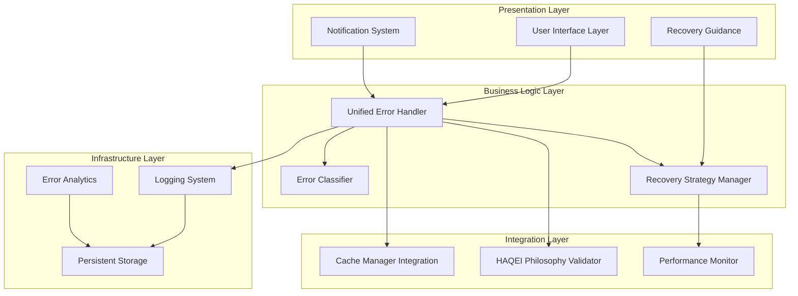
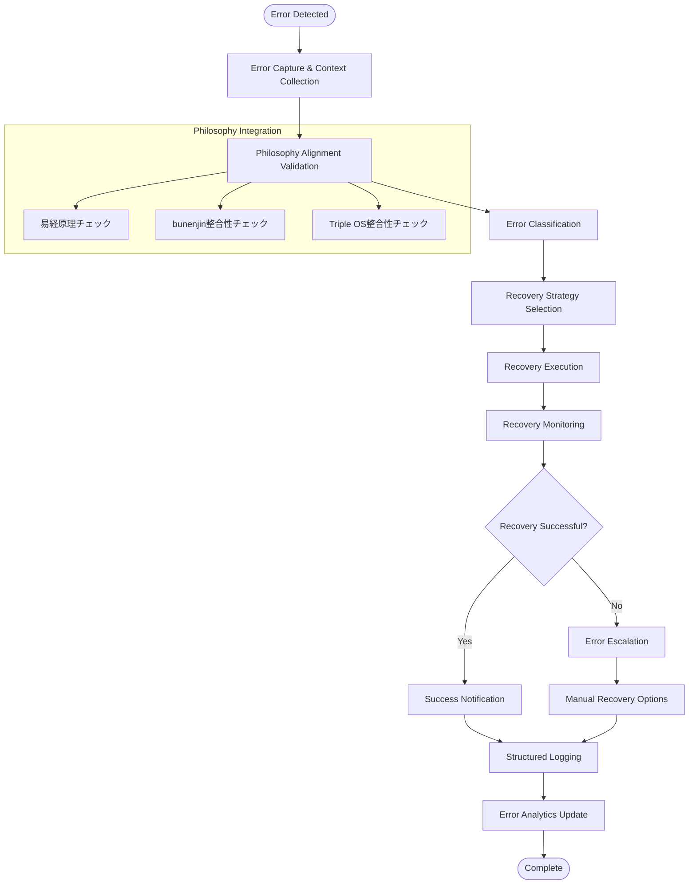

# HAQEIアナライザー - エラーハンドリング統一強化設計書

## 📋 設計概要

### プロジェクト情報
- **作成日**: 2025-08-05
- **バージョン**: v2.0.0 - 統一エラーハンドリング
- **対象システム**: HAQEIアナライザー（易経・bunenjin・Triple OS）
- **設計方針**: HAQEI哲学準拠、グレースフルデグラデーション、統一性

### 設計目標
1. **統一性**: 全システム横断的な一貫したエラーハンドリング
2. **哲学準拠**: 易経・bunenjin・Triple OS哲学との整合性
3. **復旧力**: グレースフルデグラデーションによる継続運用
4. **ユーザビリティ**: 直感的で分かりやすいエラーコミュニケーション
5. **拡張性**: 将来の機能追加に対応できる柔軟な設計

---

## 🏗️ 1. システムアーキテクチャ設計

### 1.1 階層構造 (Layered Architecture)



### 1.2 レイヤー別責務定義

#### **1.2.1 Presentation Layer（表現層）**
- **責務**: ユーザーインターフェースでのエラー表示と復旧ガイダンス
- **コンポーネント**:
  - `ErrorDisplayManager`: エラーメッセージの表示制御
  - `NotificationSystem`: 非破壊的な通知表示
  - `RecoveryGuidanceUI`: ユーザー向け復旧手順表示

#### **1.2.2 Business Logic Layer（ビジネスロジック層）**
- **責務**: エラー分類、処理戦略決定、復旧処理の実行
- **コンポーネント**:
  - `UnifiedErrorHandler`: 中央エラーハンドラー
  - `ErrorClassifier`: エラー種別判定エンジン
  - `RecoveryStrategyManager`: 復旧戦略の管理・実行

#### **1.2.3 Integration Layer（統合層）**
- **責務**: HAQEI固有システムとの統合、パフォーマンス監視
- **コンポーネント**:
  - `HAQEIPhilosophyValidator`: 哲学的整合性の検証
  - `CacheErrorHandler`: キャッシュシステム連携
  - `PerformanceErrorMonitor`: パフォーマンス関連エラー監視

#### **1.2.4 Infrastructure Layer（基盤層）**
- **責務**: ログ記録、永続化、分析データ収集
- **コンポーネント**:
  - `StructuredLogger`: 構造化ログ出力
  - `ErrorAnalytics`: エラー分析・統計
  - `PersistentErrorStorage`: エラーデータの永続化

### 1.3 エラー伝播メカニズム

```typescript
interface ErrorPropagation {
  source: ErrorSource;
  propagationPath: string[];
  context: ErrorContext;
  philosophyAlignment: PhilosophyCheck;
  recoveryAttempted: boolean;
  userNotified: boolean;
}

type ErrorSource = 
  | 'iching-engine'      // 易経エンジン
  | 'bunenjin-logic'     // bunenjin哲学
  | 'triple-os'          // Triple OS
  | 'cache-system'       // キャッシュシステム
  | 'ui-interaction'     // UI操作
  | 'data-processing'    // データ処理
  | 'network-operation'  // ネットワーク操作
  | 'storage-operation'; // ストレージ操作
```

---

## 🎯 2. エラー分類設計

### 2.1 システムエラー階層

#### **2.1.1 Critical Level（致命的）**
- **Impact**: システム全体の停止、データ破損リスク
- **Examples**:
  - 易経エンジンの完全停止
  - キャッシュシステムの破損
  - Triple OS整合性の完全破綻
- **Recovery**: 即座にフェイルセーフモードに移行

#### **2.1.2 High Level（高）**
- **Impact**: 主要機能の一部停止、機能制限
- **Examples**:
  - 卦計算エンジンのエラー
  - bunenjin哲学ロジックの不整合
  - 重要データの読み込み失敗
- **Recovery**: フォールバック機能による継続運用

#### **2.1.3 Medium Level（中）**
- **Impact**: 付加機能の制限、パフォーマンス低下
- **Examples**:
  - 非重要キャッシュの失効
  - 一部UIコンポーネントの表示異常
  - 分析結果の一部欠損
- **Recovery**: 機能縮退モードでの継続

#### **2.1.4 Low Level（低）**
- **Impact**: 軽微な不具合、ユーザー体験への最小影響
- **Examples**:
  - 非重要なアニメーション失敗
  - ログ出力の軽微なエラー
  - パフォーマンス統計の一時的異常
- **Recovery**: バックグラウンドでの自動修復

### 2.2 ユーザーエラー分類

#### **2.2.1 入力エラー**
```typescript
interface InputError {
  type: 'validation' | 'format' | 'constraint';
  field: string;
  providedValue: any;
  expectedFormat: string;
  bunenjinGuidance: string; // bunenjin哲学による指導
}
```

#### **2.2.2 操作エラー**
```typescript
interface OperationError {
  type: 'sequence' | 'permission' | 'state';
  operation: string;
  currentState: string;
  requiredState: string;
  tripleOSGuidance: string; // Triple OS観点での指導
}
```

#### **2.2.3 設定エラー**
```typescript
interface ConfigurationError {
  type: 'missing' | 'invalid' | 'conflicting';
  configKey: string;
  ichingWisdom: string; // 易経の智慧による解決指導
}
```

### 2.3 外部依存エラー

#### **2.3.1 ネットワークエラー**
- **Connection Lost**: 接続断による機能制限
- **API Timeout**: 外部API応答遅延
- **CORS Issues**: ブラウザセキュリティ制約

#### **2.3.2 ストレージエラー**
- **Quota Exceeded**: ストレージ容量超過
- **Permission Denied**: アクセス権限エラー
- **Data Corruption**: データ整合性エラー

### 2.4 哲学的整合性エラー

#### **2.4.1 易経整合性エラー**
```typescript
interface IChingIntegrityError {
  hexagramId: number;
  violatedPrinciple: string;
  expectedBehavior: string;
  actualBehavior: string;
  sequenceLogicViolation: boolean;
}
```

#### **2.4.2 bunenjin整合性エラー**
```typescript
interface BunenjinIntegrityError {
  personaConflict: string;
  contextMismatch: string;
  navigationInconsistency: string;
  philosophyViolation: string;
}
```

#### **2.4.3 Triple OS整合性エラー**
```typescript
interface TripleOSIntegrityError {
  osLayerConflict: 'engine' | 'interface' | 'safe-mode';
  inconsistentState: string;
  osTransitionError: string;
  architectureViolation: string;
}
```

---

## 🔄 3. エラー処理フロー設計

### 3.1 統一エラー処理パイプライン



### 3.2 各段階の詳細設計

#### **3.2.1 Error Detection（エラー検出）**
```typescript
class ErrorDetector {
  private detectionMethods = {
    globalError: this.setupGlobalErrorHandling,
    promiseRejection: this.setupUnhandledRejectionHandling,
    customError: this.setupCustomErrorTriggers,
    performanceError: this.setupPerformanceThresholdMonitoring,
    philosophyError: this.setupPhilosophyViolationDetection
  };

  setupGlobalErrorHandling(): void {
    window.addEventListener('error', (event) => {
      this.handleDetectedError({
        type: 'javascript-runtime',
        source: event.filename,
        message: event.message,
        stack: event.error?.stack,
        context: this.collectExecutionContext()
      });
    });
  }
}
```

#### **3.2.2 Error Classification（エラー分類）**
```typescript
class ErrorClassifier {
  classify(error: CapturedError): ClassifiedError {
    const classification = {
      category: this.determineCategory(error),
      severity: this.determineSeverity(error),
      source: this.determineSource(error),
      philosophyImpact: this.assessPhilosophyImpact(error),
      recoveryComplexity: this.assessRecoveryComplexity(error)
    };

    return this.enrichWithContext(error, classification);
  }

  private assessPhilosophyImpact(error: CapturedError): PhilosophyImpact {
    return {
      ichingViolation: this.checkIChingViolation(error),
      bunenjinInconsistency: this.checkBunenjinInconsistency(error),
      tripleOSDisruption: this.checkTripleOSDisruption(error)
    };
  }
}
```

#### **3.2.3 Recovery Strategy Selection（復旧戦略選択）**
```typescript
class RecoveryStrategyManager {
  private strategies = new Map<ErrorPattern, RecoveryStrategy>([
    ['iching-calculation-error', new IChingFallbackStrategy()],
    ['bunenjin-navigation-error', new BunenjinGuidanceStrategy()],
    ['triple-os-state-error', new TripleOSResetStrategy()],
    ['cache-corruption-error', new CacheRecoveryStrategy()],
    ['network-failure-error', new OfflineModeStrategy()]
  ]);

  async selectStrategy(classifiedError: ClassifiedError): Promise<RecoveryStrategy> {
    const primaryStrategy = this.strategies.get(classifiedError.pattern);
    
    if (!primaryStrategy || !(await primaryStrategy.canHandle(classifiedError))) {
      return this.selectFallbackStrategy(classifiedError);
    }

    return primaryStrategy;
  }
}
```

#### **3.2.4 Recovery Execution（復旧実行）**
```typescript
abstract class RecoveryStrategy {
  abstract async execute(error: ClassifiedError): Promise<RecoveryResult>;
  abstract async rollback(error: ClassifiedError): Promise<void>;
  abstract getExpectedDuration(): number;
  abstract getPhilosophyGuidance(): string;
}

class IChingFallbackStrategy extends RecoveryStrategy {
  async execute(error: ClassifiedError): Promise<RecoveryResult> {
    // 1. 易経基本データの確認
    const basicDataAvailable = await this.checkBasicIChingData();
    
    // 2. フォールバック卦データの生成
    const fallbackHexagrams = await this.generateFallbackHexagrams();
    
    // 3. 序卦伝ロジックの簡易実装
    const sequenceLogic = await this.implementBasicSequenceLogic();

    return {
      success: true,
      message: '易経フォールバック機能により継続運用中です',
      philosophyGuidance: '変化の原理に従い、現在の状況を受け入れつつ前進します',
      functionalityLevel: 'reduced',
      estimatedRecoveryTime: 300000 // 5分
    };
  }
}
```

### 3.3 例外処理パターン

#### **3.3.1 Try-Catch Enhancement Pattern**
```typescript
async function withPhilosophyAwareErrorHandling<T>(
  operation: () => Promise<T>,
  context: PhilosophyContext
): Promise<T> {
  try {
    return await operation();
  } catch (error) {
    const philosophyGuidance = await generatePhilosophyGuidance(error, context);
    const enrichedError = new PhilosophyAwareError(error.message, {
      originalError: error,
      philosophyGuidance,
      context,
      suggestedActions: await generateSuggestedActions(error, context)
    });
    
    throw enrichedError;
  }
}
```

#### **3.3.2 Circuit Breaker Pattern（易経版）**
```typescript
class IChingCircuitBreaker {
  private state: 'closed' | 'open' | 'half-open' = 'closed';
  private failureCount = 0;
  private lastFailureTime = 0;
  private readonly threshold = 5;
  private readonly timeout = 60000; // 1分

  async execute<T>(operation: () => Promise<T>): Promise<T> {
    if (this.state === 'open') {
      if (Date.now() - this.lastFailureTime > this.timeout) {
        this.state = 'half-open';
      } else {
        throw new Error('Circuit breaker is open - 易経の教えに従い、時を待ちます');
      }
    }

    try {
      const result = await operation();
      this.onSuccess();
      return result;
    } catch (error) {
      this.onFailure();
      throw error;
    }
  }

  private onSuccess(): void {
    this.failureCount = 0;
    this.state = 'closed';
  }

  private onFailure(): void {
    this.failureCount++;
    this.lastFailureTime = Date.now();
    
    if (this.failureCount >= this.threshold) {
      this.state = 'open';
    }
  }
}
```

---

## 🎨 4. UI/UX設計

### 4.1 エラーメッセージ設計原則

#### **4.1.1 HAQEI哲学に基づくメッセージング**
```typescript
interface HAQEIErrorMessage {
  technical: string;           // 技術的説明
  philosophical: string;       // 哲学的解釈
  guidance: string;           // 具体的指導
  metaphor: string;           // 易経メタファー
  bunenjinPerspective: string; // bunenjin観点
  tripleOSContext: string;    // Triple OS文脈
}

const messageTemplates = {
  'cache-error': {
    technical: 'キャッシュシステムでエラーが発生しました',
    philosophical: '記憶と現在の調和が乱れています',
    guidance: 'データを再読み込みして新しい流れを作りましょう',
    metaphor: '風雷益（42番）- 損して益を得る時です',
    bunenjinPerspective: '現在の状況に適応した新しい分人で対応します',
    tripleOSContext: 'Safe Mode OSが安全な復旧を支援します'
  }
};
```

#### **4.1.2 段階的情報開示**
```typescript
interface ErrorDisplay {
  level1: SimpleMessage;     // 一般ユーザー向け
  level2: DetailedMessage;   // 詳細を知りたいユーザー向け
  level3: TechnicalMessage;  // 開発者・上級者向け
  level4: PhilosophyDeep;    // HAQEI哲学深層解析
}
```

### 4.2 通知システム設計

#### **4.2.1 非破壊的通知（Toast System）**
```typescript
class HAQEINotificationSystem {
  showPhilosophyGuidedNotification(error: ClassifiedError): void {
    const notification = {
      type: this.mapSeverityToNotificationType(error.severity),
      title: this.generatePhilosophicalTitle(error),
      message: this.generateUserFriendlyMessage(error),
      actions: this.generateContextualActions(error),
      metaphor: this.generateIChingMetaphor(error),
      duration: this.calculateDisplayDuration(error.severity),
      dismissible: true,
      persistent: error.severity === 'critical'
    };

    this.displayNotification(notification);
  }
}
```

#### **4.2.2 プログレッシブディスクロージャー**
```typescript
class ProgressiveErrorDisclosure {
  displayError(error: ClassifiedError): void {
    // レベル1: 基本メッセージ
    this.showBasicMessage(error);

    // レベル2: 詳細情報（オプション）
    this.addDetailToggle(() => this.showDetailedInfo(error));

    // レベル3: 技術情報（開発者向け）
    this.addTechnicalToggle(() => this.showTechnicalInfo(error));

    // レベル4: 哲学的解釈（HAQEI専門）
    this.addPhilosophyToggle(() => this.showPhilosophyAnalysis(error));
  }
}
```

### 4.3 復旧操作ガイダンス

#### **4.3.1 ステップバイステップガイド**
```typescript
class RecoveryGuidanceUI {
  displayRecoverySteps(strategy: RecoveryStrategy): void {
    const steps = strategy.getRecoverySteps();
    const guidanceUI = this.createStepByStepInterface(steps);

    guidanceUI.onStepComplete = (stepIndex) => {
      this.markStepComplete(stepIndex);
      this.updateProgressIndicator(stepIndex, steps.length);
      this.showPhilosophicalEncouragement(stepIndex);
    };

    guidanceUI.onAllStepsComplete = () => {
      this.showCompletionCelebration();
      this.offerPreventionTips();
    };
  }

  private showPhilosophicalEncouragement(stepIndex: number): void {
    const encouragements = [
      '易経64番「火水未済」- まだ完成していないからこそ可能性があります',
      'bunenjin哲学 - この困難も新しい分人を発見する機会です',
      'Triple OS - Interface OSが新しい調和を見つけています'
    ];

    this.showMotivationalMessage(encouragements[stepIndex % 3]);
  }
}
```

#### **4.2.2 自動復旧進捗表示**
```typescript
class AutoRecoveryProgress {
  displayProgress(strategy: RecoveryStrategy): void {
    const progressBar = this.createProgressBar({
      title: `${strategy.name} による自動復旧中...`,
      subtitle: strategy.getPhilosophyGuidance(),
      estimatedDuration: strategy.getExpectedDuration(),
      showPhilosophyQuotes: true
    });

    strategy.onProgress = (percent, currentStep) => {
      progressBar.updateProgress(percent);
      progressBar.updateStep(currentStep);
      progressBar.showRandomPhilosophyQuote();
    };
  }
}
```

---

## ⚙️ 5. 技術設計

### 5.1 UnifiedErrorHandler クラス拡張

```typescript
class UnifiedErrorHandler {
  private errorClassifier: ErrorClassifier;
  private recoveryManager: RecoveryStrategyManager;
  private philosophyValidator: PhilosophyValidator;
  private analyticsCollector: ErrorAnalyticsCollector;
  private cacheManager: CacheManager;
  private performanceMonitor: PerformanceMonitor;

  constructor(options: ErrorHandlerOptions) {
    this.initializeComponents(options);
    this.setupGlobalHandlers();
    this.initializePhilosophyIntegration();
  }

  async handleError(error: Error, context: ErrorContext): Promise<ErrorHandlingResult> {
    const startTime = performance.now();
    
    try {
      // 1. Error Capture & Enrichment
      const capturedError = await this.captureError(error, context);

      // 2. Philosophy Alignment Check
      const philosophyCheck = await this.philosophyValidator.validate(capturedError);

      // 3. Error Classification
      const classifiedError = await this.errorClassifier.classify(capturedError, philosophyCheck);

      // 4. Recovery Strategy Selection
      const strategy = await this.recoveryManager.selectStrategy(classifiedError);

      // 5. Recovery Execution
      const recoveryResult = await this.executeRecovery(strategy, classifiedError);

      // 6. Analytics & Logging
      await this.recordErrorHandling(classifiedError, recoveryResult, performance.now() - startTime);

      return recoveryResult;

    } catch (handlingError) {
      // Fallback to basic error handling
      return this.executeBasicFallback(error, handlingError);
    }
  }

  private async executeRecovery(
    strategy: RecoveryStrategy, 
    error: ClassifiedError
  ): Promise<ErrorHandlingResult> {
    const recoveryTimeout = strategy.getExpectedDuration() * 1.5; // 150% buffer

    return Promise.race([
      strategy.execute(error),
      this.createRecoveryTimeout(recoveryTimeout, strategy)
    ]);
  }
}
```

### 5.2 監視システム設計

#### **5.2.1 リアルタイム監視**
```typescript
class ErrorMonitoringSystem {
  private metricsCollector: MetricsCollector;
  private alertManager: AlertManager;
  private dashboardUpdater: DashboardUpdater;

  startMonitoring(): void {
    // Error rate monitoring
    this.monitorErrorRate();
    
    // Philosophy violation monitoring
    this.monitorPhilosophyViolations();
    
    // Recovery success rate monitoring
    this.monitorRecoverySuccessRate();
    
    // Performance impact monitoring
    this.monitorPerformanceImpact();
  }

  private monitorErrorRate(): void {
    setInterval(() => {
      const errorRate = this.calculateErrorRate();
      
      if (errorRate > this.thresholds.warning) {
        this.alertManager.sendAlert({
          level: errorRate > this.thresholds.critical ? 'critical' : 'warning',
          message: `Error rate elevated: ${errorRate}/min`,
          philosophyGuidance: this.generatePhilosophyGuidance(errorRate),
          suggestedActions: this.generateSuggestedActions(errorRate)
        });
      }
    }, 60000); // Every minute
  }
}
```

#### **5.2.2 予測的監視**
```typescript
class PredictiveErrorMonitoring {
  private mlModel: ErrorPredictionModel;
  private patternDetector: PatternDetector;

  async predictPotentialErrors(): Promise<ErrorPrediction[]> {
    const currentMetrics = await this.gatherCurrentMetrics();
    const historicalPatterns = await this.analyzeHistoricalPatterns();
    
    const predictions = await this.mlModel.predict(currentMetrics, historicalPatterns);
    
    return predictions.map(prediction => ({
      ...prediction,
      philosophyInterpretation: this.interpretFromPhilosophyPerspective(prediction),
      preventiveActions: this.generatePreventiveActions(prediction)
    }));
  }
}
```

### 5.3 パフォーマンス統合

#### **5.3.1 エラーハンドリングパフォーマンス最適化**
```typescript
class PerformanceOptimizedErrorHandler {
  private executionCache = new Map<string, CachedRecoveryResult>();
  private asyncQueue = new AsyncQueue();
  private workerPool = new WorkerPool();

  async handleErrorWithOptimization(error: Error, context: ErrorContext): Promise<ErrorHandlingResult> {
    // 1. Quick cache check for similar errors
    const cacheKey = this.generateErrorCacheKey(error, context);
    const cachedResult = this.executionCache.get(cacheKey);
    
    if (cachedResult && this.isCacheValid(cachedResult)) {
      return this.applyCachedRecovery(cachedResult, error);
    }

    // 2. Parallel processing for non-blocking operations
    const parallelTasks = [
      this.classifyErrorAsync(error, context),
      this.gatherContextAsync(context),
      this.checkPhilosophyAlignmentAsync(error)
    ];

    const [classification, enrichedContext, philosophyCheck] = await Promise.all(parallelTasks);

    // 3. Web Worker for heavy computation
    const strategy = await this.workerPool.execute('selectStrategy', {
      classification,
      enrichedContext,
      philosophyCheck
    });

    // 4. Execute recovery with performance monitoring
    return this.executeWithPerformanceTracking(strategy, error, context);
  }
}
```

### 5.4 テスト可能性設計

#### **5.4.1 Dependency Injection Container**
```typescript
class ErrorHandlingContainer {
  private dependencies = new Map<string, any>();

  register<T>(key: string, factory: () => T): void {
    this.dependencies.set(key, factory);
  }

  resolve<T>(key: string): T {
    const factory = this.dependencies.get(key);
    if (!factory) {
      throw new Error(`Dependency not found: ${key}`);
    }
    return factory();
  }

  // Test-specific registration
  registerMock<T>(key: string, mock: T): void {
    this.dependencies.set(key, () => mock);
  }
}

// Usage in tests
const container = new ErrorHandlingContainer();
container.registerMock('ErrorClassifier', mockErrorClassifier);
container.registerMock('RecoveryStrategyManager', mockRecoveryManager);
```

#### **5.4.2 Test Scenarios Generator**
```typescript
class ErrorTestScenarioGenerator {
  generateIChingErrorScenarios(): ErrorTestCase[] {
    return [
      {
        name: 'Hexagram calculation failure',
        error: new Error('Invalid hexagram binary'),
        context: { operation: 'hexagram-calculation', hexagramId: 23 },
        expectedClassification: 'iching-calculation-error',
        expectedRecoveryStrategy: 'IChingFallbackStrategy',
        philosophyExpectation: 'Should maintain I Ching integrity'
      },
      // ... more scenarios
    ];
  }

  generateBunenjinErrorScenarios(): ErrorTestCase[] {
    return [
      {
        name: 'Persona navigation conflict',
        error: new Error('Conflicting persona states'),
        context: { operation: 'persona-transition', fromPersona: 'A', toPersona: 'B' },
        expectedClassification: 'bunenjin-navigation-error',
        expectedRecoveryStrategy: 'BunenjinGuidanceStrategy',
        philosophyExpectation: 'Should provide persona guidance'
      }
    ];
  }
}
```

---

## 📊 6. API設計仕様

### 6.1 Core Error Handling API

```typescript
interface UnifiedErrorHandlerAPI {
  // Primary error handling
  handleError(error: Error, context?: ErrorContext): Promise<ErrorHandlingResult>;
  
  // Error classification
  classifyError(error: Error, context?: ErrorContext): Promise<ClassifiedError>;
  
  // Recovery management
  getAvailableRecoveryStrategies(error: ClassifiedError): Promise<RecoveryStrategy[]>;
  executeRecovery(strategy: RecoveryStrategy, error: ClassifiedError): Promise<RecoveryResult>;
  
  // Philosophy integration
  validatePhilosophyAlignment(error: Error, context?: ErrorContext): Promise<PhilosophyCheck>;
  getPhilosophyGuidance(error: ClassifiedError): Promise<PhilosophyGuidance>;
  
  // Monitoring and analytics
  getErrorStatistics(timeRange?: TimeRange): Promise<ErrorStatistics>;
  getRecoveryMetrics(timeRange?: TimeRange): Promise<RecoveryMetrics>;
  
  // Configuration
  updateConfiguration(config: Partial<ErrorHandlerConfig>): Promise<void>;
  getConfiguration(): Promise<ErrorHandlerConfig>;
}
```

### 6.2 Philosophy-Specific APIs

```typescript
interface IChingErrorAPI {
  validateHexagramIntegrity(hexagramId: number, context: any): Promise<IntegrityCheck>;
  generateHexagramBasedGuidance(error: ClassifiedError): Promise<HexagramGuidance>;
  checkSequenceLogicViolation(operation: string, context: any): Promise<SequenceCheck>;
}

interface BunenjinErrorAPI {
  validatePersonaConsistency(personas: PersonaState[]): Promise<ConsistencyCheck>;
  generatePersonaGuidance(error: ClassifiedError): Promise<PersonaGuidance>;
  suggestPersonaTransition(currentState: PersonaState, error: ClassifiedError): Promise<PersonaTransition>;
}

interface TripleOSErrorAPI {
  validateOSLayerIntegrity(layer: OSLayer, state: any): Promise<LayerIntegrityCheck>;
  generateOSTransitionGuidance(error: ClassifiedError): Promise<OSTransitionGuidance>;
  checkArchitectureViolation(operation: string, context: any): Promise<ArchitectureCheck>;
}
```

### 6.3 Event-Driven API

```typescript
interface ErrorEventAPI {
  // Event subscription
  onError(callback: (event: ErrorEvent) => void): UnsubscribeFunction;
  onRecoveryStart(callback: (event: RecoveryStartEvent) => void): UnsubscribeFunction;
  onRecoveryComplete(callback: (event: RecoveryCompleteEvent) => void): UnsubscribeFunction;
  onPhilosophyViolation(callback: (event: PhilosophyViolationEvent) => void): UnsubscribeFunction;
  
  // Event emission
  emitError(error: Error, context?: ErrorContext): void;
  emitRecoveryStart(strategy: RecoveryStrategy, error: ClassifiedError): void;
  emitRecoveryComplete(result: RecoveryResult): void;
  emitPhilosophyViolation(violation: PhilosophyViolation): void;
}
```

---

## 🧪 7. テスト設計

### 7.1 テスト戦略

#### **7.1.1 テストピラミッド**
```
     /\
    /  \        E2E Tests (10%)
   /____\       - Full system error scenarios
  /      \      - Philosophy integration tests
 /        \     - User journey error handling
/__________\    
            \   Integration Tests (20%)
             \  - Component interaction tests
              \ - Recovery strategy tests
               \- Philosophy validation tests
                \________________
                                \
                                 \ Unit Tests (70%)
                                  \- Individual class tests
                                   \- Error classification tests
                                    \- Recovery strategy unit tests
```

#### **7.1.2 テストカテゴリ**
```typescript
interface TestSuite {
  unit: {
    errorClassification: ClassificationTestSuite;
    recoveryStrategies: RecoveryStrategyTestSuite;
    philosophyValidation: PhilosophyValidationTestSuite;
  };
  
  integration: {
    errorPropagation: PropagationTestSuite;
    recoveryExecution: RecoveryExecutionTestSuite;
    philosophyIntegration: PhilosophyIntegrationTestSuite;
  };
  
  e2e: {
    userErrorJourneys: UserJourneyTestSuite;
    systemRecovery: SystemRecoveryTestSuite;
    philosophyAlignment: PhilosophyAlignmentTestSuite;
  };
  
  performance: {
    errorHandlingSpeed: PerformanceTestSuite;
    memoryUsage: MemoryTestSuite;
    concurrentErrors: ConcurrencyTestSuite;
  };
}
```

### 7.2 テストパターン

#### **7.2.1 Philosophy-Driven Test Cases**
```typescript
describe('I Ching Error Handling', () => {
  test('should maintain hexagram sequence logic during error recovery', async () => {
    // Arrange
    const hexagramError = new Error('Hexagram calculation failed');
    const context = { hexagramId: 23, operation: 'sequence-calculation' };
    
    // Act
    const result = await errorHandler.handleError(hexagramError, context);
    
    // Assert
    expect(result.philosophyAlignment.ichingIntegrity).toBe(true);
    expect(result.recoveryStrategy.name).toBe('IChingSequenceRecovery');
    expect(result.guidance).toContain('sequence logic');
  });

  test('should provide appropriate I Ching metaphor for technical errors', async () => {
    // Test that technical errors receive meaningful I Ching metaphors
  });
});

describe('Bunenjin Error Handling', () => {
  test('should guide persona transition during navigation errors', async () => {
    // Test persona-aware error recovery
  });
});

describe('Triple OS Error Handling', () => {
  test('should maintain OS layer integrity during errors', async () => {
    // Test OS layer consistency during error states
  });
});
```

#### **7.2.2 Property-Based Testing**
```typescript
import { property, integer, string, arbitrary } from 'fast-check';

describe('Error Handler Properties', () => {
  property('should always return a valid error result', 
    arbitrary(Error), 
    arbitrary(ErrorContext),
    async (error, context) => {
      const result = await errorHandler.handleError(error, context);
      
      expect(result).toHaveProperty('success');
      expect(result).toHaveProperty('message');
      expect(result).toHaveProperty('philosophyGuidance');
      expect(result.philosophyGuidance).toBeTruthy();
    }
  );

  property('should never violate philosophy principles during recovery',
    arbitrary(ClassifiedError),
    async (error) => {
      const result = await errorHandler.executeRecovery(error);
      
      expect(result.philosophyAlignment.violated).toBe(false);
    }
  );
});
```

### 7.3 Mock Strategies

#### **7.3.1 Philosophy Component Mocks**
```typescript
class MockIChingEngine {
  async calculateHexagram(input: any): Promise<HexagramResult> {
    // Predictable hexagram calculation for testing
    return {
      hexagramId: (input.hash % 64) + 1,
      binary: '101010',
      name: 'Test Hexagram',
      interpretation: 'Test interpretation'
    };
  }

  async validateSequenceLogic(hexagramId: number): Promise<boolean> {
    // Always pass sequence validation in tests
    return true;
  }
}

class MockBunenjinNavigator {
  async transitionPersona(from: string, to: string): Promise<PersonaTransition> {
    return {
      success: true,
      newPersona: to,
      guidance: 'Mock persona transition guidance'
    };
  }
}
```

### 7.4 Performance Testing

#### **7.4.1 Error Handling Performance Benchmarks**
```typescript
describe('Error Handling Performance', () => {
  test('should handle errors within performance thresholds', async () => {
    const startTime = performance.now();
    
    await errorHandler.handleError(new Error('Test error'));
    
    const duration = performance.now() - startTime;
    expect(duration).toBeLessThan(100); // 100ms threshold
  });

  test('should handle concurrent errors efficiently', async () => {
    const errors = Array(100).fill(null).map(() => new Error('Concurrent error'));
    
    const startTime = performance.now();
    await Promise.all(errors.map(error => errorHandler.handleError(error)));
    const duration = performance.now() - startTime;
    
    expect(duration).toBeLessThan(1000); // 1 second for 100 concurrent errors
  });
});
```

---

## 📖 8. 実装ガイドライン

### 8.1 開発フェーズ

#### **Phase 1: Core Infrastructure (Week 1-2)**
1. `UnifiedErrorHandler` 基盤実装
2. `ErrorClassifier` 基本分類ロジック
3. `PhilosophyValidator` 基本チェック機能
4. 基本的なテストスイート

#### **Phase 2: Recovery Systems (Week 3-4)**
1. `RecoveryStrategyManager` 実装
2. 各種 `RecoveryStrategy` クラス実装
3. 自動復旧システム
4. 復旧テストの実装

#### **Phase 3: Philosophy Integration (Week 5-6)**
1. 易経整合性チェック強化
2. bunenjin ナビゲーション統合
3. Triple OS アーキテクチャ統合
4. 哲学的ガイダンス生成

#### **Phase 4: UI/UX Implementation (Week 7-8)**
1. エラー表示システム
2. 通知システム
3. 復旧ガイダンスUI
4. ユーザビリティテスト

#### **Phase 5: Monitoring & Analytics (Week 9-10)**
1. リアルタイム監視システム
2. エラー分析・統計
3. 予測的監視
4. ダッシュボード実装

### 8.2 品質保証

#### **8.2.1 コード品質チェックリスト**
- [ ] TypeScript strict mode 準拠
- [ ] 100% インターフェース実装
- [ ] 90%+ テストカバレッジ
- [ ] ESLint/Prettier 準拠
- [ ] JSDoc完全記述
- [ ] 哲学的整合性チェック

#### **8.2.2 Philosophy Alignment Checklist**
- [ ] 易経原理との整合性確認
- [ ] bunenjin哲学との一貫性
- [ ] Triple OS アーキテクチャ準拠
- [ ] 序卦伝論理の維持
- [ ] 変化の原理への対応

### 8.3 デプロイメント戦略

#### **8.3.1 段階的ロールアウト**
```typescript
interface DeploymentPhase {
  phase: 'canary' | 'blue-green' | 'full';
  userPercentage: number;
  features: string[];
  rollbackCriteria: RollbackCriteria;
  philosophyValidation: boolean;
}

const deploymentPlan: DeploymentPhase[] = [
  {
    phase: 'canary',
    userPercentage: 5,
    features: ['basic-error-handling'],
    rollbackCriteria: { errorRateIncrease: 10 },
    philosophyValidation: true
  },
  {
    phase: 'blue-green',
    userPercentage: 50,
    features: ['basic-error-handling', 'recovery-strategies'],
    rollbackCriteria: { errorRateIncrease: 5 },
    philosophyValidation: true
  },
  {
    phase: 'full',
    userPercentage: 100,
    features: ['all'],
    rollbackCriteria: { errorRateIncrease: 2 },
    philosophyValidation: true
  }
];
```

### 8.4 運用ガイドライン

#### **8.4.1 監視アラート設定**
```yaml
alerts:
  error_rate_high:
    condition: error_rate > 5 per minute
    severity: warning
    notification: team_slack
    philosophy_check: true
  
  recovery_failure_rate_high:
    condition: recovery_failure_rate > 20%
    severity: critical
    notification: on_call
    auto_escalation: true
  
  philosophy_violation:
    condition: philosophy_violation_detected
    severity: high
    notification: philosophy_team
    manual_review_required: true
```

#### **8.4.2 メンテナンス手順**
1. **定期メンテナンス (週次)**
   - エラーログの分析とパターン識別
   - 復旧戦略の効果測定
   - 哲学的整合性の確認

2. **緊急メンテナンス**
   - 致命的エラーの即座対応
   - 哲学的整合性違反の修正
   - ユーザー影響の最小化

---

## 📋 9. 移行計画

### 9.1 既存システムからの移行

#### **9.1.1 移行戦略**
```typescript
class MigrationStrategy {
  async migrateToUnifiedErrorHandling(): Promise<MigrationResult> {
    const phases = [
      this.auditExistingErrorHandlers,
      this.createCompatibilityLayer,
      this.gradualMigration,
      this.validateMigration,
      this.cleanupLegacyCode
    ];

    const results = [];
    for (const phase of phases) {
      const result = await phase();
      results.push(result);
      
      if (!result.success) {
        await this.rollbackToSafeState();
        throw new Error(`Migration failed at phase: ${phase.name}`);
      }
    }

    return { success: true, phases: results };
  }
}
```

#### **9.1.2 既存エラーハンドラーとの互換性**
```typescript
class LegacyErrorHandlerAdapter {
  constructor(
    private unifiedHandler: UnifiedErrorHandler,
    private legacyHandler: any
  ) {}

  // Adapter pattern for gradual migration
  async handleError(error: Error, context?: any): Promise<any> {
    try {
      // Try new unified handler first
      return await this.unifiedHandler.handleError(error, context);
    } catch (newHandlerError) {
      // Fallback to legacy handler
      console.warn('Falling back to legacy error handler:', newHandlerError);
      return this.legacyHandler.handleError(error, context);
    }
  }
}
```

### 9.2 データ移行

#### **9.2.1 エラーログの移行**
```typescript
class ErrorLogMigration {
  async migrateLegacyErrorLogs(): Promise<void> {
    const legacyLogs = await this.fetchLegacyErrorLogs();
    
    for (const legacyLog of legacyLogs) {
      const modernized = await this.modernizeErrorLog(legacyLog);
      const philosophyEnhanced = await this.enhanceWithPhilosophy(modernized);
      
      await this.storeModernizedLog(philosophyEnhanced);
    }
  }

  private async enhanceWithPhilosophy(errorLog: ErrorLog): Promise<EnhancedErrorLog> {
    const philosophyGuidance = await this.generateRetroactivePhilosophyGuidance(errorLog);
    
    return {
      ...errorLog,
      philosophyGuidance,
      ichingInterpretation: await this.generateIChingInterpretation(errorLog),
      bunenjinPerspective: await this.generateBunenjinPerspective(errorLog),
      tripleOSContext: await this.generateTripleOSContext(errorLog)
    };
  }
}
```

---

## 🎯 10. 成功指標

### 10.1 技術指標

#### **10.1.1 パフォーマンス指標**
- **エラー処理時間**: 平均 < 100ms, 95%ile < 500ms
- **復旧成功率**: > 85%
- **エラー発生率減少**: 月次 5% 改善
- **メモリ使用量**: エラーハンドリング用 < 10MB

#### **10.1.2 品質指標**
- **テストカバレッジ**: > 90%
- **コード品質スコア**: > 8.5/10
- **セキュリティスコア**: > 9.0/10
- **アクセシビリティスコア**: > 95%

### 10.2 ユーザー体験指標

#### **10.2.1 ユーザビリティ指標**
- **エラー理解度**: ユーザー調査 > 85%
- **復旧操作成功率**: > 80%
- **ユーザー満足度**: > 4.2/5.0
- **サポート問い合わせ減少**: 月次 15% 減少

#### **10.2.2 哲学的整合性指標**
- **哲学的ガイダンス有用性**: > 80%
- **易経メタファー理解度**: > 70%
- **bunenjin 適用性**: > 75%
- **Triple OS 体感**: > 85%

---

## 📚 11. 参考資料・付録

### 11.1 技術リファレンス

#### **11.1.1 Error Handling Patterns**
- Circuit Breaker Pattern
- Retry Pattern with Exponential Backoff
- Bulkhead Pattern
- Timeout Pattern
- Graceful Degradation Pattern

#### **11.1.2 Philosophy Integration References**
- 易経64卦システム完全マップ
- bunenjin哲学実装ガイド
- Triple OS アーキテクチャ仕様
- 序卦伝論理実装パターン

### 11.2 実装テンプレート

#### **11.2.1 Error Handler Template**
```typescript
// Template for custom error handlers
abstract class CustomErrorHandler extends BaseErrorHandler {
  abstract getHandledErrorTypes(): string[];
  abstract async handle(error: ClassifiedError): Promise<RecoveryResult>;
  abstract getPhilosophyGuidance(error: ClassifiedError): string;
  
  // Common implementation
  async execute(error: Error, context: ErrorContext): Promise<ErrorHandlingResult> {
    const classified = await this.classify(error, context);
    const philosophyCheck = await this.validatePhilosophy(classified);
    const recovery = await this.handle(classified);
    
    return this.formatResult(recovery, philosophyCheck);
  }
}
```

### 11.3 設定サンプル

#### **11.3.1 Production Configuration**
```json
{
  "errorHandling": {
    "logLevel": "info",
    "enablePhilosophyValidation": true,
    "recoveryTimeout": 30000,
    "maxRetryAttempts": 3,
    "enableAnalytics": true,
    "philosophySettings": {
      "ichingValidation": true,
      "bunenjinGuidance": true,
      "tripleOSIntegration": true
    },
    "notifications": {
      "enableToast": true,
      "enableModal": true,
      "enableSound": false,
      "philosophy": true
    }
  }
}
```

---

## 📞 サポート・問い合わせ

### 開発チーム連絡先
- **エラーハンドリング担当**: error-handling-team@haqei.com
- **哲学統合担当**: philosophy-team@haqei.com
- **UI/UX担当**: ux-team@haqei.com

### ドキュメント更新履歴
- **v2.0.0** (2025-08-05): 統一エラーハンドリング設計書初版
- **v2.0.1** (予定): 実装フィードバック反映版

---

*この設計書は HAQEIアナライザーの哲学的整合性を保ちながら、世界最高水準のエラーハンドリングシステムの実現を目指しています。易経の変化の原理、bunenjin哲学の柔軟性、Triple OS アーキテクチャの安定性を統合した、革新的なエラーハンドリングソリューションです。*