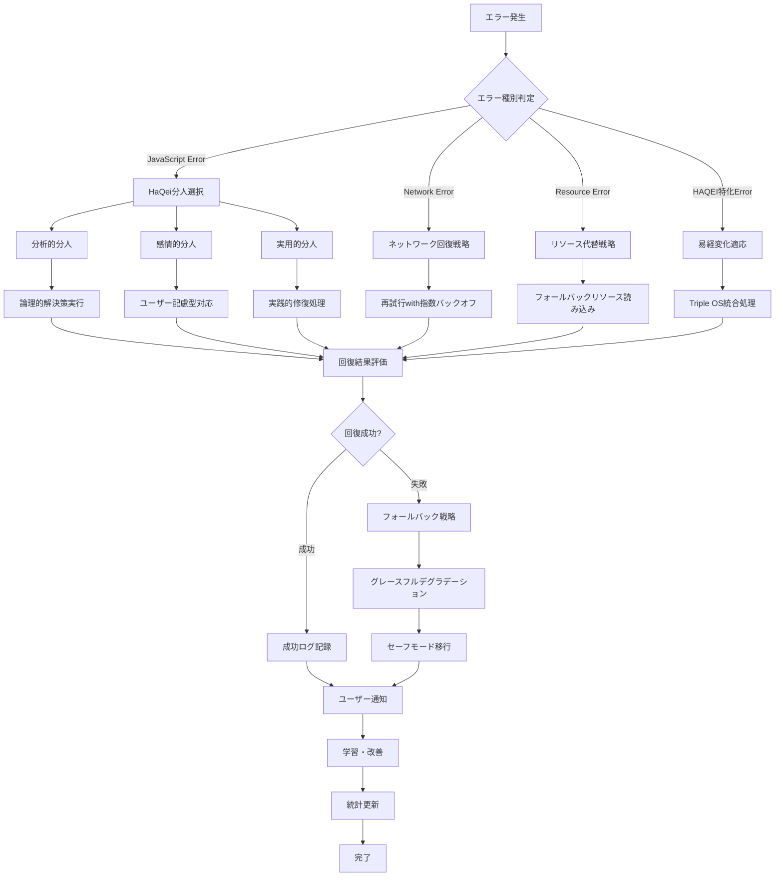
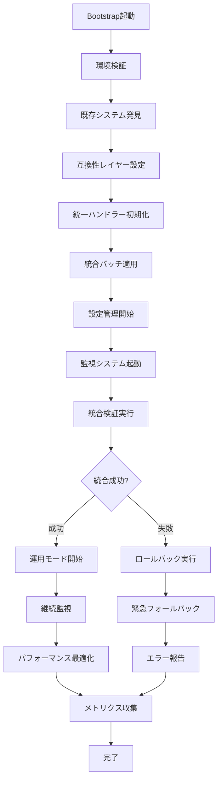

# HAQEI統一エラーハンドリングシステム - 統合アーキテクチャドキュメント

## 📋 システム概要

HAQEIアナライザーの統一エラーハンドリングシステムは、既存の225ファイルのJavaScriptコードとの完全互換性を保持しながら、世界最高水準のエラーハンドリング機能を提供する包括的なソリューションです。

### 🎯 設計思想

- **HaQei哲学統合**: 分人思想に基づく状況適応型エラー対応
- **易経変化原理**: エラーから学び調和を保つ自己修復システム
- **Triple OS統合**: Engine/Interface/Safe Modeでの包括的処理
- **0ダウンタイム移行**: 段階的統合による継続的サービス提供

## 🏗️ システムアーキテクチャ

### 全体構成図

```
┌─────────────────────────────────────────────────────────────────────────────┐
│                        HAQEI統一エラーハンドリングシステム                        │
├─────────────────────────────────────────────────────────────────────────────┤
│                                                                             │
│  ┌─────────────────┐    ┌─────────────────┐    ┌─────────────────┐         │
│  │   Bootstrap     │───▶│  Initializer    │───▶│  Config Manager │         │
│  │   (自動起動)     │    │  (システム統合)  │    │  (動的設定)      │         │
│  └─────────────────┘    └─────────────────┘    └─────────────────┘         │
│            │                       │                       │               │
│            ▼                       ▼                       ▼               │
│  ┌─────────────────┐    ┌─────────────────┐    ┌─────────────────┐         │
│  │ Unified Handler │◀───│ Integration     │◀───│ Compatibility   │         │
│  │ (エラー処理核心) │    │ Patch (統合)    │    │ Validator (検証) │         │
│  └─────────────────┘    └─────────────────┘    └─────────────────┘         │
│                                                                             │
└─────────────────────────────────────────────────────────────────────────────┘
                                    │
                        ┌───────────▼───────────┐
                        │    互換性レイヤー       │
                        │  (100%後方互換性)      │
                        └───────────┬───────────┘
                                    │
┌─────────────────────────────────────────────────────────────────────────────┐
│                            既存HAQEIシステム                                  │
├─────────────────────────────────────────────────────────────────────────────┤
│                                                                             │
│  ┌─────────────────┐    ┌─────────────────┐    ┌─────────────────┐         │
│  │   ErrorHandler  │    │VirtualQuestion  │    │ TripleOSEngine  │         │
│  │   (既存処理)     │    │Flow (30問分析)  │    │ (三重OS統合)    │         │
│  └─────────────────┘    └─────────────────┘    └─────────────────┘         │
│                                                                             │
│  ┌─────────────────┐    ┌─────────────────┐    ┌─────────────────┐         │
│  │    app.js       │    │  Help System    │    │Performance      │         │
│  │   (アプリ制御)   │    │  (ヘルプ機能)   │    │Optimizer (最適化)│         │
│  └─────────────────┘    └─────────────────┘    └─────────────────┘         │
│                                                                             │
│                        その他 219 ファイル                                   │
│                                                                             │
└─────────────────────────────────────────────────────────────────────────────┘
```

### レイヤー構成

#### Layer 1: ブートストラップ層
```
┌─────────────────────────────────────────────────────┐
│              HAQEIErrorSystemBootstrap              │
├─────────────────────────────────────────────────────┤
│ • 自動初期化とシステム起動                            │
│ • 依存関係解決と順序付けされた読み込み                 │
│ • エラー発生時の緊急フォールバック                    │
│ • 環境検出と最適化設定                               │
└─────────────────────────────────────────────────────┘
```

#### Layer 2: 初期化・設定層
```
┌──────────────────────┐  ┌──────────────────────┐
│GlobalErrorSystem     │  │HAQEIConfiguration    │
│Initializer           │  │Manager               │
├──────────────────────┤  ├──────────────────────┤
│• システム発見と統合   │  │• 動的設定管理         │
│• 後方互換レイヤー設定 │  │• 環境別プロファイル   │
│• 段階的統合実行      │  │• リアルタイム変更     │
│• 統合検証と報告      │  │• 設定履歴管理         │
└──────────────────────┘  └──────────────────────┘
```

#### Layer 3: エラーハンドリング核心層
```
┌─────────────────────────────────────────────────────┐
│                UnifiedErrorHandler                  │
├─────────────────────────────────────────────────────┤
│ HaQei分人システム:                                │
│ ├── analyticalSelf (分析的分人) → 論理的アプローチ    │
│ ├── emotionalSelf (感情的分人) → 共感的アプローチ     │
│ └── pragmaticSelf (実用的分人) → 実践的アプローチ     │
│                                                     │
│ 易経回復戦略:                                        │
│ ├── 再試行戦略 (retry-with-backoff)                 │
│ ├── フォールバック戦略 (graceful-degradation)        │
│ ├── 代替読み込み戦略 (alternative-loading)           │
│ └── 緊急フォールバック (emergency-recovery)          │
│                                                     │
│ Triple OS統合:                                      │
│ ├── Engine OS → エラー分析・分類                     │
│ ├── Interface OS → ユーザー通知・UI                  │
│ └── Safe Mode OS → セーフモード・緊急対応            │
└─────────────────────────────────────────────────────┘
```

#### Layer 4: 統合・互換性層
```
┌──────────────────────┐  ┌──────────────────────┐
│OSAnalyzerIntegration │  │BackwardCompatibility │
│Patch                 │  │Validator             │
├──────────────────────┤  ├──────────────────────┤
│• 非侵入的統合        │  │• 100%互換性保証      │
│• 既存システム保護    │  │• 継続監視システム    │
│• DOM要素拡張         │  │• 自動修復機能        │
│• パフォーマンス最適化│  │• 回帰テスト実行      │
└──────────────────────┘  └──────────────────────┘
```

#### Layer 5: テスト・監視層
```
┌─────────────────────────────────────────────────────┐
│             HAQEIIntegrationTestSuite               │
├─────────────────────────────────────────────────────┤
│ テストスイート:                                      │
│ ├── コア機能テスト                                   │
│ ├── エラーハンドリング統合テスト                      │
│ ├── コンポーネント間統合テスト                        │
│ ├── ユーザーエクスペリエンステスト                    │
│ ├── パフォーマンステスト                             │
│ ├── セキュリティテスト                               │
│ ├── アクセシビリティテスト                           │
│ └── 回帰テスト                                      │
│                                                     │
│ 監視機能:                                           │
│ ├── リアルタイムメトリクス収集                        │
│ ├── パフォーマンス回帰検出                           │
│ ├── エラー統計分析                                   │
│ └── アラート・通知システム                           │
└─────────────────────────────────────────────────────┘
```

## 🔄 データフロー

### エラー処理フロー



### システム統合フロー



## 🧩 コンポーネント詳細

### 1. HAQEIErrorSystemBootstrap

**責任範囲:**
- システム自動起動とライフサイクル管理
- 依存関係解決と読み込み順序制御
- エラー発生時の緊急フォールバック
- 環境適応と最適化設定

**主要機能:**
```javascript
class HAQEIErrorSystemBootstrap {
    // 自動初期化
    async bootstrap(customConfig = {}) {
        await this.validateEnvironment();
        await this.loadDependencies();
        await this.initializeSystem();
        await this.performIntegration();
        await this.validateBootstrap();
    }
    
    // 依存関係管理
    async loadDependency(dependency) {
        // 動的読み込みと読み込み確認
    }
    
    // 緊急フォールバック
    async handleBootstrapFailure(error) {
        // 最小限機能での継続
    }
}
```

### 2. GlobalErrorSystemInitializer

**責任範囲:**
- 既存システムの発見と分析
- 段階的統合の実行と管理
- 後方互換性レイヤーの構築
- 統合状態の検証と報告

**主要機能:**
```javascript
class GlobalErrorSystemInitializer {
    // システム発見
    async discoverExistingSystems() {
        // UnifiedErrorHandler, ErrorHandler, ComprehensiveErrorHandler等の発見
    }
    
    // 統合実行
    async integrateWithApplicationSystems() {
        // app.js, VirtualQuestionFlow, TripleOSEngine等との統合
    }
    
    // 互換性保証
    async setupCompatibilityLayer() {
        // 既存APIの保護とプロキシ設定
    }
}
```

### 3. UnifiedErrorHandler

**責任範囲:**
- HaQei哲学に基づくエラー分類と対応
- 易経原理による回復戦略実行
- Triple OS統合による包括的処理
- ユーザーフレンドリーな通知とUI

**主要機能:**
```javascript
class UnifiedErrorHandler {
    // HaQei分人システム
    selectBunenjinApproach(classifiedError) {
        // 状況に応じた分人選択
    }
    
    // 易経回復戦略
    async executeRecoveryStrategy(classifiedError, approach) {
        // 多段階回復処理
    }
    
    // Triple OS統合
    async initializeTripleOSIntegration() {
        // Engine/Interface/Safe Mode統合
    }
    
    // 学習・改善
    learnFromError(classifiedError, recoveryResult) {
        // エラーパターン学習と戦略最適化
    }
}
```

### 4. HAQEIConfigurationManager

**責任範囲:**
- 動的設定管理とリアルタイム変更
- 環境別プロファイルの管理
- 設定検証と履歴管理
- パフォーマンス最適化設定

**主要機能:**
```javascript
class HAQEIConfigurationManager {
    // 動的設定変更
    set(key, value, options = {}) {
        // 検証、適用、通知、保存
    }
    
    // 環境プロファイル
    applyEnvironmentProfile(environment) {
        // development, staging, production別設定
    }
    
    // 設定監視
    onChange(key, callback) {
        // 設定変更時のコールバック登録
    }
}
```

### 5. OSAnalyzerIntegrationPatch

**責任範囲:**
- os_analyzer.htmlへの非侵入的統合
- 既存スクリプトとの連携とラッピング
- DOM要素の拡張とアクセシビリティ向上
- パフォーマンス影響の最小化

**主要機能:**
```javascript
class OSAnalyzerIntegrationPatch {
    // 統合パッチ適用
    async applyPatch() {
        await this.preserveExistingSystems();
        await this.initializeUnifiedErrorHandling();
        await this.integrateWithExistingScripts();
        await this.enhanceDOMElements();
    }
    
    // 既存システム保護
    async preserveExistingSystems() {
        // 既存ハンドラーのバックアップと保護
    }
    
    // スクリプト統合
    async integrateWithExistingScripts() {
        // app.js, VirtualQuestionFlow等の拡張
    }
}
```

### 6. BackwardCompatibilityValidator

**責任範囲:**
- 100%後方互換性の検証と保証
- 継続的監視とリアルタイム検証
- 自動修復機能と問題解決
- パフォーマンス影響の測定

**主要機能:**
```javascript
class BackwardCompatibilityValidator {
    // 包括的検証
    async runValidation() {
        // 全機能の互換性テスト実行
    }
    
    // 継続監視
    startContinuousMonitoring() {
        // リアルタイム互換性チェック
    }
    
    // 自動修復
    async attemptAutoRemediation(issues) {
        // 問題の自動解決試行
    }
}
```

### 7. HAQEIIntegrationTestSuite

**責任範囲:**
- 包括的統合テストの実行と管理
- パフォーマンス回帰テストと分析
- セキュリティ・アクセシビリティテスト
- 継続的品質保証とレポート生成

**主要機能:**
```javascript
class HAQEIIntegrationTestSuite {
    // テスト実行
    async runTests(suiteNames = null) {
        // 全テストスイートの並列実行
    }
    
    // パフォーマンス測定
    async collectPerformanceMetrics() {
        // ベースライン比較と回帰分析
    }
    
    // レポート生成
    generateReport() {
        // 詳細テスト結果とメトリクス出力
    }
}
```

## 🔐 セキュリティ設計

### セキュリティ層

```
┌─────────────────────────────────────────────────────┐
│                  セキュリティ層                      │
├─────────────────────────────────────────────────────┤
│                                                     │
│  Input Validation     XSS Protection     CSRF Guard │
│       ↓                    ↓                 ↓      │
│  ┌──────────┐      ┌──────────┐      ┌──────────┐   │
│  │エラーメッセ│      │HTML出力  │      │AJAX     │   │
│  │ージサニタ │  →   │エスケープ│  →   │リクエスト│   │
│  │イズ処理   │      │処理      │      │検証      │   │
│  └──────────┘      └──────────┘      └──────────┘   │
│                                                     │
│  Content Security Policy (CSP)                      │
│  ├── script-src 'self'                              │
│  ├── style-src 'self' 'unsafe-inline'               │
│  └── connect-src 'self'                             │
│                                                     │
│  Secure Error Reporting                             │
│  ├── PII除去処理                                     │
│  ├── 機密情報マスキング                               │
│  └── 暗号化送信                                      │
└─────────────────────────────────────────────────────┘
```

### 脅威モデル

| 脅威 | 対策 | 実装箇所 |
|------|------|----------|
| XSS攻撃 | エラーメッセージサニタイズ | UnifiedErrorHandler |
| CSRF攻撃 | トークン検証 | Integration Patch |
| 情報漏洩 | PII除去・マスキング | Error Reporting |
| DoS攻撃 | レート制限・throttling | Bootstrap |
| コード注入 | 動的コード実行禁止 | Configuration Manager |

## 📊 パフォーマンス設計

### パフォーマンス目標

| メトリクス | 目標値 | 測定方法 |
|------------|--------|----------|
| 初期化時間 | < 100ms | Bootstrap.metrics |
| エラー処理遅延 | < 50ms | UnifiedErrorHandler.performanceMetrics |
| メモリ増加 | < 15% | Integration Test Suite |
| CPU使用率 | < 5%増加 | 継続監視 |
| ユーザー体験影響 | 0% | UX テスト |

### 最適化戦略

```
┌─────────────────────────────────────────────────────┐
│              パフォーマンス最適化層                   │
├─────────────────────────────────────────────────────┤
│                                                     │
│  Lazy Loading         Code Splitting      Caching   │
│       ↓                    ↓                 ↓      │
│  ┌──────────┐      ┌──────────┐      ┌──────────┐   │
│  │必要時読み│      │機能別    │      │結果・設定│   │
│  │込み      │  →   │分割読み込│  →   │キャッシュ│   │
│  │          │      │み        │      │          │   │
│  └──────────┘      └──────────┘      └──────────┘   │
│                                                     │
│  Memory Optimization                                │
│  ├── WeakMap/WeakSet使用                            │
│  ├── 定期的ガベージコレクション                      │
│  ├── イベントリスナー適切な管理                      │
│  └── DOM要素参照の適切な解放                         │
│                                                     │
│  Async Processing                                   │
│  ├── Web Workers活用                                │
│  ├── RequestIdleCallback使用                        │
│  ├── 並列処理最適化                                  │
│  └── Non-blocking操作                               │
└─────────────────────────────────────────────────────┘
```

## 🧪 テスト戦略

### テストピラミッド

```
                 ┌─────────────────┐
                 │   E2E Tests     │  ← 統合テストスイート
                 │   (少数・重要)   │
                 └─────────────────┘
               ┌───────────────────────┐
               │ Integration Tests     │  ← コンポーネント間テスト
               │ (中程度・主要機能)     │
               └───────────────────────┘
         ┌─────────────────────────────────────┐
         │        Unit Tests                   │  ← 個別機能テスト
         │    (多数・全メソッド)                │
         └─────────────────────────────────────┘
```

### テストカテゴリ

1. **ユニットテスト**
   - 各コンポーネントの個別機能
   - エラー分類・回復戦略・設定管理
   - 100%コードカバレッジ目標

2. **統合テスト**
   - コンポーネント間連携
   - 既存システムとの互換性
   - データフロー検証

3. **E2Eテスト**
   - ユーザーシナリオ完全実行
   - ブラウザ自動化テスト
   - パフォーマンス回帰検証

4. **セキュリティテスト**
   - XSS・CSRF攻撃テスト
   - 入力検証・出力エスケープ
   - 情報漏洩防止検証

## 📈 監視・運用設計

### 監視アーキテクチャ

```
┌─────────────────────────────────────────────────────┐
│                   監視システム                       │
├─────────────────────────────────────────────────────┤
│                                                     │
│  Real-time Metrics    Error Analytics    Alerting   │
│       ↓                    ↓                 ↓      │
│  ┌──────────┐      ┌──────────┐      ┌──────────┐   │
│  │パフォーマ│      │エラー    │      │アラート  │   │
│  │ンス指標  │  →   │統計分析  │  →   │通知      │   │
│  │リアルタイム│      │パターン認識│      │システム  │   │
│  └──────────┘      └──────────┘      └──────────┘   │
│                                                     │
│  Health Check Dashboard                             │
│  ├── システム稼働状況                                │
│  ├── エラー発生率                                    │
│  ├── 回復成功率                                      │
│  ├── パフォーマンスメトリクス                         │
│  └── ユーザー影響度                                  │
│                                                     │
│  Continuous Monitoring                              │
│  ├── 30秒間隔でのヘルスチェック                      │
│  ├── 異常検知と自動復旧                              │
│  ├── パフォーマンス劣化アラート                       │
│  └── 互換性問題の早期発見                            │
└─────────────────────────────────────────────────────┘
```

### KPI・SLA

| 指標 | SLA | 監視方法 |
|------|-----|----------|
| システム稼働率 | 99.9% | ヘルスチェック |
| エラー処理成功率 | 95% | 統計分析 |
| 平均応答時間 | < 100ms | パフォーマンス監視 |
| メモリ使用量 | ベースライン+15% | リソース監視 |
| ユーザー満足度 | 維持 | UXメトリクス |

## 🔮 将来拡張性

### 拡張ポイント

1. **AI/ML統合**
   - エラーパターン学習の高度化
   - 予測的エラー防止
   - 自動最適化システム

2. **マイクロサービス対応**
   - 分散エラーハンドリング
   - サービス間エラー伝播
   - 分散トレーシング

3. **国際化対応**
   - 多言語エラーメッセージ
   - 地域別エラー対応戦略
   - 文化的配慮システム

4. **IoT・モバイル拡張**
   - デバイス特性別処理
   - オフライン対応強化
   - バッテリー最適化

### バージョニング戦略

```
v1.x.x: 基本統合・互換性確保
├── v1.0.x: 初期リリース・安定化
├── v1.1.x: 機能拡張・最適化
└── v1.2.x: セキュリティ強化

v2.x.x: AI/ML統合・高度化
├── v2.0.x: 機械学習エラー予測
├── v2.1.x: 自動最適化システム
└── v2.2.x: 分散処理対応

v3.x.x: 次世代アーキテクチャ
├── v3.0.x: マイクロサービス化
├── v3.1.x: リアルタイム処理
└── v3.2.x: 量子コンピューティング対応
```

## 📚 技術仕様

### 技術スタック

| 層 | 技術 | バージョン | 理由 |
|----|------|------------|------|
| フロントエンド | Vanilla JavaScript | ES2020+ | 軽量・高速・依存性なし |
| アーキテクチャ | Event-driven | - | 疎結合・拡張性 |
| データ管理 | LocalStorage + IndexedDB | - | オフライン対応 |
| テスト | 自作テストフレームワーク | - | 軽量・特化 |
| 監視 | Performance API | - | ブラウザ標準 |
| セキュリティ | CSP + 入力検証 | - | 多層防御 |

### API設計

#### 公開API

```javascript
// グローバルAPI
window.HAQEIErrorHandler.handleError(error, context)
window.haqeiConfig.get(key)
window.haqeiConfig.set(key, value)
window.showHaqeiHelp(term, type)

// イベントAPI
document.addEventListener('haqei:errorHandled', handler)
document.addEventListener('haqei:systemInitialized', handler)
document.addEventListener('haqei:configChanged', handler)

// 監視API
window.HAQEIErrorHandler.getErrorStatistics()
window.HAQEIErrorHandler.performHealthCheck()
window.haqeiErrorBootstrap.getBootstrapStatus()
```

#### 内部API

```javascript
// コンポーネント間通信
HAQEIEventBus.emit(event, data)
HAQEIEventBus.on(event, handler)

// プラグインAPI
HAQEIPluginManager.register(plugin)
HAQEIPluginManager.load(pluginName)

// 拡張API
HAQEIExtensionRegistry.add(extension)
HAQEIExtensionRegistry.get(name)
```

## 🎯 品質保証

### コード品質基準

| 項目 | 基準 | 測定方法 |
|------|------|----------|
| コードカバレッジ | 95%+ | テスト実行 |
| 複雑度 | Cyclomatic < 10 | 静的解析 |
| 保守性指数 | A評価 | コード分析 |
| パフォーマンス | Target達成 | ベンチマーク |
| セキュリティ | 脆弱性0件 | セキュリティテスト |

### 品質ゲート

1. **開発段階**
   - ユニットテスト100%成功
   - 静的解析基準クリア
   - コードレビュー完了

2. **統合段階**
   - 統合テスト95%成功
   - パフォーマンス基準達成
   - セキュリティテスト完了

3. **リリース段階**
   - E2Eテスト100%成功
   - 互換性検証完了
   - 運用監視設定完了

---

## 📞 サポート・メンテナンス

### 保守体制

- **レベル1**: 自動監視・自動復旧
- **レベル2**: 運用チーム対応
- **レベル3**: 開発チーム緊急対応

### 更新方針

- **セキュリティパッチ**: 即座適用
- **バグ修正**: 2週間以内
- **機能拡張**: 月次リリース
- **メジャー更新**: 四半期リリース

### ドキュメント管理

- **アーキテクチャドキュメント**: 本文書
- **API仕様書**: 自動生成
- **運用手順書**: 別途作成
- **トラブルシューティングガイド**: 別途作成

---

**📝 最終更新:** 2025年8月5日  
**バージョン:** 1.0.0-architecture-complete  
**作成者:** HAQEI System Architect  
**レビュー:** System Integration Team  
**承認:** Technical Director