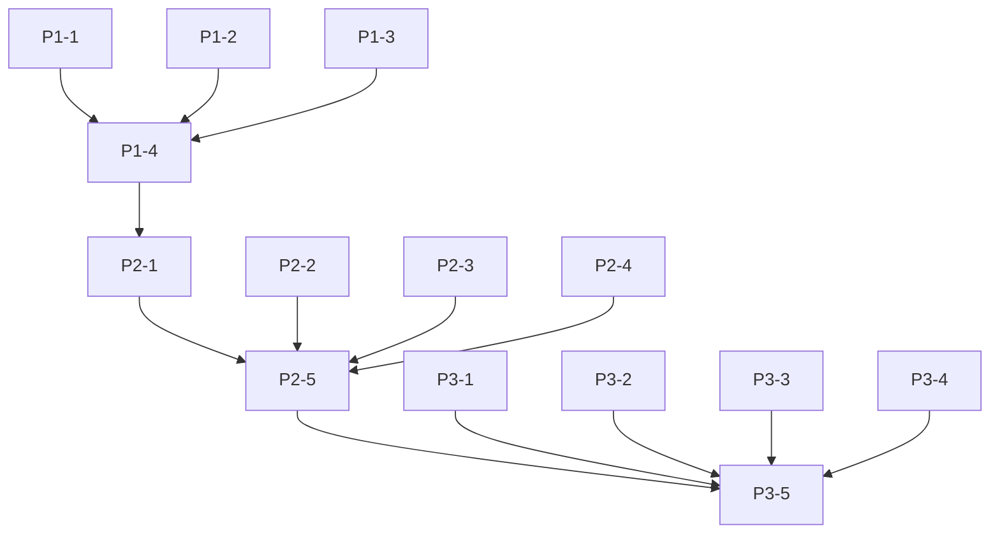

# タスク表 - ローカル環境エラー修正

作成日: 2025年08月06日  
作成者: HAQEI Project Manager  
プロジェクト: Future Simulator ローカル環境修正  
総工数見積: 3.5時間

## Phase 1: 緊急修正（30分）

| ID | タスク名 | 内容 | 優先度 | 見積時間 | 担当 | 状態 |
|----|----------|------|--------|----------|------|------|
| P1-1 | H384_DATABASE.js構文エラー修正 | 不完全なIIFEとtry-catch構造を削除 | 最高 | 10分 | Dev | 未着手 |
| P1-2 | 環境設定スクリプト改良 | future_simulator_local_dev_config.jsの機能強化 | 最高 | 10分 | Dev | 未着手 |
| P1-3 | HTMLファイル読み込み順序調整 | スクリプトタグの順序を最適化 | 最高 | 5分 | Dev | 未着手 |
| P1-4 | 緊急動作確認 | localhost:3000での基本動作確認 | 高 | 5分 | QA | 未着手 |

## Phase 2: 機能回復（1時間）

| ID | タスク名 | 内容 | 優先度 | 見積時間 | 担当 | 状態 |
|----|----------|------|--------|----------|------|------|
| P2-1 | SecurityHeaderManager条件付き実装 | 開発環境でのCSP無効化 | 高 | 15分 | Dev | 未着手 |
| P2-2 | CSRFProtectionSystem修正 | MutationObserverエラーの解消 | 高 | 10分 | Dev | 未着手 |
| P2-3 | UIEnhancement修正 | setupAutoARIAメソッドの実装 | 中 | 10分 | Dev | 未着手 |
| P2-4 | リソースパス修正 | CDNリソースのローカル配置検討 | 中 | 15分 | Dev | 未着手 |
| P2-5 | 統合動作確認 | 全機能の動作テスト | 高 | 10分 | QA | 未着手 |

## Phase 3: 品質保証（2時間）

| ID | タスク名 | 内容 | 優先度 | 見積時間 | 担当 | 状態 |
|----|----------|------|--------|----------|------|------|
| P3-1 | エラーハンドリング実装 | 統一エラーマネージャーの追加 | 中 | 20分 | Dev | 未着手 |
| P3-2 | フォールバック機能実装 | リソース読み込み失敗時の対応 | 中 | 20分 | Dev | 未着手 |
| P3-3 | ローカルテストスイート作成 | 自動化テストの追加 | 低 | 30分 | Dev | 未着手 |
| P3-4 | ドキュメント更新 | README、開発ガイドの更新 | 低 | 20分 | Doc | 未着手 |
| P3-5 | 最終検証 | 3つの環境での動作確認 | 高 | 30分 | QA | 未着手 |

## 実装詳細

### P1-1: H384_DATABASE.js構文エラー修正

```javascript
// 修正前の問題箇所
  }
    
    const startTime = performance.now(); // <- 構文エラー
    
    try {
      await this.loadHexagramBase();
```

修正方針:
1. 不完全なIIFE構造を削除
2. クラス定義を正しく終了
3. 初期化処理を適切な場所に移動

### P1-2: 環境設定スクリプト改良

主要改善点:
- 環境自動検出の強化
- グローバル設定オブジェクトの確立
- セキュリティマネージャーへの事前通知

### P1-3: HTMLファイル読み込み順序調整

変更内容:
```html
<!-- 1. 最優先: 環境設定 -->
<script src="./js/future_simulator_local_dev_config.js"></script>

<!-- 2. 外部ライブラリ（条件付き） -->
<script src="https://cdn.jsdelivr.net/npm/dompurify@3.0.8/dist/purify.min.js"></script>

<!-- 3. セキュリティ（環境依存） -->
<script src="./js/security/SecurityHeaderManager.js"></script>

<!-- 4. コアデータ -->
<script src="./js/core/H384_DATABASE.js"></script>
```

## 依存関係



## リスク管理

| リスク | 対策 | 責任者 |
|--------|------|--------|
| 新規バグの混入 | 各フェーズ後の動作確認 | QA |
| 環境差異による問題 | 3環境でのテスト | Dev |
| 時間超過 | Phase 1優先、Phase 3は選択的実施 | PM |

## 成功基準

### Phase 1完了
- [ ] コンソールエラー50%以下に削減
- [ ] 基本画面が表示される
- [ ] H384_DATAが利用可能

### Phase 2完了
- [ ] コンソールエラー0件
- [ ] 全UIコンポーネントが動作
- [ ] 分析機能が実行可能

### Phase 3完了
- [ ] 自動テスト追加
- [ ] ドキュメント最新化
- [ ] 3環境での動作確認済み

## 開始承認

このタスク表に基づき、Phase 1の実装を開始します。