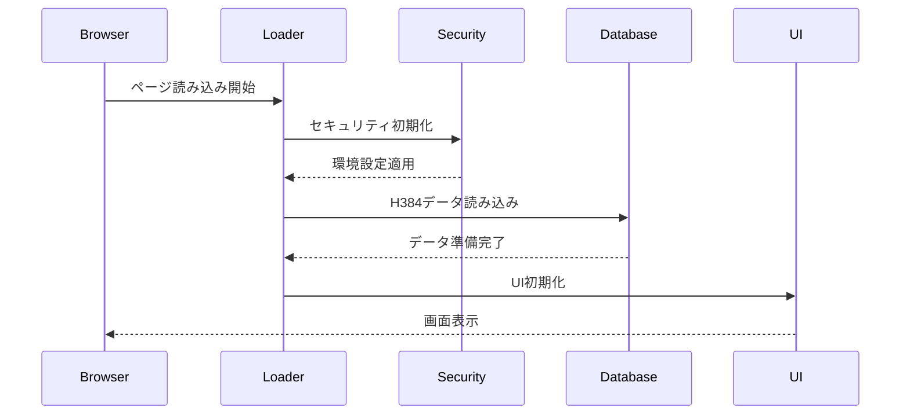

# Future Simulator 本番環境準備 設計書

作成日: 2025年08月06日  
バージョン: 1.0  
プロジェクト: HAQEI Future Simulator Production Deployment  

## 1. システムアーキテクチャ

### 1.1 全体構成

```
┌─────────────────────────────────────────────────────────┐
│                    Cloudflare Pages                      │
│  ┌─────────────┐  ┌─────────────┐  ┌─────────────┐   │
│  │   Static    │  │   Workers   │  │     CDN     │   │
│  │   Assets    │  │    API      │  │   Cache     │   │
│  └─────────────┘  └─────────────┘  └─────────────┘   │
└─────────────────────────────────────────────────────────┘
                           │
┌─────────────────────────────────────────────────────────┐
│                  Application Layer                       │
│  ┌─────────────┐  ┌─────────────┐  ┌─────────────┐   │
│  │  Security   │  │    Core     │  │     UI      │   │
│  │  Systems    │  │   Engine    │  │ Components  │   │
│  └─────────────┘  └─────────────┘  └─────────────┘   │
└─────────────────────────────────────────────────────────┘
```

### 1.2 コンポーネント設計

#### 1.2.1 セキュリティレイヤー
```javascript
// SecurityLayer Configuration
{
  production: {
    CSP: {
      defaultSrc: ["'self'"],
      scriptSrc: ["'self'", "'nonce-{random}'"],
      styleSrc: ["'self'", "'nonce-{random}'"],
      imgSrc: ["'self'", "data:", "https:"],
      connectSrc: ["'self'", "https://api.haqei.com"]
    },
    headers: {
      "Strict-Transport-Security": "max-age=31536000",
      "X-Content-Type-Options": "nosniff",
      "X-Frame-Options": "DENY",
      "Referrer-Policy": "strict-origin-when-cross-origin"
    }
  }
}
```

#### 1.2.2 コアエンジン
```javascript
// Core Engine Architecture
class H384Database {
  constructor() {
    this.data = [];
    this.initialized = false;
    this.cache = new Map();
  }
  
  async initialize() {
    try {
      await this.loadBaseData();
      await this.loadExtendedData();
      this.initialized = true;
    } catch (error) {
      await this.loadFallbackData();
    }
  }
  
  // 修正: メソッドをクラス内に適切に配置
  async loadHexagrams61to64() {
    // 実装
  }
}
```

## 2. データフロー設計

### 2.1 初期化フロー



### 2.2 エラーハンドリングフロー

```javascript
// Global Error Handler
class ErrorHandler {
  static async handle(error, context) {
    // エラー分類
    const errorType = this.classifyError(error);
    
    // ユーザー通知
    if (errorType.showToUser) {
      UI.showError(errorType.message);
    }
    
    // フォールバック処理
    if (errorType.hasFallback) {
      return await this.executeFallback(context);
    }
    
    // ログ記録
    Logger.error(error, context);
  }
}
```

## 3. モジュール設計

### 3.1 構文エラー修正

#### 3.1.1 H384_DATABASE.js修正設計
```javascript
// 問題箇所（5601-5607行）
class H384Database {
  // ... 既存のメソッド ...
  
  async loadHexagrams57to60() {
    // 実装
  } // <- 5601行: ここで正しく閉じる
  
  // 5607行: メソッドをクラス内に配置
  async loadHexagrams61to64() {
    const hexagrams = [
      { number: 61, name: "中孚", /* ... */ },
      { number: 62, name: "小過", /* ... */ },
      { number: 63, name: "既済", /* ... */ },
      { number: 64, name: "未済", /* ... */ }
    ];
    this.data.push(...hexagrams);
  }
} // <- クラスの終了
```

#### 3.1.2 future_simulator.html修正設計
```javascript
// 問題箇所（1122行）
// 修正前：グローバルスコープで定義
// const samplePaths = [...];

// 修正後：適切な関数内に移動
function initializeSampleData() {
  const samplePaths = [
    "技術革新",
    "市場変化",
    "組織変革"
  ];
  return samplePaths;
}
```

### 3.2 セキュリティ強化設計

#### 3.2.1 DOMPurify Integrity復活
```html
<!-- 修正後 -->
<script 
  src="https://cdn.jsdelivr.net/npm/dompurify@3.0.8/dist/purify.min.js"
  integrity="sha384-vdScihEZCfbPnBQf+lc7LgXUdJVYyhC3yWHUW5C5P5GpHRqVnaM6HJELJxT6IqwM"
  crossorigin="anonymous">
</script>
```

#### 3.2.2 Tailwind CSS本番対応
```bash
# インストール
npm install -D tailwindcss postcss autoprefixer

# ビルドプロセス統合
npm run build:css
```

### 3.3 パフォーマンス最適化設計

#### 3.3.1 JavaScriptバンドル化
```javascript
// webpack.config.js
module.exports = {
  entry: {
    main: './src/index.js',
    vendor: ['chart.js', 'dompurify']
  },
  output: {
    filename: '[name].[contenthash].js',
    path: path.resolve(__dirname, 'dist')
  },
  optimization: {
    splitChunks: {
      chunks: 'all',
      cacheGroups: {
        vendor: {
          test: /[\\/]node_modules[\\/]/,
          name: 'vendors',
          priority: 10
        }
      }
    }
  }
};
```

#### 3.3.2 遅延読み込み実装
```javascript
// Lazy Loading Implementation
class LazyLoader {
  static async loadComponent(componentName) {
    const module = await import(
      /* webpackChunkName: "[request]" */
      `./components/${componentName}`
    );
    return module.default;
  }
}
```

## 4. データベース設計

### 4.1 H384データ構造
```javascript
// H384 Data Structure
interface HexagramData {
  number: number;          // 1-64
  name: string;           // 卦名
  symbol: string;         // 符号
  judgment: string;       // 卦辞
  image: string;          // 大象
  lines: LineData[];      // 爻辞
  attributes: {
    element: string;      // 五行
    direction: string;    // 方位
    season: string;       // 季節
  };
}
```

### 4.2 キャッシュ設計
```javascript
// Cache Strategy
class CacheManager {
  constructor() {
    this.memory = new Map();
    this.storage = window.localStorage;
    this.ttl = 3600000; // 1時間
  }
  
  async get(key) {
    // メモリキャッシュ確認
    if (this.memory.has(key)) {
      return this.memory.get(key);
    }
    
    // ローカルストレージ確認
    const stored = this.storage.getItem(key);
    if (stored) {
      const data = JSON.parse(stored);
      if (Date.now() - data.timestamp < this.ttl) {
        this.memory.set(key, data.value);
        return data.value;
      }
    }
    
    return null;
  }
}
```

## 5. UI/UXコンポーネント設計

### 5.1 プログレスローディング
```javascript
// Progressive Loading Component
class ProgressiveLoader {
  constructor() {
    this.stages = [
      { id: 'init', weight: 20, label: '初期化中...' },
      { id: 'security', weight: 15, label: 'セキュリティ確認中...' },
      { id: 'data', weight: 30, label: 'データ読み込み中...' },
      { id: 'ui', weight: 25, label: 'UI構築中...' },
      { id: 'ready', weight: 10, label: '準備完了' }
    ];
    this.currentProgress = 0;
  }
  
  updateProgress(stageId, percentage) {
    const stage = this.stages.find(s => s.id === stageId);
    const stageProgress = (stage.weight * percentage) / 100;
    this.currentProgress += stageProgress;
    this.render();
  }
}
```

### 5.2 エラー表示コンポーネント
```javascript
// Error Display Component
class ErrorDisplay {
  static show(error, options = {}) {
    const config = {
      type: options.type || 'error',
      duration: options.duration || 5000,
      actionable: options.actionable || false,
      ...options
    };
    
    const element = this.createElement(error, config);
    document.body.appendChild(element);
    
    if (!config.actionable) {
      setTimeout(() => element.remove(), config.duration);
    }
  }
}
```

## 6. テスト設計

### 6.1 単体テスト
```javascript
// Unit Test Example
describe('H384Database', () => {
  let database;
  
  beforeEach(() => {
    database = new H384Database();
  });
  
  test('初期化が正常に完了する', async () => {
    await database.initialize();
    expect(database.initialized).toBe(true);
    expect(database.data.length).toBe(384);
  });
  
  test('エラー時にフォールバックが動作する', async () => {
    // メインデータ読み込みを失敗させる
    jest.spyOn(database, 'loadBaseData').mockRejectedValue(new Error());
    
    await database.initialize();
    expect(database.initialized).toBe(true);
    expect(database.data.length).toBeGreaterThan(0);
  });
});
```

### 6.2 統合テスト
```javascript
// Integration Test
describe('Future Simulator Integration', () => {
  test('完全な初期化フローが動作する', async () => {
    // ページ読み込みシミュレーション
    await page.goto('http://localhost:3000/future_simulator.html');
    
    // ローディング完了を待つ
    await page.waitForSelector('.ready-state', { timeout: 10000 });
    
    // エラーが表示されていないことを確認
    const errors = await page.$$('.error-display');
    expect(errors.length).toBe(0);
  });
});
```

## 7. デプロイメント設計

### 7.1 ビルドプロセス
```yaml
# .github/workflows/build.yml
name: Build and Deploy
on:
  push:
    branches: [main]

jobs:
  build:
    steps:
      - name: Checkout
        uses: actions/checkout@v3
      
      - name: Install Dependencies
        run: npm ci
      
      - name: Run Tests
        run: npm test
      
      - name: Build
        run: npm run build
      
      - name: Deploy to Cloudflare
        run: npm run deploy
```

### 7.2 環境別設定
```javascript
// config/environments.js
module.exports = {
  development: {
    API_URL: 'http://localhost:8788',
    DEBUG: true,
    SECURITY: 'relaxed'
  },
  staging: {
    API_URL: 'https://staging.haqei.com',
    DEBUG: false,
    SECURITY: 'strict'
  },
  production: {
    API_URL: 'https://api.haqei.com',
    DEBUG: false,
    SECURITY: 'strict'
  }
};
```

## 8. 監視設計

### 8.1 エラーモニタリング
```javascript
// Error Monitoring
class ErrorMonitor {
  static track(error, context) {
    const errorData = {
      message: error.message,
      stack: error.stack,
      context: context,
      timestamp: Date.now(),
      userAgent: navigator.userAgent,
      url: window.location.href
    };
    
    // Cloudflare Analyticsに送信
    this.sendToAnalytics(errorData);
  }
}
```

### 8.2 パフォーマンスモニタリング
```javascript
// Performance Monitoring
class PerformanceMonitor {
  static measureInitTime() {
    const metrics = {
      domContentLoaded: performance.timing.domContentLoadedEventEnd - performance.timing.navigationStart,
      fullyLoaded: performance.timing.loadEventEnd - performance.timing.navigationStart,
      firstPaint: performance.getEntriesByName('first-paint')[0]?.startTime,
      firstContentfulPaint: performance.getEntriesByName('first-contentful-paint')[0]?.startTime
    };
    
    return metrics;
  }
}
```

## 9. セキュリティ設計詳細

### 9.1 多層防御アーキテクチャ
1. **ネットワーク層**: Cloudflare WAF
2. **アプリケーション層**: CSP, CORS
3. **データ層**: 入力検証, サニタイズ
4. **監査層**: ログ記録, 異常検知

### 9.2 脆弱性対策マトリックス
| 脆弱性 | 対策 | 実装場所 |
|--------|------|----------|
| XSS | DOMPurify, CSP | 全入力箇所 |
| CSRF | トークン検証 | フォーム送信 |
| Injection | パラメータ検証 | API呼び出し |
| MITM | HTTPS強制 | 全通信 |

## 10. 移行計画

### 10.1 段階的移行
1. **Phase 1**: 開発環境での修正確認
2. **Phase 2**: ステージング環境でのテスト
3. **Phase 3**: カナリアリリース（5%）
4. **Phase 4**: 段階的展開（20% → 50% → 100%）

### 10.2 ロールバック計画
- 自動ロールバック条件設定
- 手動ロールバック手順書
- データバックアップ戦略

この設計書は、Future Simulatorの本番環境準備における技術的実装の詳細を定義する。