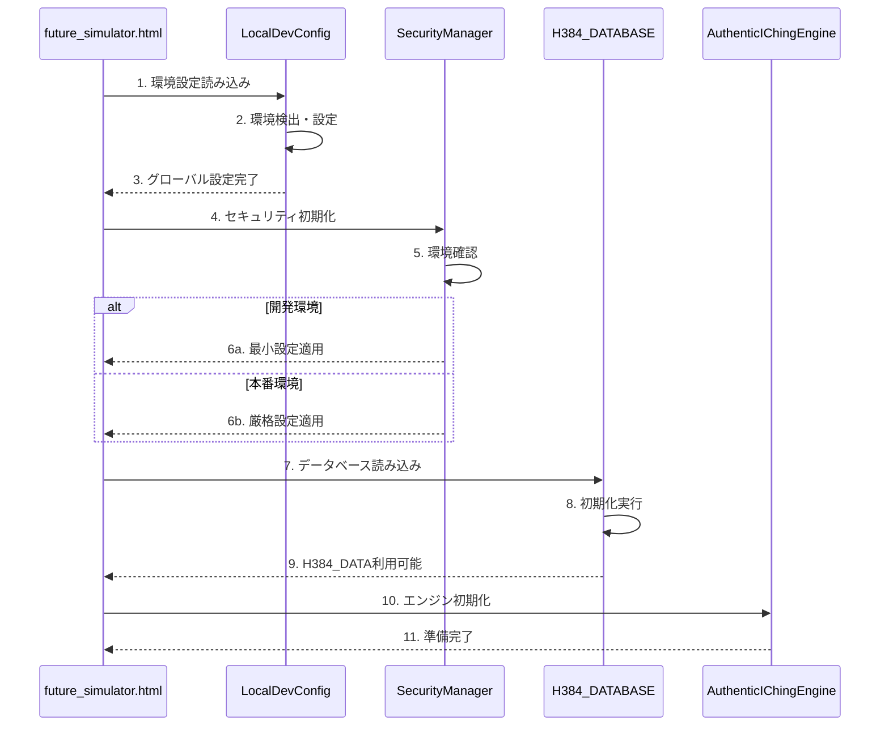

# 設計書 - ローカル環境エラー修正

作成日: 2025年08月06日  
作成者: HAQEI System Designer  
プロジェクト: Future Simulator ローカル環境修正  
バージョン: 1.0

## 1. アーキテクチャ設計

### 1.1 全体構成図

```
┌─────────────────────────────────────────────────────┐
│                 future_simulator.html                │
├─────────────────────────────────────────────────────┤
│  1. 環境検出・設定層                                 │
│     └─ future_simulator_local_dev_config.js         │
│        （最優先で読み込み、環境変数設定）            │
├─────────────────────────────────────────────────────┤
│  2. セキュリティ層                                   │
│     ├─ SecurityHeaderManager.js（条件付き動作）     │
│     ├─ DOMPurifyIntegration.js                     │
│     └─ CSRFProtectionSystem.js                     │
├─────────────────────────────────────────────────────┤
│  3. データ層                                         │
│     └─ H384_DATABASE.js（修正版）                   │
│        └─ H384_DATAグローバル変数                   │
├─────────────────────────────────────────────────────┤
│  4. ビジネスロジック層                              │
│     ├─ AuthenticIChingEngine.js                    │
│     ├─ SituationalContextEngine.js                 │
│     └─ HexagramMappingEngine.js                    │
└─────────────────────────────────────────────────────┘
```

### 1.2 読み込み順序の最適化

```javascript
// Phase 1: 環境設定（最優先）
<script src="./js/future_simulator_local_dev_config.js"></script>

// Phase 2: 外部ライブラリ（条件付き）
<script src="https://cdn.jsdelivr.net/npm/dompurify@3.0.8/dist/purify.min.js"></script>
<script src="https://cdn.tailwindcss.com"></script>

// Phase 3: セキュリティ（環境依存）
<script src="./js/security/SecurityHeaderManager.js"></script>

// Phase 4: コアデータ
<script src="./js/core/H384_DATABASE.js"></script>

// Phase 5: ビジネスロジック
<script src="./js/core/AuthenticIChingEngine.js"></script>
```

## 2. コンポーネント設計

### 2.1 環境設定コンポーネント

#### 設計方針
- 最初に読み込まれ、グローバル設定を確立
- 環境を自動検出し、適切な設定を適用

#### 実装詳細
```javascript
// future_simulator_local_dev_config.js（改良版）
(function() {
  'use strict';
  
  // 環境検出
  const ENV = {
    isDevelopment: ['localhost', '127.0.0.1'].includes(window.location.hostname),
    isStaging: window.location.hostname.includes('staging'),
    isProduction: !this.isDevelopment && !this.isStaging
  };
  
  // グローバル設定
  window.HAQEI_CONFIG = {
    environment: ENV.isDevelopment ? 'development' : 'production',
    security: {
      enableCSP: !ENV.isDevelopment,
      enableSRI: !ENV.isDevelopment,
      allowInlineScripts: ENV.isDevelopment,
      allowInlineStyles: ENV.isDevelopment
    },
    debug: ENV.isDevelopment,
    errorHandling: {
      showDetails: ENV.isDevelopment,
      logToConsole: true,
      logToServer: ENV.isProduction
    }
  };
  
  // SecurityHeaderManagerの事前設定
  window.SECURITY_OVERRIDE = ENV.isDevelopment;
  
  console.log(`🔧 HAQEI環境設定完了: ${window.HAQEI_CONFIG.environment}`);
})();
```

### 2.2 H384データベース修正設計

#### 問題の根本原因
- クラス定義の途中に初期化コードが混入
- 非同期処理の不適切な配置

#### 修正設計
```javascript
// H384_DATABASE.js（修正版構造）
class H384Database {
  constructor() {
    this.hexagrams = new Map();
    this.lineTexts = new Map();
    this.initialized = false;
  }
  
  // 静的データの定義（構文エラーを避ける）
  static get DEFAULT_HEXAGRAMS() {
    return [
      { id: 1, name: "乾為天", chinese: "乾", reading: "けん" },
      // ... 64卦のデータ
    ];
  }
  
  // 非同期初期化メソッド
  async initialize() {
    if (this.initialized) return;
    
    try {
      // データ読み込み
      this.loadStaticData();
      this.initialized = true;
      console.log('✅ H384_DATABASE初期化完了');
    } catch (error) {
      console.error('❌ H384_DATABASE初期化エラー:', error);
      throw error;
    }
  }
  
  // 同期的な静的データ読み込み
  loadStaticData() {
    H384Database.DEFAULT_HEXAGRAMS.forEach(hex => {
      this.hexagrams.set(hex.id, hex);
    });
  }
}

// インスタンス作成とグローバル公開
const H384_DATABASE = new H384Database();
window.H384_DATABASE = H384_DATABASE;

// 自動初期化（エラーをキャッチ）
(async function() {
  try {
    await H384_DATABASE.initialize();
  } catch (error) {
    console.error('初期化失敗、フォールバックモードで継続');
  }
})();
```

### 2.3 SecurityHeaderManager条件付き動作設計

#### 設計方針
- 開発環境では最小限のセキュリティ
- 本番環境ではフルセキュリティ

#### 実装詳細
```javascript
// SecurityHeaderManager.js（改良版）
class SecurityHeaderManager {
  constructor() {
    // 環境設定の確認
    this.config = window.HAQEI_CONFIG || {};
    this.isDevelopment = this.config.environment === 'development';
    
    // 開発環境では初期化をスキップ
    if (this.isDevelopment && window.SECURITY_OVERRIDE) {
      console.log('🛡️ セキュリティ: 開発モード（緩和設定）');
      return;
    }
    
    this.init();
  }
  
  init() {
    if (this.isDevelopment) {
      this.applyDevelopmentHeaders();
    } else {
      this.applyProductionHeaders();
    }
  }
  
  applyDevelopmentHeaders() {
    // 最小限のセキュリティ設定
    console.log('🔧 開発環境用セキュリティ設定適用');
  }
  
  applyProductionHeaders() {
    // 厳格なセキュリティ設定
    this.setCSPPolicy();
    this.validateResources();
  }
}
```

## 3. エラーハンドリング設計

### 3.1 統一エラーハンドラー

```javascript
// ErrorManager.js
class ErrorManager {
  constructor() {
    this.errors = [];
    this.config = window.HAQEI_CONFIG || {};
    this.setupHandlers();
  }
  
  setupHandlers() {
    // グローバルエラーハンドラー
    window.addEventListener('error', (e) => {
      this.handleError({
        type: 'runtime',
        message: e.message,
        source: e.filename,
        line: e.lineno,
        column: e.colno,
        error: e.error
      });
    });
    
    // Promiseリジェクション
    window.addEventListener('unhandledrejection', (e) => {
      this.handleError({
        type: 'promise',
        reason: e.reason,
        promise: e.promise
      });
    });
  }
  
  handleError(errorInfo) {
    this.errors.push(errorInfo);
    
    if (this.config.debug) {
      console.error('🚨 エラー検出:', errorInfo);
    }
    
    // ユーザーフレンドリーな表示
    if (!this.isCritical(errorInfo)) {
      this.showWarning(errorInfo);
    } else {
      this.showError(errorInfo);
    }
  }
}
```

## 4. データフロー設計

### 4.1 初期化シーケンス



## 5. テスト設計

### 5.1 単体テスト

| コンポーネント | テスト項目 | 期待結果 |
|----------------|------------|----------|
| LocalDevConfig | 環境検出 | localhost = development |
| H384_DATABASE | 初期化 | エラーなく完了 |
| H384_DATABASE | データ取得 | 386件のデータ |
| SecurityManager | 開発モード | CSP無効化 |

### 5.2 統合テスト

1. **起動テスト**
   - localhost:3000でエラーなし
   - コンソールエラー0件
   
2. **機能テスト**
   - テキスト入力可能
   - 分析ボタン動作
   - 結果表示

## 6. 実装優先順位

### Phase 1（即時対応）
1. H384_DATABASE.js構文エラー修正
2. future_simulator_local_dev_config.js改良
3. 読み込み順序の調整

### Phase 2（機能回復）
1. SecurityHeaderManager条件付き動作
2. エラーハンドリング追加
3. リソース読み込み最適化

### Phase 3（品質向上）
1. テスト追加
2. ドキュメント更新
3. パフォーマンス最適化

## 7. 次のステップ

本設計書に基づき、タスク表の作成と実装に進みます。