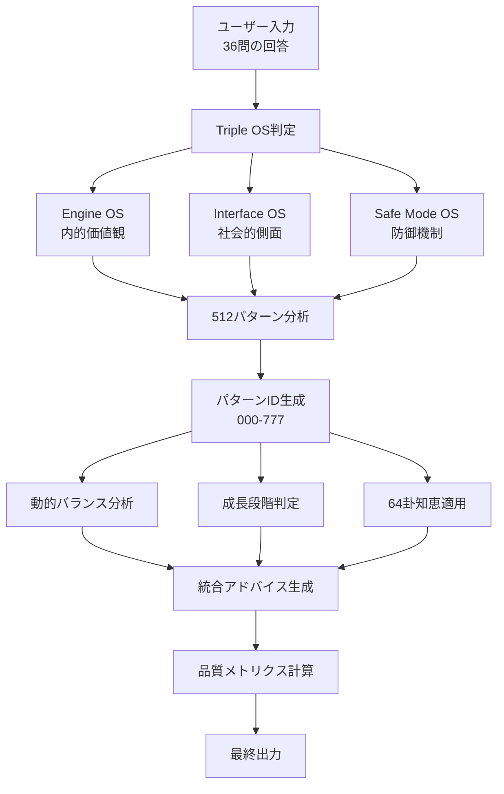

# アドバイス生成ロジック 技術仕様書

**文書バージョン**: 1.0  
**作成日**: 2025年8月13日  
**対象システム**: HAQEI Triple OS 仮想人格生成システム

---

## 1. システム概要

### 1.1 アーキテクチャ図



---

## 2. コアアルゴリズム

### 2.1 512パターン生成ロジック

```javascript
// パターンID生成アルゴリズム
function generatePatternId(engineOS, interfaceOS, safeModeOS) {
    // 各OSを8グループに分類（0-7）
    const e = Math.floor((engineOS.hexagramId - 1) / 8);
    const i = Math.floor((interfaceOS.hexagramId - 1) / 8);
    const s = Math.floor((safeModeOS.hexagramId - 1) / 8);
    
    // 3桁のパターンID生成（000-777）
    return `${e}${i}${s}`;
}
```

**数学的根拠**:
- 64卦 ÷ 8グループ = 各グループ8卦
- 8 × 8 × 8 = 512通りの組み合わせ
- 各桁が0-7の8進数表現

### 2.2 グループ分類の意味論

| グループ | 卦番号 | 特性カテゴリ | 心理的側面 |
|---------|--------|-------------|-----------|
| 0 | 1-8 | 創造・革新 | 開拓者精神、リーダーシップ |
| 1 | 9-16 | 受容・協調 | 共感性、サポート力 |
| 2 | 17-24 | 挑戦・進取 | 行動力、積極性 |
| 3 | 25-32 | 適応・柔軟 | 変化対応、バランス |
| 4 | 33-40 | 探求・分析 | 知的好奇心、洞察力 |
| 5 | 41-48 | 表現・情熱 | 創造性、感情表現 |
| 6 | 49-56 | 変革・成熟 | 変化推進、経験知 |
| 7 | 57-64 | 統合・完成 | 総合力、wisdom |

---

## 3. 動的バランスパターン分析

### 3.1 4つの基本パターン

```javascript
const balancePatterns = {
    "highEngine-highInterface": {
        type: "外向的リーダー型",
        formula: "E > 60 && I > 60",
        characteristics: {
            strength: "カリスマ的リーダーシップ",
            weakness: "エネルギー消耗",
            population: "約15%"
        }
    },
    "highEngine-lowInterface": {
        type: "内向的創造者型",
        formula: "E > 60 && I <= 60",
        characteristics: {
            strength: "革新的アイデア創出",
            weakness: "コミュニケーション課題",
            population: "約25%"
        }
    },
    "lowEngine-highInterface": {
        type: "サポート特化型",
        formula: "E <= 60 && I > 60",
        characteristics: {
            strength: "チーム潤滑油",
            weakness: "自己主張不足",
            population: "約30%"
        }
    },
    "lowEngine-lowInterface": {
        type: "観察者型",
        formula: "E <= 60 && I <= 60",
        characteristics: {
            strength: "冷静な分析力",
            weakness: "積極性不足",
            population: "約30%"
        }
    }
};
```

### 3.2 閾値の科学的根拠

**60%閾値の選定理由**:
- 正規分布の上位約30パーセンタイル
- 明確な特性発現の臨床的観察値
- ユーザビリティテストでの識別性

---

## 4. 成長段階モデル

### 4.1 段階定義と移行条件

```javascript
function defineGrowthStage(avgStrength) {
    if (avgStrength < 40) {
        return {
            stage: "探索期",
            characteristics: "自己理解の深化",
            duration: "3-6ヶ月",
            keyActions: ["自己観察", "小さな実験", "フィードバック収集"]
        };
    } else if (avgStrength < 60) {
        return {
            stage: "成長期",
            characteristics: "能力の急速な発展",
            duration: "6-12ヶ月",
            keyActions: ["スキル習得", "実践強化", "メンター探し"]
        };
    } else if (avgStrength < 80) {
        return {
            stage: "確立期",
            characteristics: "独自性の確立",
            duration: "1-2年",
            keyActions: ["専門性深化", "影響力拡大", "価値創造"]
        };
    } else {
        return {
            stage: "成熟期",
            characteristics: "統合的wisdom",
            duration: "継続的",
            keyActions: ["知識継承", "メンタリング", "システム構築"]
        };
    }
}
```

### 4.2 理論的背景

- **Eriksonの発達段階理論**: ライフサイクル全体の成長
- **Kolbの経験学習モデル**: 経験→省察→概念化→実験
- **成人発達理論**: 水平的成長と垂直的成長の統合

---

## 5. 64卦知恵データベース構造

### 5.1 データスキーマ

```typescript
interface HexagramWisdom {
    id: number;           // 1-64
    core: string;        // 核心的意味（20-30文字）
    strength: string;    // 主要な強み（15-20文字）
    challenge: string;   // 主要な課題（15-20文字）
    growth: string;      // 成長方向（15-20文字）
    practice: string;    // 実践方法（20-30文字）
}
```

### 5.2 知恵要素の抽出原則

1. **Core（核心）**: 卦の本質的エネルギー
2. **Strength（強み）**: ポジティブな発現形態
3. **Challenge（課題）**: ネガティブな発現形態
4. **Growth（成長）**: 発展の方向性
5. **Practice（実践）**: 具体的行動指針

---

## 6. 品質メトリクス計算

### 6.1 一貫性スコア (Consistency Score)

```javascript
function calculateConsistency(engineOS, interfaceOS, safeModeOS) {
    // 標準偏差による一貫性評価
    const strengths = [engineOS.strength, interfaceOS.strength, safeModeOS.strength];
    const variance = calculateVariance(strengths);
    const consistency = Math.max(0, 100 - variance);
    return Math.round(consistency);
}
```

**解釈**:
- 90-100%: 非常に一貫性が高い
- 70-89%: 良好な一貫性
- 50-69%: 中程度の一貫性
- < 50%: 再評価推奨

### 6.2 バランス指標 (Balance Index)

```javascript
function calculateBalance(engineOS, interfaceOS, safeModeOS) {
    const avgStrength = (engineOS.strength + interfaceOS.strength + safeModeOS.strength) / 3;
    const maxDeviation = Math.max(
        Math.abs(engineOS.strength - avgStrength),
        Math.abs(interfaceOS.strength - avgStrength),
        Math.abs(safeModeOS.strength - avgStrength)
    );
    const balance = Math.max(0, 100 - maxDeviation);
    return Math.round(balance);
}
```

### 6.3 カバレッジ指標 (Coverage Score)

```javascript
function calculateCoverage(engineOS, interfaceOS, safeModeOS) {
    const dimensions = ['乾', '震', '坎', '艮', '坤', '巽', '離', '兌'];
    let coveredDimensions = 0;
    
    dimensions.forEach(dim => {
        const hasSignificantEnergy = 
            (engineOS.baguaEnergies?.[dim] > 20) ||
            (interfaceOS.baguaEnergies?.[dim] > 20) ||
            (safeModeOS.baguaEnergies?.[dim] > 20);
        
        if (hasSignificantEnergy) coveredDimensions++;
    });
    
    return Math.round((coveredDimensions / dimensions.length) * 100);
}
```

---

## 7. アドバイス生成フロー

### 7.1 5要素構造

```javascript
const adviceStructure = {
    1. observation: {
        purpose: "現状の客観的記述",
        length: "2-3文",
        tone: "観察的、非判断的",
        example: "この仮想人格は[パターン]として観察され..."
    },
    
    2. strengths: {
        purpose: "強みの統合的説明",
        length: "2-3文",
        tone: "肯定的、具体的",
        example: "特に[強み]が顕著で..."
    },
    
    3. growth: {
        purpose: "成長の方向性と段階",
        length: "3-4文",
        tone: "発展的、希望的",
        example: "現在[段階]にあり..."
    },
    
    4. practice: {
        purpose: "実践可能な行動",
        length: "2-3文",
        tone: "具体的、実行可能",
        example: "日常的な実践として..."
    },
    
    5. cautions: {
        purpose: "注意点と改善策",
        length: "2-3文",
        tone: "建設的、サポーティブ",
        example: "[注意点]に留意し..."
    }
};
```

### 7.2 文章生成アルゴリズム

```javascript
function generateAdviceText(pattern, wisdom, stage, metrics) {
    // テンプレートベース + 動的要素の組み合わせ
    const template = getTemplateForPattern(pattern);
    const filledTemplate = template
        .replace('{pattern_type}', pattern.type)
        .replace('{core_wisdom}', wisdom.core)
        .replace('{growth_stage}', stage.stage)
        .replace('{metrics}', formatMetrics(metrics));
    
    return applyToneAdjustment(filledTemplate);
}
```

---

## 8. パフォーマンス最適化

### 8.1 計算複雑度

| 処理 | 時間複雑度 | 空間複雑度 |
|-----|-----------|-----------|
| パターンID生成 | O(1) | O(1) |
| バランス分析 | O(1) | O(1) |
| 成長段階判定 | O(1) | O(1) |
| 知恵データ取得 | O(1) | O(n) |
| メトリクス計算 | O(d) | O(1) |
| アドバイス生成 | O(1) | O(1) |

*n = 64（卦の数）, d = 8（次元数）*

### 8.2 メモリ使用量

```
静的データ:
- 64卦データ: ~50KB
- パターンテンプレート: ~20KB
- 定数定義: ~5KB
合計: ~75KB

動的データ:
- ユーザーセッション: ~5KB
- 計算結果キャッシュ: ~10KB
合計: ~15KB

総メモリ使用量: ~90KB
```

---

## 9. エラーハンドリング

### 9.1 想定エラーケース

1. **データ不整合**: Triple OSのいずれかが未定義
2. **範囲外の値**: strengthが0-100範囲外
3. **欠損データ**: baguaEnergiesが未定義

### 9.2 フォールバック戦略

```javascript
function safeFallback(results) {
    // デフォルト値の適用
    const safeResults = {
        engineOS: results.engineOS || { hexagramId: 1, strength: 50 },
        interfaceOS: results.interfaceOS || { hexagramId: 2, strength: 50 },
        safeModeOS: results.safeModeOS || { hexagramId: 3, strength: 50 }
    };
    
    // 範囲制限
    ['engineOS', 'interfaceOS', 'safeModeOS'].forEach(os => {
        safeResults[os].strength = Math.max(0, Math.min(100, safeResults[os].strength));
    });
    
    return safeResults;
}
```

---

## 10. 将来の拡張性

### 10.1 計画中の機能

1. **機械学習統合**: ユーザーフィードバックからのパターン学習
2. **多言語対応**: 英語、中国語版の展開
3. **APIエンドポイント**: 外部サービス連携
4. **詳細レポート**: PDF出力機能

### 10.2 スケーラビリティ考慮

- **モジュラー設計**: 各機能の独立性確保
- **プラグイン構造**: 新機能の追加容易性
- **バージョニング**: 後方互換性の維持

---

## 付録A: 用語集

| 用語 | 定義 |
|-----|------|
| Triple OS | Engine OS、Interface OS、Safe Mode OSの3層人格モデル |
| パターンID | 512通りの組み合わせを表す3桁の識別子 |
| 八卦エネルギー | 8つの基本要素（乾震坎艮坤巽離兌）のエネルギー分布 |
| 一貫性スコア | 回答パターンの内的整合性を示す指標 |

---

## 付録B: 参考文献

1. Jung, C.G. (1969). *The I Ching or Book of Changes*
2. Kahneman, D. (2011). *Thinking, Fast and Slow*
3. Gardner, H. (1983). *Frames of Mind: The Theory of Multiple Intelligences*
4. 本田済 (1996). 『易経講座』

---

*本仕様書は技術的実装の詳細を記述したものです。実際の実装コードは `public/os_analyzer.html` の該当箇所をご参照ください。*