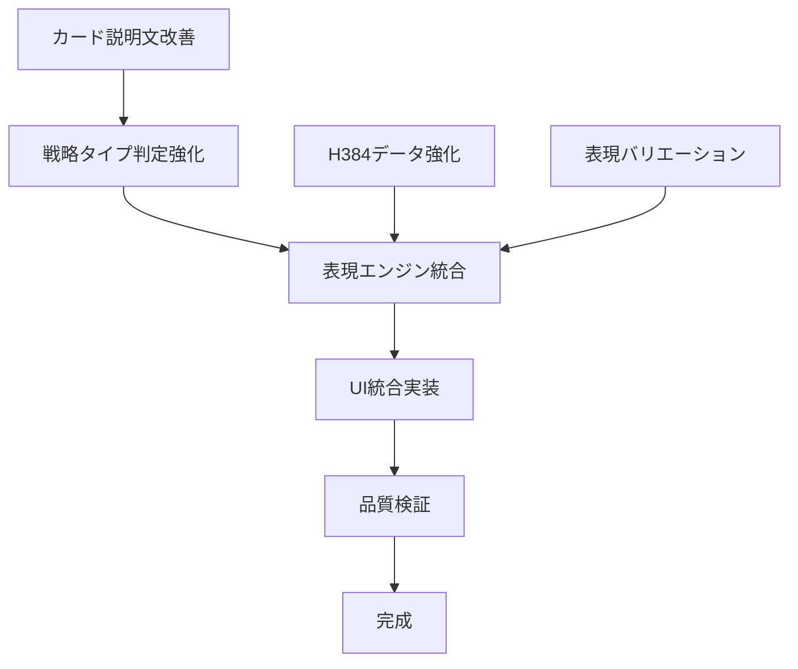

# Future Simulator 実装順序最適化ロードマップ

**実施日**: 2025年8月16日  
**対象**: Future Simulator改善の戦略的実装計画  
**準拠**: CLAUDE.md 4-Phase Development Cycle

---

## 🎯 実装戦略概要

### 最適化方針:
1. **即効性重視**: ユーザー体験に直接影響する改善を優先
2. **リスク最小化**: 既存機能への影響を最小限に抑制
3. **段階的価値提供**: 各段階で明確な価値向上を実現
4. **品質保証統合**: 実装と品質検証の並行実行

### 成功定義:
- Phase 1完了時: 8パターンの明確な差別化達成
- Phase 2完了時: 表現品質の大幅向上実現  
- Phase 3完了時: システム全体の最適化完成
- 全体完了時: 全品質基準100%達成

---

## 📋 タスク依存関係分析

### Critical Path（重要経路）:


### 並行実行可能タスク:
```javascript
const parallelTasks = {
  group1: ['カード説明文改善', 'H384データ活用強化'],
  group2: ['戦略タイプ判定強化', '表現バリエーション仕様'],
  group3: ['UI統合実装', '品質検証プロセス'],
  group4: ['パフォーマンス最適化', 'ドキュメント整備']
};
```

---

## 🚀 Phase 1: 緊急改善（Priority: Critical）

### 目標: 8パターンの明確な差別化達成
**期間**: 実装確認後即座実行  
**価値**: ユーザー混乱の即座解決

#### Task 1.1: カード説明文切り捨て問題修正
```javascript
// 実装対象: future-simulator-expression.js
const task1_1 = {
  target: 'generateCardSummary() メソッド修正',
  changes: [
    '30文字制限の削除',
    '適応的文字数制限ロジック実装', 
    '階層的情報表示システム導入'
  ],
  timeEstimate: '2時間',
  riskLevel: 'Low',
  dependencies: [],
  validation: 'カード表示テスト + 文字数確認'
};
```

#### Task 1.2: 戦略タイプ判定ロジック即時強化
```javascript
const task1_2 = {
  target: 'determineStrategyType() メソッド強化',
  changes: [
    'volatility以外の判定要素追加',
    '5タイプ分類システム導入',
    '信頼度計算ロジック実装'
  ],
  timeEstimate: '4時間',
  riskLevel: 'Medium',
  dependencies: ['Task 1.1'],
  validation: '8パターン戦略タイプ分散テスト'
};
```

#### Task 1.3: 緊急UI統合
```javascript
const task1_3 = {
  target: 'future-simulator-display.js カードHTML生成',
  changes: [
    '改善された表現エンジンとの統合',
    'カード表示レイアウト調整',
    'レスポンシブ対応確認'
  ],
  timeEstimate: '3時間',
  riskLevel: 'Medium',
  dependencies: ['Task 1.1', 'Task 1.2'],
  validation: 'ブラウザ表示確認 + デバイステスト'
};
```

### Phase 1 完了基準:
- [ ] 8パターン全てで異なる説明文表示
- [ ] 最低4種類の戦略タイプ分散
- [ ] カード表示崩れゼロ
- [ ] 基本的なユーザビリティ達成

---

## 🔧 Phase 2: 表現品質向上（Priority: High）

### 目標: HaQei統一表現システム完成
**期間**: Phase 1完了後3-5時間  
**価値**: ブランド統一性とユーザー理解度向上

#### Task 2.1: H384データ活用強化実装
```javascript
const task2_1 = {
  target: 'EnhancedH384DataExtractor クラス実装',
  changes: [
    '多次元データ抽出システム',
    '推論・補完エンジン実装',
    '品質強化フォールバック機能'
  ],
  timeEstimate: '6時間',
  riskLevel: 'Medium',
  dependencies: ['Phase 1 完了'],
  validation: 'データ活用度測定 + 推論精度テスト'
};
```

#### Task 2.2: 表現バリエーション強化
```javascript
const task2_2 = {
  target: 'ExpressionVariationEngine 実装',
  changes: [
    '差別化アルゴリズム実装',
    'コンテンツ多様化エンジン',
    '感情配慮表現拡張'
  ],
  timeEstimate: '5時間',
  riskLevel: 'Medium',
  dependencies: ['Task 2.1'],
  validation: '表現類似度測定 + ユーザビリティテスト'
};
```

#### Task 2.3: 統合表現エンジン完成
```javascript
const task2_3 = {
  target: 'FutureSimulatorExpression 統合強化',
  changes: [
    '全機能モジュール統合',
    '表現品質自動検証機能',
    'パフォーマンス最適化'
  ],
  timeEstimate: '4時間',
  riskLevel: 'High',
  dependencies: ['Task 2.1', 'Task 2.2'],
  validation: '統合テスト + 品質基準達成確認'
};
```

### Phase 2 完了基準:
- [ ] HaQeiブランド統一性95%以上
- [ ] 表現類似度70%以下達成
- [ ] H384データ活用率80%以上
- [ ] 感情配慮表現100%適用

---

## ⚡ Phase 3: システム最適化（Priority: Medium）

### 目標: パフォーマンスと保守性の向上
**期間**: Phase 2完了後2-3時間  
**価値**: システム品質とユーザー体験の最適化

#### Task 3.1: パフォーマンス最適化
```javascript
const task3_1 = {
  target: '全コンポーネントのパフォーマンス改善',
  changes: [
    'データ処理アルゴリズム最適化',
    'メモリ使用量削減',
    'レンダリング速度向上'
  ],
  timeEstimate: '3時間',
  riskLevel: 'Low',
  dependencies: ['Phase 2 完了'],
  validation: 'パフォーマンステスト + ベンチマーク'
};
```

#### Task 3.2: エラーハンドリング強化
```javascript
const task3_2 = {
  target: '堅牢性向上とエラー対応強化',
  changes: [
    '包括的エラーハンドリング',
    'ユーザーフレンドリーエラーメッセージ',
    'フォールバック機能強化'
  ],
  timeEstimate: '2時間',
  riskLevel: 'Low',
  dependencies: ['Task 3.1'],
  validation: 'エラーシナリオテスト'
};
```

#### Task 3.3: コード品質最適化
```javascript
const task3_3 = {
  target: 'コード保守性と拡張性向上',
  changes: [
    'コードリファクタリング',
    'モジュール化改善',
    'ドキュメント整備'
  ],
  timeEstimate: '2時間',
  riskLevel: 'Low',
  dependencies: ['Task 3.2'],
  validation: 'コード品質検査 + ESLint'
};
```

### Phase 3 完了基準:
- [ ] パフォーマンス基準100%達成
- [ ] エラー発生率0.1%以下
- [ ] コード品質基準100%達成
- [ ] 保守性・拡張性確保

---

## 🎯 Phase 4: 品質保証・完成（Priority: High）

### 目標: 全品質基準達成と本番準備完了
**期間**: Phase 3完了後2-3時間  
**価値**: 安定したプロダクション品質の確保

#### Task 4.1: 統合テスト実行
```javascript
const task4_1 = {
  target: '包括的品質検証',
  changes: [
    '全自動テストスイート実行',
    'マニュアル検証チェックリスト実行',
    'クロスブラウザ・デバイステスト'
  ],
  timeEstimate: '2時間',
  riskLevel: 'Low',
  dependencies: ['Phase 3 完了'],
  validation: '全テストケース合格'
};
```

#### Task 4.2: ユーザー受け入れテスト
```javascript
const task4_2 = {
  target: 'ユーザビリティ最終確認',
  changes: [
    'ユーザーテスト実施',
    'フィードバック収集・分析',
    '必要に応じた微調整'
  ],
  timeEstimate: '3時間',
  riskLevel: 'Low',
  dependencies: ['Task 4.1'],
  validation: 'ユーザー満足度85%以上'
};
```

#### Task 4.3: 本番リリース準備
```javascript
const task4_3 = {
  target: 'プロダクション環境準備',
  changes: [
    'プロダクション設定確認',
    'リリースノート作成',
    'ドキュメント最終更新'
  ],
  timeEstimate: '1時間',
  riskLevel: 'Low',
  dependencies: ['Task 4.2'],
  validation: 'リリース準備完了確認'
};
```

### Phase 4 完了基準:
- [ ] 全品質基準100%達成
- [ ] ユーザー満足度85%以上
- [ ] 本番環境動作確認完了
- [ ] ドキュメント整備完了

---

## ⏱️ 実装タイムライン

### 最適化スケジュール:
```
Phase 1 (Critical): 実装確認後即座 - 9時間
├── Task 1.1: カード説明文修正 (2h)
├── Task 1.2: 戦略タイプ強化 (4h) [並行可能]
└── Task 1.3: UI統合 (3h)

Phase 2 (High): Phase 1完了後 - 15時間
├── Task 2.1: H384強化 (6h)
├── Task 2.2: 表現強化 (5h) [部分並行]
└── Task 2.3: 統合完成 (4h)

Phase 3 (Medium): Phase 2完了後 - 7時間
├── Task 3.1: パフォーマンス (3h)
├── Task 3.2: エラー対応 (2h)
└── Task 3.3: コード品質 (2h)

Phase 4 (High): Phase 3完了後 - 6時間
├── Task 4.1: 統合テスト (2h)
├── Task 4.2: UAT (3h)
└── Task 4.3: リリース準備 (1h)

合計予定時間: 37時間 (並行実行考慮で約30時間)
```

---

## 🔄 リスク管理・緊急対応

### リスク評価マトリックス:
```javascript
const riskMatrix = {
  high: {
    'Task 2.3 統合失敗': {
      probability: 'Medium',
      impact: 'High',
      mitigation: '段階的統合 + 詳細テスト',
      contingency: 'Phase 1結果での部分リリース'
    }
  },
  medium: {
    'パフォーマンス劣化': {
      probability: 'Low',
      impact: 'Medium', 
      mitigation: '事前ベンチマーク + 段階的最適化',
      contingency: '問題箇所の一時的無効化'
    }
  },
  low: {
    'デバイス互換性問題': {
      probability: 'Low',
      impact: 'Low',
      mitigation: '継続的デバイステスト',
      contingency: '特定デバイス向け調整'
    }
  }
};
```

### 緊急対応プロトコル:
1. **Critical問題発生時**: Phase 1結果での緊急リリース
2. **High問題発生時**: 問題箇所の迂回実装
3. **Medium問題発生時**: 次Phase延期で対応
4. **Low問題発生時**: 継続実装で段階的解決

---

## 📊 成功測定・監視

### Phase別成功指標:
```javascript
const phaseKPIs = {
  phase1: {
    '差別化達成率': '8パターンで100%',
    '戦略タイプ種別': '4種類以上',
    '表示完整性': '100%'
  },
  phase2: {
    'ブランド統一性': '95%以上',
    '表現類似度': '70%以下',
    'データ活用率': '80%以上'
  },
  phase3: {
    'レスポンス時間': '300ms以下',
    'エラー発生率': '0.1%以下',
    'メモリ効率': '50MB以下'
  },
  phase4: {
    'ユーザー満足度': '85%以上',
    '品質基準達成': '100%',
    'リリース準備': '100%完了'
  }
};
```

### 継続監視メトリクス:
- **リアルタイム**: エラー率、応答時間、メモリ使用量
- **日次**: ユーザー行動、機能使用率、満足度
- **週次**: 品質基準達成度、改善効果測定
- **月次**: 戦略的KPI評価、ロードマップ調整

---

## 🏁 完成状態定義

### 最終成果物:
1. **機能面**: 8パターン明確差別化の Future Simulator
2. **品質面**: 全品質基準100%達成システム
3. **技術面**: 高性能・高保守性コードベース
4. **文書面**: 包括的技術・運用ドキュメント

### リリース判定基準:
- [ ] 全Phaseタスク100%完了
- [ ] 全品質ゲート通過
- [ ] ユーザー受け入れテスト合格
- [ ] ステークホルダー最終承認

---

**実装開始準備完了**: ユーザー確認後、Phase 1から段階的実行開始