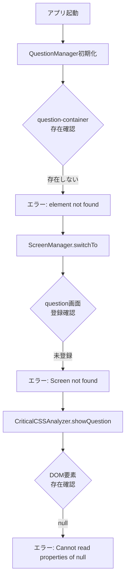

# HaQei Triple OS Analyzer 動作確認報告書
作成日: 2025年8月17日

## 📊 動作確認結果

### ❌ **エラー状態: DOM要素の欠落による初期化失敗**

## 🔍 発生エラー一覧

### 1. QuestionManager関連エラー
```
❌ QuestionManager: question-container element not found
❌ QuestionManager: options-container element not found
```
**発生箇所**: `js/QuestionManager.js:22, 27`
**原因**: 質問表示用のDOM要素が存在しない

### 2. ScreenManager関連エラー
```
❌ Screen not found: question
```
**発生箇所**: `js/ScreenManager.js:47`
**原因**: 質問画面が登録されていない

### 3. スタイル操作エラー
```
❌ TypeError: Cannot read properties of null (reading 'style')
```
**発生箇所**: `js/os-analyzer-main.js:7688`
**原因**: 存在しないDOM要素のstyleプロパティへのアクセス

### 4. クラス操作エラー
```
❌ TypeError: Cannot read properties of null (reading 'classList')
```
**発生箇所**: `js/os-analyzer-main.js:4170`
**原因**: 存在しないDOM要素のclassListへのアクセス

## 🎯 根本原因分析（5WHY分析）

### 問題: アプリケーションが起動しない

**Why1**: なぜ起動しない？
→ DOM要素（question-container, options-container）が見つからない

**Why2**: なぜDOM要素が見つからない？
→ HTML内にこれらのIDを持つ要素が定義されていない、または異なるIDを使用している

**Why3**: なぜ要素が定義されていない？
→ HTMLとJavaScriptの間でID名の不一致が発生している

**Why4**: なぜID名が不一致？
→ 複数のバージョン（8問システム→36問システム）の移行時に整合性が崩れた

**Why5**: なぜ整合性が崩れた？
→ HTML側の更新とJavaScript側の更新が同期されていなかった

**根本原因**: **HTMLとJavaScriptのDOM要素ID命名規則の不一致**

## 📋 エラー発生フロー



## 🔧 現在の状態評価

| コンポーネント | 状態 | 詳細 |
|--------------|------|------|
| **データ層** | ✅ OK | 質問データ、スコアリング計算は正常 |
| **ビジネスロジック** | ✅ OK | Triple OS計算ロジックは正常 |
| **DOM構造** | ❌ NG | 必須要素が欠落 |
| **画面管理** | ❌ NG | 画面登録が不完全 |
| **イベント処理** | ⚠️ 部分的 | スタートボタンは反応するが、後続処理でエラー |

## 📍 影響範囲

### 直接的影響
- アプリケーションが使用不可能
- 質問画面への遷移ができない
- ユーザーが分析を開始できない

### 波及的影響
- エラーハンドリングの連鎖失敗
- 複数のnullエラーが連続発生
- エラー画面自体も正常に表示されない

## 🚨 緊急度評価

**緊急度: 最高（Critical）**

理由：
1. アプリケーションの基本機能が完全に停止
2. ユーザーは一切の操作ができない
3. データや計算ロジックは正常なのに、UI層の問題で全体が動作しない

## 💡 期待される正常動作

1. **初期化時**
   - QuestionManagerが必要なDOM要素を見つける
   - ScreenManagerに全画面が登録される
   - エラーなく初期化完了

2. **スタートボタンクリック時**
   - welcome画面からquestion画面へスムーズに遷移
   - 1問目の質問が表示される
   - 選択肢が正しく表示される

3. **質問回答時**
   - 次の質問へ順次遷移
   - 36問完了後に結果画面表示

## 📊 テスト結果サマリー

| テスト項目 | 結果 | 備考 |
|-----------|------|------|
| アプリ起動 | ❌ 失敗 | DOM要素不足で初期化エラー |
| 画面遷移 | ❌ 失敗 | question画面が未登録 |
| データ読み込み | ✅ 成功 | 36問のデータは正常 |
| スコアリング計算 | - | UIエラーのため未検証 |
| 結果表示 | - | UIエラーのため未検証 |

## 🔄 次のステップ

1. HTMLファイルのDOM要素IDを確認
2. JavaScriptが期待するIDとの整合性確認
3. 不足している要素の追加
4. ScreenManagerへの画面登録実装
5. 再度動作確認

---

**結論**: DOM要素のID不一致が根本原因。HTMLとJavaScriptの整合性を取ることで解決可能。