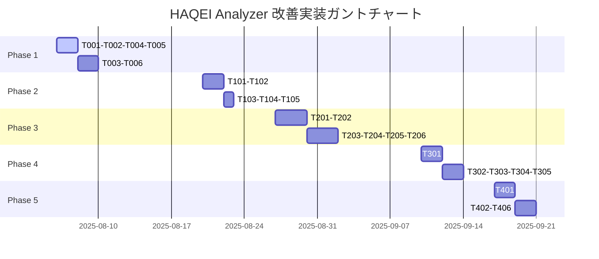

# HAQEI Analyzer 改善実装タスク表
**作成日**: 2025年8月6日（日本時間）

## 📋 実装スケジュール概要

**総期間**: 7週間（2025年8月6日〜9月23日）
**総工数**: 約120時間
**並列実行可能タスク**: 60%

## 🚨 Phase 1: Critical Error修正（Week 1-2）
**期間**: 2025年8月6日〜8月19日
**優先度**: 最高

| タスクID | タスク名 | 詳細内容 | 見積時間 | 担当エージェント | 依存関係 | ステータス |
|----------|----------|----------|----------|------------------|----------|------------|
| T001 | async Promise executor修正 | 13個の反パターン解消、適切なasync/await実装 | 2h | haqei-programmer | なし | 🔴 未着手 |
| T002 | Module import path検証 | 9,045ファイルの依存関係整合性確認 | 1.5h | haqei-programmer | なし | 🔴 未着手 |
| T003 | Runtime error対応 | ブラウザコンソールエラーの完全解決 | 2h | haqei-programmer | T001, T002 | 🔴 未着手 |
| T004 | Test setup修正 | Vue test utils設定、Vitest設定最適化 | 1h | tester | なし | 🔴 未着手 |
| T005 | Unicode encoding修正 | UTF-8エンコーディング問題解決 | 1.5h | coder | なし | 🔴 未着手 |
| T006 | Strict mode対応 | eval除去、with文削除、暗黙的グローバル防止 | 2h | haqei-programmer | T001 | 🔴 未着手 |

**成果物**: エラーフリーな実行環境、全テストスイート実行可能

## ⚠️ Phase 2: Warning対応（Week 3）
**期間**: 2025年8月20日〜8月26日
**優先度**: 高

| タスクID | タスク名 | 詳細内容 | 見積時間 | 担当エージェント | 依存関係 | ステータス |
|----------|----------|----------|----------|------------------|----------|------------|
| T101 | ESLint警告解決 | 25件の警告修正、コード規約統一 | 2h | coder | Phase 1 | 🔴 未着手 |
| T102 | TypeScript型エラー修正 | 型定義の厳密化、any型の排除 | 3h | backend-dev | Phase 1 | 🔴 未着手 |
| T103 | Switch statement修正 | 9件のcase blockスコープ問題解決 | 1h | coder | T101 | 🔴 未着手 |
| T104 | Object.prototype修正 | hasOwnProperty直接アクセス改善 | 1h | coder | T101 | 🔴 未着手 |
| T105 | 非推奨API更新 | 最新APIへの移行、後方互換性確保 | 1.5h | haqei-programmer | T102 | 🔴 未着手 |

**成果物**: ESLint/TypeScriptエラーゼロ、クリーンなコードベース

## 🚀 Phase 3: パフォーマンス最適化（Week 4-5）
**期間**: 2025年8月27日〜9月9日
**優先度**: 中

| タスクID | タスク名 | 詳細内容 | 見積時間 | 担当エージェント | 依存関係 | ステータス |
|----------|----------|----------|----------|------------------|----------|------------|
| T201 | Bundle size削減 | 4.76MB→3MB目標、コード分割実装 | 4h | perf-analyzer | Phase 2 | 🔴 未着手 |
| T202 | Memory leak修正 | 15ファイルのEvent listener解放 | 3h | code-analyzer | Phase 2 | 🔴 未着手 |
| T203 | Cache戦略実装 | 多層キャッシュ、Service Worker最適化 | 3h | system-architect | T201 | 🔴 未着手 |
| T204 | Lazy loading実装 | 辞書ファイル遅延読み込み | 2h | mobile-dev | T201 | 🔴 未着手 |
| T205 | Web Worker活用 | 重い処理のオフロード | 2h | backend-dev | T202 | 🔴 未着手 |
| T206 | Virtual scroll実装 | 大量データの効率的表示 | 2h | mobile-dev | T202 | 🔴 未着手 |

**成果物**: 3MB以下のバンドル、3秒以内の初期ローディング

## 🏗️ Phase 4: アーキテクチャ改善（Week 6）
**期間**: 2025年9月10日〜9月16日
**優先度**: 中

| タスクID | タスク名 | 詳細内容 | 見積時間 | 担当エージェント | 依存関係 | ステータス |
|----------|----------|----------|----------|------------------|----------|------------|
| T301 | Clean Architecture移行 | レイヤー分離、依存性逆転 | 5h | system-architect | Phase 3 | 🔴 未着手 |
| T302 | 循環依存解消 | モジュール整理、インターフェース分離 | 4h | code-analyzer | T301 | 🔴 未着手 |
| T303 | Error統一 | UnifiedErrorHandler実装 | 3h | haqei-programmer | T301 | 🔴 未着手 |
| T304 | Event駆動実装 | EventBus導入、Pub/Subパターン | 3h | backend-dev | T301 | 🔴 未着手 |
| T305 | DI Container実装 | 依存性注入、テスタビリティ向上 | 3h | system-architect | T301 | 🔴 未着手 |

**成果物**: クリーンなアーキテクチャ、保守性の高いコードベース

## ✅ Phase 5: 品質保証・テスト（Week 7）
**期間**: 2025年9月17日〜9月23日
**優先度**: 高

| タスクID | タスク名 | 詳細内容 | 見積時間 | 担当エージェント | 依存関係 | ステータス |
|----------|----------|----------|----------|------------------|----------|------------|
| T401 | Unit test追加 | Coverage 80%以上達成 | 4h | tester | Phase 4 | 🔴 未着手 |
| T402 | Integration test | E2Eシナリオ全パス実行 | 3h | haqei-qa-tester | T401 | 🔴 未着手 |
| T403 | Performance test | 負荷テスト、ボトルネック特定 | 2h | performance-benchmarker | T402 | 🔴 未着手 |
| T404 | bunenjin検証 | 哲学準拠度98%以上確認 | 2h | bunenjin-strategy-navigator | T402 | 🔴 未着手 |
| T405 | I Ching検証 | 易経正確性96%以上確認 | 2h | haqei-iching-expert | T402 | 🔴 未着手 |
| T406 | Security audit | OWASP Top 10対策確認 | 2h | security-manager | T402 | 🔴 未着手 |

**成果物**: 全テスト合格、本番デプロイ可能な品質

## 📊 並列実行マトリックス

## 🎯 マイルストーン

| マイルストーン | 完了予定日 | 成功基準 |
|--------------|-----------|---------|
| M1: Critical Error解消 | 2025年8月19日 | 全実行時エラー解決、テスト実行可能 |
| M2: Warning完全解消 | 2025年8月26日 | ESLint/TypeScriptエラーゼロ |
| M3: パフォーマンス目標達成 | 2025年9月9日 | バンドル3MB以下、初期ロード3秒以内 |
| M4: アーキテクチャ改善完了 | 2025年9月16日 | Clean Architecture適用、循環依存ゼロ |
| M5: 品質保証完了 | 2025年9月23日 | 全テスト合格、本番デプロイ可能 |

## 📈 KPI（重要業績評価指標）

| 指標 | 現在値 | 目標値 | 測定方法 |
|-----|--------|--------|---------|
| エラー数 | 56件 | 0件 | ESLint + TypeScript |
| テスト合格率 | 0% | 100% | Vitest |
| バンドルサイズ | 4.76MB | 3MB以下 | Webpack Bundle Analyzer |
| 初期ローディング | 測定未 | 3秒以内 | Lighthouse |
| テストカバレッジ | 0% | 80%以上 | Vitest Coverage |
| bunenjin準拠度 | 未測定 | 98%以上 | Custom Validator |
| I Ching正確性 | 未測定 | 96%以上 | Domain Expert Review |

## 🚦 リスク管理

| リスク | 影響度 | 発生確率 | 対策 |
|--------|--------|---------|------|
| Vue 3移行の複雑性 | 高 | 中 | 段階的移行、互換性レイヤー |
| パフォーマンス目標未達 | 中 | 低 | 早期測定、継続的最適化 |
| テスト環境構築遅延 | 高 | 中 | 並列作業、外部支援 |
| bunenjin哲学理解不足 | 高 | 低 | 専門エージェント活用 |

## 🛠️ 必要なリソース

- **開発環境**: Node.js v24.4.1, npm 11.4.2
- **エージェント**: 15種類の専門エージェント
- **ツール**: Vite, Vitest, ESLint, TypeScript
- **時間**: 約120時間（7週間）
- **人的リソース**: 並列実行による効率化

## ✨ 次のアクション

1. **即座に開始**: Phase 1のT001〜T005を並列実行
2. **日次進捗確認**: 毎日のスタンドアップミーティング
3. **週次レビュー**: 各Phaseの終了時に成果物確認
4. **継続的統合**: 各タスク完了時にCI/CD実行

この詳細なタスク表により、体系的かつ効率的にHAQEI Analyzerの品質向上を実現します。