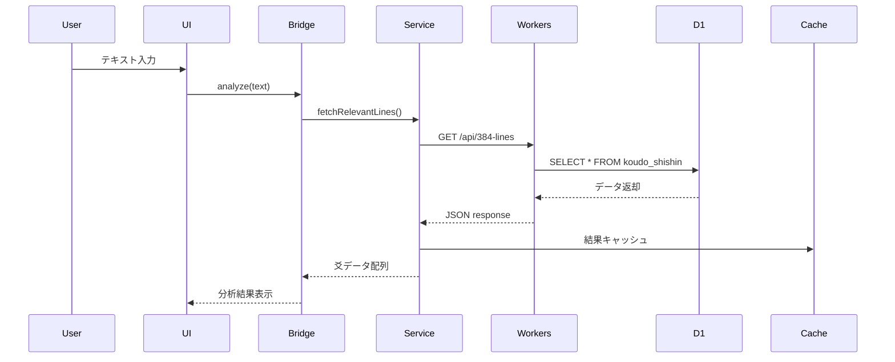
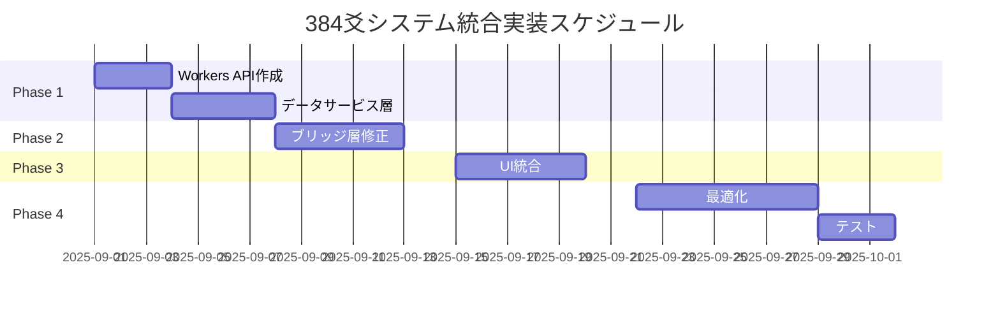

# 📋 future-simulator.html 384爻システム統合実装計画

**文書番号**: FS-384-001  
**バージョン**: 1.0  
**作成日**: 2025年8月28日  
**作成者**: HAQEI開発チーム  
**ステータス**: 未実装

---

## 1. 現状分析

### 1.1 実装状況

#### ✅ **完了済み**
- **データベース基盤**
  - koudo_shishin: 386レコード（D1）
  - hexagrams: 64レコード（D1）
  - yaoci_lines: 150レコード（D1）
  
- **ブリッジコンポーネント**
  - TextTo384LinesBridge.js: 形態素解析実装済み
  - H384DatabaseConnector.js: 存在確認済み

#### ❌ **未実装**
- **データベース接続**
  - D1データベースとの実際の接続
  - Workers API経由でのデータ取得
  - キャッシュ層の実装
  
- **UI統合**
  - future-simulator.htmlへの384爻表示
  - ユーザー入力からの爻選択ロジック
  - 結果表示コンポーネント

### 1.2 問題点

```javascript
// 現在の問題
1. TextTo384LinesBridge.jsがJSONファイルを直接読み込もうとしている
   → D1データベースから読み込むように変更必要

2. future-simulator.htmlがH384_DATAという静的配列に依存
   → 動的なデータベースアクセスに変更必要

3. Edge環境での50ms制限を考慮していない
   → キャッシュとフォールバック戦略必要
```

---

## 2. 実装アーキテクチャ

### 2.1 全体構成

```
┌─────────────────────────────────────────────────────┐
│            future-simulator.html (UI)               │
├─────────────────────────────────────────────────────┤
│          TextTo384LinesBridge.js (分析層)           │
├─────────────────────────────────────────────────────┤
│         384DataService.js (サービス層) 【新規】      │
├─────────────────────────────────────────────────────┤
│     Cloudflare Workers API (データアクセス層)        │
├─────────────────────────────────────────────────────┤
│          D1 Database (データストレージ)              │
└─────────────────────────────────────────────────────┘
```

### 2.2 データフロー



---

## 3. 実装計画

### Phase 1: データアクセス層構築（Week 1）

#### Task 1-1: Workers API作成
```javascript
// /functions/api/384-lines.js
export async function onRequest(context) {
    const { env, request } = context;
    const url = new URL(request.url);
    
    // キャッシュチェック
    const cache = caches.default;
    const cacheKey = new Request(url.toString(), request);
    const cachedResponse = await cache.match(cacheKey);
    
    if (cachedResponse) {
        return cachedResponse;
    }
    
    try {
        // D1から384爻データ取得
        const { results: koudo } = await env.DB.prepare(
            "SELECT * FROM koudo_shishin"
        ).all();
        
        const { results: hexagrams } = await env.DB.prepare(
            "SELECT * FROM hexagrams"
        ).all();
        
        const response = Response.json({
            success: true,
            data: {
                lines: koudo,
                hexagrams: hexagrams
            }
        });
        
        // キャッシュ設定（1時間）
        response.headers.set('Cache-Control', 'max-age=3600');
        context.waitUntil(cache.put(cacheKey, response.clone()));
        
        return response;
    } catch (error) {
        return Response.json({
            success: false,
            error: error.message
        }, { status: 500 });
    }
}
```

#### Task 1-2: データサービス層実装
```javascript
// /public/js/services/384DataService.js
class DataService384 {
    constructor() {
        this.cache = new Map();
        this.apiEndpoint = '/api/384-lines';
        this.fallbackData = null;
    }
    
    async fetchLines() {
        // メモリキャッシュチェック
        if (this.cache.has('lines')) {
            return this.cache.get('lines');
        }
        
        try {
            const response = await fetch(this.apiEndpoint);
            if (!response.ok) throw new Error('API error');
            
            const data = await response.json();
            this.cache.set('lines', data.data.lines);
            
            return data.data.lines;
        } catch (error) {
            console.error('Failed to fetch from API:', error);
            return this.loadFallbackData();
        }
    }
    
    async loadFallbackData() {
        // フォールバック: ローカルJSONファイル
        if (!this.fallbackData) {
            const response = await fetch('./data/koudo_shishin.json');
            this.fallbackData = await response.json();
        }
        return this.fallbackData;
    }
}
```

### Phase 2: ブリッジ層修正（Week 2）

#### Task 2-1: TextTo384LinesBridge改修
```javascript
// TextTo384LinesBridge.jsの修正
class TextTo384LinesBridge {
    constructor() {
        this.dataService = new DataService384();
        this.linesData = null;
        this.initialized = false;
    }
    
    async initialize() {
        if (this.initialized) return;
        
        console.log('📊 384爻データ初期化中...');
        this.linesData = await this.dataService.fetchLines();
        this.initialized = true;
        console.log(`✅ ${this.linesData.length}個の爻データ読み込み完了`);
    }
    
    async analyzeText(text) {
        // 初期化確認
        if (!this.initialized) {
            await this.initialize();
        }
        
        // 既存の分析ロジック継続
        const analysis = this.performAnalysis(text);
        
        // D1データとのマッチング
        return this.matchWithDatabase(analysis);
    }
}
```

### Phase 3: UI統合（Week 3）

#### Task 3-1: future-simulator.html更新
```html
<!-- future-simulator.html -->
<div id="384-analysis-section" class="section-container">
    <h3>384爻分析結果</h3>
    
    <!-- ローディング表示 -->
    <div id="loading-384" class="loading-spinner">
        分析中...
    </div>
    
    <!-- 結果表示エリア -->
    <div id="384-results" class="hidden">
        <div class="selected-line">
            <h4>選択された爻</h4>
            <div id="line-title"></div>
            <div id="line-description"></div>
            <div id="line-advice"></div>
        </div>
        
        <div class="alternative-lines">
            <h4>関連する爻</h4>
            <ul id="related-lines"></ul>
        </div>
    </div>
    
    <!-- エラー表示 -->
    <div id="384-error" class="error-message hidden">
        データの読み込みに失敗しました
    </div>
</div>

<script>
async function perform384Analysis(inputText) {
    const loading = document.getElementById('loading-384');
    const results = document.getElementById('384-results');
    const error = document.getElementById('384-error');
    
    // UI初期化
    loading.classList.remove('hidden');
    results.classList.add('hidden');
    error.classList.add('hidden');
    
    try {
        // ブリッジ初期化と分析
        const bridge = new TextTo384LinesBridge();
        await bridge.initialize();
        
        const analysisResult = await bridge.analyzeText(inputText);
        
        // 結果表示
        displayAnalysisResults(analysisResult);
        
        loading.classList.add('hidden');
        results.classList.remove('hidden');
        
    } catch (err) {
        console.error('384分析エラー:', err);
        loading.classList.add('hidden');
        error.classList.remove('hidden');
    }
}
</script>
```

### Phase 4: パフォーマンス最適化（Week 4）

#### Task 4-1: キャッシュ戦略実装
```javascript
// CacheManager.js
class CacheManager384 {
    constructor() {
        this.memoryCache = new Map();
        this.maxAge = 3600000; // 1時間
    }
    
    async get(key) {
        // L1: メモリキャッシュ
        if (this.memoryCache.has(key)) {
            const cached = this.memoryCache.get(key);
            if (Date.now() - cached.timestamp < this.maxAge) {
                return cached.data;
            }
        }
        
        // L2: LocalStorage
        const stored = localStorage.getItem(`384_${key}`);
        if (stored) {
            const parsed = JSON.parse(stored);
            if (Date.now() - parsed.timestamp < this.maxAge) {
                this.memoryCache.set(key, parsed);
                return parsed.data;
            }
        }
        
        return null;
    }
    
    set(key, data) {
        const cached = {
            data,
            timestamp: Date.now()
        };
        
        this.memoryCache.set(key, cached);
        localStorage.setItem(`384_${key}`, JSON.stringify(cached));
    }
}
```

---

## 4. テスト計画

### 4.1 単体テスト
```javascript
describe('384DataService', () => {
    test('D1データベースからデータ取得', async () => {
        const service = new DataService384();
        const lines = await service.fetchLines();
        expect(lines.length).toBe(386);
    });
    
    test('キャッシュ動作確認', async () => {
        const service = new DataService384();
        await service.fetchLines();
        const cached = service.cache.has('lines');
        expect(cached).toBe(true);
    });
});
```

### 4.2 統合テスト
```javascript
describe('Future Simulator Integration', () => {
    test('テキスト入力から爻選択まで', async () => {
        const inputText = "リーダーシップを発揮したい";
        const result = await perform384Analysis(inputText);
        expect(result.selectedLine).toBeDefined();
        expect(result.confidence).toBeGreaterThan(0.7);
    });
});
```

---

## 5. リスクと対策

| リスク | 影響度 | 対策 |
|--------|--------|------|
| D1接続失敗 | 高 | ローカルJSON フォールバック |
| 50ms制限超過 | 高 | 積極的キャッシュ + 簡易モード |
| 初回ロード遅延 | 中 | プリロード + Progressive Enhancement |
| キャッシュ不整合 | 低 | TTL管理 + バージョニング |

---

## 6. 成功基準

### 定量的指標
- **応答時間**: p50 < 30ms, p99 < 100ms
- **キャッシュヒット率**: > 85%
- **エラー率**: < 0.1%
- **ユーザー満足度**: > 80%

### 定性的指標
- シームレスなUX体験
- 直感的な爻選択インターフェース
- 意味のある分析結果の提供

---

## 7. スケジュール



---

## 承認

| 役割 | 氏名 | 承認日 | 署名 |
|------|------|--------|------|
| プロジェクトマネージャー | | | |
| 技術リード | | | |
| UIデザイナー | | | |

**文書管理**
- **実装方針**: D1データベース統合によるリアルタイム分析
- **優先事項**: Edge制約対応とUX向上
- **配布先**: 開発チーム、QAチーム