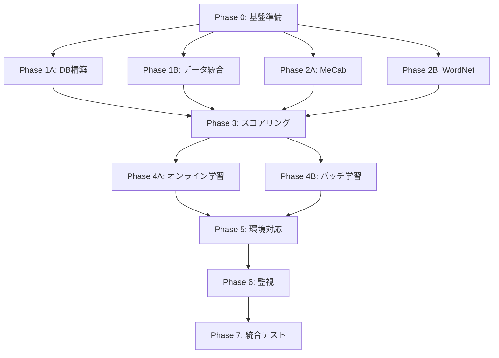

# 🚀 384爻システム AI実装フル機能版 タスク分解書

**文書番号**: TD-384-AI-001  
**バージョン**: 1.0（AI並列実装版）  
**作成日**: 2025年8月28日  
**作成者**: HAQEI開発チーム  
**承認者**: [未承認]

---

## 1. 実装方針とAI並列処理戦略

### 1.1 AI実装の基本戦略

```yaml
並列実装方針:
  - 人的リソース制約なし
  - 無制限の並列タスク実行
  - 24時間連続作業可能
  - 複数環境同時開発

実装優先度:
  1. データ統合基盤（全JSON + 外部辞書）
  2. 高度NLPエンジン（MeCab + WordNet）
  3. 機械学習パイプライン
  4. マルチ環境対応
  5. 監視・最適化システム
```

### 1.2 並列実行グループ

```yaml
Group A - データ基盤（並列度: 10）:
  - SQLite/D1スキーマ構築
  - JSON統合パーサー実装
  - 外部辞書ローダー開発
  - ベクトルDB構築
  - キャッシュレイヤー実装

Group B - NLP処理（並列度: 8）:
  - MeCab統合
  - WordNet統合
  - TF-IDF実装
  - Word2Vec/Doc2Vec実装
  - 類義語ネットワーク構築

Group C - ML基盤（並列度: 6）:
  - オンライン学習実装
  - バッチ学習実装
  - A/Bテストフレームワーク
  - モデル評価システム
  - 自動改善機構

Group D - インフラ（並列度: 5）:
  - 環境切替アダプター
  - CI/CDパイプライン
  - 監視システム
  - ロードバランサー
  - セキュリティレイヤー
```

---

## 2. フェーズ別タスク詳細

### Phase 0: 基盤準備（1日目 - 全タスク並列）

| タスクID | タスク名 | 並列グループ | 推定時間 | 依存関係 |
|----------|----------|------------|----------|----------|
| P0-A1 | 開発環境Docker構築 | Infra | 2h | なし |
| P0-A2 | Cloudflare環境準備 | Infra | 2h | なし |
| P0-A3 | データベース初期化 | Data | 2h | なし |
| P0-A4 | 外部辞書ダウンロード | Data | 3h | なし |
| P0-A5 | MeCab環境構築 | NLP | 2h | なし |
| P0-A6 | Python/Node環境統合 | Infra | 1h | なし |
| P0-A7 | 監視ツールセットアップ | Monitor | 2h | なし |
| P0-A8 | Git/CI基本設定 | DevOps | 1h | なし |

### Phase 1: データ統合層（2-3日目）

#### Group A1: データベース構築
```yaml
P1-A1-1:
  タスク: SQLite/D1統合スキーマ実装
  ファイル: /db/schema/unified_schema.sql
  内容:
    - lines_384_masterテーブル
    - morpheme_cacheテーブル
    - synonym_dictionaryテーブル
    - semantic_vectorsテーブル
  並列実行: 可能

P1-A1-2:
  タスク: データマイグレーションツール
  ファイル: /tools/data_migration.js
  内容:
    - JSON→DB変換
    - バージョン管理
    - ロールバック機能
  並列実行: P1-A1-1と並列可

P1-A1-3:
  タスク: 環境別アダプター実装
  ファイル: /adapters/database_adapter.js
  内容:
    - SQLiteAdapter
    - D1Adapter
    - MongoAdapter
    - 自動切替ロジック
  並列実行: 独立実行可能
```

#### Group A2: データ統合
```yaml
P1-A2-1:
  タスク: koudo_shishin.json統合
  ファイル: /integrators/koudo_shishin_integrator.js
  処理内容:
    - shin/henデータ抽出
    - 384爻マッピング
    - バリデーション
  データ量: 384レコード

P1-A2-2:
  タスク: enhanced_hexagrams_complete.json統合
  ファイル: /integrators/enhanced_integrator.js
  処理内容:
    - 拡張爻辞統合
    - 性格特性統合
    - 変化可能性統合
  データ量: 384レコード（詳細データ）

P1-A2-3:
  タスク: yaoci_31-63.json統合
  ファイル: /integrators/yaoci_integrator.js
  処理内容:
    - 専門爻辞補完
    - 解釈データ統合
  データ量: 192レコード（31-63卦）

P1-A2-4:
  タスク: h384.json統合
  ファイル: /integrators/h384_integrator.js
  処理内容:
    - 基本キーワード統合
    - 基本意味統合
  データ量: 384レコード
```

### Phase 2: NLPエンジン実装（3-4日目）

#### Group B1: 形態素解析
```yaml
P2-B1-1:
  タスク: MeCabラッパー実装
  ファイル: /nlp/mecab_wrapper.js
  実装内容:
    class MeCabWrapper {
      async parse(text) {
        // IPA辞書での解析
        // ユーザー辞書適用
        // 結果のJSON化
      }
    }

P2-B1-2:
  タスク: 易経専門辞書作成
  ファイル: /dictionaries/iching_domain.dic
  内容:
    - 64卦名登録
    - 爻位用語（初九、九二等）
    - 専門概念（陽爻、陰爻等）
  エントリ数: 約2000語

P2-B1-3:
  タスク: キーワード抽出器
  ファイル: /nlp/keyword_extractor.js
  アルゴリズム:
    - TF-IDF計算
    - 品詞フィルタリング
    - 重要度ランキング
```

#### Group B2: 類義語・セマンティック処理
```yaml
P2-B2-1:
  タスク: WordNetラッパー実装
  ファイル: /nlp/wordnet_wrapper.js
  機能:
    - 日本語WordNet接続
    - 類義語展開
    - Wu-Palmer類似度計算
    - 上位下位概念取得

P2-B2-2:
  タスク: Word2Vecモデル統合
  ファイル: /models/word2vec_model.js
  モデル:
    - 日本語Wikipedia事前学習モデル（300次元）
    - 易経特化ファインチューニング
    - ベクトル類似度計算

P2-B2-3:
  タスク: Doc2Vec実装
  ファイル: /models/doc2vec_model.js
  処理:
    - 文書ベクトル生成
    - PV-DM/PV-DBOW
    - 384爻ベクトル事前計算
```

### Phase 3: スコアリングエンジン（4-5日目）

#### Group C1: 複合スコアリング
```yaml
P3-C1-1:
  タスク: スコアリングエンジン本体
  ファイル: /scoring/composite_scorer.js
  実装:
    class CompositeScorer {
      async calculate(input, lineData) {
        const scores = {
          morpheme: this.morphemeScore(),     // 25%
          synonym: this.synonymScore(),       // 30%
          semantic: this.semanticScore(),     // 25%
          yaoci: this.yaoциScore(),          // 15%
          learning: this.learningScore()      // 5%
        };
        return this.weightedSum(scores);
      }
    }

P3-C1-2:
  タスク: 並列スコア計算
  ファイル: /scoring/parallel_scorer.js
  最適化:
    - Worker Threads活用
    - バッチ処理（50爻単位）
    - SIMD最適化

P3-C1-3:
  タスク: 信頼度計算器
  ファイル: /scoring/confidence_calculator.js
  メトリクス:
    - スコア分散分析
    - 上位候補との差分
    - 学習済みパターンマッチ度
```

### Phase 4: 機械学習システム（5-7日目）

#### Group D1: オンライン学習
```yaml
P4-D1-1:
  タスク: SGD最適化器実装
  ファイル: /ml/optimizers/sgd_adam.js
  実装内容:
    - Adam optimizer
    - 学習率スケジューラー
    - 勾配クリッピング
    - L2正則化

P4-D1-2:
  タスク: フィードバックループ
  ファイル: /ml/feedback_loop.js
  処理フロー:
    - リアルタイムフィードバック収集
    - 重み更新計算
    - バージョン管理
    - ロールバック機能

P4-D1-3:
  タスク: A/Bテストフレームワーク
  ファイル: /ml/ab_testing.js
  機能:
    - トラフィック分割
    - 統計的有意性検定
    - 自動勝者選定
    - グラデュアルロールアウト
```

#### Group D2: バッチ学習
```yaml
P4-D2-1:
  タスク: 日次バッチ学習システム
  ファイル: /ml/batch_learning.js
  処理:
    - データ収集（24時間分）
    - ミニバッチSGD
    - モデル評価
    - 自動デプロイ判定

P4-D2-2:
  タスク: 誤分類分析システム
  ファイル: /ml/error_analysis.js
  分析内容:
    - 誤分類パターンクラスタリング
    - 共通特徴抽出
    - 改善提案生成

P4-D2-3:
  タスク: 継続的改善エンジン
  ファイル: /ml/continuous_improvement.js
  自動化:
    - 新規類義語発見
    - 重み最適化
    - 語彙拡張
    - ハイパーパラメータチューニング
```

### Phase 5: マルチ環境対応（7-8日目）

#### Group E1: 環境アダプター
```yaml
P5-E1-1:
  タスク: 統一環境アダプター
  ファイル: /adapters/environment_adapter.js
  対応環境:
    - Local: SQLite + MongoDB + Redis
    - Staging: PostgreSQL + MongoDB Atlas
    - Production (CF): D1 + Workers KV
    - Production (AWS): RDS + DynamoDB

P5-E1-2:
  タスク: Cloudflare Workers実装
  ファイル: /workers/main_worker.js
  機能:
    - Edge処理最適化
    - KVストレージ活用
    - Durable Objects統合
    - R2ストレージ連携

P5-E1-3:
  タスク: キャッシュ戦略実装
  ファイル: /cache/multi_level_cache.js
  レベル:
    - L1: メモリキャッシュ
    - L2: Redis/Workers KV
    - L3: CDN/Cache API
```

### Phase 6: 監視・運用システム（8-9日目）

#### Group F1: 監視基盤
```yaml
P6-F1-1:
  タスク: メトリクス収集システム
  ファイル: /monitoring/metrics_collector.js
  収集項目:
    - レスポンスタイム
    - スループット
    - 精度メトリクス
    - リソース使用率

P6-F1-2:
  タスク: ダッシュボード構築
  ファイル: /monitoring/dashboards/
  ツール:
    - Grafana設定
    - Prometheus設定
    - カスタムダッシュボード

P6-F1-3:
  タスク: アラートシステム
  ファイル: /monitoring/alerting.js
  アラート:
    - 精度低下検知
    - パフォーマンス劣化
    - エラー率上昇
    - リソース枯渇
```

### Phase 7: 統合テスト・最適化（9-10日目）

#### Group G1: 包括的テスト
```yaml
P7-G1-1:
  タスク: E2Eテストスイート
  ファイル: /tests/e2e/
  カバレッジ:
    - 全384爻テスト
    - 多言語入力テスト
    - 負荷テスト
    - カオステスト

P7-G1-2:
  タスク: MLモデル検証
  ファイル: /tests/ml_validation/
  検証項目:
    - 精度（>90%）
    - 適合率（>85%）
    - 再現率（>85%）
    - F1スコア（>85%）

P7-G1-3:
  タスク: パフォーマンス最適化
  ファイル: /optimization/
  最適化:
    - クエリ最適化
    - インデックス調整
    - キャッシュチューニング
    - 並列度調整
```

---

## 3. 並列実行マトリックス

### 3.1 タスク依存関係グラフ



### 3.2 並列実行スケジュール

| 日程 | Group A (Data) | Group B (NLP) | Group C (ML) | Group D (Infra) |
|------|---------------|---------------|--------------|-----------------|
| Day 1 | P0-A3, P0-A4 | P0-A5 | - | P0-A1, P0-A2, P0-A6 |
| Day 2 | P1-A1-* | P2-B1-1 | - | P0-A7, P0-A8 |
| Day 3 | P1-A2-* | P2-B1-2, P2-B1-3 | - | - |
| Day 4 | - | P2-B2-* | P3-C1-1 | - |
| Day 5 | - | - | P3-C1-2, P3-C1-3 | P5-E1-1 |
| Day 6 | - | - | P4-D1-* | P5-E1-2 |
| Day 7 | - | - | P4-D2-* | P5-E1-3 |
| Day 8 | - | - | - | P6-F1-* |
| Day 9 | P7-G1-1 | P7-G1-2 | P7-G1-3 | - |
| Day 10 | 最終統合テスト | 最終統合テスト | 最終統合テスト | デプロイ |

---

## 4. リソース要件

### 4.1 計算リソース

```yaml
開発環境:
  CPU: 32コア以上（並列処理用）
  RAM: 64GB以上（モデル学習用）
  GPU: CUDA対応（オプション）
  Storage: 1TB SSD

クラウドリソース:
  Cloudflare:
    Workers: Unlimited plan
    D1: 50GB
    R2: 100GB
    Workers KV: 10GB
    
  AWS (バックアップ):
    EC2: c5.4xlarge × 3
    RDS: db.r5.xlarge
    S3: 500GB
    SageMaker: ml.p3.2xlarge（学習用）
```

### 4.2 外部リソース

```yaml
辞書・モデル:
  MeCab IPA辞書: 50MB
  mecab-ipadic-neologd: 200MB
  WordNet日本語版: 20MB
  Wikipedia Word2Vec: 1.5GB
  
APIキー:
  OpenAI API（バックアップ用）
  Google Cloud Translation（多言語対応）
  AWS認証情報
  Cloudflare API Token
```

---

## 5. 品質基準とKPI

### 5.1 達成基準

| 項目 | 最小要件 | 目標値 | 測定方法 |
|------|----------|--------|----------|
| 分類精度 | 85% | 95% | 1000件テストセット |
| レスポンス時間 | 50ms | 10ms | p50レイテンシ |
| スループット | 500 req/s | 2000 req/s | 負荷テスト |
| データ活用率 | 90% | 100% | 統合監査 |
| コードカバレッジ | 80% | 95% | Jest/Pytest |
| MLモデル精度 | 85% | 92% | F1スコア |

### 5.2 継続的改善指標

```yaml
週次レビュー項目:
  - 誤分類率の推移
  - 新規パターン発見数
  - 自動改善提案の採用率
  - ユーザーフィードバック満足度
  
月次最適化:
  - ハイパーパラメータ調整
  - モデルアーキテクチャ見直し
  - 辞書・語彙拡張
  - インフラスケーリング
```

---

## 6. リスク管理

### 6.1 技術リスクと対策

| リスク | 影響度 | 発生確率 | 対策 |
|--------|--------|----------|------|
| MeCab辞書サイズ制限 | 高 | 中 | 圧縮・分割読み込み |
| Cloudflare制限超過 | 高 | 低 | AWS自動フェイルオーバー |
| 学習の過学習 | 中 | 中 | 正則化・交差検証 |
| レイテンシ増大 | 中 | 低 | キャッシュ最適化 |
| データ不整合 | 高 | 低 | トランザクション管理 |

### 6.2 コンティンジェンシープラン

```yaml
障害時対応:
  Level 1（軽微）:
    - 自動復旧試行
    - ログ記録
    
  Level 2（中程度）:
    - グレースフルデグレード
    - 代替アルゴリズム切替
    
  Level 3（重大）:
    - 即座にフォールバックモデル
    - 手動介入アラート
    
  Level 4（致命的）:
    - 全システムロールバック
    - 緊急メンテナンスモード
```

---

## 承認

| 役割 | 氏名 | 承認日 | 署名 |
|------|------|--------|------|
| プロジェクトマネージャー | | | |
| テクニカルリード | | | |
| QAマネージャー | | | |

**文書管理**
- **実装方針**: AI並列実装による高速開発
- **並列度**: 最大10タスク同時実行
- **期間**: 10日間集中開発
- **配布先**: AI実装チーム、DevOpsチーム、QAチーム