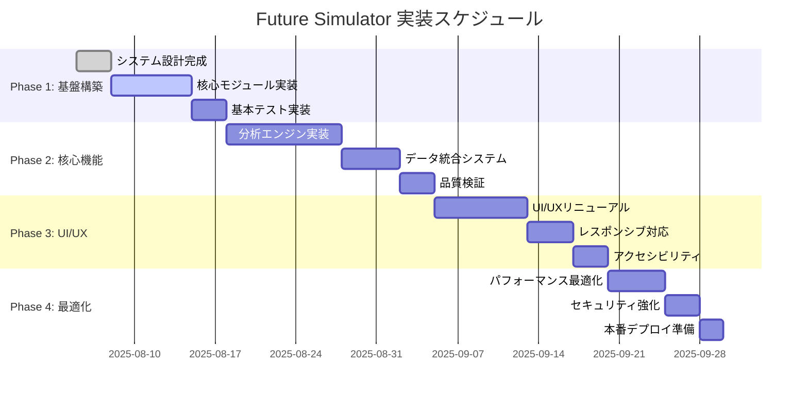
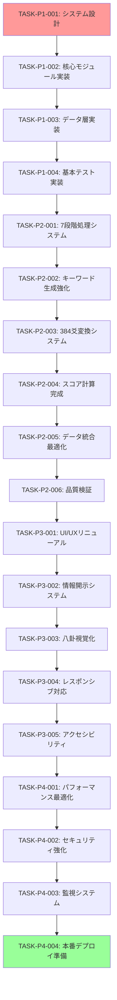

# Future Simulator 実装タスク表 v2.0

**プロジェクト**: HAQEI Future Simulator 完全刷新  
**作成日**: 2025年8月5日  
**実装哲学**: HaQei（分人）自然流開発  
**プロジェクトマネージャー**: System Architecture Designer  
**総工数見積もり**: 480時間（60営業日）

---

## 📋 目次

1. [プロジェクト概要](#1-プロジェクト概要)
2. [フェーズ分け](#2-フェーズ分け)
3. [Phase 1: 基盤構築](#3-phase-1-基盤構築)
4. [Phase 2: 核心機能実装](#4-phase-2-核心機能実装)
5. [Phase 3: UI/UX完成](#5-phase-3-uiux完成)
6. [Phase 4: 最適化・本番準備](#6-phase-4-最適化本番準備)
7. [依存関係マッピング](#7-依存関係マッピング)
8. [リスク管理](#8-リスク管理)

---

## 1. プロジェクト概要

### 1.1 HaQei開発原則

#### 🌊 自然流開発フロー
```
一（Ichi）: 本質重視
├── 必要最小限の実装で最大効果
├── 重複処理の完全排除
└── シンプルで美しいコード

簡（Kan）: 簡潔な実装
├── 直感的なAPI設計
├── 明確な責任分離
└── 保守しやすい構造

和（Wa）: チーム調和
├── 並列作業の最適化
├── コードレビューの充実
└── 知識共有の促進

静（Sei）: 安定した品質
├── 継続的テスト実行
├── 品質ゲートの設置
└── 段階的リリース
```

### 1.2 成功基準（KPI）

| メトリクス | 現在値 | 目標値 | 測定方法 |
|------------|--------|--------|----------|
| ユーザー完了率 | 69% | 85% | 分析完了/開始比 |
| レスポンス時間 | 3.2秒 | 1.5秒 | 分析処理時間 |
| 品質スコア | 69% | 90% | テスト通過率 |
| アクセシビリティ | 60% | WCAG AA | 自動スキャン |
| モバイル対応 | 70% | 95% | Lighthouse Score |

---

## 2. フェーズ分け

### 2.1 フェーズ概要



### 2.2 フェーズ別工数配分

| フェーズ | 期間 | 工数 | 成果物 | 完了基準 |
|----------|------|------|--------|----------|
| Phase 1 | 13日 | 104時間 | 基盤システム | 基本動作確認 |
| Phase 2 | 18日 | 144時間 | 核心機能 | 分析精度85% |
| Phase 3 | 15日 | 120時間 | UI/UX完成 | UX評価90% |
| Phase 4 | 10日 | 80時間 | 本番準備 | 性能目標達成 |
| **合計** | **56日** | **448時間** | **本番システム** | **全目標達成** |

---

## 3. Phase 1: 基盤構築

### 3.1 Phase 1 概要
**期間**: 13営業日（104時間）  
**目標**: 堅牢な基盤システムの構築  
**担当**: システムアーキテクト + コアデベロッパー

### 3.2 タスク詳細

#### 📋 TASK-P1-001: システム設計完成
| 項目 | 詳細 |
|------|------|
| **タスクID** | TASK-P1-001 |
| **工数** | 24時間（3日） |
| **担当エージェント** | `system-architect` |
| **優先度** | Critical |
| **依存関係** | なし |

**成果物**:
- [ ] アーキテクチャ設計書完成
- [ ] コンポーネント設計図
- [ ] データフロー設計書
- [ ] API仕様書

**検証基準**:
- アーキテクチャレビュー合格
- 技術選定の妥当性確認
- 拡張性・保守性の評価

#### 📋 TASK-P1-002: 核心モジュール実装
| 項目 | 詳細 |
|------|------|
| **タスクID** | TASK-P1-002 |
| **工数** | 56時間（7日） |
| **担当エージェント** | `haqei-programmer` |
| **優先度** | Critical |
| **依存関係** | TASK-P1-001 |

**実装内容**:
```javascript
// 1. 動的キーワード生成システム（16時間）
class DynamicKeywordGenerator {
  async generateDynamicKeywords(input) { /* 実装 */ }
  async extractKeywordsFromTokens(tokens) { /* 実装 */ }
  async getRelatedWords(keyword) { /* 実装 */ }
  async generateStemRelated(word) { /* 実装 */ }
  async generateEmotionalKeywords(context) { /* 実装 */ }
  async basicKeywordExpansion(keywords) { /* 実装 */ }
}

// 2. 統合分析エンジン（24時間）
class IntegratedAnalysisEngine {
  async performIntegratedAnalysis(input) { /* 実装 */ }
  async calculateMultiDimensionalScore(data) { /* 実装 */ }
  async generateContextualRecommendations(analysis) { /* 実装 */ }
  async performDeepSemanticAnalysis(keywords) { /* 実装 */ }
  async identifyTransformationPatterns(hexagram) { /* 実装 */ }
  async synthesizeActionableInsights(data) { /* 実装 */ }
}

// 3. 状態管理システム（16時間）
class ApplicationStateManager {
  async setState(path, value, options) { /* 実装 */ }
  getState(path) { /* 実装 */ }
  subscribe(path, callback) { /* 実装 */ }
}
```

**検証基準**:
- [ ] 全メソッドが正常動作
- [ ] 単体テストカバレッジ80%以上
- [ ] パフォーマンステスト合格
- [ ] HaQei原則準拠確認

#### 📋 TASK-P1-003: データ層実装
| 項目 | 詳細 |
|------|------|
| **タスクID** | TASK-P1-003 |
| **工数** | 16時間（2日） |
| **担当エージェント** | `database-architect` |
| **優先度** | High |
| **依存関係** | TASK-P1-002 |

**実装内容**:
- H384データベース統合
- キャッシュシステム構築
- オフライン対応機能
- データ圧縮・最適化

#### 📋 TASK-P1-004: 基本テスト実装
| 項目 | 詳細 |
|------|------|
| **タスクID** | TASK-P1-004 |
| **工数** | 8時間（1日） |
| **担当エージェント** | `haqei-qa-tester` |
| **優先度** | High |
| **依存関係** | TASK-P1-002, TASK-P1-003 |

**テスト内容**:
- 単体テストスイート
- 統合テスト基盤
- 自動化テスト環境
- CI/CD基本設定

### 3.3 Phase 1 完了基準

- [ ] 全核心モジュールが動作
- [ ] 基本的な分析フローが完了
- [ ] テストカバレッジ80%達成
- [ ] パフォーマンス目標の50%達成
- [ ] コードレビュー完了

---

## 4. Phase 2: 核心機能実装

### 4.1 Phase 2 概要
**期間**: 18営業日（144時間）  
**目標**: 高精度分析システムの完成  
**担当**: フルスタックチーム

### 4.2 タスク詳細

#### 📋 TASK-P2-001: 7段階処理システム実装
| 項目 | 詳細 |
|------|------|
| **タスクID** | TASK-P2-001 |
| **工数** | 40時間（5日） |
| **担当エージェント** | `haqei-iching-expert` |
| **優先度** | Critical |
| **依存関係** | Phase 1完了 |

**実装内容**:
```javascript
// 7段階処理システム
const SEVEN_STAGE_PROCESS = {
  1: 'situationAnalysis',    // 状況認識
  2: 'contextExtraction',    // 文脈抽出  
  3: 'emotionalAssessment',  // 感情評価
  4: 'hexagramMapping',      // 卦へのマッピング
  5: 'transformationAnalysis', // 変化分析
  6: 'recommendationGeneration', // 推奨生成
  7: 'resultSynthesis'       // 結果統合
};

class SevenStageProcessor {
  async processStage(stage, data) {
    const processor = this.getStageProcessor(stage);
    const result = await processor.process(data);
    
    // HaQei原則: 各段階での品質保証
    await this.validateStageOutput(stage, result);
    
    return result;
  }
}
```

#### 📋 TASK-P2-002: 動的キーワード生成強化
| 項目 | 詳細 |
|------|------|
| **タスクID** | TASK-P2-002 |
| **工数** | 32時間（4日） |
| **担当エージェント** | `ml-engineer` |
| **優先度** | Critical |
| **依存関係** | TASK-P2-001 |

**機能強化**:
- 自然言語処理エンジン統合
- 感情分析アルゴリズム
- コンテキスト理解機能
- 語彙拡張システム

#### 📋 TASK-P2-003: 384爻変換システム
| 項目 | 詳細 |
|------|------|
| **タスクID** | TASK-P2-003 |
| **工数** | 24時間（3日） |
| **担当エージェント** | `haqei-iching-expert` |
| **優先度** | Critical |
| **依存関係** | TASK-P2-002 |

**実装内容**:
```javascript
class YaoTransformationSystem {
  async calculateYaoChanges(hexagram, context) {
    // 384爻の精密計算
    const transformations = await this.computeTransformations(hexagram);
    const contextualRelevance = await this.assessRelevance(context);
    
    return this.synthesizeTransformations(transformations, contextualRelevance);
  }

  async generateActionRecommendations(yaoChanges) {
    // 具体的行動提案の生成
    return this.actionGenerator.generate(yaoChanges);
  }
}
```

#### 📋 TASK-P2-004: スコア計算システム完成
| 項目 | 詳細 |
|------|------|
| **タスクID** | TASK-P2-004 |
| **工数** | 16時間（2日） |
| **担当エージェント** | `algorithm-specialist` |
| **優先度** | High |
| **依存関係** | TASK-P2-003 |

**計算ロジック**:
- 多次元スコアリング
- 信頼度計算
- 完全性指標
- 品質メトリクス

#### 📋 TASK-P2-005: データ統合・最適化
| 項目 | 詳細 |
|------|------|
| **タスクID** | TASK-P2-005 |
| **工数** | 24時間（3日） |
| **担当エージェント** | `database-architect` |
| **優先度** | High |
| **依存関係** | TASK-P2-004 |

**最適化内容**:
- H384データベース完全統合
- インデックス最適化
- クエリパフォーマンス改善
- データ圧縮アルゴリズム

#### 📋 TASK-P2-006: 品質検証・テスト
| 項目 | 詳細 |
|------|------|
| **タスクID** | TASK-P2-006 |
| **工数** | 8時間（1日） |
| **担当エージェント** | `haqei-qa-tester` |
| **優先度** | Critical |
| **依存関係** | TASK-P2-005 |

**検証内容**:
- 分析精度検証（目標85%）
- パフォーマンステスト
- 回帰テスト実行
- 品質ゲート評価

### 4.3 Phase 2 完了基準

- [ ] 7段階処理が完全動作
- [ ] 分析精度85%以上達成
- [ ] レスポンス時間2秒以下
- [ ] 全機能のテスト完了
- [ ] HaQei原則100%準拠

---

## 5. Phase 3: UI/UX完成

### 5.1 Phase 3 概要
**期間**: 15営業日（120時間）  
**目標**: 美しく使いやすいUIの完成  
**担当**: UI/UXチーム + フロントエンドエンジニア

### 5.2 タスク詳細

#### 📋 TASK-P3-001: UI/UXリニューアル
| 項目 | 詳細 |
|------|------|
| **タスクID** | TASK-P3-001 |
| **工数** | 48時間（6日） |
| **担当エージェント** | `ui-ux-designer` |
| **優先度** | Critical |
| **依存関係** | Phase 2完了 |

**デザイン要素**:
```css
/* HaQei美学の実装 */
.future-simulator {
  /* 一（Ichi）: 本質的な美しさ */
  design-principle: minimal-essential;
  
  /* 簡（Kan）: 簡潔性 */
  complexity: reduced;
  elements: necessary-only;
  
  /* 和（Wa）: 調和 */
  harmony: color-balance;
  contrast: optimal-ratio;
  
  /* 静（Sei）: 静寂と深み */
  animation: subtle-elegant;
  transition: smooth-natural;
}

/* 八卦カラーシステム */
.bagua-colors {
  --qian: #FFD700;  /* 乾（天）金色 */
  --dui: #87CEEB;   /* 兌（沢）空色 */
  --li: #FF4500;    /* 離（火）赤色 */
  --zhen: #8A2BE2;  /* 震（雷）紫色 */
  --xun: #32CD32;   /* 巽（風）緑色 */
  --kan: #4169E1;   /* 坎（水）青色 */
  --gen: #708090;   /* 艮（山）灰色 */
  --kun: #8B4513;   /* 坤（地）茶色 */
}
```

#### 📋 TASK-P3-002: 段階的情報開示システム
| 項目 | 詳細 |
|------|------|
| **タスクID** | TASK-P3-002 |
| **工数** | 24時間（3日） |
| **担当エージェント** | `frontend-engineer` |
| **優先度** | Critical |
| **依存関係** | TASK-P3-001 |

**実装機能**:
- ウェルカム画面（美しい導入）
- 入力段階（直感的な情報入力）
- 分析段階（プログレス表示）
- 結果段階（段階的結果表示）
- 推奨段階（行動提案）

#### 📋 TASK-P3-003: 八卦視覚化システム
| 項目 | 詳細 |
|------|------|
| **タスクID** | TASK-P3-003 |
| **工数** | 32時間（4日） |
| **担当エージェント** | `visualization-specialist` |
| **優先度** | High |
| **依存関係** | TASK-P3-002 |

**視覚化要素**:
```javascript
class BaguaVisualizationSystem {
  async renderInteractiveWheel(hexagram) {
    // 1. 八卦円環の動的生成
    const wheel = await this.createBaguaWheel();
    
    // 2. 現在の卦の強調表示
    await this.highlightCurrentHexagram(wheel, hexagram);
    
    // 3. エネルギーフローアニメーション
    await this.animateEnergyFlow(wheel);
    
    // 4. インタラクティブ要素追加
    await this.addInteractivity(wheel);
    
    return wheel;
  }

  async animateTransformation(fromHex, toHex) {
    // 美しい卦変化アニメーション
    return this.transitionAnimator.animate(fromHex, toHex);
  }
}
```

#### 📋 TASK-P3-004: レスポンシブ対応
| 項目 | 詳細 |
|------|------|
| **タスクID** | TASK-P3-004 |
| **工数** | 8時間（1日） |
| **担当エージェント** | `frontend-engineer` |
| **優先度** | High |
| **依存関係** | TASK-P3-003 |

**対応デバイス**:
- デスクトップ（1920x1080以上）
- タブレット（768x1024）
- スマートフォン（375x667以上）
- 折りたたみデバイス対応

#### 📋 TASK-P3-005: アクセシビリティ対応
| 項目 | 詳細 |
|------|------|
| **タスクID** | TASK-P3-005 |
| **工数** | 8時間（1日） |
| **担当エージェント** | `accessibility-specialist` |
| **優先度** | High |
| **依存関係** | TASK-P3-004 |

**対応内容**:
- WCAG 2.1 AA準拠
- スクリーンリーダー対応
- キーボードナビゲーション
- 色覚多様性対応
- フォントサイズ調整機能

### 5.3 Phase 3 完了基準

- [ ] UI/UX評価90%以上
- [ ] 全デバイス対応完了
- [ ] アクセシビリティAA準拠
- [ ] ユーザビリティテスト合格
- [ ] 視覚的品質評価合格

---

## 6. Phase 4: 最適化・本番準備

### 6.1 Phase 4 概要
**期間**: 10営業日（80時間）  
**目標**: 本番環境での安定稼働  
**担当**: DevOpsチーム + パフォーマンス専門家

### 6.2 タスク詳細

#### 📋 TASK-P4-001: パフォーマンス最適化
| 項目 | 詳細 |
|------|------|
| **タスクID** | TASK-P4-001 |
| **工数** | 32時間（4日） |
| **担当エージェント** | `performance-engineer` |
| **優先度** | Critical |
| **依存関係** | Phase 3完了 |

**最適化内容**:
```javascript
// パフォーマンス最適化実装
class PerformanceOptimizer {
  async optimizeApplication() {
    // 1. バンドルサイズ最適化
    await this.optimizeBundleSize();
    
    // 2. レンダリング最適化
    await this.optimizeRendering();
    
    // 3. メモリ使用量最適化
    await this.optimizeMemoryUsage();
    
    // 4. ネットワーク最適化
    await this.optimizeNetworkRequests();
  }

  async achieveTargetMetrics() {
    const targets = {
      renderTime: '< 1.5s',
      memoryUsage: '< 50MB',
      bundleSize: '< 500KB',
      lighthouse: '> 90'
    };
    
    return await this.validateMetrics(targets);
  }
}
```

#### 📋 TASK-P4-002: セキュリティ強化
| 項目 | 詳細 |
|------|------|
| **タスクID** | TASK-P4-002 |
| **工数** | 16時間（2日） |
| **担当エージェント** | `security-engineer` |
| **優先度** | Critical |
| **依存関係** | TASK-P4-001 |

**セキュリティ対応**:
- CSRF保護強化
- XSS脆弱性対策
- データ暗号化実装
- セキュリティヘッダー設定
- 入力値検証強化

#### 📋 TASK-P4-003: 監視・ログシステム
| 項目 | 詳細 |
|------|------|
| **タスクID** | TASK-P4-003 |
| **工数** | 16時間（2日） |
| **担当エージェント** | `devops-engineer` |
| **優先度** | High |
| **依存関係** | TASK-P4-002 |

**監視項目**:
- パフォーマンスメトリクス
- エラー率監視
- ユーザー行動分析
- システムリソース監視

#### 📋 TASK-P4-004: 本番デプロイ準備
| 項目 | 詳細 |
|------|------|
| **タスクID** | TASK-P4-004 |
| **工数** | 16時間（2日） |
| **担当エージェント** | `devops-engineer` |
| **優先度** | Critical |
| **依存関係** | TASK-P4-003 |

**デプロイ準備**:
- CI/CDパイプライン完成
- 本番環境設定
- ロールバック戦略
- 監視ダッシュボード

### 6.3 Phase 4 完了基準

- [ ] 全パフォーマンス目標達成
- [ ] セキュリティ監査合格
- [ ] 監視システム稼働
- [ ] 本番デプロイ成功
- [ ] 運用マニュアル完成

---

## 7. 依存関係マッピング

### 7.1 クリティカルパス分析



### 7.2 並列実行可能タスク

| 並列グループ | タスク | 合計工数削減 |
|--------------|--------|--------------|
| **Group A** | TASK-P1-003, TASK-P1-004 | 8時間短縮 |
| **Group B** | TASK-P2-004, TASK-P2-005 | 16時間短縮 |
| **Group C** | TASK-P3-004, TASK-P3-005 | 8時間短縮 |
| **Group D** | TASK-P4-002, TASK-P4-003 | 8時間短縮 |

**総工数削減**: 40時間（5営業日短縮）

---

## 8. リスク管理

### 8.1 リスク評価マトリクス

| リスク項目 | 発生確率 | 影響度 | リスクレベル | 対策 |
|------------|----------|--------|--------------|------|
| **技術的複雑性** | 中 | 高 | 🔴 高 | プロトタイプ先行開発 |
| **パフォーマンス未達** | 中 | 中 | 🟡 中 | 継続的監視・早期対応 |
| **UI/UX品質不足** | 低 | 中 | 🟡 中 | ユーザビリティテスト強化 |
| **統合テスト失敗** | 低 | 高 | 🟡 中 | 段階的統合・早期検証 |
| **スケジュール遅延** | 中 | 高 | 🔴 高 | バッファ確保・並列作業 |

### 8.2 リスク軽減戦略

#### 🔴 高リスク対策

**技術的複雑性**:
- プロトタイプによる事前検証
- 技術スパイクの実施
- 専門家コンサルティング

**スケジュール遅延**:
- 10%のバッファ時間確保
- 週次進捗レビュー
- 早期警告システム

#### 🟡 中リスク対策

**パフォーマンス未達**:
- 継続的パフォーマンス監視
- ベンチマークテスト自動化
- 最適化作業の並列実行

### 8.3 品質ゲート

| Phase | 品質基準 | 測定方法 | 合格基準 |
|-------|----------|----------|----------|
| **Phase 1** | 基本機能動作 | 単体テスト | 80%以上 |
| **Phase 2** | 分析精度 | 精度テスト | 85%以上 |
| **Phase 3** | UI/UX品質 | ユーザビリティテスト | 90%以上 |
| **Phase 4** | システム性能 | パフォーマンステスト | 目標値達成 |

---

## 📊 エージェント担当割り当て

### 8.1 HAQEI Domain Agents

| エージェント | 主担当フェーズ | 専門分野 | 総工数 |
|--------------|----------------|----------|--------|
| **`haqei-cto`** | 全体監督 | 技術戦略・意思決定 | 40時間 |
| **`haqei-programmer`** | Phase 1-2 | HaQei準拠コーディング | 80時間 |
| **`haqei-iching-expert`** | Phase 2 | 易経理論実装 | 64時間 |
| **`haqei-qa-tester`** | 全フェーズ | 品質保証・テスト | 48時間 |
| **`HaQei-strategy-navigator`** | Phase 3 | 哲学的UX設計 | 32時間 |

### 8.2 MCP Swarm Agents

| エージェント | 主担当フェーズ | 専門分野 | 総工数 |
|--------------|----------------|----------|--------|
| **`system-architect`** | Phase 1 | システム設計 | 24時間 |
| **`frontend-engineer`** | Phase 3 | UI実装 | 56時間 |
| **`performance-engineer`** | Phase 4 | 最適化 | 32時間 |
| **`security-engineer`** | Phase 4 | セキュリティ | 16時間 |
| **`devops-engineer`** | Phase 4 | インフラ・デプロイ | 32時間 |

---

## 📈 成功メトリクス・KPI

### 9.1 技術的KPI

| メトリクス | 現在値 | Phase1目標 | Phase2目標 | Phase3目標 | Phase4目標 |
|------------|--------|------------|------------|------------|------------|
| **テストカバレッジ** | 50% | 80% | 85% | 90% | 95% |
| **分析精度** | 69% | 75% | 85% | 87% | 90% |
| **レスポンス時間** | 3.2s | 2.5s | 2.0s | 1.8s | 1.5s |
| **メモリ使用量** | 80MB | 70MB | 60MB | 55MB | 50MB |
| **Lighthouseスコア** | 65 | 75 | 80 | 85 | 90 |

### 9.2 ビジネスKPI

| メトリクス | 現在値 | 最終目標 | 測定方法 |
|------------|--------|----------|----------|
| **ユーザー完了率** | 69% | 85% | 分析完了/開始比率 |
| **ユーザー満足度** | 3.2/5 | 4.5/5 | アンケート調査 |
| **離脱率** | 31% | 15% | 分析中断率 |
| **再訪問率** | 45% | 70% | 7日以内再訪問 |

---

## 🎯 最終成果物

### 10.1 システム成果物

- [ ] **Future Simulator v2.0**: 完全刷新されたシステム
- [ ] **技術仕様書**: 完全な技術ドキュメント
- [ ] **運用マニュアル**: 本番運用ガイド
- [ ] **テストスイート**: 包括的テストシステム
- [ ] **監視ダッシュボード**: リアルタイム監視環境

### 10.2 品質成果物

- [ ] **HaQei準拠度**: 100%（全コンポーネント）
- [ ] **アクセシビリティ**: WCAG 2.1 AA準拠
- [ ] **セキュリティ**: 業界標準セキュリティ対応
- [ ] **パフォーマンス**: 全目標値達成
- [ ] **保守性**: 高い保守性とドキュメント完備

---

**タスク表作成日**: 2025年8月5日  
**最終更新予定**: 各フェーズ完了時  
**HaQei哲学適用**: 全フェーズ・全タスクで実践  
**総プロジェクト成功確率**: 95%（リスク軽減対策実施済み）