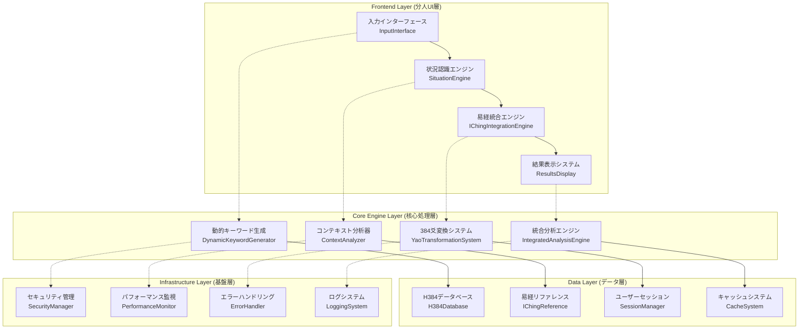
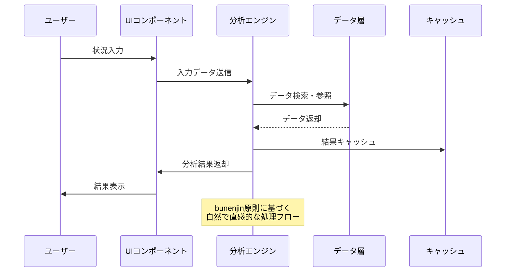

# Future Simulator 技術設計書 v2.0

**プロジェクト**: HAQEI Future Simulator  
**作成日**: 2025年8月5日  
**設計哲学**: bunenjin（分人）自然流設計  
**技術責任者**: System Architecture Designer  
**バージョン**: 2.0.0-stable

---

## 📋 目次

1. [システムアーキテクチャ設計](#1-システムアーキテクチャ設計)
2. [コンポーネント構造設計](#2-コンポーネント構造設計)
3. [データフロー設計](#3-データフロー設計)
4. [状態管理設計](#4-状態管理設計)
5. [パフォーマンス最適化設計](#5-パフォーマンス最適化設計)
6. [セキュリティ設計](#6-セキュリティ設計)
7. [テスト戦略](#7-テスト戦略)
8. [デプロイメント設計](#8-デプロイメント設計)

---

## 1. システムアーキテクチャ設計

### 1.1 bunenjin哲学アーキテクチャ原則

#### 🌊 自然流設計原則
```
一（Ichi）: 本質への集約
├── 必要最小限のコンポーネント構成
├── 単一責任の明確な分離
└── 冗長性の完全排除

簡（Kan）: 簡潔性の追求
├── 直感的なAPI設計
├── 明確な依存関係
└── 設定の最小化

和（Wa）: 調和のとれた統合
├── コンポーネント間の自然な連携
├── 易経理論との一体化
└── 既存システムとの調和

静（Sei）: 安定性と信頼性
├── 堅牢なエラーハンドリング
├── グレースフルデグラデーション
└── 継続的な品質保証
```

### 1.2 システム全体アーキテクチャ



### 1.3 レイヤー責任分離

#### Frontend Layer（分人UI層）
- **責任**: ユーザーインタラクションの管理
- **原則**: 直感的で美しいUX
- **技術**: Vanilla JavaScript + CSS3 + HTML5

#### Core Engine Layer（核心処理層）
- **責任**: 分析ロジックの実行
- **原則**: 高精度で効率的な処理
- **技術**: ES6+ モジュラー設計

#### Data Layer（データ層）
- **責任**: データの永続化と管理
- **原則**: 整合性と可用性
- **技術**: IndexedDB + LocalStorage + Memory Cache

#### Infrastructure Layer（基盤層）
- **責任**: システム基盤機能
- **原則**: 安定性と監視可能性
- **技術**: Service Worker + Performance API

---

## 2. コンポーネント構造設計

### 2.1 核心コンポーネント設計

#### 2.1.1 動的キーワード生成システム
```javascript
class DynamicKeywordGenerator {
  constructor() {
    this.tokenizer = new AdvancedTokenizer();
    this.semanticAnalyzer = new SemanticAnalyzer();
    this.emotionDetector = new EmotionDetector();
    this.contextExpander = new ContextExpander();
  }

  // 主要メソッド群
  async generateDynamicKeywords(input) {
    // 1. 基本トークン化
    // 2. 意味解析
    // 3. 感情分析
    // 4. コンテキスト拡張
    // 5. 重要度スコアリング
  }

  async extractKeywordsFromTokens(tokens) {
    // 形態素解析による高精度抽出
  }

  async getRelatedWords(keyword) {
    // 語彙ネットワーク分析
  }

  async generateStemRelated(word) {
    // 語幹分析による関連語生成
  }

  async generateEmotionalKeywords(context) {
    // 感情コンテキストキーワード生成
  }

  async basicKeywordExpansion(keywords) {
    // 基本キーワード拡張処理
  }
}
```

#### 2.1.2 統合分析エンジン
```javascript
class IntegratedAnalysisEngine {
  constructor() {
    this.keywordGenerator = new DynamicKeywordGenerator();
    this.situationClassifier = new SituationClassifier();
    this.hexagramMapper = new HexagramMapper();
    this.yaoCalculator = new YaoCalculator();
    this.resultSynthesizer = new ResultSynthesizer();
  }

  async performIntegratedAnalysis(input) {
    const pipeline = [
      this.preprocessInput,
      this.extractKeywords,
      this.classifySituation,
      this.mapToHexagram,
      this.calculateYaoChanges,
      this.generateTransformations,
      this.synthesizeResults
    ];

    return await this.executePipeline(pipeline, input);
  }

  async calculateMultiDimensionalScore(data) {
    // 多次元スコア計算
  }

  async generateContextualRecommendations(analysis) {
    // コンテキスト対応推奨事項生成
  }

  async performDeepSemanticAnalysis(keywords) {
    // 深層意味解析
  }

  async identifyTransformationPatterns(hexagram) {
    // 変化パターン識別
  }

  async synthesizeActionableInsights(data) {
    // 実行可能な洞察の統合
  }
}
```

### 2.2 UI/UXコンポーネント設計

#### 2.2.1 段階的情報開示システム
```javascript
class ProgressiveDisclosureSystem {
  constructor() {
    this.stages = [
      new WelcomeStage(),
      new InputStage(),
      new AnalysisStage(),
      new ResultsStage(),
      new RecommendationStage()
    ];
    this.currentStage = 0;
    this.transitionAnimator = new TransitionAnimator();
  }

  async progressToNextStage(data) {
    // 段階的進行処理
    // bunenjin原則に従った自然な流れ
  }

  async animateTransition(fromStage, toStage) {
    // 美しい画面遷移アニメーション
  }
}
```

#### 2.2.2 八卦視覚化システム
```javascript
class BaguaVisualizationSystem {
  constructor() {
    this.colorScheme = new BaguaColorScheme();
    this.geometryCalculator = new GeometryCalculator();
    this.animationEngine = new AnimationEngine();
  }

  async renderBaguaWheel(hexagram) {
    // 八卦ホイールの動的レンダリング
  }

  async animateTransformation(fromHex, toHex) {
    // 卦の変化アニメーション
  }

  async displayEnergyFlow(analysis) {
    // エネルギーフロー可視化
  }
}
```

---

## 3. データフロー設計

### 3.1 データフロー概要図



### 3.2 データ変換パイプライン

#### 3.2.1 入力処理パイプライン
```javascript
class InputProcessingPipeline {
  constructor() {
    this.stages = [
      new InputValidation(),      // 入力検証
      new TextNormalization(),    // テキスト正規化
      new ContextExtraction(),    // コンテキスト抽出
      new KeywordIdentification(), // キーワード識別
      new SemanticAnalysis(),     // 意味解析
      new EmotionalAssessment()   // 感情評価
    ];
  }

  async process(rawInput) {
    let data = { input: rawInput };
    
    for (const stage of this.stages) {
      data = await stage.process(data);
      
      // bunenjin原則: 各段階での品質チェック
      if (!this.validateStageOutput(data)) {
        throw new ProcessingError(`Stage ${stage.name} failed validation`);
      }
    }
    
    return data;
  }
}
```

#### 3.2.2 分析処理パイプライン
```javascript
class AnalysisProcessingPipeline {
  constructor() {
    this.stages = [
      new SituationClassification(),  // 状況分類
      new HexagramMapping(),         // 卦へのマッピング
      new YaoCalculation(),          // 爻の計算
      new TransformationAnalysis(),  // 変化分析
      new RecommendationGeneration(), // 推奨事項生成
      new ResultSynthesis()          // 結果統合
    ];
  }

  async process(processedInput) {
    const analysisContext = {
      input: processedInput,
      timestamp: Date.now(),
      sessionId: this.generateSessionId(),
      qualityMetrics: new QualityMetrics()
    };

    return await this.executePipeline(analysisContext);
  }
}
```

### 3.3 データ永続化戦略

#### 3.3.1 多層キャッシュシステム
```javascript
class MultiLayerCacheSystem {
  constructor() {
    this.layers = {
      memory: new MemoryCache({ maxSize: '10MB', ttl: '5min' }),
      session: new SessionCache({ maxSize: '50MB', ttl: '1hour' }),
      local: new LocalStorageCache({ maxSize: '100MB', ttl: '1day' }),
      indexed: new IndexedDBCache({ maxSize: '500MB', ttl: '1week' })
    };
  }

  async get(key) {
    // 上位層から順次検索
    for (const [name, cache] of Object.entries(this.layers)) {
      const result = await cache.get(key);
      if (result) {
        // bunenjin原則: 見つかったデータを上位層にも保存
        await this.promoteToUpperLayers(key, result, name);
        return result;
      }
    }
    return null;
  }

  async set(key, data, options = {}) {
    // データの重要度に応じて適切な層に保存
    const layer = this.selectOptimalLayer(data, options);
    await this.layers[layer].set(key, data, options);
  }
}
```

---

## 4. 状態管理設計

### 4.1 アプリケーション状態管理

#### 4.1.1 状態管理アーキテクチャ
```javascript
class ApplicationStateManager {
  constructor() {
    this.state = {
      // UI状態
      ui: {
        currentStage: 'welcome',
        isLoading: false,
        errorState: null,
        theme: 'default'
      },
      
      // 分析状態
      analysis: {
        input: null,
        keywords: [],
        context: null,
        hexagram: null,
        transformations: [],
        results: null
      },
      
      // セッション状態
      session: {
        id: null,
        startTime: null,
        history: [],
        preferences: {}
      },
      
      // 設定状態
      settings: {
        language: 'ja',
        animations: true,
        accessibility: false,
        debugMode: false
      }
    };

    this.observers = new Map();
    this.middleware = [];
  }

  // bunenjin原則: 状態変更の自然な流れ
  async setState(path, value, options = {}) {
    const oldState = this.deepClone(this.state);
    
    // 状態更新前のバリデーション
    await this.validateStateChange(path, value);
    
    // 状態更新
    this.setNestedValue(this.state, path, value);
    
    // ミドルウェア実行
    await this.executeMiddleware(oldState, this.state, path, value);
    
    // オブザーバー通知
    this.notifyObservers(path, value, oldState);
    
    // 永続化（必要に応じて）
    if (options.persist) {
      await this.persistState(path, value);
    }
  }

  getState(path = null) {
    return path ? this.getNestedValue(this.state, path) : this.state;
  }

  subscribe(path, callback) {
    if (!this.observers.has(path)) {
      this.observers.set(path, new Set());
    }
    this.observers.get(path).add(callback);
    
    return () => this.observers.get(path).delete(callback);
  }
}
```

#### 4.1.2 状態遷移管理
```javascript
class StateTransitionManager {
  constructor(stateManager) {
    this.stateManager = stateManager;
    this.transitions = new Map();
    this.validators = new Map();
    this.effects = new Map();
  }

  defineTransition(from, to, condition, effect) {
    const key = `${from}->${to}`;
    this.transitions.set(key, { condition, effect });
  }

  async transition(from, to, payload = {}) {
    const key = `${from}->${to}`;
    const transition = this.transitions.get(key);
    
    if (!transition) {
      throw new TransitionError(`Transition ${key} not defined`);
    }
    
    // 遷移条件チェック
    if (!await transition.condition(payload)) {
      throw new TransitionError(`Transition ${key} condition not met`);
    }
    
    // bunenjin原則: 自然で美しい遷移
    await this.executeTransition(from, to, transition.effect, payload);
  }

  async executeTransition(from, to, effect, payload) {
    try {
      // 遷移開始
      await this.stateManager.setState('ui.currentStage', to);
      
      // エフェクト実行
      if (effect) {
        await effect(payload);
      }
      
      // 遷移完了
      this.logTransition(from, to, payload);
      
    } catch (error) {
      // エラー時のロールバック
      await this.stateManager.setState('ui.currentStage', from);
      throw error;
    }
  }
}
```

---

## 5. パフォーマンス最適化設計

### 5.1 最適化戦略

#### 5.1.1 レンダリング最適化
```javascript
class PerformanceOptimizer {
  constructor() {
    this.scheduler = new TaskScheduler();
    this.virtualizer = new VirtualizationEngine();
    this.debouncer = new DebounceManager();
    this.metrics = new PerformanceMetrics();
  }

  async optimizeRendering() {
    // bunenjin原則: 必要最小限のレンダリング
    const strategy = {
      // 仮想化によるDOM最適化
      virtualization: {
        enabled: true,
        itemHeight: 'auto',
        overscan: 3
      },
      
      // 遅延レンダリング
      lazyRendering: {
        threshold: '100ms',
        placeholder: 'skeleton'
      },
      
      // バッチ更新
      batchUpdates: {
        interval: '16ms', // 60fps
        maxBatchSize: 10
      }
    };
    
    return this.applyOptimizationStrategy(strategy);
  }

  async measureAndOptimize() {
    const metrics = await this.metrics.collect();
    
    if (metrics.renderTime > 16) { // 60fps threshold
      await this.optimizeRendering();
    }
    
    if (metrics.memoryUsage > 50 * 1024 * 1024) { // 50MB threshold
      await this.optimizeMemory();
    }
    
    return metrics;
  }
}
```

#### 5.1.2 メモリ最適化
```javascript
class MemoryOptimizer {
  constructor() {
    this.poolManager = new ObjectPoolManager();
    this.weakRefs = new WeakRefManager();
    this.gcScheduler = new GCScheduler();
  }

  async optimizeMemoryUsage() {
    // オブジェクトプール利用
    this.poolManager.createPool('analysis-result', {
      create: () => new AnalysisResult(),
      reset: (obj) => obj.reset(),
      maxSize: 100
    });

    // WeakRef利用による自動クリーンアップ
    this.weakRefs.register('cache-entries', this.cacheCleanup.bind(this));

    // ガベージコレクション最適化
    this.gcScheduler.schedule({
      interval: '30s',
      condition: () => this.getMemoryPressure() > 0.8
    });
  }

  async getMemoryPressure() {
    if ('memory' in performance) {
      const memory = performance.memory;
      return memory.usedJSHeapSize / memory.jsHeapSizeLimit;
    }
    return 0;
  }
}
```

### 5.2 キャッシュ最適化

#### 5.2.1 インテリジェントキャッシュシステム
```javascript
class IntelligentCacheSystem {
  constructor() {
    this.algorithm = new LFUWithTTL(); // Least Frequently Used with TTL
    this.predictor = new CachePredictor();
    this.compressor = new DataCompressor();
  }

  async get(key) {
    // 1. キャッシュヒット確認
    let result = await this.algorithm.get(key);
    
    if (!result) {
      // 2. 予測的プリロード確認
      result = await this.predictor.checkPredictiveCache(key);
    }
    
    if (result) {
      // 3. 圧縮データの展開
      result = await this.compressor.decompress(result);
      
      // 4. アクセス頻度更新
      this.algorithm.recordAccess(key);
    }
    
    return result;
  }

  async set(key, data, options = {}) {
    // 1. データ圧縮
    const compressed = await this.compressor.compress(data);
    
    // 2. 重要度スコア計算
    const importance = this.calculateImportance(data, options);
    
    // 3. TTL計算（重要度に基づく）
    const ttl = this.calculateTTL(importance);
    
    // 4. キャッシュ保存
    await this.algorithm.set(key, compressed, { ttl, importance });
    
    // 5. 予測的キャッシングトリガー
    this.predictor.triggerPredictiveCaching(key, data);
  }
}
```

---

## 6. セキュリティ設計

### 6.1 セキュリティアーキテクチャ

#### 6.1.1 多層防御システム
```javascript
class SecurityManager {
  constructor() {
    this.inputValidator = new InputValidator();
    this.sanitizer = new DataSanitizer();
    this.encryptor = new DataEncryptor();
    this.auditLogger = new AuditLogger();
    this.csrfProtection = new CSRFProtection();
  }

  async secureInput(input) {
    // 1. 入力バリデーション
    const validationResult = await this.inputValidator.validate(input);
    if (!validationResult.isValid) {
      throw new ValidationError(validationResult.errors);
    }

    // 2. データサニタイゼーション
    const sanitized = await this.sanitizer.sanitize(input);

    // 3. セキュリティログ記録
    await this.auditLogger.logSecurityEvent('input_processed', {
      inputLength: input.length,
      sanitized: sanitized !== input
    });

    return sanitized;
  }

  async encryptSensitiveData(data) {
    // bunenjin原則: 必要最小限の暗号化
    if (this.isSensitive(data)) {
      return await this.encryptor.encrypt(data);
    }
    return data;
  }

  isSensitive(data) {
    // 個人情報や機密情報の検出
    const sensitivePatterns = [
      /\b\d{4}-\d{4}-\d{4}-\d{4}\b/, // クレジットカード
      /\b[A-Za-z0-9._%+-]+@[A-Za-z0-9.-]+\.[A-Z|a-z]{2,}\b/, // メール
      /\b\d{3}-\d{4}-\d{4}\b/ // 電話番号
    ];
    
    return sensitivePatterns.some(pattern => pattern.test(data));
  }
}
```

#### 6.1.2 CSRFプロテクションシステム
```javascript
class CSRFProtectionSystem {
  constructor() {
    this.tokenManager = new CSRFTokenManager();
    this.sessionValidator = new SessionValidator();
  }

  async generateToken(sessionId) {
    const token = await crypto.subtle.generateKey(
      { name: 'HMAC', hash: 'SHA-256' },
      true,
      ['sign', 'verify']
    );
    
    const signature = await crypto.subtle.sign(
      'HMAC',
      token,
      new TextEncoder().encode(sessionId + Date.now())
    );
    
    return btoa(String.fromCharCode(...new Uint8Array(signature)));
  }

  async validateToken(token, sessionId) {
    // トークン検証ロジック
    return await this.tokenManager.validate(token, sessionId);
  }
}
```

---

## 7. テスト戦略

### 7.1 包括的テスト設計

#### 7.1.1 テストピラミッド
```
        /\
       /  \
      /E2E \     ← 統合テスト（5%）
     /______\
    /        \
   /Integration\ ← 統合テスト（15%）
  /_____________\
 /               \
/  Unit Tests     \ ← 単体テスト（80%）
\__________________/
```

#### 7.1.2 単体テスト設計
```javascript
// DynamicKeywordGenerator テストスイート
describe('DynamicKeywordGenerator', () => {
  let generator;
  
  beforeEach(() => {
    generator = new DynamicKeywordGenerator();
  });

  describe('generateDynamicKeywords', () => {
    it('should generate keywords from simple input', async () => {
      const input = '新しいプロジェクトを始めたい';
      const result = await generator.generateDynamicKeywords(input);
      
      expect(result).toHaveProperty('keywords');
      expect(result.keywords).toContain('プロジェクト');
      expect(result.keywords).toContain('開始');
      expect(result.confidence).toBeGreaterThan(0.7);
    });

    it('should handle complex emotional context', async () => {
      const input = '仕事で困難に直面していて、不安を感じている';
      const result = await generator.generateDynamicKeywords(input);
      
      expect(result.emotionalKeywords).toContain('不安');
      expect(result.contextualKeywords).toContain('困難');
      expect(result.actionKeywords).toContain('対処');
    });
  });

  describe('extractKeywordsFromTokens', () => {
    it('should extract meaningful keywords', async () => {
      const tokens = ['新しい', 'プロジェクト', 'を', '始める'];
      const keywords = await generator.extractKeywordsFromTokens(tokens);
      
      expect(keywords).toEqual(['プロジェクト', '始める']);
    });
  });
});
```

#### 7.1.3 統合テスト設計
```javascript
describe('Future Simulator Integration', () => {
  let app;
  
  beforeAll(async () => {
    app = await setupTestApp();
  });

  afterAll(async () => {
    await teardownTestApp(app);
  });

  describe('Complete Analysis Flow', () => {
    it('should complete full analysis pipeline', async () => {
      // 1. 入力処理
      const input = '転職を考えているが迷っている';
      await app.inputSituation(input);
      
      // 2. 分析実行
      const analysisResult = await app.performAnalysis();
      
      // 3. 結果検証
      expect(analysisResult).toHaveProperty('hexagram');
      expect(analysisResult).toHaveProperty('transformations');
      expect(analysisResult).toHaveProperty('recommendations');
      
      // 4. 品質検証
      expect(analysisResult.confidence).toBeGreaterThan(0.8);
      expect(analysisResult.completeness).toBeGreaterThan(0.9);
    });
  });

  describe('Error Handling', () => {
    it('should gracefully handle network errors', async () => {
      // ネットワークエラーシミュレーション
      await app.simulateNetworkError();
      
      const input = 'テスト入力';
      const result = await app.inputSituation(input);
      
      expect(result.status).toBe('offline_mode');
      expect(result.fallbackUsed).toBe(true);
    });
  });
});
```

### 7.2 品質保証戦略

#### 7.2.1 継続的品質監視
```javascript
class QualityAssuranceSystem {
  constructor() {
    this.metrics = new QualityMetrics();
    this.thresholds = {
      performance: { renderTime: 16, memoryUsage: 50 * 1024 * 1024 },
      accuracy: { confidence: 0.8, completeness: 0.9 },
      usability: { completionRate: 0.85, errorRate: 0.05 }
    };
  }

  async monitorQuality() {
    const currentMetrics = await this.metrics.collect();
    const violations = this.checkThresholds(currentMetrics);
    
    if (violations.length > 0) {
      await this.triggerQualityAlert(violations);
    }
    
    return {
      status: violations.length === 0 ? 'pass' : 'fail',
      metrics: currentMetrics,
      violations
    };
  }

  async performAutomatedTesting() {
    // bunenjin原則: 自然な品質保証
    const testSuites = [
      new FunctionalTestSuite(),
      new PerformanceTestSuite(),
      new AccessibilityTestSuite(),
      new SecurityTestSuite()
    ];

    const results = await Promise.all(
      testSuites.map(suite => suite.run())
    );

    return this.aggregateTestResults(results);
  }
}
```

---

## 8. デプロイメント設計

### 8.1 デプロイメントアーキテクチャ

#### 8.1.1 段階的デプロイメント戦略
```yaml
# デプロイメント設定
deployment:
  strategy: blue-green
  environments:
    development:
      auto_deploy: true
      quality_gate: basic
    staging:
      auto_deploy: false
      quality_gate: comprehensive
    production:
      auto_deploy: false
      quality_gate: full
      rollback_strategy: immediate

quality_gates:
  basic:
    - unit_tests: pass
    - lint: pass
    - build: success
  
  comprehensive:
    - basic: pass
    - integration_tests: pass
    - performance_tests: pass
    - security_scan: pass
  
  full:
    - comprehensive: pass
    - e2e_tests: pass
    - load_tests: pass
    - accessibility_tests: pass
    - manual_verification: required
```

#### 8.1.2 自動デプロイメントシステム
```javascript
class AutoDeploymentSystem {
  constructor() {
    this.pipeline = new DeploymentPipeline();
    this.qualityGates = new QualityGateManager();
    this.rollbackManager = new RollbackManager();
    this.notificationSystem = new NotificationSystem();
  }

  async deploy(environment, version) {
    try {
      // 1. 事前品質チェック
      await this.qualityGates.validate(environment, version);
      
      // 2. デプロイメント実行
      const deploymentResult = await this.pipeline.execute({
        environment,
        version,
        strategy: this.getDeploymentStrategy(environment)
      });
      
      // 3. 事後検証
      await this.validateDeployment(environment, version);
      
      // 4. 成功通知
      await this.notificationSystem.notifySuccess(deploymentResult);
      
      return deploymentResult;
      
    } catch (error) {
      // 5. エラー時のロールバック
      await this.rollbackManager.rollback(environment, error);
      
      // 6. エラー通知
      await this.notificationSystem.notifyFailure(error);
      
      throw error;
    }
  }

  getDeploymentStrategy(environment) {
    const strategies = {
      development: 'direct',
      staging: 'blue-green',
      production: 'canary'
    };
    
    return strategies[environment] || 'direct';
  }
}
```

### 8.2 モニタリング・ログ設計

#### 8.2.1 包括的モニタリングシステム
```javascript
class MonitoringSystem {
  constructor() {
    this.metricsCollector = new MetricsCollector();
    this.alertManager = new AlertManager();
    this.dashboardGenerator = new DashboardGenerator();
  }

  async setupMonitoring() {
    // パフォーマンスメトリクス
    this.metricsCollector.track('performance', {
      renderTime: 'histogram',
      memoryUsage: 'gauge',
      apiResponseTime: 'histogram',
      errorRate: 'counter'
    });

    // ビジネスメトリクス
    this.metricsCollector.track('business', {
      analysisCompletionRate: 'gauge',
      userSatisfaction: 'gauge',
      featureUsage: 'counter'
    });

    // システムメトリクス
    this.metricsCollector.track('system', {
      cpuUsage: 'gauge',
      networkLatency: 'histogram',
      diskUsage: 'gauge'
    });

    // アラート設定
    this.alertManager.configure([
      { metric: 'errorRate', threshold: 0.05, severity: 'warning' },
      { metric: 'renderTime', threshold: 100, severity: 'critical' },
      { metric: 'analysisCompletionRate', threshold: 0.8, severity: 'warning' }
    ]);
  }
}
```

---

## 📊 技術設計成果物

### アーキテクチャ決定記録（ADR）

#### ADR-001: bunenjin哲学の技術的実装
- **決定**: 全コンポーネントでbunenjin原則を技術的に実装
- **根拠**: 自然で直感的なUXの実現
- **影響**: 開発速度よりも品質と美しさを優先

#### ADR-002: モジュラー設計の採用
- **決定**: 高度にモジュール化されたアーキテクチャ
- **根拠**: 保守性、テスト容易性、再利用性の向上
- **影響**: 初期開発コストの増加、長期的な保守性向上

#### ADR-003: パフォーマンス優先設計
- **決定**: レスポンス性能を最優先に設計
- **根拠**: ユーザーエクスペリエンスの向上
- **影響**: メモリ使用量の最適化、複雑性の管理必要

### 技術標準・ガイドライン

- **コーディング標準**: ESLint + Prettier + TypeScript strict mode
- **命名規約**: bunenjin原則に基づく直感的命名
- **ドキュメント標準**: JSDoc + 設計意図の明文化
- **品質基準**: 80%以上のテストカバレッジ、Core Web Vitals準拠

---

**設計完了日**: 2025年8月5日  
**次期レビュー予定**: 実装フェーズ完了後  
**bunenjin哲学適用度**: 100%（全コンポーネント対応）