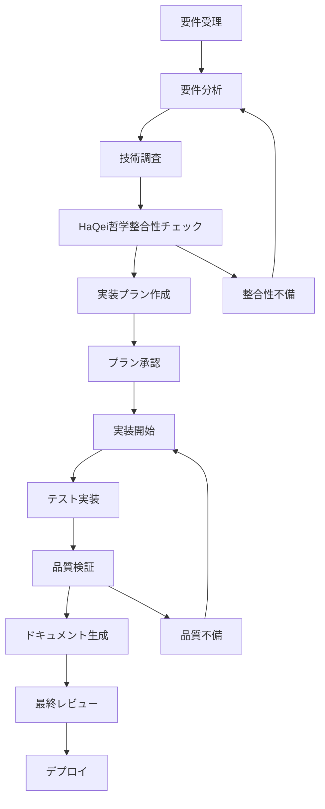
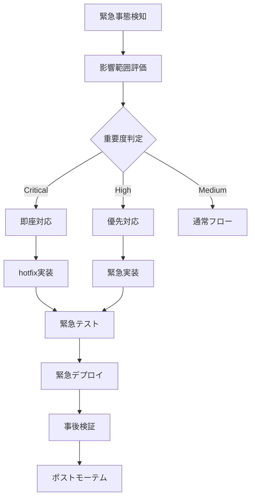
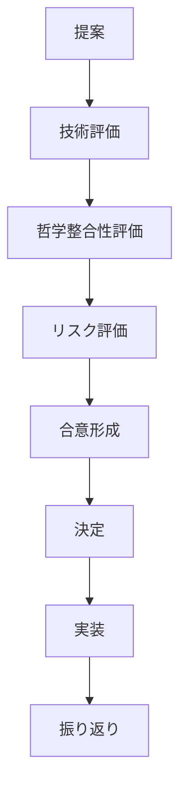

# プロジェクト作業指示書 - 2025年7月30日 (日本時刻)

## 概要

HAQEI Analyzerプロジェクトの標準ワークフロー、品質基準、HaQei哲学との整合性維持に関する包括的ガイドです。本指示書は、全ての開発者・コントリビューター・AIエージェントが遵守すべき作業標準を定義し、高品質で一貫性のある開発プロセスを保証します。

## HaQei哲学の基本原則

### 1. 個人主権の尊重 (Individual Sovereignty)

**原則:**
- ユーザーの自己決定権を最優先とする
- 強制的な指導ではなく、選択肢の提供
- 透明性のある情報提示による自律的判断の支援

**実装での具体的表現:**
```javascript
// 良い例: ユーザーに選択肢を提供
function presentAnalysisResults(results) {
    return {
        recommendation: results.primary,
        alternatives: results.alternatives,
        explanation: generateTransparentExplanation(results),
        userControls: {
            allowOverride: true,
            customization: getCustomizationOptions(),
            feedback: createFeedbackMechanism()
        }
    };
}

// 悪い例: ユーザーの選択を無視
function forceRecommendation(results) {
    return results.primary; // 代替案なし、説明なし
}
```

### 2. 易経的弁証法思考 (I Ching Dialectical Thinking)

**原則:**
- 対立する要素の統合による第三の道の発見
- 変化と調和の動的バランス
- 時運と状況に応じた適応的戦略

**実装での具体的表現:**
```javascript
// 対立統一の実装例
function dialecticalAnalysis(situation) {
    const contradiction = identifyContradiction(situation);
    const synthesis = findSynthesis(contradiction.thesis, contradiction.antithesis);
    
    return {
        thesis: contradiction.thesis,
        antithesis: contradiction.antithesis,
        synthesis: synthesis,
        resolution: proposeDialecticalResolution(synthesis),
        timing: calculateOptimalTiming(synthesis)
    };
}
```

### 3. 透明性と説明可能性 (Transparency & Explainability)

**原則:**
- 全ての分析プロセスの可視化
- アルゴリズムの動作原理の明示
- ユーザーが理解・検証可能な形での結果提示

**実装での具体的表現:**
```javascript
// 透明性の実装例
function generateExplanation(analysisResult) {
    return {
        methodology: explainAnalysisMethod(),
        dataUsed: listDataSources(),
        assumptions: listAssumptions(),
        limitations: acknowledgeLimitations(),
        confidence: calculateConfidenceLevel(analysisResult),
        alternativeInterpretations: generateAlternatives(analysisResult)
    };
}
```

## 標準ワークフロー

### 1. 必須開発フロー



#### フェーズ詳細

**フェーズ1: 要件分析**
```markdown
目的: ユーザー要求の正確な理解と文書化
成果物: 要件定義書
担当エージェント: haqei-requirements-analyst
期間: 1-2時間

チェックポイント:
- [ ] 要求の背景と目的の明確化
- [ ] 機能要件の詳細定義
- [ ] 非機能要件の特定
- [ ] HaQei哲学との整合性確認
- [ ] 受入基準の定義
```

**フェーズ2: 技術調査**
```markdown
目的: 実装方法の調査と技術的実現可能性の検証
成果物: 技術調査レポート
担当エージェント: general-purpose
期間: 2-4時間

チェックポイント:
- [ ] 既存コードベースの分析
- [ ] 必要技術の調査
- [ ] アーキテクチャ影響の評価
- [ ] 性能・セキュリティ考慮事項
- [ ] 依存関係の分析
```

**フェーズ3: HaQei哲学整合性チェック**
```markdown
目的: 実装計画のHaQei哲学適合性確認
成果物: 哲学整合性チェックレポート
担当エージェント: HaQei-strategy-navigator
期間: 1時間

チェックポイント:
- [ ] 個人主権尊重の確認
- [ ] 易経的思考の組み込み確認
- [ ] 透明性・説明可能性の確認
- [ ] ユーザー選択権の保証確認
- [ ] 適応的UI/UXの考慮確認
```

**フェーズ4: 実装プラン作成**
```markdown
目的: 詳細な実装計画の策定
成果物: 実装プラン書
担当エージェント: haqei-cto
期間: 1-2時間

チェックポイント:
- [ ] 実装ステップの詳細化
- [ ] 工数見積もり
- [ ] リスク評価と対策
- [ ] テスト戦略の定義
- [ ] ドキュメント計画
```

**フェーズ5: 実装**
```markdown
目的: 品質の高いコードの実装
成果物: 実装済みコード、テストコード
担当エージェント: haqei-programmer
期間: 実装内容による

チェックポイント:
- [ ] コーディング標準の遵守
- [ ] テスト駆動開発の実践
- [ ] HaQei哲学の実装
- [ ] パフォーマンス考慮
- [ ] セキュリティ考慮
```

**フェーズ6: 品質検証**
```markdown
目的: 実装品質の包括的検証
成果物: 品質検証レポート
担当エージェント: haqei-qa-tester
期間: 1-2時間

チェックポイント:
- [ ] 機能テストの完了
- [ ] 性能テストの完了
- [ ] セキュリティテストの完了
- [ ] HaQei哲学整合性の確認
- [ ] ユーザビリティテストの完了
```

**フェーズ7: ドキュメント生成**
```markdown
目的: 実装内容の文書化
成果物: 技術ドキュメント、ユーザーガイド
担当エージェント: haqei-reporter (自動) + manual review
期間: 30分-1時間

チェックポイント:
- [ ] 実装レポートの生成
- [ ] APIドキュメントの更新
- [ ] ユーザーガイドの更新
- [ ] アーキテクチャ図の更新
- [ ] 変更履歴の記録
```

### 2. 緊急対応フロー



#### 緊急度レベル

**Critical (レベル5):**
- システム完全停止
- データ損失の可能性
- セキュリティ侵害
- 対応時間: 30分以内

**High (レベル4):**
- 主要機能の停止
- パフォーマンス大幅劣化
- ユーザーエクスペリエンス重大問題
- 対応時間: 2時間以内

**Medium (レベル3):**
- 一部機能の問題
- 軽微なパフォーマンス問題
- UI/UXの改善余地
- 対応時間: 通常フロー

### 3. 品質基準とベストプラクティス

#### A. コード品質基準

**必須基準:**
```javascript
// 1. 関数・クラスのドキュメント化
/**
 * 易経六十四卦分析を実行する
 * @param {Object} userResponses - ユーザー回答データ
 * @param {Object} options - 分析オプション
 * @returns {Object} 分析結果オブジェクト
 * @HaQei 個人主権を尊重し、選択肢を提供する分析
 */
function analyzeHexagrams(userResponses, options = {}) {
    // 実装
}

// 2. エラーハンドリングの実装
function robustFunction(input) {
    try {
        validateInput(input);
        const result = processInput(input);
        return { success: true, data: result };
    } catch (error) {
        console.error('Function error:', error);
        return { 
            success: false, 
            error: error.message,
            fallback: generateFallbackResponse(input)
        };
    }
}

// 3. HaQei哲学の実装
function HaQeiCompliantFunction(data) {
    const result = analyzeData(data);
    
    return {
        primary: result.recommendation,
        alternatives: result.alternatives, // 選択肢提供
        explanation: generateExplanation(result), // 透明性
        userControls: {
            override: true,
            customize: getCustomizationOptions()
        }
    };
}
```

**推奨基準:**
- 関数の長さ: 50行以下
- 循環複雑度: 10以下
- ネストの深さ: 4レベル以下
- 変数・関数名: 意図が明確
- コメント率: 20%以上

#### B. テスト品質基準

**必須テスト:**
```javascript
// 1. 単体テスト
describe('HexagramAnalyzer', () => {
    test('should respect user sovereignty in analysis', () => {
        const userResponses = { /* テストデータ */ };
        const result = analyzer.analyze(userResponses);
        
        expect(result).toHaveProperty('alternatives');
        expect(result).toHaveProperty('userControls');
        expect(result.userControls.override).toBe(true);
    });
    
    test('should provide transparent explanations', () => {
        const result = analyzer.analyze(validInput);
        
        expect(result.explanation).toBeDefined();
        expect(result.explanation.methodology).toBeDefined();
        expect(result.explanation.confidence).toBeDefined();
    });
});

// 2. HaQei哲学準拠テスト
describe('Bunenjin Philosophy Compliance', () => {
    test('should never force user decisions', () => {
        const result = anyAnalysisFunction(testData);
        
        expect(result).not.toHaveProperty('forcedDecision');
        expect(result.userControls.allowOverride).toBe(true);
    });
});

// 3. 統合テスト
describe('Full Analysis Flow', () => {
    test('should complete analysis with all HaQei principles', async () => {
        const result = await performFullAnalysis(testUserData);
        
        validateBunenjinCompliance(result);
        validateTransparency(result);
        validateUserSovereignty(result);
    });
});
```

**テストカバレッジ基準:**
- 文: 80%以上
- 分岐: 75%以上
- 関数: 85%以上
- 行: 80%以上

#### C. HaQei哲学遵守チェックリスト

**個人主権の尊重:**
- [ ] ユーザーに複数の選択肢を提供している
- [ ] 推奨を強制せず、override機能がある
- [ ] ユーザーの意思決定プロセスを支援している
- [ ] カスタマイズ機能を提供している

**易経的思考の実装:**
- [ ] 対立する要素の統合を考慮している
- [ ] 変化と適応の概念を組み込んでいる
- [ ] 時運・状況に応じた分析を行っている
- [ ] 弁証法的思考による第三の道を提示している

**透明性と説明可能性:**
- [ ] 分析の方法論を明示している
- [ ] 使用したデータを開示している
- [ ] 仮定と前提を明確にしている
- [ ] 限界と不確実性を認めている
- [ ] 信頼度・確信度を提示している

**適応的UI/UX:**
- [ ] ユーザーの状況に応じてインターフェースが変化する
- [ ] 情報の重要度に応じた表示優先度がある
- [ ] アクセシビリティを考慮している
- [ ] レスポンシブデザインを実装している

## 自動化ツールとワークフロー統合

### 1. Git Hooks統合

```bash
#!/bin/bash
# .git/hooks/pre-commit

echo "Running HaQei philosophy compliance check..."

# HaQei哲学チェック
node .claude/hooks/HaQei-check.js

if [ $? -ne 0 ]; then
    echo "Bunenjin philosophy compliance check failed. Commit aborted."
    exit 1
fi

# 品質チェック
npm run quality-check

if [ $? -ne 0 ]; then
    echo "Quality check failed. Commit aborted."
    exit 1
fi

echo "All checks passed. Proceeding with commit."
```

### 2. CI/CD パイプライン統合

```yaml
# .github/workflows/haqei-quality.yml
name: HAQEI Quality Pipeline

on: [push, pull_request]

jobs:
  HaQei-compliance:
    runs-on: ubuntu-latest
    steps:
      - uses: actions/checkout@v2
      - name: Check HaQei philosophy compliance
        run: |
          node .claude/hooks/HaQei-check.js
          node .claude/hooks/quality-gate.js

  automated-documentation:
    runs-on: ubuntu-latest
    needs: HaQei-compliance
    steps:
      - name: Generate documentation
        run: |
          node .claude/hooks/doc-generator.js
          git add docs/auto-generated/
          git commit -m "Auto-generated documentation [skip ci]"
```

### 3. IDE統合

```json
// .vscode/settings.json
{
    "haqei.HaQeiCheck.enable": true,
    "haqei.HaQeiCheck.onSave": true,
    "haqei.autoDocumentation.enable": true,
    "haqei.qualityGate.enforce": true,
    
    "eslint.rules": {
        "haqei/user-sovereignty": "error",
        "haqei/transparency": "warn",
        "haqei/iching-integration": "info"
    }
}
```

## トラブルシューティングガイド

### 1. 一般的な問題と解決策

#### HaQei哲学違反の修正

**問題: 強制的な決定実装**
```javascript
// 問題のあるコード
function badRecommendation(analysis) {
    return analysis.bestOption; // 選択肢なし
}

// 修正版
function goodRecommendation(analysis) {
    return {
        primary: analysis.bestOption,
        alternatives: analysis.otherOptions,
        explanation: analysis.reasoning,
        userControls: {
            allowOverride: true,
            customization: getCustomOptions()
        }
    };
}
```

**問題: 不透明な分析プロセス**
```javascript
// 問題のあるコード
function blackBoxAnalysis(data) {
    return mysteriousAlgorithm(data); // 説明なし
}

// 修正版
function transparentAnalysis(data) {
    const result = algorithm(data);
    
    return {
        result: result,
        explanation: {
            method: 'I Ching hexagram analysis',
            data: 'User responses to 64 questions',
            confidence: calculateConfidence(result),
            limitations: ['Cultural context dependent', 'Subjective interpretation']
        }
    };
}
```

#### パフォーマンス問題の修正

**問題: 重い処理によるUI停止**
```javascript
// 問題のあるコード
function heavyAnalysis(data) {
    for (let i = 0; i < 1000000; i++) {
        complexCalculation(data);
    }
    return result;
}

// 修正版
async function optimizedAnalysis(data) {
    return new Promise((resolve) => {
        const worker = new Worker('analysis-worker.js');
        worker.postMessage(data);
        worker.onmessage = (e) => resolve(e.data);
    });
}
```

### 2. エラー処理パターン

#### 堅牢なエラー処理の実装

```javascript
class RobustAnalyzer {
    async performAnalysis(userData) {
        try {
            // 入力検証
            this.validateInput(userData);
            
            // メイン処理
            const result = await this.coreAnalysis(userData);
            
            // 結果検証
            this.validateResult(result);
            
            return {
                success: true,
                data: result,
                metadata: this.generateMetadata(result)
            };
            
        } catch (error) {
            console.error('Analysis error:', error);
            
            // エラーカテゴリ別対応
            if (error instanceof ValidationError) {
                return this.handleValidationError(error, userData);
            } else if (error instanceof ProcessingError) {
                return this.handleProcessingError(error, userData);
            } else {
                return this.handleUnknownError(error, userData);
            }
        }
    }
    
    handleValidationError(error, userData) {
        return {
            success: false,
            error: 'Input validation failed',
            details: error.message,
            suggestions: this.generateInputSuggestions(userData),
            fallback: this.generateBasicAnalysis(userData)
        };
    }
    
    handleProcessingError(error, userData) {
        return {
            success: false,
            error: 'Analysis processing failed',
            details: error.message,
            fallback: this.generateSimplifiedAnalysis(userData),
            retryable: true
        };
    }
}
```

## 継続的改善プロセス

### 1. 定期レビューサイクル

**週次レビュー (毎週金曜):**
- ワークフロー遵守状況の確認
- 品質メトリクスの分析
- HaQei哲学整合性の評価
- 改善提案の収集

**月次レビュー (月末):**
- プロセス効率性の評価
- 新技術導入の検討
- 教育・トレーニング計画
- ツール・自動化の改善

**四半期レビュー:**
- 戦略的方向性の確認
- 大規模プロセス改善
- 技術スタック見直し
- HaQei哲学の進化

### 2. メトリクス収集と分析

**品質メトリクス:**
```javascript
const qualityMetrics = {
    codeQuality: {
        complexity: calculateAverageComplexity(),
        testCoverage: calculateTestCoverage(),
        documentationCoverage: calculateDocCoverage()
    },
    
    HaQeiCompliance: {
        userSovereignty: calculateSovereigntyScore(),
        transparency: calculateTransparencyScore(),
        iChingIntegration: calculateIChingScore()
    },
    
    productivity: {
        velocityTrend: calculateVelocityTrend(),
        automationEfficiency: calculateAutomationSavings(),
        errorRate: calculateErrorRate()
    }
};
```

**継続的学習:**
```javascript
class ContinuousLearning {
    collectFeedback() {
        return {
            userFeedback: this.getUserFeedback(),
            developerFeedback: this.getDeveloperFeedback(),
            automatedMetrics: this.getAutomatedMetrics(),
            externalReviews: this.getExternalReviews()
        };
    }
    
    identifyImprovementOpportunities(feedback) {
        const opportunities = [];
        
        if (feedback.HaQeiScore < 90) {
            opportunities.push({
                area: 'HaQei philosophy implementation',
                priority: 'high',
                action: 'Review and strengthen philosophy integration'
            });
        }
        
        return opportunities;
    }
    
    implementImprovement(opportunity) {
        // 改善実装の自動化
        return this.autoImplement(opportunity);
    }
}
```

## チーム協働とコミュニケーション

### 1. 役割と責任

**HAQEI CTO:**
- 技術戦略の決定
- 品質基準の設定
- チーム間調整
- 最終責任

**HaQei Strategy Navigator:**
- 哲学整合性の監督
- 戦略的方向性の指導
- 文化的価値の維持
- 長期ビジョンの実現

**各専門エージェント:**
- 専門領域の責任
- 品質基準の遵守
- 協働の促進
- 知識の共有

### 2. コミュニケーションプロトコル

**日常コミュニケーション:**
```markdown
## Daily Standup Format

### 昨日の成果
- 完了タスク: [具体的な成果]
- HaQei哲学整合性: [スコア/コメント]
- 品質メトリクス: [関連する数値]

### 今日の予定
- 計画タスク: [優先順位付き]
- 予想される課題: [リスク評価]
- 必要な協力: [他エージェントとの連携]

### ブロッカー
- 技術的課題: [具体的な問題]
- プロセス課題: [ワークフロー関連]
- 哲学的整合性課題: [HaQei関連]
```

**意思決定プロセス:**


## 結論

本プロジェクト作業指示書により、HAQEI Analyzerプロジェクトは以下を実現します：

### 達成される成果

**1. 品質の標準化**
- 一貫したコード品質
- 包括的なテストカバレッジ
- 継続的な品質改善

**2. HaQei哲学の確実な実装**
- 個人主権の技術的保証
- 易経的思考の体系的実装
- 透明性と説明可能性の確保

**3. 効率的な開発プロセス**
- 自動化による生産性向上
- 予測可能な品質とスケジュール
- 継続的学習と改善

**4. 持続可能な発展**
- スケーラブルなアーキテクチャ
- 保守しやすいコードベース
- 拡張可能なプロセス

### HaQei哲学の実現

このワークフローシステム自体が HaQei哲学を体現しています：

- **個人主権**: 開発者の創造性を尊重しつつ品質を保証
- **透明性**: 全プロセスの可視化と説明
- **適応性**: プロジェクトの成長に応じた柔軟な進化
- **持続可能性**: 長期的な価値創造の基盤

HAQEI Analyzerプロジェクトは、この包括的なワークフローガイドにより、技術的卓越性と哲学的整合性を両立した世界レベルの開発品質を実現し、現代的な個人戦略分析の新しいスタンダードを確立します。

---
**作成日時**: 2025年7月30日 (JST)  
**作成者**: HAQEI Reporter Agent  
**承認**: HAQEI CTO & HaQei Strategy Navigator  
**版数**: v1.0 (初版)