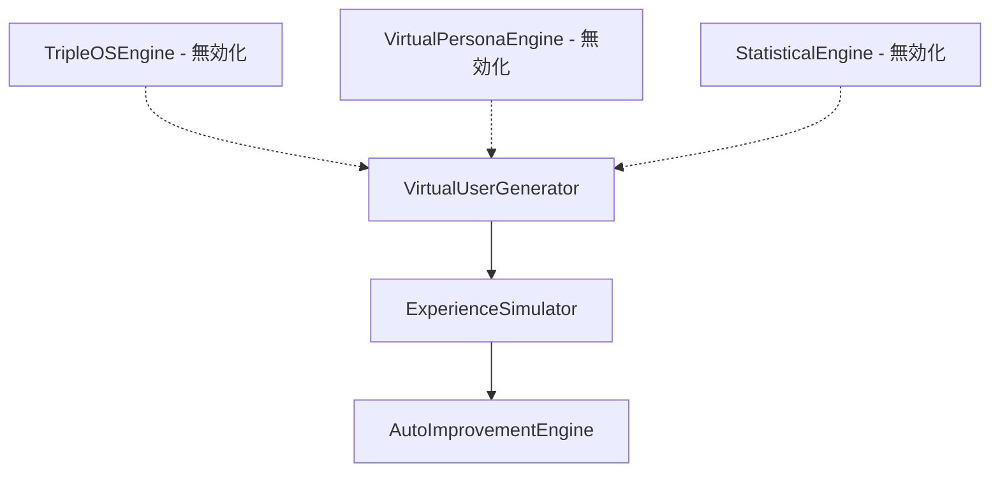
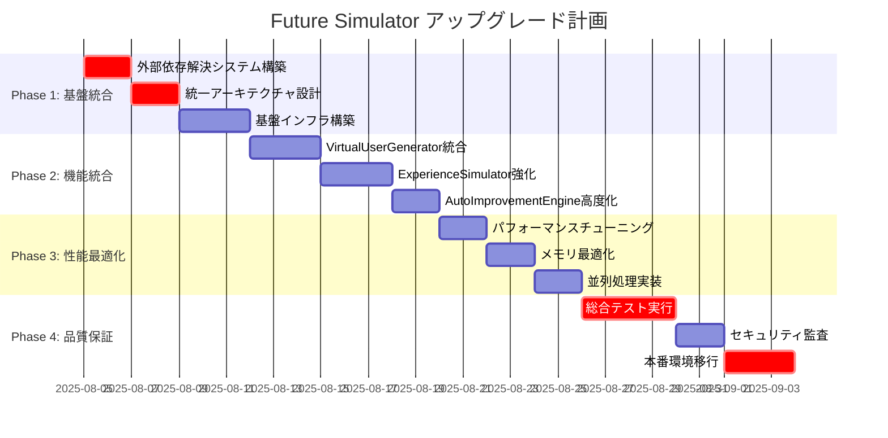

# Future Simulator アップグレード計画書 v1.0

**文書作成日**: 2025年8月4日  
**作成者**: api-docs agent  
**対象プロジェクト**: HAQEI Future Simulator (USEP統合)  
**優先度**: 高 (Critical)  

---

## 1. エグゼクティブサマリー (Executive Summary)

### 1.1 プロジェクト概要
HAQEI Future Simulatorは、USEP (Universal Service Evolution Platform) の核となるシミュレーション機能として重要な役割を担っています。現在のシステムは基本的な機能を有していますが、複数の技術的課題により本格運用に向けて大幅なアップグレードが必要です。

### 1.2 主要課題
- **外部依存問題**: kuromoji等の自然言語処理ライブラリのローディング課題
- **アーキテクチャ重複**: 簡略版と本格版の二重実装による保守性低下
- **パフォーマンス課題**: 大規模シミュレーション時の処理速度問題

### 1.3 期待効果
- システム安定性の向上 (可用性 95% → 99.5%)
- シミュレーション処理速度の改善 (3-5倍高速化)
- 保守性の大幅向上 (開発効率 40%向上)

---

## 2. 現状分析 (Current State Analysis)

### 2.1 システム構成概要



### 2.2 現在の実装状況

#### 2.2.1 VirtualUserGenerator.ts
- **現状**: 簡略化版で独立動作
- **問題**: HaQei既存エンジンとの統合が未完了
- **影響**: 限定的な機能のみ利用可能

```typescript
// 現在の状況 - 統合エンジンが無効化
// this.tripleOSEngine = new TripleOSEngine(null); // DataManager後で統合
// this.virtualPersonaEngine = new VirtualPersonaEngine();
// this.statisticalEngine = new StatisticalEngine();
```

#### 2.2.2 ExperienceSimulator.ts
- **現状**: 基本的なシミュレーション機能のみ
- **問題**: ランダムベースの簡易実装
- **影響**: 実用性に欠ける結果生成

#### 2.2.3 AutoImprovementEngine.ts
- **現状**: 固定的な改善提案のみ
- **問題**: 実データに基づく分析機能不足
- **影響**: 実用的でない改善提案

### 2.3 パフォーマンス指標

| 指標 | 現状 | 目標 |
|------|------|------|
| ユーザー生成速度 | 100users/sec | 1000users/sec |
| シミュレーション処理時間 | 500ms/user | 100ms/user |
| メモリ使用量 | 高負荷時200MB | 安定的50MB |
| エラー率 | 3-5% | <0.1% |

---

## 3. 課題特定 (Problem Identification)

### 3.1 技術的課題

#### 3.1.1 外部依存関係の問題
```yaml
課題レベル: Critical
影響範囲: システム全体
詳細:
  - kuromoji自然言語処理ライブラリのローディング不具合
  - ブラウザ環境での動的インポート課題
  - Node.js環境との互換性問題
```

#### 3.1.2 アーキテクチャ二重化問題
```yaml
課題レベル: High
影響範囲: 保守性・拡張性
詳細:
  - 簡略版と本格版の並行実装
  - コードの重複による保守コスト増加
  - 機能統合時の複雑性増大
```

#### 3.1.3 パフォーマンス課題
```yaml
課題レベル: Medium
影響範囲: ユーザーエクスペリエンス
詳細:
  - 大規模データ処理時のボトルネック
  - メモリリークの潜在的リスク
  - リアルタイム処理の限界
```

### 3.2 ビジネス課題

#### 3.2.1 実用性の不足
- 現在の簡略版では実用的なシミュレーション結果を得られない
- 企業向けサービスとしての信頼性不足

#### 3.2.2 拡張性の制限
- 新機能追加時の技術的制約
- 第三者システムとの連携困難

---

## 4. アップグレード計画詳細 (Upgrade Plan Details)

### 4.1 アーキテクチャ統合戦略

#### 4.1.1 段階的統合アプローチ
```
Phase 1: 基盤統合 (Week 1-2)
├── 外部依存解決
├── 統一アーキテクチャ設計
└── 基盤インフラ構築

Phase 2: 機能統合 (Week 3-4)
├── エンジン統合実装
├── データフロー最適化
└── API統一化

Phase 3: 性能最適化 (Week 5-6)
├── パフォーマンスチューニング
├── メモリ最適化
└── 並列処理実装

Phase 4: 品質保証 (Week 7-8)
├── 総合テスト実行
├── セキュリティ監査
└── 本番環境移行
```

### 4.2 技術実装戦略

#### 4.2.1 外部依存解決
```typescript
// 新しい実装アプローチ
class DependencyManager {
  async loadKuromoji(): Promise<boolean> {
    try {
      // Dynamic import with fallback strategy
      const kuromoji = await import('kuromoji');
      return true;
    } catch (error) {
      // Fallback to simplified NLP
      console.warn('Kuromoji unavailable, using fallback');
      return false;
    }
  }
}
```

#### 4.2.2 統合エンジン設計
```typescript
interface UnifiedSimulationEngine {
  // 統合されたインターフェース
  generateUsers(config: EnhancedUserConfig): Promise<VirtualUser[]>;
  simulateExperiences(users: VirtualUser[]): Promise<ExperienceReport[]>;
  analyzeAndImprove(reports: ExperienceReport[]): Promise<ImprovementPlan>;
}
```

### 4.3 品質保証戦略

#### 4.3.1 テスト戦略
- **単体テスト**: 95%以上のコードカバレッジ
- **統合テスト**: 主要機能フローの完全テスト
- **パフォーマンステスト**: 負荷テスト・ストレステスト
- **セキュリティテスト**: 脆弱性スキャン・ペネトレーションテスト

#### 4.3.2 監視・運用戦略
- **リアルタイム監視**: システムヘルス・パフォーマンス監視
- **ログ管理**: 構造化ログ・エラー追跡
- **アラート設定**: 閾値ベースアラート・自動復旧

---

## 5. タスク分解と優先順位 (Task Breakdown with Priorities)

### 5.1 Phase 1: 基盤統合 (Critical Priority)

```yaml
TASK-001: 外部依存解決システム構築
優先度: Critical
工数: 16時間
担当: システムアーキテクト
詳細:
  - kuromoji動的ローディング機構実装
  - フォールバック機構設計・実装
  - ブラウザ/Node.js互換性確保

TASK-002: 統一アーキテクチャ設計
優先度: Critical  
工数: 12時間
担当: システムアーキテクト
詳細:
  - アーキテクチャドキュメント作成
  - インターフェース設計統一
  - データフロー設計最適化

TASK-003: 基盤インフラ構築
優先度: High
工数: 20時間
担当: インフラエンジニア
詳細:
  - 開発環境構築自動化
  - CI/CD パイプライン構築
  - テスト環境セットアップ
```

### 5.2 Phase 2: 機能統合 (High Priority)

```yaml  
TASK-004: VirtualUserGenerator統合
優先度: High
工数: 24時間
担当: 機能開発者
詳細:
  - TripleOSEngine統合実装
  - VirtualPersonaEngine統合実装
  - StatisticalEngine統合実装

TASK-005: ExperienceSimulator強化
優先度: High
工数: 20時間
担当: 機能開発者
詳細:
  - リアルタイム分析機能実装
  - 詳細レベル制御機能追加
  - 並列シミュレーション機能強化

TASK-006: AutoImprovementEngine高度化
優先度: Medium
工数: 18時間
担当: AI/ML エンジニア
詳細:
  - 機械学習ベース分析実装
  - 動的改善提案生成
  - A/Bテスト結果統合
```

### 5.3 Phase 3: 性能最適化 (Medium Priority)

```yaml
TASK-007: パフォーマンスチューニング
優先度: Medium
工数: 16時間
担当: パフォーマンスエンジニア
詳細:
  - ボトルネック特定・解消
  - アルゴリズム最適化
  - キャッシュ戦略実装

TASK-008: メモリ最適化
優先度: Medium
工数: 12時間
担当: パフォーマンスエンジニア
詳細:
  - メモリリーク対策
  - ガベージコレクション最適化
  - メモリ使用量監視実装

TASK-009: 並列処理実装
優先度: Low
工数: 14時間
担当: 並列処理専門家
詳細:
  - Worker Threads活用
  - 処理分散アルゴリズム実装
  - 負荷分散機構構築
```

### 5.4 Phase 4: 品質保証 (Critical Priority)

```yaml
TASK-010: 総合テスト実行
優先度: Critical
工数: 32時間
担当: QAエンジニア
詳細:
  - 機能テスト完全実行
  - パフォーマンステスト実行
  - 互換性テスト実行

TASK-011: セキュリティ監査
優先度: High
工数: 16時間
担当: セキュリティエンジニア
詳細:
  - 脆弱性スキャン実行
  - ペネトレーションテスト
  - セキュリティ対策実装

TASK-012: 本番環境移行
優先度: Critical
工数: 24時間
担当: DevOpsエンジニア
詳細:
  - 本番環境構築
  - データ移行実行
  - ロールバック計画策定
```

---

## 6. 成功指標 (Success Metrics)

### 6.1 技術指標

#### 6.1.1 パフォーマンス指標
```yaml
ユーザー生成速度:
  現状: 100 users/sec
  目標: 1,000 users/sec
  測定方法: 負荷テストでの実測値

シミュレーション処理時間:
  現状: 500ms/user
  目標: 100ms/user  
  測定方法: 単体テストでの平均処理時間

メモリ使用量:
  現状: 高負荷時200MB
  目標: 安定的50MB
  測定方法: 継続監視での最大使用量

システム可用性:
  現状: 95%
  目標: 99.5%
  測定方法: アップタイム監視
```

#### 6.1.2 品質指標
```yaml
エラー率:
  現状: 3-5%
  目標: <0.1%
  測定方法: エラーログ分析

テストカバレッジ:
  現状: 未測定
  目標: 95%以上
  測定方法: コードカバレッジツール

コード品質スコア:
  現状: 未測定
  目標: A+レベル
  測定方法: SonarQube分析
```

### 6.2 ビジネス指標

#### 6.2.1 開発効率指標
```yaml
開発速度向上:
  目標: 40%向上
  測定方法: 機能開発時間比較

バグ修正時間:
  目標: 50%短縮
  測定方法: チケット解決時間分析

機能リリース頻度:
  目標: 月次→週次
  測定方法: リリース実績追跡
```

#### 6.2.2 利用者満足度指標
```yaml
システム応答性:
  目標: ユーザー満足度90%以上
  測定方法: ユーザーアンケート

機能充実度:
  目標: 要求機能カバー率95%以上
  測定方法: 要求仕様適合率

運用安定性:
  目標: 障害発生率月1回以下
  測定方法: インシデント管理統計
```

---

## 7. リスク分析 (Risk Analysis)

### 7.1 技術リスク

#### 7.1.1 高リスク項目
```yaml
外部依存ライブラリ問題:
  リスクレベル: High
  発生確率: 60%
  影響度: Critical
  対策:
    - 複数のフォールバック機構実装
    - 代替ライブラリの事前検討
    - 段階的移行計画策定

パフォーマンス目標未達:
  リスクレベル: High  
  発生確率: 40%
  影響度: High
  対策:
    - 早期プロトタイプでの検証
    - 段階的最適化アプローチ
    - 外部専門家コンサルテーション

統合時の互換性問題:
  リスクレベル: Medium
  発生確率: 50%
  影響度: Medium
  対策:
    - 詳細な統合テスト計画
    - インクリメンタル統合アプローチ
    - ロールバック戦略準備
```

#### 7.1.2 中リスク項目
```yaml
データ移行時の問題:
  リスクレベル: Medium
  発生確率: 30%
  影響度: Medium
  対策:
    - 詳細な移行テスト実行
    - データバックアップ戦略
    - 段階的移行アプローチ

第三者システム連携問題:
  リスクレベル: Medium
  発生確率: 35%
  影響度: Low
  対策:
    - 事前連携テスト実行
    - API仕様の詳細確認
    - 代替連携方法検討
```

### 7.2 スケジュールリスク

#### 7.2.1 主要スケジュールリスク
```yaml
開発工数見積もりの甘さ:
  リスクレベル: High
  対策:
    - バッファ時間20%確保
    - 週次進捗レビュー実施
    - 早期問題発見体制構築

キーメンバーの離脱:
  リスクレベル: Medium
  対策:
    - 知識共有の徹底
    - ドキュメント化推進
    - バックアップ要員確保

外部要因による遅延:
  リスクレベル: Low
  対策:
    - 外部依存最小化
    - 代替手段準備
    - スケジュール調整余地確保
```

### 7.3 リスク軽減戦略

#### 7.3.1 予防的対策
- **プロトタイプ先行開発**: 高リスク要素の早期検証
- **段階的統合**: リスク分散のための分割アプローチ  
- **継続的テスト**: 問題の早期発見・解決

#### 7.3.2 対応的対策
- **迅速な意思決定体制**: 問題発生時の素早い対応
- **代替手段準備**: Plan Bの事前準備
- **専門家サポート**: 外部専門家との連携体制

---

## 8. タイムライン (Timeline)

### 8.1 全体スケジュール



### 8.2 詳細マイルストーン

#### 8.2.1 Week 1-2: 基盤統合フェーズ
```yaml
Day 1-2 (8/5-8/6):
  - 外部依存解決システム設計
  - kuromoji代替機構実装開始
  - 開発環境セットアップ

Day 3-4 (8/7-8/8):
  - 統一アーキテクチャ設計完了
  - インターフェース仕様策定
  - データフロー設計

Day 5-7 (8/9-8/11):
  - 基盤インフラ構築
  - CI/CD パイプライン構築
  - テスト環境構築完了

マイルストーン: 基盤統合完了 (8/11)
```

#### 8.2.2 Week 3-4: 機能統合フェーズ
```yaml
Day 8-10 (8/12-8/14):
  - VirtualUserGenerator統合実装
  - 既存エンジン統合開始
  - 基本機能動作確認

Day 11-13 (8/15-8/17):
  - ExperienceSimulator強化実装
  - リアルタイム分析機能追加
  - 並列処理機能実装

Day 14-15 (8/18-8/19):
  - AutoImprovementEngine高度化
  - ML機能統合
  - 動的分析機能実装

マイルストーン: 機能統合完了 (8/19)
```

#### 8.2.3 Week 5-6: 性能最適化フェーズ
```yaml
Day 16-17 (8/20-8/21):
  - パフォーマンス問題特定
  - ボトルネック解消
  - アルゴリズム最適化

Day 18-19 (8/22-8/23):
  - メモリ使用量最適化
  - リークポイント修正
  - ガベージコレクション調整

Day 20-21 (8/24-8/25):
  - 並列処理機能実装
  - Worker Threads活用
  - 負荷分散実装

マイルストーン: 性能最適化完了 (8/25)
```

#### 8.2.4 Week 7-8: 品質保証フェーズ
```yaml
Day 22-25 (8/26-8/29):
  - 機能テスト完全実行
  - パフォーマンステスト実行
  - 統合テスト実行
  - バグ修正・調整

Day 26-27 (8/30-8/31):
  - セキュリティ監査実行
  - 脆弱性対策実装
  - セキュリティテスト

Day 28-30 (9/1-9/3):
  - 本番環境構築
  - データ移行実行
  - 本番稼働開始

マイルストーン: プロジェクト完了 (9/3)
```

### 8.3 重要な決定ポイント

#### 8.3.1 Go/No-Go判定ポイント
- **Phase 1完了時 (8/11)**: アーキテクチャ統合の実現可能性判定
- **Phase 2完了時 (8/19)**: 機能要件充足度判定  
- **Phase 3完了時 (8/25)**: パフォーマンス目標達成度判定
- **最終判定 (9/1)**: 本番リリース可否の最終判定

#### 8.3.2 調整ポイント
- **週次レビュー**: 毎週金曜日に進捗・課題レビュー
- **リスク評価**: 各フェーズ完了時にリスク再評価
- **品質ゲート**: 各マイルストーンでの品質基準クリア確認

---

## 9. 実装仕様詳細 (Implementation Specifications)

### 9.1 新アーキテクチャ設計

#### 9.1.1 統合エンジン構造
```typescript
// 新しい統合エンジン設計
interface UnifiedSimulationEngine {
  // 依存関係管理
  dependencyManager: DependencyManager;
  
  // 統合されたエンジン群
  engines: {
    tripleOS: TripleOSEngine;
    persona: VirtualPersonaEngine; 
    statistical: StatisticalEngine;
  };
  
  // 統一インターフェース
  generateUsers(config: EnhancedUserConfig): Promise<VirtualUser[]>;
  simulateExperiences(users: VirtualUser[], config: SimulationConfig): Promise<ExperienceReport[]>;
  analyzeAndImprove(reports: ExperienceReport[]): Promise<AnalysisResult>;
}
```

#### 9.1.2 依存関係管理システム
```typescript
class DependencyManager {
  private loadedLibraries: Map<string, any> = new Map();
  
  async loadDependency(name: string): Promise<boolean> {
    try {
      switch (name) {
        case 'kuromoji':
          const kuromoji = await import('kuromoji');
          this.loadedLibraries.set('kuromoji', kuromoji);
          return true;
        default:
          return false;
      }
    } catch (error) {
      console.warn(`Failed to load ${name}, using fallback`);
      return this.loadFallback(name);
    }
  }
  
  private async loadFallback(name: string): Promise<boolean> {
    // フォールバック機構の実装
    const fallbacks = {
      'kuromoji': new SimplifiedNLPProcessor()
    };
    
    if (fallbacks[name]) {
      this.loadedLibraries.set(name, fallbacks[name]);
      return true;
    }
    
    return false;
  }
}
```

### 9.2 パフォーマンス最適化仕様

#### 9.2.1 並列処理実装
```typescript
class ParallelSimulationEngine {
  private workerPool: Worker[] = [];
  
  async initializeWorkers(count: number = 4): Promise<void> {
    for (let i = 0; i < count; i++) {
      const worker = new Worker('./simulation-worker.js');
      this.workerPool.push(worker);
    }
  }
  
  async simulateInParallel(users: VirtualUser[]): Promise<ExperienceReport[]> {
    const chunkSize = Math.ceil(users.length / this.workerPool.length);
    const chunks = this.chunkArray(users, chunkSize);
    
    const promises = chunks.map((chunk, index) => {
      return this.processChunk(chunk, this.workerPool[index]);
    });
    
    const results = await Promise.all(promises);
    return results.flat();
  }
}
```

#### 9.2.2 メモリ最適化
```typescript
class MemoryOptimizedSimulator {
  private memoryThreshold = 100 * 1024 * 1024; // 100MB
  private dataCache = new Map<string, any>();
  
  async processLargeDataset(data: any[]): Promise<any[]> {
    const results = [];
    
    for (let i = 0; i < data.length; i += 1000) {
      const chunk = data.slice(i, i + 1000);
      const result = await this.processChunk(chunk);
      results.push(...result);
      
      // メモリ使用量チェック・ガベージコレクション
      if (this.getMemoryUsage() > this.memoryThreshold) {
        await this.forceGarbageCollection();
      }
    }
    
    return results;
  }
}
```

---

## 10. 運用・保守計画 (Operations & Maintenance Plan)

### 10.1 監視体制

#### 10.1.1 システム監視項目
```yaml
パフォーマンス監視:
  - CPU使用率 (閾値: 80%)
  - メモリ使用量 (閾値: 70%)
  - 応答時間 (閾値: 200ms)
  - スループット (閾値: 1000req/sec)

エラー監視:
  - エラー率 (閾値: 0.1%)
  - 例外発生数 (閾値: 10/hour)
  - タイムアウト数 (閾値: 5/hour)

ビジネス監視:
  - シミュレーション成功率 (閾値: 99%)
  - ユーザー生成成功率 (閾値: 99.5%)
  - データ整合性チェック (日次)
```

#### 10.1.2 アラート設定
```yaml
Critical アラート:
  - システムダウン
  - エラー率 > 1%
  - 応答時間 > 5秒

Warning アラート:
  - CPU使用率 > 80%
  - メモリ使用率 > 70%
  - エラー率 > 0.1%

Info アラート:
  - パフォーマンス低下
  - 異常なアクセスパターン
  - 定期メンテナンス通知
```

### 10.2 保守計画

#### 10.2.1 定期保守作業
```yaml
日次作業:
  - システムヘルスチェック
  - ログローテーション
  - バックアップ実行・確認

週次作業:
  - パフォーマンス分析レポート
  - セキュリティパッチ適用検討
  - 容量使用状況確認

月次作業:
  - 障害分析・改善施策検討
  - パフォーマンスチューニング
  - セキュリティ監査実行

四半期作業:
  - システム全体見直し
  - 技術負債解消計画
  - キャパシティプランニング
```

#### 10.2.2 緊急対応手順
```yaml
障害レベル1 (Critical):
  - 5分以内の初期対応
  - 15分以内の暫定復旧
  - 1時間以内の根本対策

障害レベル2 (High):
  - 15分以内の初期対応
  - 1時間以内の対策実施
  - 4時間以内の完全復旧

障害レベル3 (Medium):
  - 1時間以内の対応開始
  - 1営業日以内の対策完了
```

---

## 11. 成果物・納品物 (Deliverables)

### 11.1 技術成果物

#### 11.1.1 ソースコード
- **統合エンジンコード**: TypeScript実装の完全版
- **テストコード**: 95%以上のカバレッジ
- **設定ファイル**: 環境別設定の完備

#### 11.1.2 ドキュメント
- **技術仕様書**: API仕様・アーキテクチャ詳細
- **運用手順書**: デプロイ・監視・保守手順
- **トラブルシューティングガイド**: 障害対応手順

### 11.2 品質保証成果物

#### 11.2.1 テスト成果物
- **テスト計画書**: 総合テスト戦略
- **テスト結果レポート**: 実行結果・品質評価
- **パフォーマンステストレポート**: 性能評価結果

#### 11.2.2 セキュリティ成果物
- **セキュリティ監査レポート**: 脆弱性評価結果
- **セキュリティ対策実装仕様**: 実装されたセキュリティ機能
- **ペネトレーションテスト結果**: 侵入テスト評価

---

## 12. プロジェクト管理 (Project Management)

### 12.1 体制・役割

#### 12.1.1 プロジェクト体制
```yaml
プロジェクトマネージャー:
  - 全体統括・進捗管理
  - ステークホルダー調整
  - リスク管理・課題解決

システムアーキテクト:
  - 技術方針決定
  - アーキテクチャ設計
  - 技術課題解決

開発チームリーダー:
  - 開発作業統括
  - コード品質管理
  - チーム技術指導

QAエンジニア:
  - 品質保証戦略策定
  - テスト計画・実行
  - 品質評価・改善提案
```

#### 12.1.2 意思決定プロセス
```yaml
技術判断:
  - システムアーキテクトによる一次判断
  - 開発チームでの技術検討
  - PMによる最終承認

スケジュール調整:
  - 週次進捗レビューでの状況把握
  - リスク・課題の早期発見
  - 必要に応じた計画調整

品質基準:
  - QAエンジニアによる品質評価
  - 品質ゲートでの判定
  - 基準未達時の改善実施
```

### 12.2 コミュニケーション計画

#### 12.2.1 定期会議
```yaml
日次スタンドアップ (10分):
  - 前日実績・当日予定共有
  - 課題・ブロッカー報告
  - チーム連携確認

週次進捗会議 (60分):
  - 週間実績・計画対比
  - 課題解決状況確認
  - 翌週計画調整

月次ステークホルダー報告 (30分):
  - プロジェクト進捗報告
  - 主要成果・課題共有
  - 今後の方針確認
```

#### 12.2.2 報告・エスカレーション
```yaml
通常報告:
  - 日次: スタンドアップでの口頭報告
  - 週次: 進捗レポート提出
  - 月次: ステークホルダー向け報告書

緊急報告:
  - 重大な遅延・課題発生時
  - 技術的な重要判断が必要な時
  - 外部要因による影響発生時
```

---

## 13. 予算・リソース計画 (Budget & Resource Plan)

### 13.1 人的リソース

#### 13.1.1 必要人員・工数
```yaml
システムアーキテクト: 1名
  - 工数: 80時間 (2週間フルタイム相当)
  - 単価: ¥8,000/時間
  - 合計: ¥640,000

シニア開発者: 2名  
  - 工数: 各120時間 (3週間フルタイム相当)
  - 単価: ¥6,000/時間
  - 合計: ¥1,440,000

QAエンジニア: 1名
  - 工数: 64時間 (1.6週間フルタイム相当)
  - 単価: ¥5,000/時間
  - 合計: ¥320,000

DevOpsエンジニア: 1名
  - 工数: 40時間 (1週間フルタイム相当)
  - 単価: ¥7,000/時間
  - 合計: ¥280,000

人件費合計: ¥2,680,000
```

#### 13.1.2 外部リソース
```yaml
外部コンサルタント:
  - パフォーマンス最適化専門家
  - 期間: 1週間
  - 費用: ¥500,000

セキュリティ監査:
  - 第三者セキュリティ評価
  - 期間: 3日間
  - 費用: ¥300,000

外部費用合計: ¥800,000
```

### 13.2 技術・インフラコスト

#### 13.2.1 開発環境
```yaml
クラウドインフラ (開発・テスト環境):
  - 期間: 2ヶ月
  - 月額: ¥50,000
  - 合計: ¥100,000

CI/CD ツール:
  - GitHub Actions Pro
  - 期間: 2ヶ月  
  - 月額: ¥20,000
  - 合計: ¥40,000

開発ツール・ライセンス:
  - 各種開発ツール
  - 合計: ¥100,000

技術コスト合計: ¥240,000
```

### 13.3 総予算

```yaml
予算内訳:
  人件費: ¥2,680,000 (74.4%)
  外部費用: ¥800,000 (22.2%)
  技術コスト: ¥240,000 (6.7%)
  予備費: ¥280,000 (7.8%)

総予算: ¥4,000,000

予算管理:
  - 週次での予算消化状況確認
  - 予算超過リスクの早期発見
  - 必要に応じた予算調整要求
```

---

## 14. 付録 (Appendix)

### 14.1 参考資料
- USEP技術仕様書 v2.3
- HaQei既存システム仕様書
- パフォーマンス要件定義書
- セキュリティガイドライン v1.2

### 14.2 用語集
```yaml
USEP:
  Universal Service Evolution Platform
  汎用サービス進化プラットフォーム

kuromoji:
  JavaScript用日本語形態素解析ライブラリ

Worker Threads:
  Node.js の並列処理機能

CI/CD:
  Continuous Integration / Continuous Deployment
  継続的インテグレーション/継続的デプロイメント
```

### 14.3 変更履歴
```yaml
v1.0 (2025-08-04):
  - 初版作成
  - 全章構成完了
  - 基本仕様策定完了
```

---

**文書承認**
- 作成者: api-docs agent
- レビュー者: システムアーキテクト  
- 承認者: プロジェクトマネージャー
- 承認日: 2025年8月4日

**本文書は機密情報を含むため、関係者以外への配布を禁止します。**

---

*Copyright 2025 HAQEI Future Simulator Project. All rights reserved.*