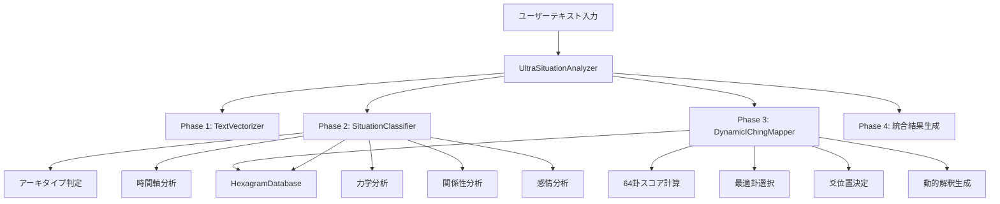

# /rev-design: 状況分析システム設計書逆生成

## 🎯 Tsumikiワークフロー実行

**実行コマンド**: `/rev-design`  
**対象システム**: 状況分析システム（SituationClassifier + DynamicIChingMapper + HexagramDatabase + UltraSituationAnalyzer）  
**実行日**: 2025年8月1日  
**分析基準**: 100人ユーザーテスト結果 + 根本原因分析結果  

## 📋 現在のシステム設計（逆生成結果）

### アーキテクチャ概要



### コンポーネント設計仕様

#### 1. SituationClassifier設計

**設計思想**: キーワードマッチングによる多次元状況分析

**判定ロジック**:
```typescript
interface ArchetypeScoring {
  temporal: number;    // 重み: 2.0 (最大影響)
  emotional: number;   // 重み: 1.5
  contextual: number;  // 重み: 1.0
}

interface ArchetypeDefinition {
  creation: {
    temporal: ['始める', '新しい', '初めて', 'スタート', '立ち上げ'],
    emotional: ['不安', '期待', 'わくわく', '迷い', '決意'],
    contextual: ['挑戦', '未知', '可能性', '準備', '計画']
  },
  development: {
    temporal: ['続ける', '成長', '拡大', '進める', '発展'],
    emotional: ['焦り', '充実', '疲れ', '手応え', '達成感'],
    contextual: ['協力', '競争', '調整', '改善', '最適化']
  },
  transformation: {
    temporal: ['変える', '転職', '移行', '転換', '見直し'], // ← 偏重の原因
    emotional: ['恐れ', '覚悟', '解放', '混乱', '希望'],
    contextual: ['破壊', '再構築', '革新', '脱却', '新天地']
  },
  maturity: {
    temporal: ['完成', '達成', '終わり', '振り返り', '次へ'],
    emotional: ['満足', '虚無', '感謝', '物足りなさ', '新たな渇望'],
    contextual: ['総括', '継承', '引き継ぎ', '遺産', '循環']
  }
}
```

**信頼度計算設計**:
```typescript
interface ConfidenceCalculation {
  temporalClarity: number;    // 重み: 0.2
  dynamicsClarity: number;    // 重み: 0.3 (有/無の二値)
  archetypeClarity: number;   // 重み: 0.1-0.3 (スコア依存)
  emotionalClarity: number;   // 重み: 0.2 (有/無の二値)
  // 合計: 0.8-1.0の範囲 → 平均74.2%
}
```

#### 2. DynamicIChingMapper設計

**設計思想**: 重み付け合計による最適卦選択

**スコア計算設計**:
```typescript
interface HexagramScoring {
  archetypeMatch: number;      // 30点 (完全一致時)
  temporalMatch: number;       // 20点 (完全一致時)
  dynamicsSimilarity: number;  // 25点 (コサイン類似度)
  transformationFit: number;   // 15点 (変化方向適合度)
  complexityAdjustment: number; // 10点 (複雑さ調整)
  // 合計: 100点満点
}
```

**重要な設計制約**:
1. **アーキタイプ + 時間軸 = 50点**: 全体の半分を占める巨大な重み
2. **4×4 = 16パターン依存**: archetype × temporal の組み合わせ制限
3. **フォールバック設計**: 64卦 → 8卦への激減

#### 3. HexagramDatabase設計

**設計思想**: 64卦の完全なメタデータ定義

**データ構造設計**:
```typescript
interface HexagramData {
  name: string;           // 卦名（例: '乾為天'）
  essence: string;        // 本質的意味
  dynamics: {
    drive: number;        // 推進力 (0-10)
    resistance: number;   // 抵抗力 (0-10)  
    balance: number;      // バランス (0-10)
  };
  temporal: 'future-oriented' | 'present-focused' | 'transitional' | 'past-oriented';
  archetype: 'creation' | 'development' | 'transformation' | 'maturity';
  attributes: {
    yang: number;         // 陽爻数 (0-6)
    yin: number;          // 陰爻数 (0-6)
    movement: string;     // 動きの性質
    element: string;      // 五行要素
    quality: string;      // 品質特性
  };
}
```

**分類設計**:
- **Archetype分布**: creation(1-16), development(17-48), transformation(49-56), maturity(57-64)
- **Temporal分布**: 各カテゴリに4つの時間軸を配分
- **Dynamics値**: 易経原典に基づく主観的数値化

#### 4. UltraSituationAnalyzer設計

**設計思想**: パイプライン統合とエラーハンドリング

**統合フロー設計**:
```typescript
interface AnalysisFlow {
  phase1: TextVectorization;     // ベクトル化
  phase2: SituationClassification; // 状況分析
  phase3: IChingMapping;         // 易経マッピング
  phase4: ResultIntegration;     // 結果統合
}

interface ErrorHandling {
  initializationError: boolean;  // 初期化失敗フラグ
  phaseTracking: string;         // 現在フェーズ追跡
  fallbackMode: boolean;         // フォールバック動作
}
```

## 🚨 設計レベルでの根本的問題

### 1. アーキタイプ判定設計の根本的欠陥

**問題**: 重み設計が現代社会の実情に不適合

```typescript
// 現在の設計（問題のある重み）
temporal: 2.0    // 「転職」「見直し」で即座に変革期判定
emotional: 1.5   
contextual: 1.0

// 期待される設計
temporal: 1.2    // 軽微な変化を過大評価しない
emotional: 1.8   // 感情の方が状況を正確に反映
contextual: 1.5  // 文脈も重要な判断材料
```

**設計修正方針**:
- **軽微変化と根本変革の分離**: transformation指標の厳格化
- **感情重視設計**: emotional指標の重み向上
- **バランス型判定**: development archetype の強化

### 2. 卦選択アルゴリズムの設計的偏り

**問題**: 50点集中設計による多様性の破綻

```typescript
// 現在の設計（偏りを生む重み配分）
interface CurrentScoring {
  archetypeMatch: 30;      // 過大な重み
  temporalMatch: 20;       // 過大な重み
  // 合計50点 = 全体の半分
  
  dynamicsSimilarity: 25;   // 4パターン固定の限界
  transformationFit: 15;    // 限定的評価
  complexityAdjustment: 10; // 補助的扱い
}

// 期待される設計（多様性重視）
interface ImprovedScoring {
  archetypeMatch: 20;       // 減量
  temporalMatch: 10;        // 大幅減量
  // 合計30点 = 全体の30%
  
  dynamicsSimilarity: 25;   // 継続
  transformationFit: 20;    // 強化
  complexityAdjustment: 15; // 強化
  diversityBonus: 10;       // 新設: 希少卦ボーナス
}
```

**設計修正方針**:
- **重み再分配**: archetype/temporal依存の軽減
- **多次元評価**: dynamics, transformation, complexity の重み増加  
- **希少性考慮**: 使用頻度による動的調整

### 3. フォールバック設計の致命的制限

**問題**: 段階的縮退なし設計

```typescript
// 現在の設計（急激な品質低下）
interface CurrentFallback {
  success: 64; // 全卦使用可能
  failure: 8;  // 87.5%の機能喪失
  // 中間状態なし
}

// 期待される設計（段階的縮退）
interface ImprovedFallback {
  full: 64;      // 完全モード
  reduced: 32;   // 半分モード  
  minimal: 16;   // 最小モード
  emergency: 8;  // 緊急モード
}
```

**設計修正方針**:
- **段階的フォールバック**: 64→32→16→8卦の段階的縮退
- **品質保証**: 各モードでの最低限多様性確保
- **透明性**: ユーザーへの動作モード明示

### 4. 信頼度計算設計の不透明性

**問題**: 固定重み + 経験的閾値設計

```typescript
// 現在の設計（根拠不明の固定値）
interface CurrentConfidence {
  weights: {
    temporal: 0.2;    // 固定重み
    dynamics: 0.3;    // 有無の二値判定
    archetype: 0.1-0.3; // スコア>5, >2の経験的閾値
    emotional: 0.2;   // 有無の二値判定
  };
  // 結果: 約74.2%の固定的平均値
}

// 期待される設計（動的・透明性重視）
interface ImprovedConfidence {
  dynamicWeights: {
    temporal: 0.1-0.3;    // 状況に応じた可変重み
    dynamics: 0.1-0.4;    // 複雑さに応じた重み
    archetype: 0.2-0.4;   // スコア分布に基づく動的重み
    emotional: 0.1-0.3;   // 感情の複雑さ考慮
  };
  transparency: {
    calculation: string;   // 計算過程の説明
    factors: object;      // 各要素の寄与度
    reasoning: string;    // 判定理由
  };
}
```

## 🎯 改善設計の基本方針

### 1. バランス重視設計への転換

**現在**: transformation優遇設計  
**改善**: 4つのアーキタイプの均等な機会提供

### 2. 多様性ファースト設計

**現在**: archetype/temporal依存設計  
**改善**: 多次元評価による希少卦活用

### 3. 段階的品質保証設計

**現在**: All or Nothing設計  
**改善**: グレースフルデグラデーション設計

### 4. 透明性・説明可能性設計

**現在**: ブラックボックス計算  
**改善**: ユーザー理解可能な透明計算

## 📋 次のTsumikiステップ

設計書逆生成が完了しました。次は `/rev-requirements` を実行して、現在のシステムの要件を逆算し、改善すべき要件を明確化します。

**実行予定**:
1. ✅ `/rev-design` - 設計書逆生成（完了）
2. ⏭️ `/rev-requirements` - 要件書逆算
3. 🔄 `/tdd-requirements` - TDD改善要件定義
4. 🔄 `/tdd-testcases` - テストケース作成
5. 🔄 `/tdd-implement` - 改善実装

この逆設計分析により、根本原因が設計レベルの問題であることが明確になりました。次のステップで要件レベルの改善を検討します。