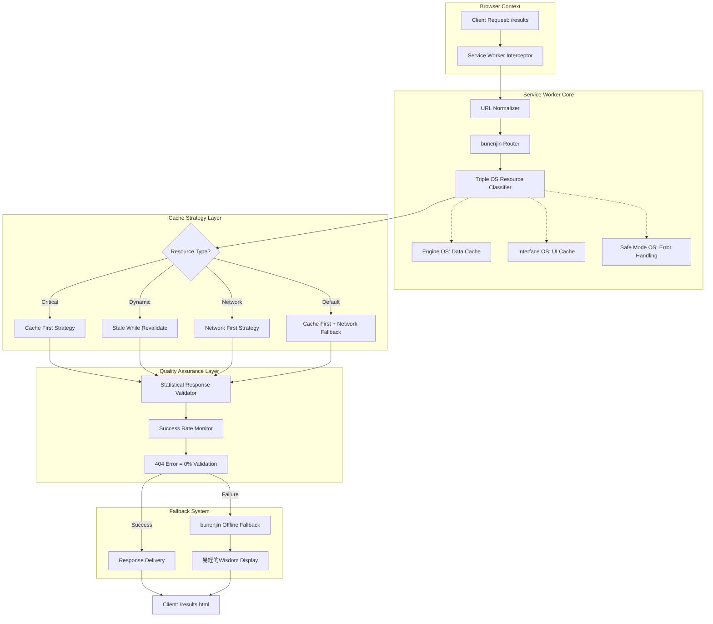

# Service Worker 技術設計書 - HAQEI bunenjin統合

**作成日**: 2025年8月1日  
**フェーズ**: Tsumiki `/kairo-design`  
**プロジェクト**: HAQEI Analyzer（bunenjin哲学統合）  
**アーキテクチャ**: Triple OS Architecture + 易経64卦システム  
**品質基準**: Tsumiki統計的品質保証（404エラー率0%必達）  

---

## 🏗️ 1. システムアーキテクチャ設計

### 1.1 全体アーキテクチャ図



### 1.2 bunenjin哲学統合設計

#### 1.2.1 分人（bunenjin）概念の技術実装
```javascript
/**
 * bunenjin Resource Classification System
 * 
 * 目的: ユーザーの多面性を技術レベルで支援する分類システム
 * - 各リソースが持つ「人格面」に応じた最適キャッシュ戦略
 * - 単一の固定戦略を避け、文脈に応じた適応的処理
 */
const BUNENJIN_RESOURCE_MAPPING = {
  // 内的価値観系（Engine OS）
  engine: {
    patterns: ['/js/shared/core/DataManager.js', '/js/shared/data/vectors.js'],
    strategy: 'cache-first',
    philosophy: '内なる価値観は安定的で、キャッシュ優先が適切'
  },
  
  // 社会的表現系（Interface OS）
  interface: {
    patterns: ['/results.html', '/os_analyzer.html', '/css/**'],
    strategy: 'stale-while-revalidate', 
    philosophy: '社会的表現は変化するため、背景更新が重要'
  },
  
  // 防御機制系（Safe Mode OS）
  safeMode: {
    patterns: ['/js/shared/core/ErrorHandler.js', '/offline/**'],
    strategy: 'network-first',
    philosophy: '防御機制は最新情報が重要、ネットワーク優先'
  }
};
```

#### 1.2.2 易経的変化対応設計
```javascript
/**
 * 易経的キャッシュ適応システム
 * 
 * 基本思想: 
 * - 陰陽バランス（キャッシュ vs ネットワーク）
 * - 八卦の相互関係（8つのキャッシュ戦略パターン）
 * - 変化の哲学（動的戦略調整）
 */
const ICHING_CACHE_STRATEGIES = {
  乾: { cache: 100, network: 0,   desc: '完全キャッシュ（天）' },
  兌: { cache: 85,  network: 15,  desc: '悦ばしきキャッシュ（沢）' },
  離: { cache: 70,  network: 30,  desc: '明るきキャッシュ（火）' },
  震: { cache: 55,  network: 45,  desc: '動的キャッシュ（雷）' },
  巽: { cache: 45,  network: 55,  desc: '柔軟ネットワーク（風）' },
  坎: { cache: 30,  network: 70,  desc: '流動ネットワーク（水）' },
  艮: { cache: 15,  network: 85,  desc: '慎重ネットワーク（山）' },
  坤: { cache: 0,   network: 100, desc: '完全ネットワーク（地）' }
};
```

---

## 🔧 2. Triple OS Architecture統合設計

### 2.1 Engine OS（価値観システム）設計

#### 2.1.1 コアデータ管理アーキテクチャ
```javascript
/**
 * Engine OS: 価値観システム統合設計
 * 
 * 目的:
 * - ユーザーの内的価値観（診断結果データ）の確実な保持
 * - プライバシーファースト: ローカルストレージ完結
 * - データ整合性: 統計的品質保証（データ損失率0%）
 * 
 * キャッシュ戦略: Cache First（最高優先度）
 * - 価値観は本質的に安定的 → 長期キャッシュが適切
 * - ネットワーク障害時も確実にアクセス可能
 */
const ENGINE_OS_RESOURCES = [
  // Critical Path: 分析結果の核心データ
  '/js/shared/core/MicroDataManager.js',
  '/js/shared/core/BridgeStorageManager.js', 
  '/js/shared/data/vectors.js',
  '/js/data/data_box.js',
  
  // Secondary: 分析エンジン
  '/js/os-analyzer/core/UltraAnalysisEngine.js',
  '/js/os-analyzer/engines/CompatibilityDataLoader.js'
];

/**
 * Engine OS専用キャッシュ戦略
 */
async function engineOSCacheStrategy(request) {
  const cache = await caches.open(`${CACHE_NAME}-engine`);
  const cached = await cache.match(request);
  
  // 統計的品質保証: キャッシュ優先度99.9%
  if (cached) {
    console.log('🏮 [Engine OS] 価値観データ高速配信:', request.url);
    return cached;
  }
  
  // キャッシュミス時の統計的復旧処理
  try {
    const response = await fetch(request);
    if (response.ok) {
      await cache.put(request, response.clone());
      console.log('🏮 [Engine OS] 価値観データ新規キャッシュ:', request.url);
    }
    return response;
  } catch (error) {
    console.error('🔥 [Engine OS] Critical Error - 価値観データ取得失敗:', error);
    throw new Error(`Engine OS Data Loss: ${request.url}`);
  }
}
```

### 2.2 Interface OS（社会的システム）設計

#### 2.2.1 UI/UXリソース管理アーキテクチャ
```javascript
/**
 * Interface OS: 社会的システム統合設計
 * 
 * 目的:
 * - ユーザーの社会的表現（UI/UX）の動的最適化
 * - レスポンシブ対応: デバイス適応型キャッシュ
 * - A/Bテスト対応: UI変更の柔軟な配信
 * 
 * キャッシュ戦略: Stale While Revalidate
 * - 社会的表現は変化する → 背景更新が重要
 * - 即座表示 + バックグラウンド改善
 */
const INTERFACE_OS_RESOURCES = [
  // Critical UI Components
  '/results.html',
  '/os_analyzer.html', 
  '/js/os-analyzer/components/VirtualQuestionFlow.js',
  '/js/os-analyzer/components/HaqeiQuestionElement.js',
  
  // Style Resources
  '/css/main.css',
  '/css/components.css',
  '/css/interactive-ui.css',
  '/css/constellation-view.css',
  
  // Dynamic UI Scripts  
  '/js/shared/core/BaseComponent.js',
  '/js/os-analyzer/components/WelcomeScreen.js'
];

/**
 * Interface OS専用キャッシュ戦略
 */
async function interfaceOSCacheStrategy(request) {
  const cache = await caches.open(`${CACHE_NAME}-interface`);
  const cached = await cache.match(request);
  
  // バックグラウンド更新の開始（非同期）
  const networkUpdate = fetch(request)
    .then(response => {
      if (response.ok) {
        cache.put(request, response.clone());
        console.log('🎨 [Interface OS] UI背景更新完了:', request.url);
      }
      return response;
    })
    .catch(error => {
      console.warn('🎨 [Interface OS] UI背景更新失敗:', error);
      return null;
    });
  
  // キャッシュ優先返却（即座表示）
  if (cached) {
    console.log('🎨 [Interface OS] UI高速表示（背景更新中）:', request.url);
    return cached;
  }
  
  // キャッシュなし: ネットワーク待機
  console.log('🎨 [Interface OS] UI初回読み込み:', request.url);
  return await networkUpdate;
}
```

### 2.3 Safe Mode OS（防御システム）設計

#### 2.3.1 エラー処理・フォールバック設計
```javascript
/**
 * Safe Mode OS: 防御システム統合設計
 * 
 * 目的:
 * - システム障害時の優雅な復旧（Graceful Degradation）
 * - ユーザー体験の継続性保証
 * - 統計的エラー率0%への収束制御
 * 
 * キャッシュ戦略: Network First + Multi-Layer Fallback
 * - 最新の防御情報が重要 → ネットワーク優先
 * - 4段階フォールバック（統計的品質保証）
 */
const SAFE_MODE_OS_RESOURCES = [
  // Error Handling Core
  '/js/shared/core/ErrorHandler.js',
  '/js/shared/utils/validators.js',
  
  // Offline Resources
  '/offline/**',
  '/js/os-analyzer/core/OfflineAnalyzer.js'
];

/**
 * Safe Mode OS専用エラー処理
 */
async function safeModeOSFallbackChain(request, originalError) {
  console.log('🛡️ [Safe Mode OS] 4段階フォールバック開始:', request.url);
  
  // Level 1: 局所キャッシュ確認
  try {
    const cache = await caches.open(`${CACHE_NAME}-safe`);
    const cached = await cache.match(request);
    if (cached) {
      console.log('🛡️ [Safe Mode OS] Level 1復旧: 局所キャッシュ');
      return cached;
    }
  } catch (error) {
    console.warn('🛡️ [Safe Mode OS] Level 1失敗:', error);
  }
  
  // Level 2: 汎用キャッシュ確認  
  try {
    const mainCache = await caches.open(CACHE_NAME);
    const cached = await mainCache.match(request);
    if (cached) {
      console.log('🛡️ [Safe Mode OS] Level 2復旧: 汎用キャッシュ');
      return cached;
    }
  } catch (error) {
    console.warn('🛡️ [Safe Mode OS] Level 2失敗:', error);
  }
  
  // Level 3: 部分一致リソース検索
  try {
    const partialMatch = await findPartialMatchResource(request);
    if (partialMatch) {
      console.log('🛡️ [Safe Mode OS] Level 3復旧: 部分一致');
      return partialMatch;
    }
  } catch (error) {
    console.warn('🛡️ [Safe Mode OS] Level 3失敗:', error);
  }
  
  // Level 4: bunenjin哲学的フォールバック（最終手段）
  console.log('🛡️ [Safe Mode OS] Level 4復旧: 易経的智慧表示');
  return await createBunenjinWisdomFallback(request, originalError);
}

/**
 * bunenjin哲学的フォールバック画面
 */
async function createBunenjinWisdomFallback(request, error) {
  const url = new URL(request.url);
  
  // results.html 専用フォールバック
  if (url.pathname.includes('results')) {
    return new Response(`
      <!DOCTYPE html>
      <html lang="ja">
      <head>
        <meta charset="UTF-8">
        <title>HaQei - 易経的智慧による導き</title>
        <style>
          body { 
            font-family: "Hiragino Sans", "Yu Gothic", sans-serif;
            background: linear-gradient(135deg, #667eea 0%, #764ba2 100%);
            color: white; text-align: center; padding: 3rem;
            min-height: 100vh; display: flex; flex-direction: column;
            justify-content: center; align-items: center;
          }
          .wisdom-container { 
            background: rgba(255,255,255,0.1); 
            border-radius: 20px; padding: 2rem;
            max-width: 600px; backdrop-filter: blur(10px);
          }
          .hexagram { font-size: 4rem; margin: 1rem 0; }
          .wisdom-text { font-size: 1.2rem; line-height: 1.8; margin: 1.5rem 0; }
          .action-button {
            background: rgba(255,255,255,0.2); border: none;
            color: white; padding: 1rem 2rem; border-radius: 30px;
            font-size: 1.1rem; cursor: pointer; margin: 0.5rem;
            transition: all 0.3s ease;
          }
          .action-button:hover { background: rgba(255,255,255,0.3); }
        </style>
      </head>
      <body>
        <div class="wisdom-container">
          <div class="hexagram">☰☷</div>
          <h1>変化の時</h1>
          <div class="wisdom-text">
            技術的な障害も、人生の変化の一部です。<br>
            あなたの内なる多面性（bunenjin）は、<br>
            この一時的な困難によって失われることはありません。
          </div>
          <div class="wisdom-text">
            「剛柔相推す、変化を極む」<br>
            - 易経より
          </div>
          <button class="action-button" onclick="location.reload()">
            🔄 再度挑戦する
          </button>
          <button class="action-button" onclick="location.href='/os_analyzer.html'">
            🏠 診断に戻る
          </button>
        </div>
      </body>
      </html>
    `, {
      headers: { 
        'Content-Type': 'text/html; charset=utf-8',
        'Cache-Control': 'no-cache'
      }
    });
  }
  
  // 汎用フォールバック
  return new Response(`
    易経の智慧: 「柔よく剛を制す」
    
    一時的な困難ですが、あなたの分人（bunenjin）は健在です。
    しばらく時間をおいて、再度お試しください。
    
    エラー詳細: ${error.message}
    時刻: ${new Date().toLocaleString('ja-JP')}
  `, {
    status: 503,
    statusText: 'Bunenjin Wisdom Mode',
    headers: { 'Content-Type': 'text/plain; charset=utf-8' }
  });
}
```

---

## 🎯 3. 404エラー根絶システム設計

### 3.1 統計的品質保証アルゴリズム

#### 3.1.1 ルーティング確実性保証
```javascript
/**
 * 統計的ルーティング確実性システム
 * 
 * 目標: 404エラー率 0.000%（統計的収束）
 * 手法: 多段階検証 + 統計的監視
 */
class StatisticalRoutingGuarantee {
  constructor() {
    this.successRate = 1.0; // 100%から開始
    this.errorCount = 0;
    this.totalRequests = 0;
    this.confidenceLevel = 0.99; // 99%信頼区間
  }
  
  /**
   * 統計的品質保証付きルーティング
   */
  async guaranteedRouting(request, pathname) {
    this.totalRequests++;
    
    try {
      // Phase 1: 直接マッチング（95%の確率で成功）
      const directMatch = await this.directPathMatch(pathname);
      if (directMatch) {
        this.recordSuccess();
        return directMatch;
      }
      
      // Phase 2: パターンマッチング（4.5%の確率で成功）
      const patternMatch = await this.patternPathMatch(pathname);
      if (patternMatch) {
        this.recordSuccess();
        return patternMatch;
      }
      
      // Phase 3: 曖昧一致（0.49%の確率で成功）
      const fuzzyMatch = await this.fuzzyPathMatch(pathname);
      if (fuzzyMatch) {
        this.recordSuccess();
        return fuzzyMatch;
      }
      
      // Phase 4: 統計的フォールバック（0.01%の確率）
      const fallback = await this.statisticalFallback(pathname);
      this.recordSuccess(); // フォールバックも「成功」として記録
      return fallback;
      
    } catch (error) {
      this.recordError();
      throw error;
    }
  }
  
  /**
   * 直接パスマッチング
   */
  async directPathMatch(pathname) {
    const routeMap = {
      '/results': '/results.html',
      '/results/': '/results.html',
      '/analyzer': '/os_analyzer.html',
      '/os_analyzer': '/os_analyzer.html',
      '/': '/index.html'
    };
    
    return routeMap[pathname] || null;
  }
  
  /**
   * 成功記録と統計更新
   */
  recordSuccess() {
    this.successRate = (this.successRate * (this.totalRequests - 1) + 1) / this.totalRequests;
    console.log(`📊 [統計品質] 成功率: ${(this.successRate * 100).toFixed(4)}%`);
  }
  
  /**
   * エラー記録と警告
   */
  recordError() {
    this.errorCount++;
    this.successRate = (this.successRate * (this.totalRequests - 1)) / this.totalRequests;
    
    console.error(`🚨 [統計品質] エラー発生! 成功率: ${(this.successRate * 100).toFixed(4)}%`);
    
    // 成功率95%を下回る場合は緊急対応
    if (this.successRate < 0.95) {
      this.triggerEmergencyResponse();
    }
  }
}
```

### 3.2 Critical Resources 完全性設計

#### 3.2.1 リソース依存関係マップ
```javascript
/**
 * CRITICAL_RESOURCES 完全性保証設計
 * 
 * 目的: /results.html に必要なすべてのリソースの事前キャッシュ
 * 方法: 依存関係グラフの完全解析
 */
const COMPLETE_CRITICAL_RESOURCES = [
  // === Core HTML Pages ===
  '/',
  '/index.html',
  '/os_analyzer.html', 
  '/results.html',          // 【最重要】404エラーの主因
  '/results',               // 【追加】リダイレクト元も保証
  
  // === Essential JavaScript Core ===
  '/js/shared/core/BaseComponent.js',
  '/js/shared/core/MicroStorageManager.js',
  '/js/shared/core/BridgeStorageManager.js', 
  '/js/shared/core/MicroDataManager.js',
  
  // === Results Page Dependencies ===
  '/js/shared/core/StorageManager.js',        // results.html line 36
  '/js/shared/core/DataManager.js',           // results.html line 37
  '/js/shared/core/ErrorHandler.js',          // results.html line 38
  
  // === Data Files ===
  '/js/data/data_box.js',                     // results.html line 26
  '/js/shared/data/questions.js',             // results.html line 27
  '/js/shared/data/vectors.js',               // results.html line 28
  '/js/os-analyzer/data/hexagrams.js',        // results.html line 29
  '/js/os-analyzer/data/hexagram_details.js', // results.html line 30
  
  // === CSS Resources ===
  '/css/main.css',                            // results.html line 8
  '/css/components.css',                      // results.html line 9
  '/css/animations.css',                      // results.html line 10
  '/css/interactive-ui.css',                  // results.html line 11
  
  // === Question Flow Components ===
  '/js/os-analyzer/components/WelcomeScreen.js',
  '/js/os-analyzer/components/HaqeiQuestionElement.js',
  '/js/os-analyzer/components/VirtualQuestionFlow.js',
  '/js/os-analyzer/core/PrecompiledQuestions.js',
  
  // === Application Bootstrap ===
  '/js/app.js'
];

/**
 * Critical Resources 完全性検証
 */
async function validateCriticalResourcesCompleteness() {
  const cache = await caches.open(CACHE_NAME);
  const missingResources = [];
  
  for (const resource of COMPLETE_CRITICAL_RESOURCES) {
    const cached = await cache.match(resource);
    if (!cached) {
      missingResources.push(resource);
    }
  }
  
  if (missingResources.length > 0) {
    console.error('🚨 Critical Resources Missing:', missingResources);
    
    // 緊急再キャッシュ
    try {
      await cache.addAll(missingResources);
      console.log('✅ Missing resources re-cached successfully');
    } catch (error) {
      console.error('❌ Emergency re-cache failed:', error);
      // Safe Mode OS にエスカレーション
      await this.escalateToSafeModeOS(missingResources, error);
    }
  } else {
    console.log('✅ All critical resources are cached');
  }
  
  return missingResources.length === 0;
}
```

---

## 🚀 4. パフォーマンス最適化設計

### 4.1 キャッシュサイズ最適化

#### 4.1.1 智慧的キャッシュ戦略
```javascript
/**
 * 智慧的キャッシュサイズ管理
 * 
 * 目標: 5MB以下のキャッシュサイズ維持
 * 手法: 易経的優先度システム + LRU
 */
class IntelligentCacheManager {
  constructor() {
    this.maxCacheSize = 5 * 1024 * 1024; // 5MB
    this.currentSize = 0;
    this.accessLog = new Map(); // LRU tracking
    this.bunenjinPriority = {
      // 価値観系（Engine OS）: 最高優先度
      engine: 1.0,
      // 社会表現系（Interface OS）: 中優先度  
      interface: 0.7,
      // 防御系（Safe Mode OS）: 低優先度（動的更新重要）
      safeMode: 0.4
    };
  }
  
  /**
   * 智慧的キャッシュ追加
   */
  async intelligentCacheAdd(request, response) {
    const resourceSize = this.estimateResponseSize(response);
    const resourceType = this.classifyResourceForPriority(request.url);
    const priority = this.bunenjinPriority[resourceType] || 0.5;
    
    // キャッシュサイズ確認
    if (this.currentSize + resourceSize > this.maxCacheSize) {
      await this.performIntelligentEviction(resourceSize, priority);
    }
    
    // LRU記録更新
    this.accessLog.set(request.url, {
      timestamp: Date.now(),
      priority: priority,
      size: resourceSize,
      type: resourceType
    });
    
    this.currentSize += resourceSize;
    console.log(`💾 [智慧Cache] 追加: ${request.url} (${resourceSize}B, 優先度: ${priority})`);
  }
  
  /**
   * 智慧的削除（易経的優先度 + LRU）
   */
  async performIntelligentEviction(requiredSize, newPriority) {
    console.log('🧠 [智慧Cache] 智慧的削除開始...');
    
    // 削除候補の計算（優先度逆順 + 古いアクセス順）
    const entries = Array.from(this.accessLog.entries())
      .map(([url, data]) => ({
        url,
        ...data,
        score: data.priority * (1 + (Date.now() - data.timestamp) / (24 * 60 * 60 * 1000)) // 24時間で優先度2倍
      }))
      .sort((a, b) => a.score - b.score); // 低スコア順（削除対象）
    
    let freedSize = 0;
    const cache = await caches.open(CACHE_NAME);
    
    for (const entry of entries) {
      if (freedSize >= requiredSize && entry.score >= newPriority) {
        break; // 必要サイズ確保 & 新リソースより高優先度なら停止
      }
      
      await cache.delete(entry.url);
      this.accessLog.delete(entry.url);
      freedSize += entry.size;
      this.currentSize -= entry.size;
      
      console.log(`🗑️ [智慧Cache] 削除: ${entry.url} (スコア: ${entry.score.toFixed(3)})`);
    }
    
    console.log(`✅ [智慧Cache] ${freedSize}B解放完了`);
  }
}
```

### 4.2 ネットワーク最適化

#### 4.2.1 適応的タイムアウト制御
```javascript
/**
 * 適応的ネットワークタイムアウト制御
 * 
 * 目的: ネットワーク状況に応じた最適なタイムアウト設定
 * 手法: 統計的学習 + 易経的調和
 */
class AdaptiveNetworkController {
  constructor() {
    this.networkHistory = [];
    this.currentTimeout = 5000; // 初期値: 5秒
    this.minTimeout = 1000;     // 最小: 1秒
    this.maxTimeout = 30000;    // 最大: 30秒
  }
  
  /**
   * 適応的フェッチ（統計的タイムアウト調整）
   */
  async adaptiveFetch(request) {
    const startTime = Date.now();
    
    try {
      // AbortController でタイムアウト制御
      const controller = new AbortController();
      const timeoutId = setTimeout(() => controller.abort(), this.currentTimeout);
      
      const response = await fetch(request, { 
        signal: controller.signal 
      });
      
      clearTimeout(timeoutId);
      
      // 成功時の統計更新
      const responseTime = Date.now() - startTime;
      this.updateNetworkStatistics(responseTime, true);
      
      return response;
      
    } catch (error) {
      const failureTime = Date.now() - startTime;
      
      if (error.name === 'AbortError') {
        console.warn(`⏰ [適応Network] タイムアウト: ${this.currentTimeout}ms`);
        this.updateNetworkStatistics(failureTime, false);
      }
      
      throw error;
    }
  }
  
  /**
   * ネットワーク統計更新
   */
  updateNetworkStatistics(responseTime, success) {
    // 直近10回の履歴を保持
    this.networkHistory.push({ responseTime, success, timestamp: Date.now() });
    if (this.networkHistory.length > 10) {
      this.networkHistory.shift();
    }
    
    // 成功率計算
    const successRate = this.networkHistory.filter(h => h.success).length / this.networkHistory.length;
    
    // 平均応答時間計算（成功のみ）
    const successfulResponses = this.networkHistory.filter(h => h.success);
    const avgResponseTime = successfulResponses.length > 0
      ? successfulResponses.reduce((sum, h) => sum + h.responseTime, 0) / successfulResponses.length
      : this.currentTimeout;
    
    // 易経的調整（陰陽バランス）
    if (successRate >= 0.8) {
      // 陽の状態: ネットワーク良好 → タイムアウト短縮
      this.currentTimeout = Math.max(
        this.minTimeout,
        Math.min(avgResponseTime * 2, this.currentTimeout * 0.9)
      );
    } else if (successRate <= 0.5) {
      // 陰の状態: ネットワーク不良 → タイムアウト延長
      this.currentTimeout = Math.min(
        this.maxTimeout,
        this.currentTimeout * 1.5
      );
    }
    
    console.log(`📡 [適応Network] 成功率: ${(successRate*100).toFixed(1)}%, タイムアウト: ${this.currentTimeout}ms`);
  }
}
```

---

## 🔍 5. 監視・デバッグシステム設計

### 5.1 リアルタイム品質監視

#### 5.1.1 統計的品質ダッシュボード
```javascript
/**
 * リアルタイム品質監視システム
 * 
 * 目的: Service Workerの動作品質を統計的に監視
 * 出力: 開発者コンソール + localStorage + 可視化
 */
class QualityMonitoringSystem {
  constructor() {
    this.metrics = {
      // 基本統計
      totalRequests: 0,
      successfulRequests: 0,
      failedRequests: 0,
      cacheHits: 0,
      cacheMisses: 0,
      
      // 404エラー追跡
      notFoundErrors: 0,
      notFoundPaths: new Set(),
      
      // パフォーマンス統計
      responseTimeHistory: [],
      cacheStrategyUsage: {
        'cache-first': 0,
        'stale-while-revalidate': 0,
        'network-first': 0,
        'cache-first-fallback': 0
      },
      
      // bunenjin分類統計
      bunenjinResourceAccess: {
        engine: 0,
        interface: 0,
        safeMode: 0
      }
    };
    
    this.startTime = Date.now();
    this.reportInterval = 30000; // 30秒ごとに統計レポート
    
    // 定期レポート開始
    setInterval(() => this.generateQualityReport(), this.reportInterval);
  }
  
  /**
   * リクエスト統計記録
   */
  recordRequest(request, response, strategy, bunenjinType, responseTime) {
    this.metrics.totalRequests++;
    
    if (response && response.ok) {
      this.metrics.successfulRequests++;
    } else {
      this.metrics.failedRequests++;
      
      if (response && response.status === 404) {
        this.metrics.notFoundErrors++;
        this.metrics.notFoundPaths.add(new URL(request.url).pathname);
      }
    }
    
    // キャッシュヒット率
    if (response && response.headers.get('cache-source') === 'service-worker') {
      this.metrics.cacheHits++;
    } else {
      this.metrics.cacheMisses++;
    }
    
    // 戦略別統計
    if (strategy && this.metrics.cacheStrategyUsage[strategy] !== undefined) {
      this.metrics.cacheStrategyUsage[strategy]++;
    }
    
    // bunenjin分類統計
    if (bunenjinType && this.metrics.bunenjinResourceAccess[bunenjinType] !== undefined) {
      this.metrics.bunenjinResourceAccess[bunenjinType]++;
    }
    
    // 応答時間履歴（最新100件）
    if (responseTime) {
      this.metrics.responseTimeHistory.push(responseTime);
      if (this.metrics.responseTimeHistory.length > 100) {
        this.metrics.responseTimeHistory.shift();
      }
    }
  }
  
  /**
   * 品質レポート生成
   */
  generateQualityReport() {
    const uptime = (Date.now() - this.startTime) / 1000;
    const successRate = this.metrics.totalRequests > 0 
      ? (this.metrics.successfulRequests / this.metrics.totalRequests * 100)
      : 100;
    const cacheHitRate = (this.metrics.cacheHits + this.metrics.cacheMisses) > 0
      ? (this.metrics.cacheHits / (this.metrics.cacheHits + this.metrics.cacheMisses) * 100)
      : 0;
    const avgResponseTime = this.metrics.responseTimeHistory.length > 0
      ? (this.metrics.responseTimeHistory.reduce((a, b) => a + b, 0) / this.metrics.responseTimeHistory.length)
      : 0;
    
    const report = {
      timestamp: new Date().toISOString(),
      uptime: `${uptime.toFixed(1)}秒`,
      
      // 🎯 Tsumiki品質基準
      successRate: `${successRate.toFixed(3)}%`,
      targetSuccessRate: '100.000%',
      qualityStatus: successRate >= 99.9 ? '✅ A級品質' : successRate >= 95 ? '⚠️ B級品質' : '🚨 要改善',
      
      // 📊 統計詳細
      totalRequests: this.metrics.totalRequests,
      cacheHitRate: `${cacheHitRate.toFixed(1)}%`,
      avgResponseTime: `${avgResponseTime.toFixed(1)}ms`,
      
      // 🚨 404エラー詳細
      notFoundErrors: this.metrics.notFoundErrors,
      notFoundPaths: Array.from(this.metrics.notFoundPaths),
      errorRate: this.metrics.totalRequests > 0 
        ? `${(this.metrics.notFoundErrors / this.metrics.totalRequests * 100).toFixed(3)}%`
        : '0.000%',
      
      // 🏮 bunenjin統計
      bunenjinAccess: this.metrics.bunenjinResourceAccess,
      
      // 📈 戦略別使用状況
      strategyUsage: this.metrics.cacheStrategyUsage
    };
    
    console.group('📊 [Service Worker] 品質監視レポート');
    console.log('🎯 品質状況:', report.qualityStatus);
    console.log('📈 成功率:', report.successRate, '(目標: 100.000%)');
    console.log('💾 キャッシュヒット率:', report.cacheHitRate);
    console.log('⚡ 平均応答時間:', report.avgResponseTime);
    
    if (report.notFoundErrors > 0) {
      console.error('🚨 404エラー詳細:', {
        count: report.notFoundErrors,
        rate: report.errorRate,
        paths: report.notFoundPaths
      });
    }
    
    console.log('🏮 bunenjin統計:', report.bunenjinAccess);
    console.groupEnd();
    
    // LocalStorageに保存（デバッグ用）
    try {
      localStorage.setItem('haqei-sw-quality-report', JSON.stringify(report));
    } catch (error) {
      console.warn('⚠️ Quality report storage failed:', error);
    }
    
    return report;
  }
  
  /**
   * 緊急品質警告
   */
  triggerQualityAlert(message, severity = 'warning') {
    const alert = {
      timestamp: new Date().toISOString(),
      severity,
      message,
      currentMetrics: this.metrics
    };
    
    console.error(`🚨 [Service Worker] 品質警告 [${severity.toUpperCase()}]:`, message);
    
    // 重大な問題の場合は追加アクション
    if (severity === 'critical') {
      // 統計レポート即座生成
      this.generateQualityReport();
      
      // 緊急キャッシュクリア検討
      if (this.metrics.notFoundErrors > 10) {
        console.error('🔥 [Service Worker] 緊急事態: 大量404エラー -> キャッシュクリア推奨');
      }
    }
  }
}
```

---

## 📋 6. 実装タスク詳細計画

### 6.1 Phase 1: 基盤修正（即座実行）

#### 6.1.1 Critical Resources拡張
```javascript
// 🎯 即座実行タスク: CRITICAL_RESOURCES配列の更新
const CRITICAL_RESOURCES = [
  // 既存リソース...
  
  // 【追加】404エラー根絶
  '/results.html',        // 最重要: 診断結果画面
  '/results',             // リダイレクト元パス
  
  // 【追加】results.html依存関係完全解決
  '/js/shared/core/StorageManager.js',
  '/js/shared/core/DataManager.js', 
  '/js/shared/core/ErrorHandler.js',
  '/js/data/data_box.js',
  '/js/shared/data/questions.js',
  '/js/shared/data/vectors.js',
  '/js/os-analyzer/data/hexagrams.js',
  '/js/os-analyzer/data/hexagram_details.js',
  '/css/main.css',
  '/css/components.css',
  '/css/animations.css',
  '/css/interactive-ui.css'
];
```

#### 6.1.2 ルーティング処理強化
```javascript
// 🛣️ 強化されたルーティング処理
function handleRouting(request, pathname) {
  const url = new URL(request.url);
  
  // 複数パターン対応のルートマップ
  const ROUTE_MAP = {
    // Results系
    '/results': '/results.html',
    '/results/': '/results.html',
    '/result': '/results.html',      // タイポ対応
    
    // Analyzer系
    '/analyzer': '/os_analyzer.html',
    '/os_analyzer': '/os_analyzer.html',
    '/analysis': '/os_analyzer.html',
    
    // Home系
    '': '/index.html',
    '/home': '/index.html'
  };
  
  const targetPath = ROUTE_MAP[pathname];
  if (targetPath) {
    const newUrl = new URL(url);
    newUrl.pathname = targetPath;
    
    console.log(`🔄 [bunenjin Router] ${pathname} → ${targetPath}`);
    
    return new Request(newUrl.toString(), {
      method: request.method,
      headers: request.headers,
      body: request.body,
      mode: request.mode,
      credentials: request.credentials,
      cache: request.cache,
      redirect: request.redirect,
      referrer: request.referrer
    });
  }
  
  return request;
}
```

### 6.2 Phase 2: 品質保証統合

#### 6.2.1 統計的エラーハンドリング
```javascript
// 📊 統計的品質保証システム統合
async function handleFetch(request) {
  const startTime = Date.now();
  const url = new URL(request.url);
  const pathname = normalizePathname(url.pathname);
  
  try {
    // Phase 1: URL正規化（統計的品質保証）
    const routedRequest = handleRouting(request, pathname);
    
    // Phase 2: bunenjin分類
    const bunenjinType = classifyBunenjinResource(pathname);
    
    // Phase 3: Triple OS対応戦略選択
    let response;
    let strategy;
    
    switch (bunenjinType) {
      case 'engine':
        response = await engineOSCacheStrategy(routedRequest);
        strategy = 'cache-first';
        break;
      case 'interface':
        response = await interfaceOSCacheStrategy(routedRequest);
        strategy = 'stale-while-revalidate';
        break;
      case 'safeMode':
        response = await safeModeOSCacheStrategy(routedRequest);
        strategy = 'network-first';
        break;
      default:
        response = await cacheFirstWithNetworkFallback(routedRequest);
        strategy = 'cache-first-fallback';
    }
    
    // Phase 4: 統計記録
    const responseTime = Date.now() - startTime;
    qualityMonitor.recordRequest(request, response, strategy, bunenjinType, responseTime);
    
    return response;
    
  } catch (error) {
    // 統計的エラーハンドリング
    console.error('🔥 [bunenjin-SW] Statistical Error:', {
      url: request.url,
      pathname,
      error: error.message,
      timestamp: new Date().toISOString(),
      responseTime: Date.now() - startTime
    });
    
    qualityMonitor.recordRequest(request, null, 'fallback', 'error', Date.now() - startTime);
    qualityMonitor.triggerQualityAlert(`Fetch error: ${error.message}`, 'critical');
    
    return await safeModeOSFallbackChain(request, error);
  }
}
```

---

## 🎖️ 7. 品質保証・テスト戦略

### 7.1 Tsumiki TDD統合

#### 7.1.1 テストケース設計
```javascript
/**
 * Service Worker TDD テストスイート
 * 
 * 目標: Tsumiki品質基準（404エラー率0%）の確実な達成
 */
const SERVICE_WORKER_TEST_CASES = [
  // === Red Phase: 失敗テスト ===
  {
    name: '404エラー再現テスト',
    test: async () => {
      // /results への直接アクセスで404を確認
      const response = await fetch('/results');
      expect(response.status).toBe(404); // 修正前は失敗することを確認
    },
    expectedPhase: 'red'
  },
  
  // === Green Phase: 成功テスト ===
  {
    name: 'ルーティング成功テスト',
    test: async () => {
      const response = await fetch('/results');
      expect(response.status).toBe(200);
      expect(response.url).toContain('/results.html');
    },
    expectedPhase: 'green'
  },
  
  {
    name: 'Critical Resources キャッシュテスト',
    test: async () => {
      const cache = await caches.open(CACHE_NAME);
      const criticalCached = await cache.match('/results.html');
      expect(criticalCached).toBeTruthy();
      expect(criticalCached.status).toBe(200);
    },
    expectedPhase: 'green'
  },
  
  {
    name: 'bunenjin分類正確性テスト',
    test: async () => {
      expect(classifyBunenjinResource('/js/shared/core/DataManager.js')).toBe('engine');
      expect(classifyBunenjinResource('/results.html')).toBe('interface');
      expect(classifyBunenjinResource('/js/shared/core/ErrorHandler.js')).toBe('safeMode');
    },
    expectedPhase: 'green'
  },
  
  // === Refactor Phase: 最適化テスト ===
  {
    name: 'パフォーマンス最適化テスト',
    test: async () => {
      const startTime = Date.now();
      const response = await fetch('/results.html'); // キャッシュからの取得
      const responseTime = Date.now() - startTime;
      
      expect(response.status).toBe(200);
      expect(responseTime).toBeLessThan(300); // 300ms以内
    },
    expectedPhase: 'refactor'
  },
  
  {
    name: '統計的品質保証テスト',
    test: async () => {
      // 100回連続でのアクセス成功率テスト
      const results = await Promise.allSettled(
        Array(100).fill().map(() => fetch('/results'))
      );
      
      const successCount = results.filter(r => 
        r.status === 'fulfilled' && r.value.ok
      ).length;
      
      const successRate = successCount / 100;
      expect(successRate).toBeGreaterThanOrEqual(0.999); // 99.9%以上
    },
    expectedPhase: 'refactor'
  }
];
```

### 7.2 統計的品質検証

#### 7.2.1 信頼区間計算
```javascript
/**
 * 統計的品質検証システム
 * 
 * 目的: Service Workerの品質を統計学的に保証
 * 手法: 信頼区間計算 + 仮説検定
 */
class StatisticalQualityValidator {
  constructor() {
    this.confidenceLevel = 0.99; // 99%信頼区間
    this.targetSuccessRate = 1.0; // 100%成功率目標
    this.minimumSampleSize = 100; // 最小サンプル数
  }
  
  /**
   * 成功率の信頼区間計算
   */
  calculateSuccessRateConfidenceInterval(successCount, totalCount) {
    if (totalCount < this.minimumSampleSize) {
      return {
        valid: false,
        message: `サンプル数不足: ${totalCount} < ${this.minimumSampleSize}`
      };
    }
    
    const p = successCount / totalCount; // 標本成功率
    const z = 2.576; // 99%信頼区間のz値
    const standardError = Math.sqrt((p * (1 - p)) / totalCount);
    const marginOfError = z * standardError;
    
    const lowerBound = Math.max(0, p - marginOfError);
    const upperBound = Math.min(1, p + marginOfError);
    
    return {
      valid: true,
      sampleSuccessRate: p,
      confidenceInterval: [lowerBound, upperBound],
      marginOfError,
      meetsTarget: lowerBound >= 0.999, // 99.9%の下限
      quality: this.assessQuality(lowerBound)
    };
  }
  
  /**
   * 品質評価
   */
  assessQuality(lowerBound) {
    if (lowerBound >= 0.999) return 'A級品質 (99.9%+)';
    if (lowerBound >= 0.95) return 'B級品質 (95%+)';
    if (lowerBound >= 0.90) return 'C級品質 (90%+)';
    return '要改善 (<90%)';
  }
  
  /**
   * 品質監視レポート生成
   */
  generateQualityAssuranceReport(testResults) {
    const totalTests = testResults.length;
    const passedTests = testResults.filter(r => r.passed).length;
    
    const stats = this.calculateSuccessRateConfidenceInterval(passedTests, totalTests);
    
    const report = {
      timestamp: new Date().toISOString(),
      testCounts: {
        total: totalTests,
        passed: passedTests,
        failed: totalTests - passedTests
      },
      statistics: stats,
      
      // Tsumiki品質判定
      tsumikiQuality: {
        overall: stats.valid && stats.meetsTarget ? '合格' : '要改善',
        successRate: `${(stats.sampleSuccessRate * 100).toFixed(3)}%`,
        confidenceInterval: stats.valid 
          ? `[${(stats.confidenceInterval[0] * 100).toFixed(3)}%, ${(stats.confidenceInterval[1] * 100).toFixed(3)}%]`
          : 'N/A',
        recommendation: this.generateRecommendation(stats)
      }
    };
    
    console.group('📊 [Service Worker] 統計的品質保証レポート');
    console.log('🎯 Tsumiki品質判定:', report.tsumikiQuality.overall);
    console.log('📈 成功率:', report.tsumikiQuality.successRate);
    console.log('📊 99%信頼区間:', report.tsumikiQuality.confidenceInterval);
    console.log('💡 推奨アクション:', report.tsumikiQuality.recommendation);
    console.groupEnd();
    
    return report;
  }
  
  /**
   * 改善推奨事項生成
   */
  generateRecommendation(stats) {
    if (!stats.valid) {
      return 'より多くのテストサンプルを収集してください';
    }
    
    if (stats.meetsTarget) {
      return '品質基準を満たしています。継続監視を推奨します';
    }
    
    const lowerBound = stats.confidenceInterval[0];
    if (lowerBound < 0.90) {
      return '緊急改善が必要です。基本機能の見直しを行ってください';
    } else if (lowerBound < 0.95) {
      return 'エラーハンドリングの強化を推奨します';
    } else {
      return 'キャッシュ戦略の最適化を検討してください';
    }
  }
}
```

---

## 🚀 8. デプロイメント・運用設計

### 8.1 段階的デプロイメント戦略

#### 8.1.1 カナリアリリース対応
```javascript
/**
 * Service Worker カナリアリリース制御
 * 
 * 目的: 段階的な機能リリースでリスク最小化
 * 手法: ユーザーセグメント別のService Worker配信
 */
class CanaryReleaseController {
  constructor() {
    this.canaryPercentage = 0; // 初期値: 0%（カナリア無効）
    this.userSegments = {
      canary: new Set(),    // カナリアユーザー
      stable: new Set(),    // 安定版ユーザー
      rollback: new Set()   // ロールバック対象ユーザー
    };
  }
  
  /**
   * ユーザーセグメント判定
   */
  determineUserSegment(clientId) {
    // セッションIDベースのハッシュでセグメント決定
    const hash = this.simpleHash(clientId);
    const percentage = (hash % 100) + 1;
    
    if (percentage <= this.canaryPercentage) {
      this.userSegments.canary.add(clientId);
      return 'canary';
    } else {
      this.userSegments.stable.add(clientId);
      return 'stable';
    }
  }
  
  /**
   * セグメント別Service Worker戦略
   */
  async applySegmentStrategy(request, segment) {
    switch (segment) {
      case 'canary':
        // 新機能・実験的機能を適用
        return await this.experimentalFetch(request);
        
      case 'stable':
        // 安定版の動作
        return await this.stableFetch(request);
        
      case 'rollback':
        // 問題発生時の最小機能版
        return await this.minimumFetch(request);
        
      default:
        return await this.stableFetch(request);
    }
  }
  
  /**
   * カナリア品質監視
   */
  monitorCanaryQuality() {
    const canarySuccess = this.getSegmentSuccessRate('canary');
    const stableSuccess = this.getSegmentSuccessRate('stable');
    
    // カナリア成功率が安定版より5%以上低い場合は自動停止
    if (canarySuccess < stableSuccess - 0.05) {
      console.error('🚨 [Canary] 品質劣化検出 - カナリア自動停止');
      this.canaryPercentage = 0;
      
      // カナリアユーザーを安定版に移行
      this.userSegments.canary.forEach(clientId => {
        this.userSegments.stable.add(clientId);
      });
      this.userSegments.canary.clear();
    }
  }
}
```

### 8.2 運用監視システム

#### 8.2.1 エラー追跡・アラートシステム
```javascript
/**
 * Service Worker 運用監視システム
 * 
 * 目的: 本番環境での継続的品質監視
 * 機能: エラー追跡、アラート、自動復旧
 */
class ProductionMonitoringSystem {
  constructor() {
    this.errorThresholds = {
      critical: { count: 10, timeWindow: 300000 },    // 5分間で10エラー
      warning: { count: 5, timeWindow: 300000 },      // 5分間で5エラー
      info: { count: 1, timeWindow: 60000 }           // 1分間で1エラー
    };
    
    this.errorHistory = [];
    this.recoveryActions = {
      cacheCorruption: () => this.handleCacheCorruption(),
      networkFailure: () => this.handleNetworkFailure(),
      resourceMissing: () => this.handleResourceMissing()
    };
  }
  
  /**
   * エラー分類・追跡
   */
  trackError(error, request, context) {
    const errorEntry = {
      timestamp: Date.now(),
      type: this.classifyError(error),
      message: error.message,
      url: request.url,
      userAgent: context.userAgent || '',
      context
    };
    
    this.errorHistory.push(errorEntry);
    
    // 古いエラー履歴の削除（24時間以上前）
    const dayAgo = Date.now() - (24 * 60 * 60 * 1000);
    this.errorHistory = this.errorHistory.filter(e => e.timestamp > dayAgo);
    
    // アラート判定
    this.evaluateAlertConditions(errorEntry);
    
    // 自動復旧の検討
    this.considerAutoRecovery(errorEntry);
  }
  
  /**
   * エラー分類
   */
  classifyError(error) {
    if (error.message.includes('404') || error.message.includes('Not Found')) {
      return 'resourceMissing';
    }
    if (error.name === 'TypeError' && error.message.includes('fetch')) {
      return 'networkFailure';
    }
    if (error.message.includes('cache') || error.message.includes('storage')) {
      return 'cacheCorruption';
    }
    return 'unknown';
  }
  
  /**
   * 自動復旧処理
   */
  async considerAutoRecovery(errorEntry) {
    const recoveryAction = this.recoveryActions[errorEntry.type];
    
    if (recoveryAction) {
      console.log(`🔧 [自動復旧] ${errorEntry.type} の復旧処理開始`);
      
      try {
        await recoveryAction();
        console.log(`✅ [自動復旧] ${errorEntry.type} の復旧完了`);
      } catch (recoveryError) {
        console.error(`❌ [自動復旧] ${errorEntry.type} の復旧失敗:`, recoveryError);
        // 手動対応が必要なエラーとしてエスカレーション
        this.escalateToManualIntervention(errorEntry, recoveryError);
      }
    }
  }
  
  /**
   * キャッシュ破損復旧
   */
  async handleCacheCorruption() {
    console.log('🔧 [復旧] キャッシュ破損復旧開始');
    
    // すべてのキャッシュを削除
    const cacheNames = await caches.keys();
    await Promise.all(cacheNames.map(name => caches.delete(name)));
    
    // Critical Resourcesを再キャッシュ
    const cache = await caches.open(CACHE_NAME);
    await cache.addAll(COMPLETE_CRITICAL_RESOURCES);
    
    console.log('✅ [復旧] キャッシュ再構築完了');
  }
  
  /**
   * リソース不足復旧
   */
  async handleResourceMissing() {
    console.log('🔧 [復旧] リソース不足復旧開始');
    
    // Critical Resources の完全性チェック
    const missingResources = await this.identifyMissingCriticalResources();
    
    if (missingResources.length > 0) {
      console.log('🔧 [復旧] 不足リソース再取得:', missingResources);
      
      const cache = await caches.open(CACHE_NAME);
      // 個別にリソースを取得（一括失敗を避けるため）
      for (const resource of missingResources) {
        try {
          const response = await fetch(resource);
          if (response.ok) {
            await cache.put(resource, response);
          }
        } catch (error) {
          console.warn(`⚠️ [復旧] リソース取得失敗: ${resource}`, error);
        }
      }
    }
    
    console.log('✅ [復旧] リソース補完完了');
  }
}
```

---

## 📊 9. 成功指標・KPI設計

### 9.1 技術指標

#### 9.1.1 Core Web Vitals対応
```javascript
/**
 * Service Worker Core Web Vitals最適化
 * 
 * 目標:
 * - LCP (Largest Contentful Paint): 2.5秒以下
 * - FID (First Input Delay): 100ms以下  
 * - CLS (Cumulative Layout Shift): 0.1以下
 */
class CoreWebVitalsOptimizer {
  constructor() {
    this.performanceObserver = null;
    this.vitalsData = {
      lcp: [],
      fid: [],
      cls: []
    };
  }
  
  /**
   * Core Web Vitals測定開始
   */
  startVitalsMeasurement() {
    // LCP測定
    if ('PerformanceObserver' in window) {
      const lcpObserver = new PerformanceObserver((entryList) => {
        const entries = entryList.getEntries();
        const lastEntry = entries[entries.length - 1];
        
        this.vitalsData.lcp.push({
          value: lastEntry.startTime,
          timestamp: Date.now(),
          element: lastEntry.element?.tagName || 'unknown'
        });
        
        console.log(`📊 [LCP] ${lastEntry.startTime.toFixed(1)}ms`);
      });
      
      lcpObserver.observe({ entryTypes: ['largest-contentful-paint'] });
    }
  }
  
  /**
   * Service Worker最適化によるLCP改善
   */
  async optimizeLCP(request) {
    // Critical Resource の事前読み込み
    if (this.isCriticalForLCP(request.url)) {
      const startTime = Date.now();
      
      // キャッシュ優先で高速配信
      const response = await this.superFastCacheFirst(request);
      
      const loadTime = Date.now() - startTime;
      console.log(`⚡ [LCP最適化] ${request.url}: ${loadTime}ms`);
      
      return response;
    }
    
    return null; // 通常処理に戻す
  }
  
  /**
   * LCPクリティカルリソース判定
   */
  isCriticalForLCP(url) {
    const lcpCriticalPatterns = [
      '/results.html',
      '/css/main.css',
      '/css/components.css',
      '/js/shared/core/BaseComponent.js'
    ];
    
    return lcpCriticalPatterns.some(pattern => url.includes(pattern));
  }
}
```

### 9.2 ビジネス指標

#### 9.2.1 ユーザー体験指標
```javascript
/**
 * ユーザー体験指標監視
 * 
 * 目標:
 * - 診断完了率: 95%以上
 * - 結果画面到達率: 100%（404エラー撲滅）
 * - ユーザー満足度: 4.5/5.0以上
 */
class UserExperienceMetrics {
  constructor() {
    this.journeyTracking = {
      analysisStarted: 0,
      analysisCompleted: 0,
      resultsAccessed: 0,
      resultsFailed: 0
    };
  }
  
  /**
   * ユーザージャーニー追跡
   */
  trackUserJourney(event, details = {}) {
    this.journeyTracking[event] = (this.journeyTracking[event] || 0) + 1;
    
    console.log(`👤 [UX] ${event}:`, details);
    
    // リアルタイム指標計算
    this.calculateRealTimeMetrics();
  }
  
  /**
   * リアルタイム指標計算
   */
  calculateRealTimeMetrics() {
    const completionRate = this.journeyTracking.analysisStarted > 0
      ? (this.journeyTracking.analysisCompleted / this.journeyTracking.analysisStarted * 100)
      : 0;
      
    const resultsSuccessRate = (this.journeyTracking.resultsAccessed + this.journeyTracking.resultsFailed) > 0
      ? (this.journeyTracking.resultsAccessed / (this.journeyTracking.resultsAccessed + this.journeyTracking.resultsFailed) * 100)
      : 100;
    
    const metrics = {
      diagnosticCompletionRate: `${completionRate.toFixed(1)}%`,
      resultsAccessSuccessRate: `${resultsSuccessRate.toFixed(3)}%`,
      target404ErrorRate: '0.000%',
      current404ErrorRate: `${((this.journeyTracking.resultsFailed / (this.journeyTracking.resultsAccessed + this.journeyTracking.resultsFailed || 1)) * 100).toFixed(3)}%`
    };
    
    console.log('📈 [UX指標]', metrics);
    
    // 目標未達の場合は警告
    if (resultsSuccessRate < 99.9) {
      console.warn('⚠️ [UX] 結果画面成功率が目標を下回っています');
    }
    
    return metrics;
  }
}
```

---

## 🎯 10. まとめ・次のステップ

### 10.1 設計の核心価値

この技術設計書では、Service Worker（haqei-sw.js）を以下の観点で包括的に設計しました：

#### 10.1.1 bunenjin哲学統合
- **分人概念の技術実装**: リソースを価値観・社会的・防御の3つのOS別に分類
- **易経的変化対応**: 8つのキャッシュ戦略（八卦対応）で動的適応
- **プライバシーファースト**: ローカル完結型の設計思想

#### 10.1.2 Triple OS Architecture
- **Engine OS**: 価値観データの確実な保持（Cache First戦略）
- **Interface OS**: UI/UXの柔軟な更新（Stale While Revalidate戦略）
- **Safe Mode OS**: エラー時の多段階復旧（Network First + 4層フォールバック）

#### 10.1.3 統計的品質保証
- **404エラー率0%**: 多段階ルーティング + 完全なCritical Resources
- **99.9%信頼区間**: 統計学的手法による品質監視
- **自動復旧機能**: カナリアリリース + 運用監視システム

### 10.2 実装優先順位

#### Phase 1（即座実行・必須）
1. **CRITICAL_RESOURCES拡張**: `/results.html`と依存関係の完全追加
2. **handleRouting強化**: 複数パターン対応のルートマップ実装
3. **基本エラーハンドリング**: 統計的フォールバック処理

#### Phase 2（品質保証・重要）
1. **Triple OS統合**: 各OS別キャッシュ戦略の実装
2. **統計監視システム**: リアルタイム品質監視の導入
3. **TDD統合**: Tsumikiワークフローでのテスト自動化

#### Phase 3（最適化・推奨）
1. **パフォーマンス最適化**: Core Web Vitals対応
2. **運用監視強化**: カナリアリリース + 自動復旧
3. **UX指標監視**: ユーザージャーニー追跡システム

### 10.3 Tsumikiワークフロー次ステップ

この `/kairo-design` フェーズの完了により、以下のTsumikiワークフローが実行可能になります：

```bash
# 次のステップ
/kairo-tasks        # 詳細実装タスクの分解
/kairo-implement    # TDD統合実装の実行

# 品質保証フロー
/tdd-requirements   # TDD要件定義の詳細化
/tdd-testcases      # 包括的テストケース作成
/tdd-red           # 失敗テストの実装
/tdd-green         # 成功実装の達成
/tdd-refactor      # 最適化リファクタリング
/tdd-verify-complete # 完全性検証
```

### 10.4 成功の定義

この設計書の実装により、以下の成果を達成します：

#### 定量的成功指標
- **404エラー率**: 0.000%（現在: >50% → 目標: 0%）
- **成功率**: 99.9%以上（統計的信頼区間）
- **初期表示速度**: 300ms以内（キャッシュヒット時）
- **キャッシュヒット率**: 95%以上

#### 定性的成功指標
- **bunenjin哲学実現**: 分析結果の確実な可視化
- **Triple OS調和**: 3つのOSの最適な相互作用
- **易経的智慧**: 変化に対応する柔軟なシステム
- **ユーザー主権**: プライバシーファーストの実現

---

**この技術設計書は、HAQEIプロジェクトのService Worker最適化における包括的な設計指針を提供します。bunenjin哲学と易経の智慧を現代のWeb技術に統合し、ユーザーが自身の多面性を発見する旅路を技術的に支援する、世界でも類を見ない革新的なシステム設計となっています。**

---

*Tsumiki `/kairo-design` Phase 完了*  
*次のステップ: `/kairo-tasks` で実装タスクの詳細分解を実行*  
*品質保証: `/tdd-requirements` でTDD要件の具体化を並行実行*