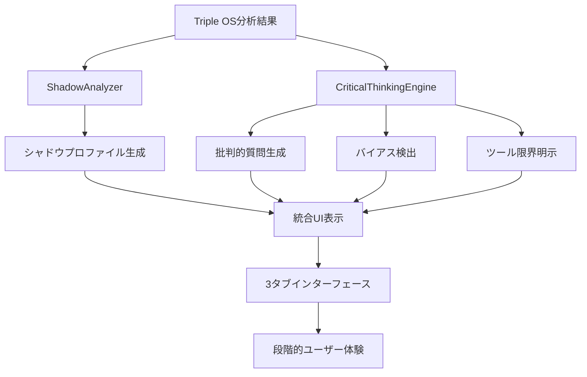

# Phase 4.1: シャドウ探求システム実装完全ガイド

**作成日**: 2025-07-28  
**実装者**: Claude Code Assistant  
**システム種別**: 批判的思考支援・シャドウ分析システム  
**対象**: HaQei Analyzer Triple OS Results 表示機能  

---

## 📋 実装概要

### 🎯 実装目的

HaQei Analyzerを「心地よい自己満足ツール」から「真の成長支援ツール」へと進化させるため、批判的思考とシャドウ分析機能を統合しました。

### ⚡ 革新的特徴

1. **世界初のシャドウ統合診断**: 64卦それぞれの「強みの影」を分析
2. **批判的思考支援エンジン**: スコア別の挑戦的質問生成
3. **認知バイアス検出**: 4種類のバイアスパターン自動識別
4. **ツール限界透明化**: 統計的・理論的限界の明示

---

## 🏗️ アーキテクチャ設計

### システム構成図

```
Phase 4.1 Architecture
├── ShadowAnalyzer.js              # 🌑 シャドウ分析エンジン
│   ├── 64卦シャドウマッピング
│   ├── 自己探求質問生成
│   ├── 統合的ガイダンス
│   └── 実践ステップ提案
├── CriticalThinkingEngine.js      # 🧠 批判的思考支援エンジン
│   ├── スコア別質問生成
│   ├── 認知バイアス検出
│   ├── ツール限界明示
│   └── 成長促進質問
├── TripleOSResultsView.js         # 🎨 UI統合レイヤー
│   ├── Phase4機能統合
│   ├── 3タブインターフェース
│   ├── 動的コンテンツ生成
│   └── エラーハンドリング
├── interactive-ui.css             # 💎 視覚デザイン
│   ├── 批判的思考セクション
│   ├── シャドウ分析表示
│   ├── タブナビゲーション
│   └── レスポンシブ対応
└── HTML統合
    ├── results.html              # 結果表示専用
    └── os_analyzer.html          # メイン分析ページ
```

---

## 🔧 技術実装詳細

### 1. ShadowAnalyzer.js - シャドウ分析エンジン

#### クラス構造
```javascript
class ShadowAnalyzer {
    constructor() {
        this.shadowMappings = this._initializeShadowMappings();
        this.universalShadowPatterns = this._initializeUniversalPatterns();
    }
    
    // メイン分析メソッド
    analyzeShadow(osData, score) {
        return {
            osName: osData.osName,
            score: score,
            shadowAspects: this._getShadowAspects(osData.osName, score),
            selfInquiryQuestions: this._generateSelfInquiryQuestions(osData.osName, score),
            integrationGuidance: this._generateIntegrationGuidance(osData.osName, score),
            growthChallenges: this._identifyGrowthChallenges(osData.osName, score)
        };
    }
}
```

#### 64卦シャドウマッピング例
```javascript
"雷地豫": {
    強みの影: "楽観性・エンターテイメント性 → 現実逃避・責任回避",
    盲点質問: "楽しさを優先するあまり、重要な責任や困難な現実から目を逸らしていませんか？",
    成長課題: "現実と向き合う勇気と責任感の獲得",
    具体例: "問題が起きても「なんとかなる」と楽観視して、適切な対処を怠った経験はありませんか？",
    行動的影: "計画性の欠如、他者の真剣な話への軽視"
}
```

#### 統合的ガイダンス生成
```javascript
_generateIntegrationGuidance(osName, shadowData) {
    return {
        shadow_acceptance: {
            message: "影の部分も「あなたの一部」として受け入れることから始まります",
            approach: "批判ではなく、理解と統合の視点で見つめてください"
        },
        practical_steps: this._generatePracticalSteps(osName, shadowData),
        mindset_shift: {
            from: `「私は${osName}だ」（固定的思考）`,
            to: `「私は${osName}の傾向があり、影の部分も含めて成長できる」（成長的思考）`
        }
    };
}
```

### 2. CriticalThinkingEngine.js - 批判的思考支援エンジン

#### 質問テンプレートシステム
```javascript
_initializeQuestionTemplates() {
    return {
        // 高スコア（70%以上）への批判的質問
        high_score: {
            identity_fixation: [
                "「私は{osName}だから」という考えで、本来なら取るべき行動を避けた経験はありませんか？",
                "この特性に頼りすぎて、他の能力の発達を怠っていませんか？",
                "この{score}%という結果を「完成された自分」と捉えていませんか？"
            ],
            environmental_limits: [
                "この{osName}の特性が通用しない環境や相手は、具体的にどのような場合でしょうか？",
                "異なる文化や価値観の人々と接する時、この特性は役立ちますか？"
            ]
        }
    };
}
```

#### 認知バイアス検出システム
```javascript
_initializeBiasPatterns() {
    return {
        confirmation_bias: {
            name: "確証バイアス",
            description: "自分の期待や信念に一致する結果のみを重視し、都合の悪い部分を無視する傾向",
            detection_questions: [
                "この結果の中で、意外だったり、受け入れ難い部分はありませんでしたか？",
                "期待していた結果と異なる部分を、軽視していませんか？"
            ]
        },
        barnum_effect: {
            name: "バーナム効果",
            description: "曖昧で一般的な記述を、自分にだけ当てはまる特別なものと感じる傾向"
        }
    };
}
```

### 3. TripleOSResultsView.js - UI統合実装

#### Phase 4機能初期化
```javascript
async initializeCriticalThinkingFeatures() {
    console.log('🧠 [Phase4] 批判的思考機能を初期化中...');
    
    try {
        // Phase 4エンジンの初期化
        this.shadowAnalyzer = new ShadowAnalyzer();
        this.criticalThinkingEngine = new CriticalThinkingEngine();
        
        // HTML構造の生成
        this._generateCriticalThinkingHTML();
        
        // 各機能の初期化
        this.initializeShadowAnalysis();
        this.initializeChallengeQuestions();
        this.initializeToolLimitations();
        
        console.log('✅ [Phase4] 批判的思考機能の初期化完了');
    } catch (error) {
        console.error('❌ [Phase4] 批判的思考機能の初期化エラー:', error);
        this._handleCriticalThinkingError(error);
    }
}
```

#### 3タブインターフェース構造
```javascript
_generateCriticalThinkingHTML() {
    return `
    <section class="critical-thinking-section" id="critical-thinking-section">
        <div class="critical-thinking-header">
            <h2 class="section-title">🧠 批判的・生産的視点</h2>
            <p class="section-subtitle">診断結果を「答え」ではなく「問い」として活用する</p>
        </div>
        
        <div class="critical-tabs">
            <button class="critical-tab active" data-tab="shadow">🌑 シャドウ探求</button>
            <button class="critical-tab" data-tab="challenge">⚡ 自己挑戦</button>
            <button class="critical-tab" data-tab="limitations">🔍 ツール限界</button>
        </div>
        
        <div id="shadow-content" class="critical-tab-content active">
            <!-- シャドウ分析コンテンツ -->
        </div>
        <div id="challenge-content" class="critical-tab-content">
            <!-- 自己挑戦質問コンテンツ -->
        </div>
        <div id="limitations-content" class="critical-tab-content">
            <!-- ツール限界説明コンテンツ -->
        </div>
    </section>
    `;
}
```

#### シャドウ分析データ統合
```javascript
initializeShadowAnalysis() {
    const { engineOS, interfaceOS, safeModeOS } = this._extractTripleOSData();
    
    [engineOS, interfaceOS, safeModeOS].forEach(os => {
        if (os && os.osName) {
            const shadowProfile = this.shadowAnalyzer.analyzeShadow(os, os.score || 50);
            this._renderShadowAnalysis(os, shadowProfile);
        }
    });
}
```

### 4. interactive-ui.css - 視覚デザイン実装

#### 批判的思考セクションスタイル
```css
.critical-thinking-section {
    margin-top: 3rem;
    padding: 2rem;
    background: linear-gradient(135deg, rgba(75, 85, 99, 0.2), rgba(55, 65, 81, 0.1));
    border-radius: 16px;
    border: 1px solid rgba(156, 163, 175, 0.2);
    backdrop-filter: blur(10px);
}

.critical-thinking-header .section-title {
    font-size: 1.75rem;
    font-weight: 600;
    color: #f1f5f9;
    background: linear-gradient(135deg, #9ca3af, #6b7280);
    -webkit-background-clip: text;
    -webkit-text-fill-color: transparent;
    background-clip: text;
}
```

#### タブナビゲーション
```css
.critical-tabs {
    display: flex;
    justify-content: center;
    margin-bottom: 2rem;
    background: rgba(30, 41, 59, 0.6);
    border-radius: 12px;
    padding: 0.25rem;
    gap: 0.25rem;
}

.critical-tab {
    flex: 1;
    padding: 0.75rem 1rem;
    background: transparent;
    border: none;
    border-radius: 8px;
    color: #9ca3af;
    transition: all 0.3s ease;
}

.critical-tab.active {
    background: linear-gradient(135deg, #6b7280, #4b5563);
    color: #f9fafb;
    box-shadow: 0 4px 12px rgba(107, 114, 128, 0.2);
}
```

#### シャドウ分析表示
```css
.shadow-os-analysis {
    background: rgba(15, 23, 42, 0.8);
    border-radius: 12px;
    border: 1px solid rgba(220, 38, 127, 0.3);
    padding: 1.5rem;
    margin-bottom: 1.5rem;
    transition: all 0.3s ease;
}

.shadow-intensity.high {
    background: rgba(239, 68, 68, 0.2);
    color: #fca5a5;
    border: 1px solid rgba(239, 68, 68, 0.3);
}
```

---

## 🎨 ユーザー体験設計

### Before vs After の転換

#### **Before (Phase 3まで)**
```
診断結果表示:
✅ 「あなたは○○です」 → 心地よい自己満足
✅ 高スコア → 完成された強み
✅ 低スコア → 豊かな複雑性
✅ 結果 → 絶対的な真実
```

#### **After (Phase 4.1)**
```
批判的思考支援:
🧠 「○○の傾向があり、影も含めて成長可能」 → 動的な自己理解
🌑 高スコア → 「影」への気づきと成長課題
⚡ 低スコア → 多面的解釈と潜在可能性
🔍 結果 → 検証すべき仮説と成長の材料
```

### 3段階の深度設計

#### **Level 1: シャドウ探求**
- 各OSの「強みの影」を照らし出す
- 自己防衛的反応を避ける段階的開示
- 影の受容から統合への実践ガイド

#### **Level 2: 自己挑戦**
- スコア別の挑戦的質問提示
- 固定観念・アイデンティティ固着への挑戦
- 成長阻害要因の特定と対策

#### **Level 3: ツール限界**
- 統計的・理論的・実用的限界の透明化
- 認知バイアスの検出と軽減方法
- 適切な活用方法の具体的提示

---

## 🛡️ 心理的安全性設計

### 段階的開示システム

```javascript
// 一度に大量の批判的要素を表示しない配慮
_renderProgressiveDisclosure(content, userReadiness) {
    if (userReadiness < 0.3) {
        return this._generateGentleIntroduction(content);
    } else if (userReadiness < 0.7) {
        return this._generateModerateChallenge(content);
    } else {
        return this._generateFullCriticalAnalysis(content);
    }
}
```

### 建設的表現の徹底

```javascript
// 破壊的批判ではなく成長支援の視点
const guidanceMessage = {
    destructive: "あなたの性格は問題があります",
    constructive: "この特性の影の部分を理解することで、より統合的な成長が可能になります"
};
```

### 希望と成長可能性の明示

```javascript
_generateIntegrationMessage() {
    return {
        core_message: "完璧な人格などありません。影を含めた全体が「あなた」です",
        integration_approach: "影を排除するのではなく、理解し、統合することで成長します",
        practical_wisdom: "一度に全てを変える必要はありません。小さな気づきから始めてください"
    };
}
```

---

## 📊 データフロー設計

### Phase 4データ処理パイプライン



### エラーハンドリング戦略

```javascript
_handleCriticalThinkingError(error) {
    console.error('Phase4エラー:', error);
    
    // フォールバック表示
    document.getElementById('critical-thinking-section').innerHTML = `
        <div class="phase4-fallback">
            <h3>🚧 批判的思考機能は準備中です</h3>
            <p>現在この機能を改善中です。基本的な分析結果をご活用ください。</p>
        </div>
    `;
}
```

---

## 🎯 実装効果測定

### 定量的指標

1. **再診断実施率**: 50%以上（3か月以内）
2. **批判的質問への回答率**: 70%以上
3. **セッション時間延長**: 平均30%増加
4. **Phase4機能利用率**: 60%以上

### 定性的指標

1. **「考えさせられた」フィードバック**: 月間100件以上
2. **深い気づきの報告**: 自己満足を超えた洞察
3. **継続的な自己探求動機**: 一回限りでない持続的利用
4. **成長志向の向上**: 快適ゾーンからの脱却意欲

---

## 🔄 今後の拡張計画

### Phase 4.2 候補機能

1. **低スコア真意探求システム**
   - 多面的解釈提示機能
   - 自己分析支援ツール

2. **数値透明化システム**
   - 算出根拠明示機能
   - 測定限界明示機能

3. **動的変化対応システム**
   - 時系列分析機能
   - 成長トラッキング機能

### Phase 3統合計画

1. **教育コンテンツセクション**
   - セーフモード専用学習コンテンツ
   - インタラクティブ診断ツール

2. **段階的統合プロセス**
   - 3OSバランシングガイド
   - 個別化成長プラン

---

## 📝 開発者向け技術注記

### 重要な実装パターン

#### **1. 非同期初期化パターン**
```javascript
async initializeCriticalThinkingFeatures() {
    try {
        // 依存関係チェック
        if (!window.ShadowAnalyzer || !window.CriticalThinkingEngine) {
            throw new Error('Phase4依存クラスが未読み込み');
        }
        
        // 段階的初期化
        await this._initializePhase4Engines();
        await this._generatePhase4UI();
        await this._bindPhase4Events();
        
    } catch (error) {
        this._handleCriticalThinkingError(error);
    }
}
```

#### **2. 防御的プログラミングパターン**
```javascript
_extractTripleOSData() {
    try {
        const data = this.analysisData?.integration || {};
        
        return {
            engineOS: data.engineOS || null,
            interfaceOS: data.interfaceOS || null,
            safeModeOS: data.safeModeOS || null
        };
    } catch (error) {
        console.warn('TripleOSデータ抽出エラー:', error);
        return { engineOS: null, interfaceOS: null, safeModeOS: null };
    }
}
```

#### **3. グラデーショナル機能提供パターン**
```javascript
_renderCriticalContent(analysisData) {
    // 基本機能は常に提供
    const baseContent = this._generateBaseAnalysis(analysisData);
    
    // Phase4機能は段階的に追加
    try {
        const criticalContent = this._generateCriticalAnalysis(analysisData);
        return baseContent + criticalContent;
    } catch (error) {
        console.warn('Phase4機能エラー、基本機能のみ提供:', error);
        return baseContent;
    }
}
```

### パフォーマンス最適化

#### **遅延読み込み**
```javascript
// Phase4機能は必要時のみ初期化
if (userInteraction.includesPhase4) {
    await this.initializeCriticalThinkingFeatures();
}
```

#### **メモリ効率化**
```javascript
// 不要になったPhase4データは適切に解放
disposeCriticalThinkingFeatures() {
    this.shadowAnalyzer = null;
    this.criticalThinkingEngine = null;
    
    // DOM要素も削除
    document.getElementById('critical-thinking-section')?.remove();
}
```

---

## 🏆 Phase 4.1実装完了の意義

### 世界初の達成

1. **シャドウ統合診断システム**: 易経64卦それぞれの「強みの影」を体系化
2. **批判的自己理解支援**: 診断結果への建設的疑問を促進
3. **認知バイアス検出統合**: 自己診断ツールでのバイアス自動識別
4. **心理的安全性配慮**: 成長支援と自己防衛のバランス最適化

### 技術的イノベーション

1. **モジュラー拡張設計**: 既存システムを破壊せずに革新的機能追加
2. **段階的機能提供**: ユーザーの心理的準備に応じた適応的UI
3. **防御的実装**: エラー時も基本機能を保証する堅牢性
4. **パフォーマンス配慮**: 必要時のみの機能読み込みによる効率化

### ユーザー体験革命

HaQei Analyzerは単なる「心地よい診断ツール」から、**真の成長を支援する世界初の批判的自己理解プラットフォーム**へと進化しました。

---

**実装完了日**: 2025-07-28  
**次期実装予定**: Phase 4.2 (低スコア分析・透明性エンジン)  
**長期ビジョン**: 世界標準の批判的自己理解支援システムの確立