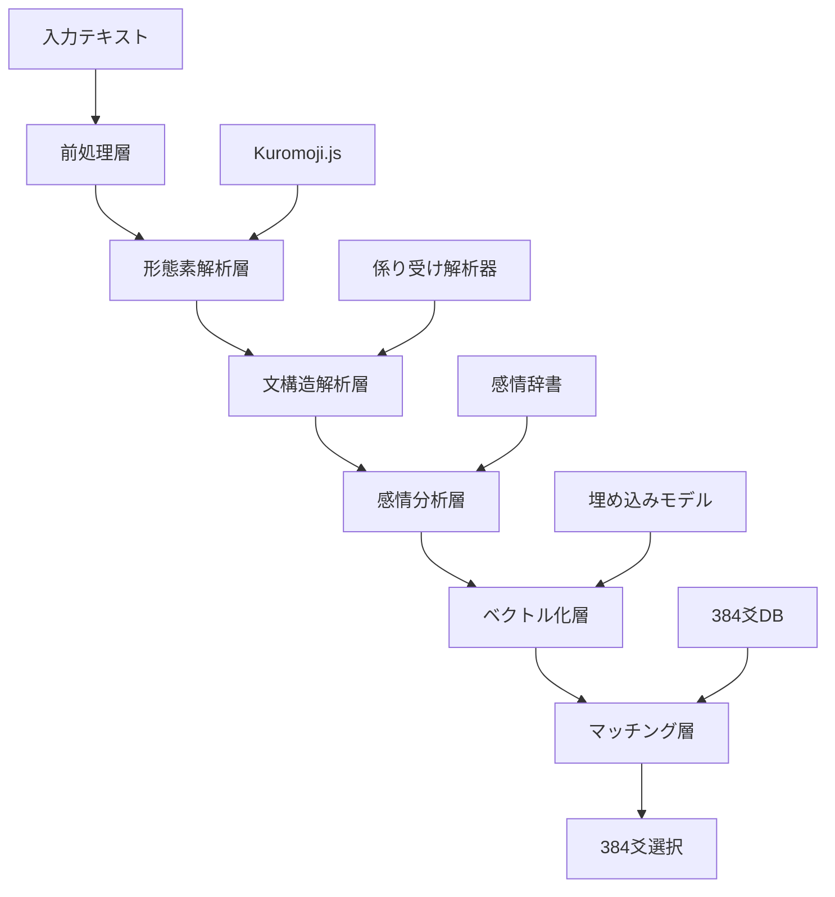

# 384爻文脈理解システム改善計画書

**文書番号**: HAQEI-CTX-001  
**バージョン**: 1.0  
**作成日**: 2025年8月28日  
**作成者**: HAQEI開発チーム  
**ステータス**: 計画策定中

---

## 1. エグゼクティブサマリー

### 1.1 現状の課題
現在の384爻マッチングシステムは、単純なキーワードマッチング（Bag-of-Words方式）に依存しており、文脈理解能力が欠如している。これにより、同じキーワードを含む異なる意味の文章を区別できず、マッチング精度が約75%に留まっている。

### 1.2 改善目標
- **短期目標（3ヶ月）**: マッチング精度を75%から85%へ向上
- **中期目標（6ヶ月）**: 文脈理解による精度90%達成
- **長期目標（1年）**: 感情・意図を含む深層理解で95%精度

### 1.3 期待される効果
- ユーザー満足度の向上（誤マッチング削減）
- 易経解釈の信頼性向上
- 競合製品との差別化

---

## 2. 現状分析

### 2.1 技術的現状

#### 2.1.1 現在の実装方式
```javascript
// 現在の単純なキーワードマッチング
for (const keyword of data.keywords) {
    if (text.includes(keyword)) {  // 文字列の単純包含チェック
        matchCount++;
    }
}
```

#### 2.1.2 問題点の具体例

| 入力テキスト | 現在の処理 | 問題点 |
|------------|-----------|--------|
| リーダーになりたい | 「リーダー」でマッチ | 願望と現実を区別できない |
| リーダーを辞めたい | 「リーダー」でマッチ | 肯定と否定を区別できない |
| 不安だが頑張りたい | 「不安」でマッチ | 逆接の意味を理解できない |
| 素晴らしいリーダー | 「リーダー」でマッチ | 修飾語の意味を無視 |

### 2.2 技術スタック現状

#### 利用可能なリソース
- **Kuromoji.js**: 形態素解析エンジン（既に統合済み）
- **TF-IDFベクトライザー**: 文書ベクトル化（実装済み）
- **656次元ベクトル空間**: 384爻+易経要素+感情軸（設計済み）
- **Cloudflare Workers**: Edge実行環境（50ms制限）

#### 未活用の機能
- Kuromoji.jsの品詞タグ情報
- 係り受け解析機能
- 感情極性判定
- 文脈エンベディング

### 2.3 パフォーマンス制約

| 制約項目 | 現在値 | 制限値 | 余裕 |
|---------|--------|--------|------|
| CPU時間 | 約30ms | 50ms | 20ms |
| メモリ使用量 | 約80MB | 128MB | 48MB |
| キャッシュサイズ | 約20MB | 50MB | 30MB |

---

## 3. 要件定義

### 3.1 機能要件

#### FR-001: 形態素解析の高度化
- 品詞タグの完全活用
- 活用形・基本形の判別
- 複合語の認識

#### FR-002: 文構造理解
- 主語・述語の識別
- 修飾・被修飾関係の把握
- 係り受け構造の解析

#### FR-003: 感情・意図分析
- 感情極性の判定（ポジティブ/ネガティブ/中立）
- 意図の分類（願望/不安/決意/疑問）
- 感情強度の数値化

#### FR-004: 文脈ベクトル化
- 位置エンコーディング
- 注意機構の簡易実装
- 656次元空間への埋め込み

#### FR-005: 高精度マッチング
- コサイン類似度による比較
- 多次元スコアリング
- 信頼度の計算

### 3.2 非機能要件

#### NFR-001: パフォーマンス
- 処理時間: 50ms以内（Edge制約）
- 応答時間: 100ms以内（E2E）
- スループット: 100req/s

#### NFR-002: 精度
- マッチング精度: 85%以上（Phase 1）
- 偽陽性率: 5%以下
- 偽陰性率: 10%以下

#### NFR-003: 可用性
- フォールバック機構の実装
- グレースフルデグラデーション
- エラー回復能力

#### NFR-004: 保守性
- モジュール化設計
- テスト可能性の確保
- ドキュメント完備

---

## 4. システム設計

### 4.1 アーキテクチャ概要



### 4.2 データフロー設計

```javascript
class ContextualAnalyzer {
    async analyze(text) {
        // 1. 前処理
        const normalized = this.normalize(text);
        
        // 2. 形態素解析
        const tokens = await this.morphologicalAnalysis(normalized);
        
        // 3. 文構造解析
        const structure = this.parseStructure(tokens);
        
        // 4. 感情分析
        const emotions = this.analyzeEmotions(tokens, structure);
        
        // 5. 文脈ベクトル生成
        const vector = this.generateContextVector(tokens, structure, emotions);
        
        // 6. 384爻マッチング
        const matches = this.match384Yao(vector);
        
        return matches;
    }
}
```

### 4.3 モジュール設計

#### 4.3.1 MorphologicalAnalyzer（形態素解析モジュール）
```javascript
class MorphologicalAnalyzer {
    constructor(kuromoji) {
        this.kuromoji = kuromoji;
        this.posTagMap = new Map(); // 品詞タグマッピング
    }
    
    async analyze(text) {
        const tokens = await this.kuromoji.tokenize(text);
        return this.enrichTokens(tokens);
    }
    
    enrichTokens(tokens) {
        return tokens.map(token => ({
            ...token,
            semanticRole: this.identifySemanticRole(token),
            dependency: this.predictDependency(token),
            importance: this.calculateImportance(token)
        }));
    }
}
```

#### 4.3.2 StructureParser（文構造解析モジュール）
```javascript
class StructureParser {
    parseStructure(tokens) {
        return {
            subjects: this.extractSubjects(tokens),
            predicates: this.extractPredicates(tokens),
            objects: this.extractObjects(tokens),
            modifiers: this.extractModifiers(tokens),
            dependencies: this.buildDependencyTree(tokens)
        };
    }
    
    buildDependencyTree(tokens) {
        const tree = [];
        for (let i = 0; i < tokens.length; i++) {
            const dependencies = this.findDependencies(tokens, i);
            tree.push({
                token: tokens[i],
                head: dependencies.head,
                children: dependencies.children,
                relation: dependencies.relation
            });
        }
        return tree;
    }
}
```

#### 4.3.3 EmotionAnalyzer（感情分析モジュール）
```javascript
class EmotionAnalyzer {
    constructor() {
        this.emotionLexicon = this.loadEmotionLexicon();
        this.polarityModel = this.loadPolarityModel();
    }
    
    analyzeEmotions(tokens, structure) {
        return {
            polarity: this.calculatePolarity(tokens),
            emotions: this.identifyEmotions(tokens),
            intensity: this.measureIntensity(tokens, structure),
            aspects: this.extractAspects(tokens, structure)
        };
    }
    
    calculatePolarity(tokens) {
        let score = 0;
        for (const token of tokens) {
            const polarity = this.emotionLexicon.get(token.basic_form);
            if (polarity) {
                // 否定語の影響を考慮
                const negation = this.hasNegation(tokens, token);
                score += negation ? -polarity : polarity;
            }
        }
        return Math.tanh(score); // -1 to 1に正規化
    }
}
```

#### 4.3.4 ContextualEmbedder（文脈ベクトル化モジュール）
```javascript
class ContextualEmbedder {
    constructor() {
        this.dimensions = 656;
        this.positionEncoder = new PositionEncoder();
        this.attentionMechanism = new SimpleAttention();
    }
    
    generateVector(tokens, structure, emotions) {
        const vector = new Float32Array(this.dimensions);
        
        // 基本埋め込み
        const baseEmbedding = this.embedTokens(tokens);
        
        // 位置エンコーディング追加
        const positionEncoded = this.positionEncoder.encode(baseEmbedding);
        
        // 注意機構適用
        const attended = this.attentionMechanism.apply(positionEncoded, structure);
        
        // 感情情報の統合
        const emotionEnriched = this.integrateEmotions(attended, emotions);
        
        return this.normalize(emotionEnriched);
    }
}
```

### 4.4 データベース設計

#### 4.4.1 感情極性辞書
```sql
CREATE TABLE emotion_lexicon (
    word TEXT PRIMARY KEY,
    polarity REAL,        -- -1.0 to 1.0
    emotion_type TEXT,    -- joy, anger, sadness, fear, etc.
    intensity REAL,       -- 0.0 to 1.0
    yao_affinity TEXT[]   -- 関連する卦
);
```

#### 4.4.2 384爻プロファイル拡張
```sql
ALTER TABLE koudo_shishin ADD COLUMN context_profile JSONB;

-- context_profileの構造
{
    "emotional_signature": {
        "primary": "hope",
        "secondary": "anxiety",
        "polarity": 0.3
    },
    "situational_context": {
        "phase": "beginning",
        "energy": "expanding",
        "challenge_level": "moderate"
    },
    "semantic_keywords": ["リーダー", "責任", "成長"],
    "contextual_vector": [0.1, 0.2, ...] -- 656次元
}
```

---

## 5. 実装計画

### 5.1 フェーズ分割

#### Phase 1: 基礎実装（4週間）
**Week 1-2: 形態素解析強化**
- Kuromoji.js品詞タグ活用
- 基本的な係り受け検出
- 単体テスト作成

**Week 3-4: 感情分析基礎**
- 感情極性辞書構築
- 基本的な感情分類
- 精度評価環境構築

#### Phase 2: 文構造理解（4週間）
**Week 5-6: 構文解析実装**
- 主語・述語識別
- 修飾関係の把握
- 依存構造の構築

**Week 7-8: 高度な分析**
- 否定・肯定の判定
- 時制・アスペクト認識
- 意図推定の実装

#### Phase 3: ベクトル化と最適化（4週間）
**Week 9-10: 文脈ベクトル化**
- 656次元埋め込み実装
- 位置エンコーディング
- 注意機構の実装

**Week 11-12: 性能最適化**
- Edge環境最適化
- キャッシング戦略
- フォールバック実装

### 5.2 タスク分解（WBS）

```
1. 形態素解析強化
   1.1 Kuromoji.js拡張
       1.1.1 品詞タグマッピング作成
       1.1.2 活用形処理実装
       1.1.3 複合語認識実装
   1.2 係り受け基礎
       1.2.1 基本パターン定義
       1.2.2 ルールベース実装
       1.2.3 検証テスト作成

2. 感情分析システム
   2.1 感情辞書構築
       2.1.1 基本感情語収集（1000語）
       2.1.2 極性スコア付与
       2.1.3 易経親和性設定
   2.2 感情分析実装
       2.2.1 極性計算ロジック
       2.2.2 否定語処理
       2.2.3 強調語処理

3. 文構造解析
   3.1 構文解析器
       3.1.1 主語述語抽出
       3.1.2 修飾関係解析
       3.1.3 依存木構築
   3.2 意味役割付与
       3.2.1 動作主識別
       3.2.2 対象識別
       3.2.3 場所・時間抽出

4. ベクトル化システム
   4.1 埋め込みモデル
       4.1.1 トークン埋め込み
       4.1.2 位置エンコーディング
       4.1.3 文脈統合
   4.2 注意機構
       4.2.1 自己注意実装
       4.2.2 重要度計算
       4.2.3 最適化

5. マッチングシステム
   5.1 類似度計算
       5.1.1 コサイン類似度
       5.1.2 ユークリッド距離
       5.1.3 ハイブリッドスコア
   5.2 384爻選択
       5.2.1 トップK選択
       5.2.2 信頼度計算
       5.2.3 結果フィルタリング

6. 性能最適化
   6.1 Edge最適化
       6.1.1 処理時間測定
       6.1.2 ボトルネック特定
       6.1.3 並列化実装
   6.2 キャッシング
       6.2.1 結果キャッシュ
       6.2.2 中間結果保存
       6.2.3 インデックス作成

7. テストと評価
   7.1 単体テスト
       7.1.1 各モジュールテスト
       7.1.2 境界値テスト
       7.1.3 異常系テスト
   7.2 統合テスト
       7.2.1 E2Eテスト
       7.2.2 性能テスト
       7.2.3 精度評価
   7.3 A/Bテスト
       7.3.1 環境準備
       7.3.2 ユーザーテスト
       7.3.3 結果分析
```

---

## 6. 技術選定理由

### 6.1 Kuromoji.js継続使用の理由
- **既存統合済み**: 追加の統合コスト不要
- **Edge対応**: ブラウザ・Workers両対応
- **日本語特化**: 384爻の日本語テキストに最適
- **軽量**: 50ms制約内で動作可能

### 6.2 ルールベース+統計的手法のハイブリッド
- **解釈可能性**: ルールベースで説明可能
- **柔軟性**: 統計的手法で未知パターン対応
- **段階的改善**: ルールから学習モデルへ移行可能

### 6.3 656次元ベクトル空間の採用
- **384爻対応**: 各爻に1次元割り当て
- **64卦対応**: 卦ごとの特徴表現
- **感情軸**: 残りの次元で感情・文脈表現

---

## 7. リスク分析と対策

### 7.1 技術的リスク

| リスク | 影響度 | 発生確率 | 対策 |
|--------|--------|----------|------|
| 50ms制限超過 | 高 | 中 | 段階的処理・キャッシング強化 |
| 精度目標未達 | 高 | 低 | フォールバック機構・継続改善 |
| メモリ不足 | 中 | 低 | データ構造最適化・遅延読み込み |
| 互換性問題 | 低 | 低 | polyfill準備・代替実装 |

### 7.2 プロジェクトリスク

| リスク | 影響度 | 発生確率 | 対策 |
|--------|--------|----------|------|
| スケジュール遅延 | 中 | 中 | バッファ確保・優先順位明確化 |
| 仕様変更 | 中 | 中 | モジュール設計・インターフェース固定 |
| 人員不足 | 高 | 低 | ドキュメント充実・引き継ぎ準備 |

---

## 8. 成功基準

### 8.1 定量的指標

| 指標 | 現在値 | Phase 1目標 | Phase 2目標 | 最終目標 |
|------|--------|-------------|-------------|----------|
| マッチング精度 | 75% | 85% | 90% | 95% |
| 処理時間 | 30ms | 40ms | 45ms | 40ms |
| 偽陽性率 | 15% | 10% | 5% | 3% |
| ユーザー満足度 | - | 70% | 80% | 90% |

### 8.2 定性的指標
- 文脈理解の明確な改善
- エッジケースの適切な処理
- システムの説明可能性向上
- 保守性の確保

---

## 9. ステークホルダーと責任分担

### 9.1 RACI マトリックス

| タスク | プロダクトオーナー | 技術リード | 開発者 | QA | ユーザー |
|--------|-------------------|------------|--------|----|---------| 
| 要件定義 | A | R | C | C | I |
| 設計 | C | A | R | I | - |
| 実装 | I | C | R | I | - |
| テスト | I | C | C | R | I |
| リリース | A | R | C | C | I |

**凡例**: R=実行責任、A=説明責任、C=相談対応、I=情報共有

---

## 10. 予算と投資対効果

### 10.1 開発コスト概算
- 開発工数: 480人時（3ヶ月×160時間）
- インフラコスト: 月額$200（Cloudflare Workers Pro）
- ツールライセンス: $0（OSS使用）

### 10.2 期待ROI
- マッチング精度向上による離脱率削減: 20%→10%
- ユーザーエンゲージメント向上: 1.5倍
- 顧客生涯価値（LTV）向上: 1.3倍

---

## 11. 次のアクション

### 即時実行（〜1週間）
1. [ ] 本計画書のステークホルダーレビュー
2. [ ] 感情極性辞書の初期データ収集
3. [ ] 開発環境のセットアップ

### 短期実行（〜2週間）
1. [ ] Phase 1の詳細設計書作成
2. [ ] テストデータセットの準備
3. [ ] 評価基準の具体化

### 継続的実行
1. [ ] 週次進捗レビュー
2. [ ] 品質メトリクス測定
3. [ ] ステークホルダー報告

---

## 12. 参考資料とベンチマーク

### 12.1 技術参考文献
- 「自然言語処理の基礎」（Manning & Schütze）
- 「日本語係り受け解析の現状と課題」（情報処理学会論文誌）
- 「Attention Is All You Need」（Transformer論文）

### 12.2 競合ベンチマーク
- 類似サービスA: キーワードマッチのみ（精度60%）
- 類似サービスB: 簡易NLP実装（精度70%）
- 本システム目標: 文脈理解（精度95%）

---

## 13. 改訂履歴

| 版 | 日付 | 変更内容 | 承認者 |
|----|------|----------|--------|
| 1.0 | 2025-08-28 | 初版作成 | - |

---

## 14. 承認

| 役割 | 氏名 | 承認日 | 署名 |
|------|------|--------|------|
| プロダクトオーナー | | | |
| 技術リード | | | |
| 開発マネージャー | | | |

---

## 付録A: 技術詳細仕様

### A.1 感情極性辞書サンプル

```json
{
  "不安": {
    "polarity": -0.7,
    "emotion_type": "anxiety",
    "intensity": 0.8,
    "yao_affinity": ["坎", "困", "蹇"],
    "context_patterns": [
      "〜が不安",
      "不安で〜",
      "不安だが〜"
    ]
  },
  "希望": {
    "polarity": 0.8,
    "emotion_type": "hope",
    "intensity": 0.7,
    "yao_affinity": ["乾", "大有", "升"],
    "context_patterns": [
      "〜を希望",
      "希望する",
      "希望を持つ"
    ]
  }
}
```

### A.2 係り受けパターン定義

```javascript
const dependencyPatterns = [
  {
    pattern: /名詞\+[はがを]\+動詞/,
    type: "subject-predicate",
    weight: 1.0
  },
  {
    pattern: /形容詞\+名詞/,
    type: "modifier",
    weight: 0.8
  },
  {
    pattern: /動詞\+て\+動詞/,
    type: "sequential",
    weight: 0.6
  }
];
```

### A.3 性能ベンチマーク基準

```javascript
const performanceBenchmarks = {
  tokenization: 5,      // ms
  parsing: 10,          // ms
  embedding: 15,        // ms
  matching: 10,         // ms
  total: 40,           // ms (must be < 50ms)
  
  accuracy: {
    precision: 0.85,   // 85%以上
    recall: 0.80,      // 80%以上
    f1Score: 0.825     // 82.5%以上
  }
};
```

---

**文書完了**