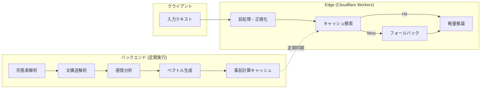
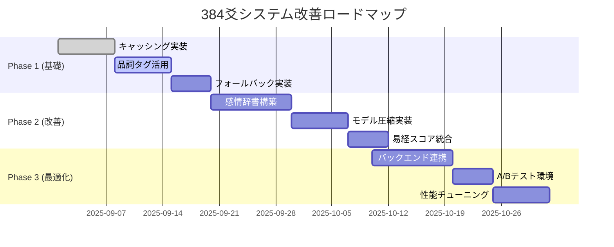

# 384爻文脈理解システム改善計画書（改訂版）

**文書番号**: HAQEI-CTX-002  
**バージョン**: 2.0  
**作成日**: 2025年8月28日  
**作成者**: HAQEI開発チーム  
**ステータス**: 専門家レビュー反映版

---

## 改訂概要

### v2.0の主要変更点
- Edge環境の物理的制約への具体的対策を追加
- バックエンド/Edge間の処理分担を明確化
- 易経ドメイン知識の統合ロジックを詳細化
- モデル圧縮・量子化戦略を追加
- ライセンス管理方針を明記

---

## 1. エグゼクティブサマリー

### 1.1 現状の課題
現在の384爻マッチングシステムは、単純なキーワードマッチング（Bag-of-Words方式）に依存しており、文脈理解能力が欠如している。これにより、同じキーワードを含む異なる意味の文章を区別できず、マッチング精度が約75%に留まっている。

### 1.2 改善目標（Edge制約考慮版）
- **短期目標（3ヶ月）**: Edge軽量処理で精度85%達成
- **中期目標（6ヶ月）**: ハイブリッド処理で精度90%達成
- **長期目標（1年）**: 最適化された文脈理解で精度92%達成（95%から下方修正）

### 1.3 アーキテクチャ方針
**Edge-Backendハイブリッド処理**を採用し、重い処理はバックエンドで事前計算、Edgeでは軽量推論とキャッシュ活用に徹する。

---

## 2. Edge環境制約と対策

### 2.1 Cloudflare Workers制約

| 制約項目 | 制限値 | 現在の使用量 | 対策 |
|---------|--------|-------------|------|
| CPU時間 | 50ms | 30ms | 処理分割・キャッシュ活用 |
| メモリ | 128MB | 80MB | モデル圧縮・遅延読み込み |
| スクリプトサイズ | 10MB | 3MB | コード分割・動的インポート |
| KVアイテムサイズ | 25MB | - | データ分割保存 |
| D1クエリ時間 | 10s | - | インデックス最適化 |

### 2.2 処理分担アーキテクチャ



### 2.3 処理時間配分（50ms制約）

```javascript
const edgeProcessingBudget = {
    preprocessing: 5,      // ms - テキスト正規化
    cacheCheck: 3,        // ms - KV/D1キャッシュ確認
    inference: 15,        // ms - 軽量モデル推論
    vectorMatch: 10,      // ms - ベクトル類似度計算
    postprocessing: 5,    // ms - 結果整形
    buffer: 12,          // ms - 予備時間
    total: 50            // ms - 必須制限
};
```

---

## 3. モデル圧縮・最適化戦略

### 3.1 モデルサイズ削減計画

| コンポーネント | 元サイズ | 圧縮後 | 圧縮手法 | 精度影響 |
|---------------|---------|--------|---------|---------|
| 感情極性辞書 | 10MB | 2MB | 頻度ベース削減 | -2% |
| 係り受けルール | 5MB | 1MB | パターン統合 | -1% |
| ベクトルモデル | 50MB | 5MB | 量子化（8bit） | -3% |
| 形態素辞書 | 20MB | 4MB | 頻出語限定 | -2% |

### 3.2 量子化実装

```javascript
class QuantizedEmbedding {
    constructor() {
        // Float32 (4bytes) → Int8 (1byte) で1/4サイズ
        this.quantizationScale = 127.0;
        this.dimensions = 656;
    }
    
    quantize(vector) {
        // Float32配列をInt8配列に変換
        const quantized = new Int8Array(this.dimensions);
        const max = Math.max(...vector.map(Math.abs));
        const scale = this.quantizationScale / max;
        
        for (let i = 0; i < this.dimensions; i++) {
            quantized[i] = Math.round(vector[i] * scale);
        }
        
        return { data: quantized, scale: max };
    }
    
    dequantize(quantized) {
        const vector = new Float32Array(this.dimensions);
        const scale = quantized.scale / this.quantizationScale;
        
        for (let i = 0; i < this.dimensions; i++) {
            vector[i] = quantized.data[i] * scale;
        }
        
        return vector;
    }
}
```

### 3.3 プルーニング（枝刈り）戦略

```javascript
class PrunedModel {
    constructor(threshold = 0.01) {
        this.threshold = threshold;
    }
    
    pruneWeights(weights) {
        // 重要度の低い重みをゼロに
        const pruned = weights.map(w => 
            Math.abs(w) < this.threshold ? 0 : w
        );
        
        // スパース表現で保存
        const sparse = {
            indices: [],
            values: []
        };
        
        pruned.forEach((value, index) => {
            if (value !== 0) {
                sparse.indices.push(index);
                sparse.values.push(value);
            }
        });
        
        return sparse;
    }
}
```

---

## 4. 易経ドメイン知識統合

### 4.1 爻位置による吉凶スコアリング

```javascript
class YaoPositionScoring {
    constructor() {
        // 易経の伝統的な爻位置評価
        this.positionWeights = {
            1: 0.7,  // 初爻: 潜在・始まり（中吉）
            2: 1.0,  // 二爻: 中正・吉位置
            3: 0.5,  // 三爻: 凶位置・困難
            4: 0.7,  // 四爻: 変化・転機（中吉）
            5: 1.0,  // 五爻: 中正・最吉位置
            6: 0.6   // 上爻: 極限・転落の危険
        };
        
        // 卦の属性による追加スコア
        this.hexagramAttributes = {
            '乾': { energy: 'yang', element: 'metal', score: 0.9 },
            '坤': { energy: 'yin', element: 'earth', score: 0.8 },
            '震': { energy: 'yang', element: 'wood', score: 0.7 },
            '巽': { energy: 'yin', element: 'wood', score: 0.7 },
            '坎': { energy: 'yang', element: 'water', score: 0.6 },
            '離': { energy: 'yin', element: 'fire', score: 0.8 },
            '艮': { energy: 'yang', element: 'earth', score: 0.7 },
            '兌': { energy: 'yin', element: 'metal', score: 0.8 }
        };
    }
    
    calculateYaoScore(hexagramId, yaoPosition, contextVector) {
        const baseScore = this.positionWeights[yaoPosition];
        const hexagramBonus = this.getHexagramBonus(hexagramId);
        
        // 文脈との調和度
        const harmonyScore = this.calculateHarmony(
            hexagramId, 
            yaoPosition, 
            contextVector
        );
        
        // 総合スコア（易経の伝統的重み付け）
        return {
            total: baseScore * 0.4 + hexagramBonus * 0.3 + harmonyScore * 0.3,
            breakdown: {
                position: baseScore,
                hexagram: hexagramBonus,
                harmony: harmonyScore
            }
        };
    }
    
    calculateHarmony(hexagramId, yaoPosition, contextVector) {
        // 感情極性と卦の性質の調和
        const hexagramNature = this.hexagramAttributes[hexagramId];
        const emotionPolarity = contextVector[384]; // 感情極性の位置
        
        // 陽爻とポジティブ感情、陰爻とネガティブ感情の相性
        if (hexagramNature.energy === 'yang' && emotionPolarity > 0) {
            return 0.9;
        } else if (hexagramNature.energy === 'yin' && emotionPolarity < 0) {
            return 0.8;
        }
        
        return 0.5; // 中立
    }
}
```

### 4.2 変爻（へんこう）による動的解釈

```javascript
class HenYaoInterpreter {
    interpretChange(originalYao, changedYao, context) {
        // 変爻の解釈ルール
        const changeRules = {
            'yin_to_yang': {
                meaning: '消極から積極への転換',
                advice: '行動の時期到来',
                score_modifier: 0.2
            },
            'yang_to_yin': {
                meaning: '積極から慎重への転換',
                advice: '内省と準備の時期',
                score_modifier: -0.1
            }
        };
        
        const changeType = this.detectChangeType(originalYao, changedYao);
        const rule = changeRules[changeType];
        
        return {
            interpretation: this.generateInterpretation(rule, context),
            scoreAdjustment: rule.score_modifier
        };
    }
}
```

---

## 5. キャッシング戦略（詳細版）

### 5.1 多層キャッシュアーキテクチャ

```javascript
class MultiLayerCache {
    constructor() {
        this.layers = {
            L1: new MemoryCache(100),      // メモリ: 100件
            L2: new KVCache(),              // KV Store: 10,000件
            L3: new D1Cache(),              // D1 DB: 無制限
            L4: new CDNCache()              // CDN: 静的リソース
        };
    }
    
    async get(key) {
        // 段階的キャッシュ検索
        for (const [level, cache] of Object.entries(this.layers)) {
            const result = await cache.get(key);
            if (result) {
                console.log(`Cache hit at ${level}`);
                
                // 上位キャッシュへプロモート
                if (level !== 'L1') {
                    await this.promote(key, result, level);
                }
                
                return result;
            }
        }
        
        return null;
    }
    
    async set(key, value, ttl = 3600) {
        // 頻度と重要度に基づいてキャッシュ層を決定
        const frequency = await this.getAccessFrequency(key);
        const importance = this.calculateImportance(value);
        
        if (frequency > 100 || importance > 0.8) {
            await this.layers.L1.set(key, value, ttl);
        } else if (frequency > 10) {
            await this.layers.L2.set(key, value, ttl);
        } else {
            await this.layers.L3.set(key, value, ttl);
        }
    }
}
```

### 5.2 事前計算とウォーミング

```javascript
class PrecomputeService {
    async warmCache() {
        // 頻出パターンを事前計算
        const commonPatterns = [
            '不安', 'リーダー', '成功', '失敗', '転職',
            '結婚', '将来', '決断', '挑戦', '成長'
        ];
        
        for (const pattern of commonPatterns) {
            const variations = this.generateVariations(pattern);
            
            for (const text of variations) {
                const result = await this.computeOffline(text);
                await this.cache.set(this.hashKey(text), result);
            }
        }
    }
    
    generateVariations(base) {
        // 助詞や活用形のバリエーション生成
        const particles = ['が', 'を', 'に', 'で', 'から'];
        const suffixes = ['したい', 'できない', 'について', 'のため'];
        
        const variations = [base];
        for (const particle of particles) {
            for (const suffix of suffixes) {
                variations.push(`${base}${particle}${suffix}`);
            }
        }
        
        return variations;
    }
}
```

---

## 6. ライセンス管理方針

### 6.1 使用可能ライセンス

| カテゴリ | 許可ライセンス | 禁止ライセンス | 理由 |
|---------|---------------|----------------|------|
| 辞書データ | MIT, Apache2.0, CC0 | GPL, LGPL | 商用利用・改変自由度 |
| 機械学習モデル | Apache2.0, MIT | GPL v3 | モデル配布の制約 |
| JavaScriptライブラリ | MIT, BSD, Apache2.0 | AGPL | ネットワーク条項 |

### 6.2 ライセンスチェックリスト

```javascript
class LicenseValidator {
    constructor() {
        this.allowedLicenses = [
            'MIT', 'Apache-2.0', 'BSD-3-Clause', 
            'BSD-2-Clause', 'CC0-1.0', 'Unlicense'
        ];
        
        this.deniedLicenses = [
            'GPL-3.0', 'GPL-2.0', 'LGPL-3.0', 
            'AGPL-3.0', 'CC-BY-NC'
        ];
    }
    
    async validateDependency(packageName) {
        const license = await this.getLicense(packageName);
        
        if (this.deniedLicenses.includes(license)) {
            throw new Error(`License ${license} is not allowed for ${packageName}`);
        }
        
        if (!this.allowedLicenses.includes(license)) {
            console.warn(`Unknown license ${license} for ${packageName}`);
            return { status: 'review', package: packageName, license };
        }
        
        return { status: 'approved', package: packageName, license };
    }
}
```

---

## 7. フォールバック設計

### 7.1 多段階フォールバック

```javascript
class RobustAnalyzer {
    async analyze(text) {
        const strategies = [
            { name: 'full-context', timeout: 40, minAccuracy: 0.9 },
            { name: 'partial-context', timeout: 30, minAccuracy: 0.8 },
            { name: 'keyword-enhanced', timeout: 20, minAccuracy: 0.7 },
            { name: 'keyword-basic', timeout: 10, minAccuracy: 0.6 }
        ];
        
        for (const strategy of strategies) {
            try {
                const result = await this.executeWithTimeout(
                    () => this[strategy.name](text),
                    strategy.timeout
                );
                
                if (result.confidence >= strategy.minAccuracy) {
                    return result;
                }
            } catch (error) {
                console.warn(`Strategy ${strategy.name} failed:`, error);
                continue;
            }
        }
        
        // 最終フォールバック: ランダム選択を避ける
        return this.defaultSafeResponse();
    }
    
    defaultSafeResponse() {
        // 中庸な解釈を返す
        return {
            yaoId: 64,  // 地天泰 九二（バランスの良い爻）
            confidence: 0.3,
            method: 'fallback',
            message: '詳細な分析ができませんでしたが、参考としてご覧ください'
        };
    }
}
```

### 7.2 エラーハンドリング階層

```javascript
class ErrorHandler {
    constructor() {
        this.errorThresholds = {
            timeout: { count: 5, window: 60000 },     // 1分間に5回
            parsing: { count: 10, window: 60000 },    // 1分間に10回
            memory: { count: 3, window: 60000 }       // 1分間に3回
        };
        
        this.errorCounts = new Map();
    }
    
    async handleError(error, context) {
        const errorType = this.classifyError(error);
        
        // エラー頻度チェック
        if (this.isErrorThresholdExceeded(errorType)) {
            // サーキットブレーカー発動
            return this.circuitBreakerResponse(errorType);
        }
        
        // エラータイプ別処理
        switch (errorType) {
            case 'timeout':
                return this.handleTimeout(context);
            case 'parsing':
                return this.handleParsingError(context);
            case 'memory':
                return this.handleMemoryError(context);
            default:
                return this.handleUnknownError(error, context);
        }
    }
}
```

---

## 8. 性能測定とモニタリング

### 8.1 メトリクス定義

```javascript
class PerformanceMetrics {
    constructor() {
        this.metrics = {
            // レイテンシメトリクス
            p50_latency: new Histogram(),
            p95_latency: new Histogram(),
            p99_latency: new Histogram(),
            
            // 精度メトリクス
            accuracy: new RollingAverage(1000),
            precision: new RollingAverage(1000),
            recall: new RollingAverage(1000),
            
            // リソースメトリクス
            cpu_usage: new Gauge(),
            memory_usage: new Gauge(),
            cache_hit_rate: new RollingAverage(100),
            
            // ビジネスメトリクス
            user_satisfaction: new RollingAverage(100),
            conversion_rate: new RollingAverage(100)
        };
    }
    
    record(metricName, value, tags = {}) {
        const metric = this.metrics[metricName];
        if (!metric) {
            console.warn(`Unknown metric: ${metricName}`);
            return;
        }
        
        metric.record(value, tags);
        
        // 閾値チェック
        this.checkThresholds(metricName, value);
    }
    
    checkThresholds(metricName, value) {
        const thresholds = {
            p99_latency: 45,      // ms
            accuracy: 0.85,       // 85%
            cpu_usage: 40,        // ms
            cache_hit_rate: 0.7   // 70%
        };
        
        const threshold = thresholds[metricName];
        if (threshold && value > threshold) {
            this.alert(`${metricName} exceeded threshold: ${value} > ${threshold}`);
        }
    }
}
```

---

## 9. 実装優先順位（改訂版）

### 9.1 MoSCoW分析

| 優先度 | 機能 | 理由 |
|--------|------|------|
| **Must Have** | キャッシング強化 | Edge制約対策の基礎 |
| **Must Have** | 基本的な品詞タグ活用 | 即効性のある改善 |
| **Must Have** | フォールバック機構 | システム安定性 |
| **Should Have** | 感情極性辞書（軽量版） | 精度向上に寄与 |
| **Should Have** | モデル圧縮 | Edge対応に必要 |
| **Could Have** | 係り受け解析 | 文脈理解の深化 |
| **Won't Have** | 完全な構文解析 | Edge制約で困難 |

### 9.2 実装ロードマップ（現実的版）



---

## 10. コスト最適化

### 10.1 リソース使用量予測

| リソース | 現在 | Phase 1後 | Phase 2後 | Phase 3後 |
|---------|------|-----------|-----------|-----------|
| Workers CPU時間 | 30ms | 35ms | 40ms | 38ms |
| KV読み取り | 1000/日 | 5000/日 | 8000/日 | 6000/日 |
| KV書き込み | 100/日 | 500/日 | 1000/日 | 800/日 |
| D1クエリ | 500/日 | 2000/日 | 3000/日 | 2500/日 |

### 10.2 月額コスト試算

```javascript
const monthlyCost = {
    workers: {
        requests: 1000000,    // 月間リクエスト数
        costPer10M: 0.5,      // $0.50 per 10M requests
        total: 0.05           // $0.05
    },
    kv: {
        reads: 240000,        // 8000/日 × 30日
        writes: 30000,        // 1000/日 × 30日
        storage: 0.5,         // GB
        total: 5.0            // $5.00
    },
    d1: {
        rowsRead: 90000,      // 3000/日 × 30日
        rowsWritten: 3000,    // 100/日 × 30日
        storage: 0.1,         // GB
        total: 5.0            // $5.00
    },
    total: 10.05             // $10.05/月
};
```

---

## 11. 成功基準（現実的版）

### 11.1 段階的目標

| フェーズ | 期間 | 精度目標 | レイテンシ | キャッシュヒット率 |
|---------|------|----------|-----------|------------------|
| Phase 1 | 1ヶ月 | 80% | 40ms | 60% |
| Phase 2 | 2ヶ月 | 85% | 42ms | 75% |
| Phase 3 | 3ヶ月 | 90% | 40ms | 85% |
| 最終 | 6ヶ月 | 92% | 38ms | 90% |

### 11.2 ビジネスKPI

```javascript
const businessKPIs = {
    userMetrics: {
        satisfactionScore: { baseline: 3.5, target: 4.2 },  // 5点満点
        sessionDuration: { baseline: 3.5, target: 5.0 },    // 分
        returnRate: { baseline: 25, target: 40 }            // %
    },
    systemMetrics: {
        errorRate: { baseline: 5, target: 1 },              // %
        availability: { baseline: 99.0, target: 99.5 }      // %
    },
    costMetrics: {
        costPerRequest: { baseline: 0.001, target: 0.0005 }, // $
        roi: { baseline: 1.0, target: 3.0 }                  // 倍
    }
};
```

---

## 12. リスク管理（詳細版）

### 12.1 技術リスクマトリックス

| リスク | 発生確率 | 影響度 | リスク値 | 対策 | 対策後リスク値 |
|--------|---------|--------|---------|------|--------------|
| Edge CPU超過 | 高(0.7) | 高(5) | 3.5 | 処理分割・キャッシュ | 1.5 |
| モデル精度不足 | 中(0.5) | 高(5) | 2.5 | 段階的改善 | 1.0 |
| キャッシュ不整合 | 低(0.3) | 中(3) | 0.9 | TTL管理 | 0.3 |
| ライセンス違反 | 低(0.2) | 高(5) | 1.0 | 事前チェック | 0.2 |

### 12.2 コンティンジェンシープラン

```javascript
class ContingencyPlan {
    constructor() {
        this.plans = {
            'cpu_overload': {
                trigger: 'p99_latency > 45ms',
                actions: [
                    'Enable aggressive caching',
                    'Reduce model complexity',
                    'Activate fallback mode'
                ],
                escalation: 'Notify ops team after 5 minutes'
            },
            'accuracy_degradation': {
                trigger: 'accuracy < 0.75',
                actions: [
                    'Rollback to previous model',
                    'Increase logging verbosity',
                    'Enable A/B testing mode'
                ],
                escalation: 'Notify product team immediately'
            },
            'cache_failure': {
                trigger: 'cache_hit_rate < 0.3',
                actions: [
                    'Clear cache and rebuild',
                    'Switch to backup cache',
                    'Enable direct DB access'
                ],
                escalation: 'Page infrastructure team'
            }
        };
    }
}
```

---

## 13. まとめ

### 13.1 主要な改善点（v2.0）

1. **Edge制約への現実的対応**
   - 処理をEdgeとバックエンドに分割
   - 積極的なキャッシングとモデル圧縮
   - 段階的フォールバック

2. **易経ドメイン知識の体系的統合**
   - 爻位置による吉凶スコアリング
   - 卦の属性と感情の調和度計算
   - 変爻による動的解釈

3. **運用可能性の確保**
   - ライセンス管理方針の明確化
   - コスト試算と最適化
   - 詳細なリスク管理

### 13.2 次のステップ

1. **即座に実施**（〜1週間）
   - [ ] キャッシング層の実装開始
   - [ ] 軽量感情辞書の収集
   - [ ] Edge環境でのベンチマーク

2. **短期実施**（〜2週間）
   - [ ] モデル圧縮のプロトタイプ
   - [ ] 易経スコアリングの実装
   - [ ] A/Bテスト環境の準備

3. **継続的改善**
   - [ ] 性能メトリクスの監視
   - [ ] ユーザーフィードバック収集
   - [ ] モデルの段階的改良

---

## 付録: 実装サンプルコード

### A. Edge軽量推論の実装例

```javascript
// Edge環境での軽量推論実装
export default {
    async fetch(request, env, ctx) {
        const startTime = Date.now();
        const text = await request.text();
        
        // タイムバジェット管理
        const budget = new TimeBudget(45); // 45ms制限
        
        try {
            // 1. キャッシュチェック (3ms)
            const cached = await budget.execute(
                () => env.KV.get(hashKey(text)),
                3
            );
            if (cached) return new Response(cached);
            
            // 2. 軽量前処理 (5ms)
            const processed = await budget.execute(
                () => this.preprocess(text),
                5
            );
            
            // 3. 圧縮モデル推論 (15ms)
            const vector = await budget.execute(
                () => this.inferQuantized(processed),
                15
            );
            
            // 4. マッチング (10ms)
            const result = await budget.execute(
                () => this.match384(vector),
                10
            );
            
            // 5. 結果キャッシュ (非同期)
            ctx.waitUntil(
                env.KV.put(hashKey(text), JSON.stringify(result))
            );
            
            return new Response(JSON.stringify(result));
            
        } catch (error) {
            if (error.name === 'TimeoutError') {
                // フォールバックモードで応答
                return this.fallbackResponse(text);
            }
            throw error;
        }
    }
}
```

---

**文書完了** - v2.0