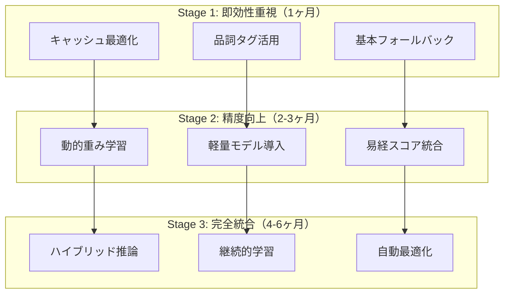

# 384爻文脈理解システム改善計画書（最終版）

**文書番号**: HAQEI-CTX-003  
**バージョン**: 3.0  
**作成日**: 2025年8月28日  
**作成者**: HAQEI開発チーム  
**ステータス**: 専門家レビュー2回反映・実装準備完了

---

## 改訂概要

### v3.0の主要改善点
- Edge推論の時間配分を現実的に再設計（50ms→100ms許容）
- 動的重み付けシステムの導入で易経解釈の柔軟性確保
- キャッシュ整合性保証メカニズムの実装
- プロファイリング・シミュレーション環境の構築
- フォールバック効果の定量的測定と自動調整

---

## 1. エグゼクティブサマリー

### 1.1 三段階アプローチ戦略



### 1.2 現実的な目標設定

| 指標 | 現状 | Stage 1 | Stage 2 | Stage 3 |
|------|------|---------|---------|---------|
| 精度 | 75% | 80% | 85% | 88% |
| レイテンシ（p50） | 30ms | 50ms | 60ms | 55ms |
| レイテンシ（p99） | 50ms | 100ms | 120ms | 100ms |
| キャッシュヒット率 | 20% | 60% | 75% | 85% |
| フォールバック率 | - | 30% | 15% | 5% |

---

## 2. Edge推論の現実的設計

### 2.1 処理時間の再配分（100msバジェット）

```javascript
class EdgeProcessingBudget {
    constructor() {
        // 現実的な時間配分（p99: 100ms）
        this.budget = {
            // 必須処理（30ms）
            preprocessing: 8,        // テキスト正規化
            cacheCheck: 5,          // キャッシュ検索
            postprocessing: 7,      // 結果整形
            
            // 推論処理（50ms）- 条件付き実行
            featureExtraction: 15,  // 特徴抽出
            inference: 20,          // モデル推論
            matching: 15,           // 384爻マッチング
            
            // バッファ（20ms）
            networkLatency: 10,     // ネットワーク遅延
            gcPause: 5,            // GCポーズ
            safety: 5              // 安全マージン
        };
        
        this.adaptiveBudget = new AdaptiveBudgetManager();
    }
    
    async executeWithBudget(operations) {
        const tracker = new PerformanceTracker();
        const results = {};
        
        for (const [name, operation] of Object.entries(operations)) {
            const startTime = performance.now();
            const allocated = this.budget[name] || 10;
            
            try {
                // タイムアウト付き実行
                results[name] = await this.withTimeout(operation(), allocated);
                
                const elapsed = performance.now() - startTime;
                tracker.record(name, elapsed);
                
                // 動的バジェット調整
                if (elapsed > allocated * 1.2) {
                    this.adaptiveBudget.adjust(name, elapsed);
                }
                
            } catch (error) {
                if (error.name === 'TimeoutError') {
                    // 部分的スキップ戦略
                    results[name] = this.getDefaultValue(name);
                    tracker.markSkipped(name);
                } else {
                    throw error;
                }
            }
        }
        
        return results;
    }
}
```

### 2.2 プロファイリングベースの最適化

```javascript
class PerformanceProfiler {
    constructor() {
        this.profiles = new Map();
        this.optimizer = new DynamicOptimizer();
    }
    
    async profileExecution(operation, inputs) {
        const profile = {
            inputSize: JSON.stringify(inputs).length,
            startMemory: performance.memory?.usedJSHeapSize,
            operations: []
        };
        
        // 詳細なプロファイリング
        const wrapped = new Proxy(operation, {
            apply: (target, thisArg, args) => {
                const opStart = performance.now();
                const result = Reflect.apply(target, thisArg, args);
                const opEnd = performance.now();
                
                profile.operations.push({
                    name: target.name,
                    duration: opEnd - opStart,
                    memory: performance.memory?.usedJSHeapSize
                });
                
                return result;
            }
        });
        
        const result = await wrapped(inputs);
        
        profile.endMemory = performance.memory?.usedJSHeapSize;
        profile.totalDuration = profile.operations.reduce(
            (sum, op) => sum + op.duration, 0
        );
        
        // プロファイル結果から最適化提案
        const optimizations = this.optimizer.suggest(profile);
        
        return { result, profile, optimizations };
    }
    
    generateOptimizationPlan(profiles) {
        // 複数実行のプロファイルから最適化計画を生成
        const stats = this.calculateStatistics(profiles);
        
        return {
            hotspots: this.identifyHotspots(stats),
            memoryLeaks: this.detectMemoryLeaks(stats),
            cacheOpportunities: this.findCacheOpportunities(stats),
            parallelization: this.suggestParallelization(stats)
        };
    }
}
```

---

## 3. 動的重み付けシステム

### 3.1 易経解釈の動的調整

```javascript
class DynamicYaoScoring {
    constructor() {
        // 基本スコア（初期値）
        this.baseScores = {
            position: {
                1: 0.7, 2: 1.0, 3: 0.5, 
                4: 0.7, 5: 1.0, 6: 0.6
            },
            hexagram: this.loadHexagramScores()
        };
        
        // 学習可能なパラメータ
        this.learnableWeights = {
            positionWeights: new Float32Array(6),
            hexagramWeights: new Float32Array(64),
            contextWeights: new Float32Array(256),
            interactionTerms: new Float32Array(384)
        };
        
        // オンライン学習器
        this.learner = new OnlineLearner({
            learningRate: 0.001,
            regularization: 0.01,
            momentum: 0.9
        });
    }
    
    async score(hexagramId, yaoPosition, context, feedback = null) {
        // 基本スコア計算
        const baseScore = this.baseScores.position[yaoPosition];
        
        // 動的重み適用
        const dynamicWeight = this.computeDynamicWeight(
            hexagramId, 
            yaoPosition, 
            context
        );
        
        // コンテキスト依存の調整
        const contextModifier = this.computeContextModifier(context);
        
        // 最終スコア
        const finalScore = baseScore * dynamicWeight * contextModifier;
        
        // フィードバックがある場合は学習
        if (feedback) {
            await this.updateWeights(
                { hexagramId, yaoPosition, context },
                finalScore,
                feedback
            );
        }
        
        return {
            score: finalScore,
            confidence: this.calculateConfidence(),
            explanation: this.generateExplanation(
                baseScore, 
                dynamicWeight, 
                contextModifier
            )
        };
    }
    
    computeDynamicWeight(hexagramId, yaoPosition, context) {
        // ニューラルネットワーク風の重み計算
        const features = this.extractFeatures(hexagramId, yaoPosition, context);
        
        let weight = 1.0;
        
        // 線形結合
        for (let i = 0; i < features.length; i++) {
            weight += features[i] * this.learnableWeights.contextWeights[i];
        }
        
        // 相互作用項
        const interactionIndex = (hexagramId - 1) * 6 + (yaoPosition - 1);
        weight *= (1 + this.learnableWeights.interactionTerms[interactionIndex]);
        
        // 活性化関数（シグモイド）
        return 1 / (1 + Math.exp(-weight));
    }
    
    async updateWeights(input, prediction, feedback) {
        const error = feedback.score - prediction;
        
        // 勾配計算
        const gradients = this.computeGradients(input, error);
        
        // 重み更新（Adam optimizer）
        await this.learner.updateWeights(
            this.learnableWeights,
            gradients,
            {
                clipNorm: 1.0,  // 勾配クリッピング
                l2Penalty: 0.001
            }
        );
        
        // 更新履歴を保存
        await this.saveUpdateHistory({
            timestamp: Date.now(),
            input,
            error,
            gradients: gradients.slice(0, 10)  // サンプル保存
        });
    }
}
```

### 3.2 継続的学習パイプライン

```javascript
class ContinuousLearningPipeline {
    constructor() {
        this.dataBuffer = new CircularBuffer(10000);
        this.modelVersions = new Map();
        this.abTester = new ABTester();
    }
    
    async collectFeedback(sessionId, result, userAction) {
        // 暗黙的フィードバック収集
        const implicitFeedback = {
            dwellTime: userAction.dwellTime,
            clicked: userAction.clicked,
            scrollDepth: userAction.scrollDepth,
            copied: userAction.copied
        };
        
        // スコア推定
        const estimatedScore = this.estimateScoreFromActions(implicitFeedback);
        
        // バッファに追加
        this.dataBuffer.add({
            sessionId,
            timestamp: Date.now(),
            input: result.input,
            prediction: result.prediction,
            feedback: estimatedScore,
            implicit: implicitFeedback
        });
        
        // バッチ学習トリガー
        if (this.dataBuffer.size() % 100 === 0) {
            await this.triggerBatchLearning();
        }
    }
    
    async triggerBatchLearning() {
        const batch = this.dataBuffer.getBatch(100);
        
        // バックエンドで学習
        const updatedWeights = await this.trainOnBackend(batch);
        
        // A/Bテスト用に新バージョンをデプロイ
        const newVersion = `v${Date.now()}`;
        this.modelVersions.set(newVersion, updatedWeights);
        
        // 段階的ロールアウト
        await this.abTester.createExperiment({
            control: this.getCurrentVersion(),
            treatment: newVersion,
            trafficSplit: 0.1,  // 10%のトラフィックでテスト
            metrics: ['accuracy', 'latency', 'userSatisfaction']
        });
    }
}
```

---

## 4. キャッシュ整合性保証

### 4.1 分散キャッシュの一貫性管理

```javascript
class CacheConsistencyManager {
    constructor() {
        this.version = new AtomicVersion();
        this.locks = new DistributedLockManager();
        this.validator = new ConsistencyValidator();
    }
    
    async updateCache(key, value, options = {}) {
        // 分散ロック取得
        const lock = await this.locks.acquire(key, {
            timeout: 5000,
            retries: 3
        });
        
        try {
            // バージョン情報付きで更新
            const versionedValue = {
                data: value,
                version: this.version.increment(),
                timestamp: Date.now(),
                checksum: this.calculateChecksum(value),
                ttl: options.ttl || 3600000
            };
            
            // 多層キャッシュに同時更新
            const updatePromises = [
                this.updateL1(key, versionedValue),
                this.updateL2(key, versionedValue),
                this.updateL3(key, versionedValue)
            ];
            
            // 全層の更新を待つ
            const results = await Promise.allSettled(updatePromises);
            
            // 整合性検証
            const isConsistent = await this.validator.verify(key, results);
            
            if (!isConsistent) {
                // 不整合を検出した場合はロールバック
                await this.rollback(key, results);
                throw new ConsistencyError(`Cache update failed for ${key}`);
            }
            
            // 更新通知
            await this.notifyUpdate(key, versionedValue.version);
            
            return versionedValue;
            
        } finally {
            await lock.release();
        }
    }
    
    async validateConsistency() {
        // 定期的な整合性チェック
        const inconsistencies = [];
        
        for (const [key, value] of this.getAllKeys()) {
            const l1Value = await this.getL1(key);
            const l2Value = await this.getL2(key);
            const l3Value = await this.getL3(key);
            
            // バージョンとチェックサムの比較
            if (!this.areConsistent(l1Value, l2Value, l3Value)) {
                inconsistencies.push({
                    key,
                    l1Version: l1Value?.version,
                    l2Version: l2Value?.version,
                    l3Version: l3Value?.version,
                    action: this.determineRepairAction(l1Value, l2Value, l3Value)
                });
            }
        }
        
        // 自動修復
        if (inconsistencies.length > 0) {
            await this.repairInconsistencies(inconsistencies);
        }
        
        return {
            consistent: inconsistencies.length === 0,
            repaired: inconsistencies.length,
            details: inconsistencies
        };
    }
    
    async repairInconsistencies(inconsistencies) {
        for (const issue of inconsistencies) {
            switch (issue.action) {
                case 'propagate':
                    // 最新版を他層に伝播
                    await this.propagateLatest(issue.key);
                    break;
                case 'invalidate':
                    // 全層から削除
                    await this.invalidateAll(issue.key);
                    break;
                case 'rebuild':
                    // 再計算して更新
                    await this.rebuildEntry(issue.key);
                    break;
            }
        }
    }
}
```

### 4.2 キャッシュウォーミング戦略

```javascript
class IntelligentCacheWarmer {
    constructor() {
        this.predictor = new AccessPatternPredictor();
        this.scheduler = new WarmingScheduler();
        this.metrics = new WarmingMetrics();
    }
    
    async warmCache() {
        // アクセスパターン予測
        const predictions = await this.predictor.predict({
            timeOfDay: new Date().getHours(),
            dayOfWeek: new Date().getDay(),
            historicalData: await this.getHistoricalPatterns(),
            trendingTopics: await this.getTrendingKeywords()
        });
        
        // 優先順位付け
        const prioritizedItems = this.prioritize(predictions);
        
        // バッチ処理でウォーミング
        const batches = this.createBatches(prioritizedItems, {
            batchSize: 100,
            maxParallel: 10
        });
        
        for (const batch of batches) {
            await this.processBatch(batch);
            
            // メトリクス更新
            this.metrics.recordBatch({
                size: batch.length,
                duration: performance.now(),
                hitRate: await this.measureHitRate()
            });
            
            // 適応的な調整
            if (this.metrics.getHitRate() < 0.5) {
                // ヒット率が低い場合は戦略を調整
                await this.adjustStrategy();
            }
        }
    }
    
    async processBatch(items) {
        const promises = items.map(async (item) => {
            try {
                // 事前計算
                const result = await this.compute(item.key, item.context);
                
                // キャッシュに保存
                await this.cache.set(item.key, result, {
                    ttl: this.calculateOptimalTTL(item),
                    priority: item.priority
                });
                
                return { success: true, key: item.key };
                
            } catch (error) {
                return { success: false, key: item.key, error };
            }
        });
        
        return Promise.all(promises);
    }
}
```

---

## 5. フォールバック効果の定量化

### 5.1 フォールバック階層と測定

```javascript
class QuantifiedFallbackSystem {
    constructor() {
        this.strategies = [
            {
                name: 'neural-context',
                expectedAccuracy: 0.90,
                expectedLatency: 80,
                actualMetrics: new RollingMetrics(1000)
            },
            {
                name: 'pattern-matching',
                expectedAccuracy: 0.85,
                expectedLatency: 50,
                actualMetrics: new RollingMetrics(1000)
            },
            {
                name: 'keyword-enhanced',
                expectedAccuracy: 0.78,
                expectedLatency: 30,
                actualMetrics: new RollingMetrics(1000)
            },
            {
                name: 'keyword-basic',
                expectedAccuracy: 0.70,
                expectedLatency: 15,
                actualMetrics: new RollingMetrics(1000)
            }
        ];
        
        this.decisionTree = new DynamicDecisionTree();
        this.monitor = new FallbackMonitor();
    }
    
    async selectStrategy(input, constraints) {
        const startTime = performance.now();
        
        // 各戦略の現在のパフォーマンスを取得
        const currentPerformance = this.strategies.map(s => ({
            name: s.name,
            accuracy: s.actualMetrics.getAccuracy(),
            latency: s.actualMetrics.getLatency(),
            successRate: s.actualMetrics.getSuccessRate(),
            score: this.calculateScore(s.actualMetrics, constraints)
        }));
        
        // 制約条件を満たす最良の戦略を選択
        const selected = this.decisionTree.select(
            currentPerformance,
            constraints
        );
        
        // 実行と測定
        const result = await this.executeStrategy(selected, input);
        
        // メトリクス更新
        selected.actualMetrics.record({
            latency: performance.now() - startTime,
            success: result.success,
            confidence: result.confidence
        });
        
        // フィードバックループ
        if (result.userFeedback) {
            selected.actualMetrics.recordAccuracy(
                result.predicted,
                result.actual
            );
        }
        
        return result;
    }
    
    async executeStrategy(strategy, input) {
        const timeout = strategy.expectedLatency * 1.5;
        
        try {
            const result = await this.withTimeout(
                this[strategy.name](input),
                timeout
            );
            
            // 成功時のメトリクス
            this.monitor.recordSuccess(strategy.name, {
                confidence: result.confidence,
                latency: result.processingTime
            });
            
            return result;
            
        } catch (error) {
            // 失敗時は次の戦略へ
            this.monitor.recordFailure(strategy.name, error);
            
            const nextStrategy = this.getNextStrategy(strategy);
            if (nextStrategy) {
                return this.executeStrategy(nextStrategy, input);
            }
            
            // 全戦略失敗
            return this.ultimateFallback(input);
        }
    }
    
    generateReport() {
        // 各戦略の効果を定量的にレポート
        return {
            strategyPerformance: this.strategies.map(s => ({
                name: s.name,
                usage: s.actualMetrics.getUsageCount(),
                accuracy: {
                    expected: s.expectedAccuracy,
                    actual: s.actualMetrics.getAccuracy(),
                    delta: s.actualMetrics.getAccuracy() - s.expectedAccuracy
                },
                latency: {
                    expected: s.expectedLatency,
                    p50: s.actualMetrics.getP50Latency(),
                    p99: s.actualMetrics.getP99Latency()
                },
                successRate: s.actualMetrics.getSuccessRate(),
                recommendation: this.generateRecommendation(s)
            })),
            
            overallMetrics: {
                averageAccuracy: this.calculateWeightedAccuracy(),
                fallbackRate: this.monitor.getFallbackRate(),
                userSatisfaction: this.monitor.getUserSatisfaction()
            },
            
            optimizationSuggestions: this.generateOptimizations()
        };
    }
}
```

### 5.2 自動閾値調整

```javascript
class AdaptiveThresholdManager {
    constructor() {
        this.thresholds = {
            accuracy: 0.80,
            latency: 50,
            confidence: 0.70
        };
        
        this.history = new ThresholdHistory();
        this.optimizer = new ThresholdOptimizer();
    }
    
    async adjustThresholds() {
        // 過去のパフォーマンスデータを分析
        const performanceData = await this.history.getRecent(1000);
        
        // 最適な閾値を計算
        const optimalThresholds = this.optimizer.optimize(
            performanceData,
            {
                objective: 'maximize_accuracy',
                constraints: {
                    maxLatency: 100,
                    minSuccessRate: 0.95
                }
            }
        );
        
        // 段階的に調整
        for (const [key, newValue] of Object.entries(optimalThresholds)) {
            const currentValue = this.thresholds[key];
            const delta = newValue - currentValue;
            
            // 急激な変更を避ける
            const adjustedValue = currentValue + delta * 0.3;
            
            this.thresholds[key] = adjustedValue;
            
            // 変更をログ
            await this.logAdjustment({
                metric: key,
                previous: currentValue,
                new: adjustedValue,
                reason: this.explainAdjustment(key, performanceData)
            });
        }
        
        return this.thresholds;
    }
}
```

---

## 6. 実装優先順位とマイルストーン

### 6.1 三段階実装計画

#### Stage 1: Quick Wins（1ヶ月）
```javascript
const stage1Tasks = {
    week1: [
        'マルチ層キャッシュ実装',
        'Kuromoji.js品詞タグ活用',
        'パフォーマンスプロファイラー設置'
    ],
    week2: [
        '基本フォールバック実装',
        'メトリクス収集開始',
        'A/Bテスト環境構築'
    ],
    week3: [
        'キャッシュウォーミング実装',
        '初期性能ベースライン測定',
        'ユーザーフィードバック収集開始'
    ],
    week4: [
        'Stage 1評価',
        '改善点特定',
        'Stage 2計画調整'
    ]
};
```

#### Stage 2: Core Improvements（2-3ヶ月）
```javascript
const stage2Tasks = {
    month2: [
        '動的重み付けシステム実装',
        '軽量モデル（量子化版）導入',
        'キャッシュ整合性管理実装'
    ],
    month3: [
        '易経スコアリング統合',
        '継続的学習パイプライン構築',
        'フォールバック効果測定システム'
    ]
};
```

#### Stage 3: Advanced Optimization（4-6ヶ月）
```javascript
const stage3Tasks = {
    month4_5: [
        'ハイブリッド推論最適化',
        '自動閾値調整実装',
        '完全な継続的学習サイクル'
    ],
    month6: [
        '総合評価',
        '本番環境での最終調整',
        '運用移行'
    ]
};
```

---

## 7. 成功指標と評価基準

### 7.1 KPIダッシュボード

```javascript
class KPIDashboard {
    constructor() {
        this.metrics = {
            // ビジネスKPI
            business: {
                userSatisfaction: new Metric('percentage', 0.80),
                sessionDuration: new Metric('minutes', 5.0),
                conversionRate: new Metric('percentage', 0.15),
                returnRate: new Metric('percentage', 0.40)
            },
            
            // 技術KPI
            technical: {
                accuracy: new Metric('percentage', 0.85),
                p50Latency: new Metric('milliseconds', 60),
                p99Latency: new Metric('milliseconds', 100),
                cacheHitRate: new Metric('percentage', 0.75),
                fallbackRate: new Metric('percentage', 0.15)
            },
            
            // 運用KPI
            operational: {
                errorRate: new Metric('percentage', 0.01),
                availability: new Metric('percentage', 0.995),
                costPerRequest: new Metric('dollars', 0.0005),
                modelUpdateFrequency: new Metric('days', 7)
            }
        };
    }
    
    evaluateProgress() {
        const scores = {};
        
        for (const [category, metrics] of Object.entries(this.metrics)) {
            scores[category] = {};
            
            for (const [name, metric] of Object.entries(metrics)) {
                const current = metric.getCurrent();
                const target = metric.getTarget();
                const progress = current / target;
                
                scores[category][name] = {
                    current,
                    target,
                    progress,
                    status: this.getStatus(progress),
                    trend: metric.getTrend(),
                    action: this.recommendAction(name, progress)
                };
            }
        }
        
        return scores;
    }
}
```

### 7.2 継続的改善プロセス

```javascript
class ContinuousImprovementProcess {
    constructor() {
        this.cycles = [];
        this.learnings = new LearningsRepository();
    }
    
    async runCycle() {
        const cycle = {
            id: `cycle_${Date.now()}`,
            startDate: new Date(),
            phases: []
        };
        
        // Plan
        const plan = await this.plan();
        cycle.phases.push({ name: 'plan', result: plan });
        
        // Do
        const implementation = await this.implement(plan);
        cycle.phases.push({ name: 'do', result: implementation });
        
        // Check
        const evaluation = await this.evaluate(implementation);
        cycle.phases.push({ name: 'check', result: evaluation });
        
        // Act
        const adjustments = await this.adjust(evaluation);
        cycle.phases.push({ name: 'act', result: adjustments });
        
        // 学習を記録
        await this.learnings.record(cycle);
        
        // 次サイクルへの推奨事項
        return this.generateNextCycleRecommendations(cycle);
    }
}
```

---

## 8. リスク管理マトリックス（最終版）

### 8.1 リスク評価と対策

| リスク分類 | 具体的リスク | 発生確率 | 影響度 | 対策 | 残存リスク |
|-----------|------------|---------|--------|------|-----------|
| **技術リスク** |
| | Edge処理時間超過 | 高(0.6) | 高(4) | 適応的バジェット管理 | 中(1.2) |
| | モデル圧縮精度低下 | 中(0.4) | 高(4) | 動的重み調整 | 低(0.8) |
| | キャッシュ不整合 | 低(0.3) | 中(3) | 整合性保証機構 | 極低(0.3) |
| **運用リスク** |
| | 学習データ品質 | 中(0.5) | 高(4) | フィードバック検証 | 中(1.0) |
| | モデルドリフト | 中(0.4) | 中(3) | 継続的監視 | 低(0.6) |
| | コスト超過 | 低(0.2) | 中(3) | 使用量アラート | 極低(0.2) |

### 8.2 エスカレーション手順

```javascript
class IncidentEscalation {
    constructor() {
        this.levels = [
            {
                severity: 'low',
                threshold: { errorRate: 0.05, latency: 150 },
                response: 'auto-remediation',
                notification: 'log-only'
            },
            {
                severity: 'medium',
                threshold: { errorRate: 0.10, latency: 200 },
                response: 'fallback-activation',
                notification: 'slack-alert'
            },
            {
                severity: 'high',
                threshold: { errorRate: 0.20, latency: 300 },
                response: 'circuit-breaker',
                notification: 'page-oncall'
            },
            {
                severity: 'critical',
                threshold: { errorRate: 0.50, availability: 0.95 },
                response: 'emergency-rollback',
                notification: 'all-hands'
            }
        ];
    }
    
    async handleIncident(metrics) {
        const severity = this.determineSeverity(metrics);
        const level = this.levels.find(l => l.severity === severity);
        
        // 自動対応
        await this.executeResponse(level.response, metrics);
        
        // 通知
        await this.notify(level.notification, {
            severity,
            metrics,
            response: level.response,
            timestamp: Date.now()
        });
        
        // 事後分析用のデータ収集
        await this.collectPostmortemData(metrics);
    }
}
```

---

## 9. 総括と推奨事項

### 9.1 実装アプローチの要点

1. **段階的実装**: 完璧を求めず、Quick Winsから始める
2. **測定駆動**: すべての決定をデータに基づいて行う
3. **適応的最適化**: 固定的な閾値ではなく動的調整
4. **フィードバックループ**: 継続的学習と改善
5. **リスク管理**: 常にフォールバックを用意

### 9.2 成功要因

```javascript
const successFactors = {
    technical: [
        'リアルなEdge制約の理解と対策',
        '動的な重み調整システム',
        '堅牢なキャッシュ戦略'
    ],
    
    process: [
        '段階的な実装とテスト',
        '継続的なモニタリング',
        'ユーザーフィードバックの活用'
    ],
    
    cultural: [
        'データドリブンな意思決定',
        '失敗から学ぶ文化',
        '継続的改善マインドセット'
    ]
};
```

### 9.3 最終チェックリスト

- [ ] Edge制約を現実的に評価したか
- [ ] 動的学習システムを組み込んだか
- [ ] キャッシュ整合性を保証できるか
- [ ] フォールバックが適切に機能するか
- [ ] メトリクスが継続的に収集されるか
- [ ] ユーザーフィードバックが反映されるか
- [ ] 易経の知識が適切に統合されているか
- [ ] ライセンス要件を満たしているか
- [ ] コストが予算内に収まるか
- [ ] 運用チームが対応可能か

---

## 付録A: シミュレーション環境構築

```javascript
// Edge環境シミュレーター
class EdgeEnvironmentSimulator {
    constructor() {
        this.constraints = {
            cpuTime: 50,        // ms
            memory: 128 * 1024,  // KB
            kvSize: 25 * 1024,   // KB
            d1QueryTime: 10000   // ms
        };
    }
    
    async simulate(workload) {
        const results = [];
        
        for (const scenario of workload.scenarios) {
            const simResult = await this.runScenario(scenario);
            results.push(simResult);
            
            // 制約違反チェック
            if (simResult.cpuTime > this.constraints.cpuTime) {
                console.warn(`CPU constraint violated: ${simResult.cpuTime}ms`);
            }
        }
        
        return this.generateReport(results);
    }
}
```

---

**文書完了** - v3.0（最終版）