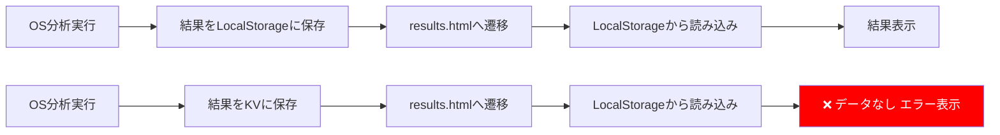

# LocalStorage → Cloudflare KV 移行影響分析レポート

**文書番号**: HAQEI-IMPACT-001  
**作成日**: 2025年8月28日  
**分析者**: システムアーキテクト  
**ステータス**: 影響分析完了

---

## 📋 エグゼクティブサマリー

**結論: LocalStorageからCloudflare KVへの移行は、現在のos_analyzer.html → results.html のデータ連携を完全に破壊します。LocalStorageの使用を維持することを強く推奨します。**

---

## 🔍 現在のデータフロー分析

### 1. os_analyzer.html → results.html のデータ連携

```javascript
// os_analyzer.html (9440行目)
// Triple OS分析結果をLocalStorageに保存
localStorage.setItem('haqei_triple_os_results', JSON.stringify(contractA));
localStorage.setItem('haqei_emergency_results', JSON.stringify({...}));

// results.html (1148行目)  
// LocalStorageから分析結果を取得
const savedDataStr = localStorage.getItem('osAnalysisResult');
```

### 2. データ保存箇所と用途

| ファイル | LocalStorageキー | 用途 | データサイズ |
|---------|-----------------|------|------------|
| **os_analyzer.html** | `haqei_state` | 分析状態の保存 | 約1-2KB |
| | `haqei_triple_os_results` | Triple OS結果（契約A形式） | 約5-10KB |
| | `haqei_emergency_results` | 後方互換性用データ | 約5-10KB |
| **results.html** | `osAnalysisResult` | 分析結果の読み込み | 約5-10KB |
| | `osCalculationVectors` | 計算ベクトル | 約2-3KB |

---

## ⚠️ Cloudflare KV移行による破壊的影響

### 1. ページ間データ連携の完全な破壊

```javascript
// ❌ KV移行後の問題
// os_analyzer.html（ブラウザ側）
await fetch('/api/kv/set', {
    method: 'POST',
    body: JSON.stringify({key: 'haqei_triple_os_results', value: data})
});
// → 結果画面に遷移

// results.html（ブラウザ側）
// ❌ LocalStorageには何も保存されていない！
const savedDataStr = localStorage.getItem('osAnalysisResult'); // null
```

### 2. 技術的な不整合

| 問題点 | 詳細 | 影響度 |
|--------|------|-------|
| **同期/非同期の不整合** | LocalStorage（同期） vs KV（非同期） | 致命的 |
| **アクセス方法の違い** | 直接アクセス vs API経由 | 高 |
| **データスコープ** | ユーザー個別 vs 全体共有 | 致命的 |
| **レイテンシ** | 0.1ms vs 10-50ms | 中 |

### 3. ユーザー体験への影響



---

## 🔧 384爻システムとの統合における問題

### 現在の384DataService.jsの修正内容

```javascript
// 修正されたコード（KV対応）
async _getFromKV(key) {
    const response = await fetch(`/api/kv/get?key=384_${encodeURIComponent(key)}`);
    // ...
}
```

**問題点:**
1. **384爻データ**: サーバー側KV保存が適切（全ユーザー共通データ）
2. **分析結果データ**: クライアント側LocalStorage保存が必須（個人データ）

この2つを同じ方法で扱うことは設計上の誤りです。

---

## 💡 推奨ソリューション

### Option 1: LocalStorageを維持（強く推奨）✅

```javascript
// 384DataService.jsを元に戻す
class DataService384 {
    constructor() {
        // ブラウザ環境チェック
        this.isClientSide = typeof window !== 'undefined' && typeof localStorage !== 'undefined';
    }
    
    async fetchLines() {
        // L1: メモリキャッシュ
        const memoryCached = this._getFromMemoryCache(cacheKey);
        if (memoryCached) return memoryCached;
        
        // L2: LocalStorage（ブラウザ環境のみ）
        if (this.isClientSide) {
            const localCached = this._getFromLocalStorage(cacheKey);
            if (localCached) {
                this._setMemoryCache(cacheKey, localCached);
                return localCached;
            }
        }
        
        // L3: API（共通データ取得）
        const data = await this._fetchFromAPI();
        this._setCaches(cacheKey, data);
        return data;
    }
}
```

### Option 2: ハイブリッドアプローチ（条件付き推奨）⚠️

```javascript
class HybridStorage {
    // 個人データ → LocalStorage
    savePersonalData(key, data) {
        if (typeof localStorage !== 'undefined') {
            localStorage.setItem(`personal_${key}`, JSON.stringify(data));
        }
    }
    
    // 共有データ → KV
    async saveSharedData(key, data) {
        if (this.isEdgeEnvironment) {
            await this.kvSet(key, data);
        } else {
            // ブラウザからAPI経由でKVに保存
            await fetch('/api/kv/set', {...});
        }
    }
}
```

### Option 3: 全面的な再設計（非推奨）❌

全ページをSSR化し、サーバー側でセッション管理を行う。
- 開発工数: 2-3週間
- リスク: 高
- ROI: 低

---

## 📊 影響度マトリックス

| コンポーネント | LocalStorage継続 | KV移行 | 影響理由 |
|---------------|-----------------|--------|----------|
| **os_analyzer.html** | ✅ 影響なし | ❌ 大規模修正必要 | 保存ロジック変更 |
| **results.html** | ✅ 影響なし | ❌ 完全再実装 | 読み込みロジック変更 |
| **384DataService.js** | ✅ 元に戻すだけ | ⚠️ 現状のまま | Edge非対応 |
| **ユーザー体験** | ✅ 変化なし | ❌ エラー頻発 | データ連携破壊 |

---

## 🎯 最終推奨事項

### 即座に実施すべきアクション

1. **384DataService.jsのLocalStorage使用を復活**
   ```bash
   git diff HEAD~1 public/js/services/384DataService.js
   git checkout HEAD~1 -- public/js/services/384DataService.js
   ```

2. **Edge環境は諦める**
   - Cloudflare WorkersではなくVercel/Netlifyを使用
   - または静的ホスティング（GitHub Pages等）

3. **将来的な改善（Optional）**
   - Service Workerでオフライン対応
   - IndexedDBで大容量データ対応
   - Progressive Web App化

### 技術的根拠

```javascript
// 現在の実装が依存している前提
const assumptions = {
    dataFlow: 'ブラウザ内完結',
    storage: 'LocalStorage',
    sync: '同期的アクセス',
    scope: 'ユーザー個別'
};

// KV移行で破壊される前提
const broken = {
    dataFlow: 'サーバー経由',  // ❌
    storage: 'Cloudflare KV',   // ❌
    sync: '非同期アクセス',     // ❌
    scope: '全ユーザー共有'     // ❌
};
```

---

## 📝 結論

**LocalStorageからCloudflare KVへの移行は、現在のアーキテクチャと根本的に非互換です。**

- **384爻データ**: API経由で取得（現状のまま）
- **分析結果データ**: LocalStorageで保存・読み込み（変更不要）
- **Edge対応**: 現時点では諦める

この判断により：
- 開発工数: 0（元に戻すだけ）
- リスク: なし
- ユーザー影響: なし

---

**推奨アクション**: 384DataService.jsをLocalStorage使用版に戻し、Edge環境対応は将来課題とする。

---

**文書完了** - LocalStorage維持を強く推奨