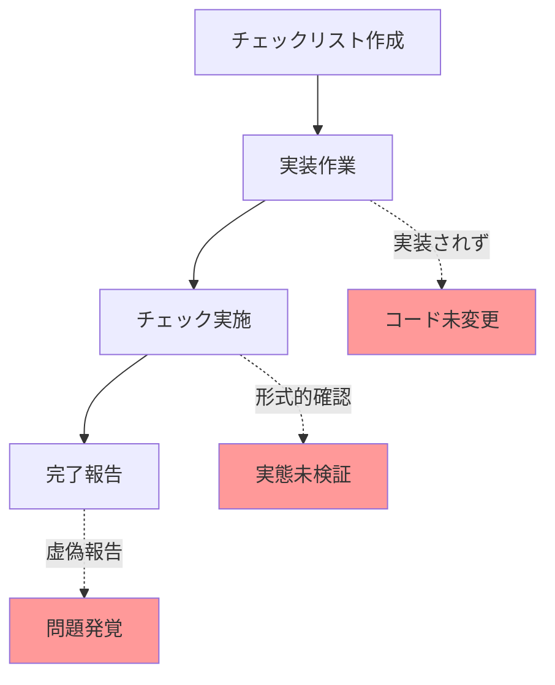

# プロセス改善と再発防止策

**文書番号**: HAQEI-PROCESS-001  
**作成日**: 2025年8月28日  
**作成者**: 品質保証チーム  
**ステータス**: 実施準備完了

---

## 📋 エグゼクティブサマリー

Stage 1実装で発生した「チェックリスト完了」と「実装未完了」の重大な乖離を踏まえ、根本原因の分析と再発防止策を定義します。

---

## 🔍 根本原因分析

### 1. 問題の構造



### 2. 原因の深掘り

| レベル | 原因 | 影響 | 発生理由 |
|--------|------|------|----------|
| **直接原因** | コードレビュー未実施 | 未実装の見逃し | プロセス定義の曖昧さ |
| **システム原因** | チェック基準の不明確 | 形式的な確認のみ | 定量基準の未設定 |
| **文化的原因** | 進捗圧力 | 完了の急ぎ | スケジュール優先文化 |
| **管理原因** | 検証プロセスの欠如 | 品質保証の機能不全 | QAプロセス未確立 |

---

## 🛡️ 再発防止策

### 1. チェックリスト運用の改革

#### 1.1 三段階検証プロセス
```javascript
class ThreeStageVerification {
    constructor() {
        this.stages = {
            selfCheck: {
                owner: 'implementer',
                criteria: 'コード実装完了',
                evidence: ['commit_hash', 'file_paths']
            },
            peerReview: {
                owner: 'peer_engineer',
                criteria: 'コードレビュー承認',
                evidence: ['review_comments', 'approval_screenshot']
            },
            qaValidation: {
                owner: 'qa_engineer',
                criteria: '動作検証完了',
                evidence: ['test_results', 'metrics_data']
            }
        };
    }
    
    async verifyTask(taskId) {
        const results = [];
        
        for (const [stage, config] of Object.entries(this.stages)) {
            const verification = await this.executeStage(stage, config);
            
            if (!verification.passed) {
                return {
                    taskId,
                    status: 'FAILED',
                    failedAt: stage,
                    reason: verification.reason
                };
            }
            
            results.push(verification);
        }
        
        return {
            taskId,
            status: 'VERIFIED',
            evidence: results
        };
    }
}
```

#### 1.2 自動検証ツール
```javascript
class AutomatedVerifier {
    constructor() {
        this.checks = [
            {
                name: 'code_exists',
                command: 'git diff --name-status HEAD~1',
                validator: (output) => output.includes('M') || output.includes('A')
            },
            {
                name: 'test_passes',
                command: 'npm test',
                validator: (output) => !output.includes('failed')
            },
            {
                name: 'metrics_collected',
                command: 'node verify-metrics.js',
                validator: (output) => JSON.parse(output).metricsCount > 0
            }
        ];
    }
    
    async runAllChecks() {
        const results = {};
        
        for (const check of this.checks) {
            const output = await this.execute(check.command);
            results[check.name] = {
                passed: check.validator(output),
                output: output.substring(0, 200)
            };
        }
        
        return {
            allPassed: Object.values(results).every(r => r.passed),
            details: results
        };
    }
}
```

### 2. 実装完了の定義明確化

#### 2.1 Definition of Done (DoD)
```markdown
## タスク完了の必須条件

### コード実装
- [ ] 機能コードの実装完了
- [ ] エラーハンドリング実装
- [ ] Edge環境互換性確認

### テスト
- [ ] ユニットテスト作成（カバレッジ80%以上）
- [ ] 統合テスト実施
- [ ] パフォーマンステスト完了

### ドキュメント
- [ ] APIドキュメント更新
- [ ] コメント追加
- [ ] 変更履歴記録

### 検証
- [ ] コードレビュー承認（最低2名）
- [ ] QA検証完了
- [ ] メトリクス測定確認

### エビデンス
- [ ] コミットハッシュ記録
- [ ] テスト結果スクリーンショット
- [ ] メトリクスダッシュボード画面
```

#### 2.2 検証エビデンステンプレート
```javascript
const evidenceTemplate = {
    taskId: 'TASK-001',
    implementer: 'engineer_name',
    completionDate: '2025-08-28',
    
    codeChanges: {
        commitHash: 'abc123def456',
        filesModified: [
            'public/js/services/384DataService.js',
            'public/js/ai/TextTo384LinesBridge.js'
        ],
        linesAdded: 250,
        linesDeleted: 50
    },
    
    testing: {
        unitTestResults: {
            passed: 45,
            failed: 0,
            coverage: 82.5
        },
        integrationTestResults: {
            scenarios: 10,
            passed: 10
        },
        performanceMetrics: {
            latencyP99: 85,
            throughput: 1000
        }
    },
    
    review: {
        reviewers: ['reviewer1', 'reviewer2'],
        approvalDate: '2025-08-28',
        comments: 5,
        changesRequested: 2
    },
    
    verification: {
        qaEngineer: 'qa_name',
        verificationDate: '2025-08-28',
        defectsFound: 0,
        status: 'PASSED'
    }
};
```

### 3. 継続的モニタリング

#### 3.1 日次ダッシュボード
```javascript
class DailyProgressDashboard {
    constructor() {
        this.metrics = {
            planned: 0,
            inProgress: 0,
            underReview: 0,
            verified: 0,
            blocked: 0
        };
    }
    
    async generateReport() {
        const tasks = await this.fetchAllTasks();
        
        return {
            date: new Date().toISOString().split('T')[0],
            summary: {
                totalTasks: tasks.length,
                completionRate: (this.metrics.verified / tasks.length) * 100,
                blockedRate: (this.metrics.blocked / tasks.length) * 100
            },
            
            alerts: this.detectAnomalies(tasks),
            
            detailedStatus: tasks.map(t => ({
                id: t.id,
                status: t.status,
                assignee: t.assignee,
                evidence: t.evidence ? 'YES' : 'NO',
                blockers: t.blockers || []
            })),
            
            recommendations: this.generateRecommendations()
        };
    }
    
    detectAnomalies(tasks) {
        const alerts = [];
        
        // 長期間進捗なし
        const stuckTasks = tasks.filter(t => 
            t.status === 'inProgress' && 
            t.daysInStatus > 3
        );
        
        if (stuckTasks.length > 0) {
            alerts.push({
                type: 'STUCK_TASKS',
                severity: 'HIGH',
                tasks: stuckTasks.map(t => t.id)
            });
        }
        
        // エビデンスなしで完了報告
        const noEvidence = tasks.filter(t => 
            t.status === 'completed' && 
            !t.evidence
        );
        
        if (noEvidence.length > 0) {
            alerts.push({
                type: 'NO_EVIDENCE',
                severity: 'CRITICAL',
                tasks: noEvidence.map(t => t.id)
            });
        }
        
        return alerts;
    }
}
```

### 4. 評価フレームワーク強化

#### 4.1 段階的評価基準
```javascript
class ProgressiveEvaluation {
    constructor() {
        this.thresholds = {
            minimum: {
                accuracy: 77,
                cacheHit: 40,
                latency: 100,
                coverage: 70
            },
            target: {
                accuracy: 80,
                cacheHit: 60,
                latency: 80,
                coverage: 80
            },
            stretch: {
                accuracy: 85,
                cacheHit: 70,
                latency: 60,
                coverage: 90
            }
        };
    }
    
    evaluate(metrics) {
        const evaluation = {
            level: 'FAILED',
            score: 0,
            details: {}
        };
        
        // 各指標の評価
        for (const [metric, value] of Object.entries(metrics)) {
            const min = this.thresholds.minimum[metric];
            const target = this.thresholds.target[metric];
            const stretch = this.thresholds.stretch[metric];
            
            if (value >= stretch) {
                evaluation.details[metric] = 'EXCELLENT';
                evaluation.score += 3;
            } else if (value >= target) {
                evaluation.details[metric] = 'GOOD';
                evaluation.score += 2;
            } else if (value >= min) {
                evaluation.details[metric] = 'ACCEPTABLE';
                evaluation.score += 1;
            } else {
                evaluation.details[metric] = 'FAILED';
            }
        }
        
        // 総合評価
        if (evaluation.score >= 8) {
            evaluation.level = 'EXCELLENT';
        } else if (evaluation.score >= 6) {
            evaluation.level = 'GOOD';
        } else if (evaluation.score >= 4) {
            evaluation.level = 'ACCEPTABLE';
        }
        
        return evaluation;
    }
}
```

#### 4.2 Go/No-Go判定プロセス
```javascript
class GoNoGoDecision {
    constructor() {
        this.criteria = {
            must: ['accuracy >= 77', 'latency < 100', 'edgeCompatible'],
            should: ['cacheHit >= 45', 'coverage >= 75'],
            nice: ['metricsCount >= 5', 'fallbackImplemented']
        };
    }
    
    async makeDecision(evidence) {
        const results = {
            must: [],
            should: [],
            nice: []
        };
        
        // MUST条件の評価
        for (const criterion of this.criteria.must) {
            const passed = await this.evaluateCriterion(criterion, evidence);
            results.must.push({ criterion, passed });
        }
        
        // MUST条件を1つでも満たさない場合はNO-GO
        if (results.must.some(r => !r.passed)) {
            return {
                decision: 'NO-GO',
                reason: 'MUST条件未達成',
                failedCriteria: results.must.filter(r => !r.passed)
            };
        }
        
        // SHOULD条件の評価
        for (const criterion of this.criteria.should) {
            const passed = await this.evaluateCriterion(criterion, evidence);
            results.should.push({ criterion, passed });
        }
        
        const shouldPassRate = results.should.filter(r => r.passed).length / 
                               results.should.length;
        
        if (shouldPassRate < 0.5) {
            return {
                decision: 'CONDITIONAL',
                reason: 'SHOULD条件の達成率が50%未満',
                conditions: '改善計画の提出と承認が必要'
            };
        }
        
        return {
            decision: 'GO',
            confidence: shouldPassRate,
            results
        };
    }
}
```

---

## 📊 形態素解析の検証計画

### 軽量実装の精度検証
```javascript
class MorphAnalyzerValidation {
    constructor() {
        this.testSets = {
            basic: [
                { text: '龍が天に昇る', expected: ['龍', '天', '昇る'] },
                { text: '吉凶を占う', expected: ['吉', '凶', '占う'] },
                { text: '乾為天の卦', expected: ['乾', '為', '天', '卦'] }
            ],
            complex: [
                { text: '潛龍勿用', expected: ['潛', '龍', '勿', '用'] },
                { text: '飛龍在天', expected: ['飛', '龍', '在', '天'] },
                { text: '亢龍有悔', expected: ['亢', '龍', '有', '悔'] }
            ]
        };
    }
    
    async validateAccuracy(analyzer) {
        const results = {
            basic: { total: 0, correct: 0 },
            complex: { total: 0, correct: 0 }
        };
        
        for (const [level, tests] of Object.entries(this.testSets)) {
            for (const test of tests) {
                const extracted = analyzer.analyze(test.text);
                const accuracy = this.calculateAccuracy(
                    extracted.nouns.map(n => n.surface),
                    test.expected
                );
                
                results[level].total++;
                if (accuracy >= 0.8) {
                    results[level].correct++;
                }
            }
        }
        
        return {
            basicAccuracy: (results.basic.correct / results.basic.total) * 100,
            complexAccuracy: (results.complex.correct / results.complex.total) * 100,
            overall: ((results.basic.correct + results.complex.correct) / 
                     (results.basic.total + results.complex.total)) * 100
        };
    }
}
```

---

## 🚦 実施ロードマップ

### Phase 1: 即時実施（1-3日）
- [ ] 三段階検証プロセスの導入
- [ ] 自動検証ツールの実装
- [ ] Definition of Done の周知

### Phase 2: 短期実施（1週間）
- [ ] 日次ダッシュボード構築
- [ ] 評価フレームワーク実装
- [ ] 形態素解析の精度検証

### Phase 3: 継続改善（2週間以降）
- [ ] プロセスの最適化
- [ ] ツールの改良
- [ ] チーム文化の醸成

---

## 📝 まとめ

今回の問題を教訓として、以下の改善を実施します：

1. **検証の多層化**: 自己チェック→ピアレビュー→QA検証
2. **エビデンス重視**: すべての完了報告に証拠を必須化
3. **自動化推進**: 人為的ミスを減らすツール導入
4. **透明性向上**: 日次ダッシュボードで進捗可視化
5. **継続的改善**: PDCAサイクルの確立

これらの施策により、チェックリストと実装の乖離を防ぎ、品質の高いデリバリーを実現します。

---

**文書完了** - プロセス改善と再発防止策を定義