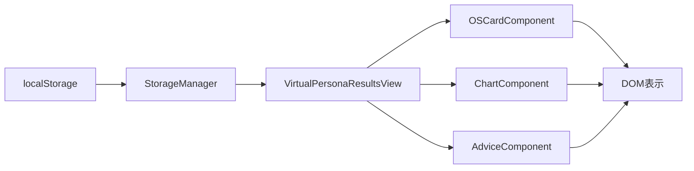

# 🎯 TRAE向け OSアナライザー結果ページ 要件定義と実装計画

## 📊 現状分析サマリー

### 🔴 緊急度：最高
現在、results.htmlは**18個の必須ファイルが欠損**しており、ページが正常に動作しない状態です。

### ✅ 利用可能なリソース
- `StorageManager.js` - データ管理の基盤（存在確認済み）
- `vectors.js` - ベクトルデータ（存在確認済み）
- `haqei-unified-design.css` - 統一デザインシステム（存在確認済み）

---

## 🏗️ Phase別実装計画

### 📌 Phase 1: 基盤復旧（優先度：最高）
**目標**: 最低限の動作を確保

#### タスク1.1: VirtualPersonaResultsView.js作成
```javascript
// /public/js/components/VirtualPersonaResultsView.js
class VirtualPersonaResultsView {
  constructor() {
    this.container = document.getElementById('virtual-persona-container');
    this.storageManager = new StorageManager();
  }
  
  async initialize() {
    // 基本的な初期化処理
    await this.loadAnalysisData();
    this.render();
  }
  
  async loadAnalysisData() {
    // localStorageからデータ取得
    this.tripleOSData = this.storageManager.getTripleOSAnalysis();
    this.answers = this.storageManager.getAnswers();
  }
  
  render() {
    // 最小限のHTML生成
    this.container.innerHTML = `
      <div class="results-container">
        <h1>分析結果</h1>
        <div id="os-results"></div>
      </div>
    `;
  }
}
```

#### タスク1.2: 欠損ファイルのスタブ作成
各ファイルに最小限の実装を追加:
- `/public/js/shared/core/BaseComponent.js`
- `/public/js/shared/core/DataManager.js`
- `/public/js/shared/core/ErrorHandler.js`

#### タスク1.3: エラーハンドリング強化
```javascript
// results.htmlの初期化スクリプト修正
try {
  if (typeof VirtualPersonaResultsView !== 'undefined') {
    const view = new VirtualPersonaResultsView();
    await view.initialize();
  } else {
    // フォールバック処理
    document.getElementById('virtual-persona-container').innerHTML = 
      '<div class="error">結果表示コンポーネントの読み込みに失敗しました</div>';
  }
} catch (error) {
  console.error('初期化エラー:', error);
  // エラー表示
}
```

---

### 📌 Phase 2: Triple OS表示実装（優先度：高）
**目標**: 3つのOSの基本情報を表示

#### タスク2.1: Triple OSデータ構造の定義
```javascript
// データ構造定義
const tripleOSData = {
  engineOS: {
    name: "価値観システム",
    score: 85,
    hexagram: "乾為天",
    description: "核となる価値観"
  },
  interfaceOS: {
    name: "社会的システム",
    score: 72,
    hexagram: "風火家人",
    description: "他者との関わり方"
  },
  safeModeOS: {
    name: "防御システム",
    score: 68,
    hexagram: "山雷頤",
    description: "ストレス対処法"
  }
};
```

#### タスク2.2: OSカード表示コンポーネント
```javascript
class OSCardComponent {
  constructor(osData) {
    this.data = osData;
  }
  
  render() {
    return `
      <div class="os-card">
        <h3>${this.data.name}</h3>
        <div class="os-score">${this.data.score}%</div>
        <div class="os-hexagram">${this.data.hexagram}</div>
        <p>${this.data.description}</p>
      </div>
    `;
  }
}
```

#### タスク2.3: レイアウト実装
```css
/* Triple OS表示用CSS */
.os-cards-container {
  display: grid;
  grid-template-columns: repeat(3, 1fr);
  gap: 20px;
  padding: 40px;
}

.os-card {
  background: linear-gradient(135deg, #667eea 0%, #764ba2 100%);
  border-radius: 12px;
  padding: 24px;
  color: white;
}
```

---

### 📌 Phase 3: インタラクティブ機能（優先度：中）
**目標**: ユーザー体験の向上

#### タスク3.1: アニメーション実装
- カードのフェードイン効果
- スコアのカウントアップ動画
- ホバーエフェクト

#### タスク3.2: 詳細情報の展開/折りたたみ
```javascript
class ExpandableSection {
  constructor(title, content) {
    this.title = title;
    this.content = content;
    this.isExpanded = false;
  }
  
  toggle() {
    this.isExpanded = !this.isExpanded;
    this.render();
  }
}
```

#### タスク3.3: チャート表示
```javascript
// Chart.jsを使用したレーダーチャート
const ctx = document.getElementById('osChart').getContext('2d');
new Chart(ctx, {
  type: 'radar',
  data: {
    labels: ['価値観', '社会性', '防御力'],
    datasets: [{
      data: [85, 72, 68],
      backgroundColor: 'rgba(102, 126, 234, 0.2)'
    }]
  }
});
```

---

### 📌 Phase 4: 高度な分析表示（優先度：低）
**目標**: 深い洞察の提供

#### タスク4.1: OS間の相互作用表示
- 3つのOSの関係性を可視化
- 矛盾や調和のポイントを表示

#### タスク4.2: 易経メタファー統合
- 64卦の詳細説明
- 現代的解釈の追加

#### タスク4.3: 実践的アドバイス生成
- 個別化されたアクションプラン
- 日常生活での活用法

---

## 🔧 技術仕様

### ファイル構成
```
/public/
├── results.html（修正）
├── js/
│   ├── components/
│   │   └── VirtualPersonaResultsView.js（新規作成）
│   ├── shared/
│   │   ├── core/
│   │   │   ├── BaseComponent.js（新規作成）
│   │   │   ├── StorageManager.js（既存）
│   │   │   ├── DataManager.js（新規作成）
│   │   │   └── ErrorHandler.js（新規作成）
│   │   └── data/
│   │       └── vectors.js（既存）
│   └── os-analyzer/
│       ├── core/（新規作成）
│       └── components/（新規作成）
└── css/
    ├── haqei-unified-design.css（既存）
    └── results-page.css（新規作成）
```

### データフロー


---

## ✅ 実装チェックリスト

### Phase 1（必須）
- [ ] VirtualPersonaResultsView.js作成
- [ ] BaseComponent.js作成
- [ ] DataManager.js作成
- [ ] ErrorHandler.js作成
- [ ] 基本的なエラーハンドリング実装
- [ ] ローディング表示の実装

### Phase 2（推奨）
- [ ] Triple OSデータ構造定義
- [ ] OSCardComponent実装
- [ ] 基本的なCSS適用
- [ ] レスポンシブ対応

### Phase 3（オプション）
- [ ] アニメーション実装
- [ ] インタラクティブ要素追加
- [ ] Chart.js統合

### Phase 4（将来）
- [ ] 高度な分析機能
- [ ] AI統合（Gemini API等）
- [ ] PDFエクスポート機能

---

## 🚨 注意事項

### 重要な制約
1. **localStorage依存**: 全データはlocalStorageから取得
2. **セキュリティ**: XSS対策を必ず実装
3. **パフォーマンス**: 大量データの処理に注意
4. **ブラウザ互換性**: モダンブラウザのみサポート

### エラー処理方針
```javascript
// 全ての非同期処理でtry-catchを使用
try {
  // 処理
} catch (error) {
  console.error('エラー詳細:', error);
  // ユーザーフレンドリーなエラー表示
  this.showError('データの読み込みに失敗しました');
}
```

### テスト方法
1. **単体テスト**: 各コンポーネントを個別にテスト
2. **統合テスト**: ページ全体の動作確認
3. **ユーザーテスト**: 実際の診断フローでテスト

---

## 📝 実装順序（推奨）

### Day 1: 基盤構築
1. VirtualPersonaResultsView.js作成（2時間）
2. 必須ファイルのスタブ作成（1時間）
3. 基本的な表示確認（1時間）

### Day 2: データ表示
1. Triple OSデータ取得実装（2時間）
2. カードコンポーネント作成（2時間）
3. CSS適用（1時間）

### Day 3: 改善とテスト
1. エラーハンドリング強化（1時間）
2. アニメーション追加（2時間）
3. 全体テスト（2時間）

---

## 🎯 成功基準

### 最低限の成功
- results.htmlが エラーなく表示される
- Triple OSの基本情報が表示される
- データが正しく読み込まれる

### 理想的な成功
- 美しいUIで結果が表示される
- インタラクティブな要素が動作する
- ユーザーが深い洞察を得られる

---

## 📞 サポート情報

### 技術的な質問
- Serenaの記憶を参照
- CLAUDE.mdのガイドライン確認
- 既存の実装（StorageManager.js等）を参考

### デバッグ方法
```javascript
// デバッグ用ログ出力
console.log('🔍 Debug:', {
  component: 'VirtualPersonaResultsView',
  data: this.tripleOSData,
  timestamp: new Date().toISOString()
});
```

### 緊急時の対処
1. localStorageをクリア: `localStorage.clear()`
2. ページをリロード: `location.reload()`
3. フォールバック表示: 静的HTMLを表示

---

## 🏁 完了定義

### Phase 1完了条件
- [ ] ページがエラーなく読み込まれる
- [ ] 基本的なデータが表示される
- [ ] エラー時に適切なメッセージが表示される

### Phase 2完了条件
- [ ] Triple OSの3つのカードが表示される
- [ ] スコアと易卦が正しく表示される
- [ ] レスポンシブデザインが適用される

### 全体完了条件
- [ ] ユーザーテストで問題が発生しない
- [ ] パフォーマンスが許容範囲内
- [ ] コードレビューをパス

---

**このドキュメントに従って、TRAEは段階的に結果ページを構築できます。**
**Phase 1から順番に実装し、各Phaseの完了を確認してから次に進んでください。**