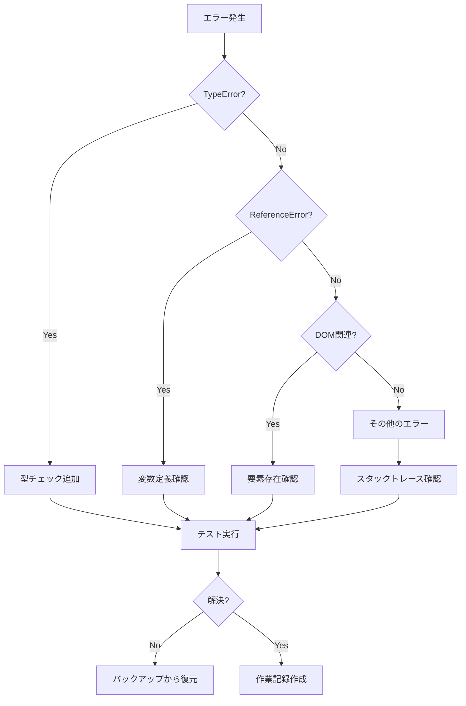

# 🚨 Trae向けエラー対策マニュアル - トラブルシューティング完全版

## 📋 エラー対応の基本原則

### 🔴 絶対守るルール
1. **パニックにならない** - エラーは必ず解決できる
2. **原因を特定してから修正** - 推測で修正しない
3. **バックアップから復元可能** - 最悪の場合の保険
4. **作業を記録する** - 同じエラーを繰り返さない

## 🎯 よく発生するエラーと解決法

### ❌ エラー1: TypeError: Cannot read properties of undefined (reading 'text')

#### 症状
```
TypeError: Cannot read properties of undefined (reading 'text')
    at QuestionManager.displayQuestion (QuestionManager.js:165)
```

#### 原因
- オブジェクトをインデックスとして使用している
- 質問データが正しく読み込まれていない
- undefinedな値にアクセスしている

#### 解決手順
```javascript
// 1. エラー箇所の特定
console.log('Debug - Index:', index);
console.log('Debug - Type:', typeof index);
console.log('Debug - Question:', this.questions[index]);

// 2. 型チェックを追加
if (typeof index === 'object') {
    // オブジェクトの場合の処理
    index = index.index || index.currentQuestion || 0;
}

// 3. 存在チェック
if (!this.questions || !this.questions[index]) {
    console.error('Question not found');
    return;
}

// 4. プロパティチェック
const question = this.questions[index];
if (!question.text) {
    console.error('Question text missing');
    return;
}
```

#### 確認コマンド
```bash
# エラーが解消されたか確認
npm run dev
# ブラウザのコンソールでエラーがないことを確認
```

---

### ❌ エラー2: Radio buttons not displaying (Q2以降)

#### 症状
- Q1では表示されるがQ2以降表示されない
- DOMに`<div>`要素はあるが`<input type="radio">`がない

#### 原因
- showQuestion()がQuestionManagerを正しく呼び出していない
- 別の関数がDOMを上書きしている

#### 解決手順
```javascript
// 1. 呼び出し元を確認
// os-analyzer-main.js
showQuestion() {
    console.log('🔍 showQuestion - current:', this.currentQuestion);
    
    // ❌ 間違い：オブジェクトを渡している
    // this.QuestionManager.displayQuestion(this.questions[this.currentQuestion]);
    
    // ✅ 正解：インデックスを渡す
    this.QuestionManager.displayQuestion(this.currentQuestion);
}

// 2. DOM生成を確認
// QuestionManager.js
const optionsHTML = question.options.map((option, i) => `
    <label class="option-label">
        <input type="radio" 
               name="q${questionIndex + 1}" 
               value="${option.value || i}">
        <span>${option.text}</span>
    </label>
`).join('');

// 3. DOM更新を確認
document.getElementById('options-container').innerHTML = optionsHTML;
```

#### デバッグ方法
```javascript
// ブラウザコンソールで実行
// ラジオボタンの数を確認
document.querySelectorAll('input[type="radio"]').length

// options-containerの内容確認
document.getElementById('options-container').innerHTML
```

---

### ❌ エラー3: Uncaught ReferenceError: QuestionManager is not defined

#### 症状
```
Uncaught ReferenceError: QuestionManager is not defined
    at os-analyzer-main.js:4211
```

#### 原因
- QuestionManagerが読み込まれていない
- インポート/初期化の順序が間違っている
- this.QuestionManagerではなくQuestionManagerを参照

#### 解決手順
```javascript
// 1. HTMLでの読み込み順確認
// os_analyzer.html
<script src="/js/core/QuestionManager.js"></script>
<script src="/js/os-analyzer-main.js"></script>

// 2. 初期化確認
// os-analyzer-main.js
class OSAnalyzer {
    constructor() {
        this.QuestionManager = new QuestionManager();
    }
}

// 3. 参照方法確認
// ❌ 間違い
QuestionManager.displayQuestion(0);

// ✅ 正解
this.QuestionManager.displayQuestion(0);
```

---

### ❌ エラー4: イベントリスナーの重複登録

#### 症状
- ボタンクリックで複数回処理が実行される
- 同じアラートが複数回表示される

#### 原因
- addEventListener が複数回実行されている
- 画面遷移時にリスナーが削除されていない

#### 解決手順
```javascript
// 1. フラグで重複防止
const btn = document.getElementById('nextBtn');
if (btn && !btn.dataset.listenerAttached) {
    btn.dataset.listenerAttached = 'true';
    btn.addEventListener('click', handler);
}

// 2. 古いリスナーを削除
btn.removeEventListener('click', oldHandler);
btn.addEventListener('click', newHandler);

// 3. イベント委譲を使用
document.addEventListener('click', (e) => {
    if (e.target.id === 'nextBtn') {
        // 処理
    }
});
```

---

### ❌ エラー5: localStorage関連エラー

#### 症状
```
QuotaExceededError: Failed to execute 'setItem' on 'Storage'
```

#### 原因
- localStorageの容量制限（5-10MB）
- 循環参照を含むオブジェクトの保存

#### 解決手順
```javascript
// 1. 容量確認
function getStorageSize() {
    let total = 0;
    for (let key in localStorage) {
        total += localStorage[key].length;
    }
    return total;
}

// 2. 古いデータ削除
localStorage.removeItem('old-key');

// 3. データ圧縮
const data = JSON.stringify(complexObject);
const compressed = LZString.compress(data); // ライブラリ使用
localStorage.setItem('key', compressed);

// 4. エラーハンドリング
try {
    localStorage.setItem('key', value);
} catch (e) {
    console.error('Storage full:', e);
    // 古いデータを削除して再試行
}
```

---

## 🔧 デバッグツールの使い方

### Chrome DevTools

#### 1. Consoleタブ
```javascript
// エラーの詳細確認
console.error(error);
console.trace(); // スタックトレース

// 変数の内容確認
console.log('Variable:', variable);
console.table(array); // 配列を表形式で表示

// 条件付きログ
console.assert(condition, 'Error message');
```

#### 2. Sourcesタブ
```javascript
// ブレークポイントの設定
debugger; // コード内に記述

// 条件付きブレークポイント
// 右クリック → Add conditional breakpoint
// 条件: index > 5
```

#### 3. Networkタブ
- ファイルの読み込み状況確認
- 404エラーの特定
- キャッシュの確認

### エラー収集スクリプト
```javascript
// error-collector.js
window.addEventListener('error', (e) => {
    const errorInfo = {
        message: e.message,
        source: e.filename,
        line: e.lineno,
        column: e.colno,
        error: e.error?.stack,
        timestamp: new Date().toISOString()
    };
    
    console.error('🚨 Error caught:', errorInfo);
    
    // エラーをlocalStorageに保存
    const errors = JSON.parse(localStorage.getItem('errors') || '[]');
    errors.push(errorInfo);
    localStorage.setItem('errors', JSON.stringify(errors));
});
```

---

## 🎯 エラー別対処フローチャート



---

## 🆘 緊急時の対処法

### 1. 画面が真っ白になった
```bash
# 1. コンソールエラー確認
# F12 → Console

# 2. ネットワークエラー確認
# F12 → Network → 赤い項目を探す

# 3. キャッシュクリア
# Ctrl + Shift + R

# 4. サーバー再起動
# Ctrl + C
npm run dev
```

### 2. 変更が反映されない
```bash
# 1. ファイルが保存されているか確認
git status

# 2. 正しいファイルを編集しているか確認
find . -name "*.js" -newer .git/index

# 3. ブラウザキャッシュクリア
# Chrome: 設定 → プライバシー → 閲覧履歴データ削除
```

### 3. Gitで間違えてコミットした
```bash
# 直前のコミットを取り消し（ファイルは残る）
git reset --soft HEAD~1

# 変更を破棄して前の状態に戻る
git reset --hard HEAD~1

# 特定のファイルだけ前の状態に戻す
git checkout HEAD~1 -- path/to/file
```

---

## 📝 エラーログテンプレート

```markdown
## エラーログ - $(date "+%Y/%m/%d %H:%M")

### エラー内容
- **エラーメッセージ**: 
- **発生場所**: ファイル名:行番号
- **発生タイミング**: （例：Q2表示時）

### 原因
- 

### 試した解決策
1. 
2. 
3. 

### 最終的な解決方法
- 

### 今後の予防策
- 
```

---

## 🔍 よく使うデバッグコマンド集

```javascript
// 要素の存在確認
document.getElementById('element-id')

// クラスを持つ要素の数
document.getElementsByClassName('class-name').length

// 特定の属性を持つ要素
document.querySelectorAll('[data-attribute="value"]')

// イベントリスナーの確認
getEventListeners(document.getElementById('button-id'))

// 変数の型確認
console.log(typeof variable)

// オブジェクトの構造確認
console.dir(object)

// 関数の定義確認
console.log(functionName.toString())

// パフォーマンス測定
console.time('operation');
// 処理
console.timeEnd('operation');

// メモリ使用量
console.memory
```

---

## 📚 参考リンク

### 公式ドキュメント
- [Chrome DevTools](https://developer.chrome.com/docs/devtools/)
- [MDN Web Docs - Debugging JavaScript](https://developer.mozilla.org/en-US/docs/Learn/JavaScript/First_steps/What_went_wrong)
- [JavaScript Error Reference](https://developer.mozilla.org/en-US/docs/Web/JavaScript/Reference/Errors)

### トラブルシューティング
- エラーメッセージをそのままGoogle検索
- Stack Overflowで類似の問題を検索
- GitHub Issuesで同じエラーを検索

---

## 🎯 最終チェックリスト

エラー対応完了後の確認：

- [ ] エラーが再現しないことを確認
- [ ] 新しいエラーが発生していないか確認
- [ ] コンソールがクリーンか確認
- [ ] パフォーマンスが低下していないか確認
- [ ] 他の機能が壊れていないか確認
- [ ] エラーログを記録
- [ ] 解決方法を文書化

---

**重要**: エラーは学習の機会です。
解決したエラーは必ず記録し、チームの知識として共有してください。