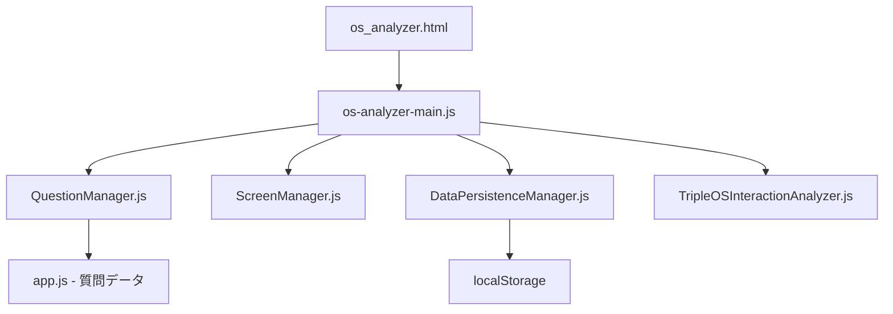

# 📁 Trae向けフォルダ構造説明書 - HAQEI Analyzer Project

## 🎯 この文書の目的
プロジェクトのフォルダ構造と各ファイルの役割を明確にし、正しいファイルを編集できるようにする

## 🚨 最重要：変更前の必須確認事項
```bash
# 1. 現在のブランチ確認
git status

# 2. CLAUDEルール確認
cat CLAUDE.md

# 3. 作業記録確認
ls -la .serena/memories/*$(date "+%Y%m%d")*
```

## 📂 プロジェクトルート構造

```
/Users/hideakimacbookair/Desktop/haqei-analyzer/
│
├── 📝 設定ファイル（触らない）
│   ├── package.json          # ⚠️ 削除厳禁
│   ├── package-lock.json     # ⚠️ 削除厳禁
│   ├── wrangler.toml         # Cloudflare設定
│   └── claude-mcp-config.json # MCP設定
│
├── 📚 ドキュメント
│   ├── CLAUDE.md            # 🔴 必読：開発ルール
│   ├── docs/                # 各種ドキュメント
│   └── .serena/memories/    # 作業記録（必須保存先）
│
├── 🌐 公開ファイル（メイン作業場所）
│   └── public/              # Webアプリケーション本体
│
├── 🗄️ データファイル（読み取り専用）
│   └── data/               # ⚠️ 編集・削除厳禁
│
├── 🔧 スクリプト
│   └── scripts/            # 開発用スクリプト
│
└── 📦 アーカイブ
    └── archives/           # 過去ファイルの保管場所
```

## 🎯 OS Analyzer 関連ファイル詳細

### 1️⃣ HTMLファイル（/public/）
```
public/
├── os_analyzer.html        # ✅ メインファイル（本番用）
├── os_analyzer_clean.html  # クリーン版
├── os_analyzer_a11y.html   # アクセシビリティ版
└── index.html              # トップページ
```

### 2️⃣ JavaScriptファイル構造（/public/js/）
```
public/js/
├── 🎮 メインコントローラー
│   └── os-analyzer-main.js    # 画面制御の中心
│
├── 📚 core/ （コア機能）
│   ├── QuestionManager.js     # ⭐ 質問表示管理（最重要）
│   ├── ScreenManager.js       # 画面遷移制御
│   ├── DataPersistenceManager.js # データ保存
│   ├── TripleOSInteractionAnalyzer.js # Triple OS分析
│   ├── YongProbabilityMonitor.js # 確率監視
│   ├── SeedableRandom.js      # 乱数生成
│   └── ExpressionGenerator.js # 表現生成
│
├── 🧩 components/ （UIコンポーネント）
│   ├── InteractiveSystem.js   # 対話システム
│   ├── ScoreVisualization.js  # スコア表示
│   └── ResultPageController.js # 結果画面制御
│
└── 📊 assets/js/ （データ定義）
    ├── app.js                  # ⚠️ 質問データ（重要）
    └── questions-unified-v2.js # 統一質問データ
```

### 3️⃣ CSSファイル（/public/css/）
```
public/css/
├── os-analyzer.css          # OS Analyzer専用スタイル
└── haqei-unified-design.css # 統一デザインシステム（青色基調）
```

## 🔍 重要ファイル詳細説明

### QuestionManager.js（最重要）
**場所**: `/public/js/core/QuestionManager.js`
**役割**: 
- 質問の表示管理
- ラジオボタンの生成
- 選択肢の制御
- 回答の記録

**主要メソッド**:
```javascript
- displayQuestion(index)     // 質問表示
- generateOptionsHTML()       // 選択肢HTML生成
- getSelectedAnswer()        // 選択された回答取得
- validateAnswer()           // 回答検証
```

### os-analyzer-main.js
**場所**: `/public/js/os-analyzer-main.js`
**役割**:
- アプリケーション全体の制御
- 画面遷移の管理
- 各モジュールの連携
- イベントハンドリング

**主要メソッド**:
```javascript
- init()                     // 初期化
- showQuestion()             // 質問画面表示
- handleNextButtonClick()    // 次へボタン処理
- showResults()              // 結果表示
```

### DataPersistenceManager.js
**場所**: `/public/js/core/DataPersistenceManager.js`
**役割**:
- localStorageへのデータ保存
- セッション管理
- データの永続化

## 🚫 絶対に触ってはいけないファイル

### データファイル（/data/）
```
data/
├── hexagrams.json           # 易経データ
├── h384.json               # H384データベース
├── enhanced_hexagrams_complete.json
└── *.json                  # すべてのJSONファイル
```
**理由**: データの整合性が崩れるとシステム全体が動作しなくなる

### 設定ファイル
- `package.json` - 削除したら即 `git restore package.json`
- `wrangler.toml` - Cloudflare設定
- `.env` ファイル（もしあれば）

## 📝 ファイル編集時の注意事項

### 編集前チェックリスト
```bash
# 1. ファイルの存在確認
ls -la /path/to/file

# 2. バックアップ作成
cp file.js file.js.backup_$(date "+%Y%m%d_%H%M%S")

# 3. 現在の内容確認
head -50 file.js
```

### 編集後チェックリスト
```bash
# 1. Lintチェック
npm run lint

# 2. エラー確認
npm run dev
# ブラウザのコンソールでエラー確認

# 3. 作業記録保存
echo "修正内容..." > .serena/memories/作業名_$(date "+%Y%m%d").md
```

## 🔄 ファイル間の依存関係



## 📌 よくある間違いと対処法

### 1. 間違ったファイルを編集
**症状**: 変更が反映されない
**対処**: 
```bash
# 正しいファイルパスを確認
find . -name "QuestionManager.js" -type f
# 結果: ./public/js/core/QuestionManager.js
```

### 2. データファイルを編集
**症状**: システムが動作しない
**対処**:
```bash
# Git で復元
git restore data/*.json
```

### 3. 重複ファイルの作成
**症状**: どのファイルが使われているか不明
**対処**:
```bash
# HTMLから参照されているファイルを確認
grep -n "QuestionManager" public/os_analyzer.html
```

## 🎯 作業時のベストプラクティス

### 1. 小さな変更から始める
```javascript
// まず console.log を追加して動作確認
console.log('🔍 Debug: Function called');
```

### 2. 段階的にテスト
```bash
# 各変更後に動作確認
npm run dev
# http://localhost:8788/os_analyzer.html
```

### 3. エラーログを活用
```javascript
try {
    // 処理
} catch (error) {
    console.error('❌ Error in QuestionManager:', error);
    console.trace();
}
```

## 📊 フォルダサイズ目安

| フォルダ | サイズ | ファイル数 | 重要度 |
|---------|--------|------------|--------|
| /public/js/core/ | ~500KB | 30+ | ⭐⭐⭐⭐⭐ |
| /public/js/components/ | ~200KB | 15+ | ⭐⭐⭐⭐ |
| /data/ | ~5MB | 10+ | ⚠️ 読取専用 |
| /archives/ | ~10MB | 100+ | 📦 参照用 |

## 🔍 デバッグ用コマンド集

```bash
# ファイル検索
find . -name "*Question*" -type f | grep -v node_modules

# 特定の関数を検索
grep -r "displayQuestion" public/js --include="*.js"

# 最近変更されたファイル
find public/js -type f -mtime -1 -name "*.js"

# ファイルの行数確認
wc -l public/js/core/QuestionManager.js

# Git差分確認
git diff public/js/core/QuestionManager.js
```

## 📝 最終確認

作業前に必ず確認：
1. ✅ CLAUDE.md を読んだ
2. ✅ 正しいファイルパスを確認した
3. ✅ バックアップを作成した
4. ✅ テスト環境を準備した
5. ✅ 作業記録の保存先を確認した

---

**注意**: このフォルダ構造は2025年1月18日時点のものです。
ファイルの移動や名前変更があった場合は、必ず最新の構造を確認してください。

```bash
# 最新構造の確認
ls -la public/js/core/
ls -la public/js/components/
```