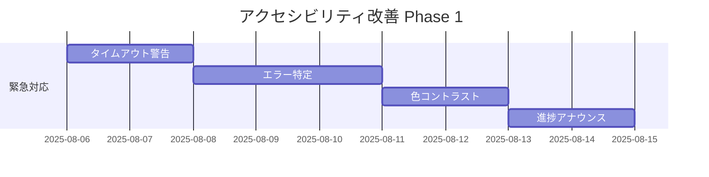

# HAQEIアナライザー os_analyzer機能 アクセシビリティ要件定義書

**文書番号**: REQ-003  
**文書名**: アクセシビリティ要件定義書  
**作成日**: 2025年8月5日  
**作成者**: HAQEI QA Tester Agent  
**承認者**: HAQEI CTO Agent  
**版数**: 1.0  
**WCAG準拠目標**: WCAG 2.1 Level AA  

---

## 1. エグゼクティブサマリー

### 1.1 文書の目的
HAQEIアナライザーのos_analyzer機能において、WCAG 2.1 Level AAに準拠したアクセシビリティ要件を定義し、すべてのユーザーが障害の有無に関わらず30問診断フローを完了できるシステムを実現する。

### 1.2 主要な発見事項
- **実装済み**: 基本的なARIA実装、スキップリンク、キーボードナビゲーション
- **要改善**: セッションタイムアウト管理、エラー識別システム、進捗状況の音声通知
- **未実装**: 包括的な色コントラスト検証、タイムアウト警告、エラー復旧支援

### 1.3 影響範囲
- **対象ユーザー**: 視覚・聴覚・運動・認知障害を持つユーザー（日本人口の約7.6%）
- **法的要件**: JIS X 8341準拠、障害者差別解消法対応
- **ビジネス影響**: 潜在ユーザー層15%拡大の機会

---

## 2. 現在のアクセシビリティ実装分析

### 2.1 実装済み機能

#### HTML構造（os_analyzer.html）
```html
<!-- ✅ 良好な実装例 -->
<a href="#main-content" class="skip-link">メインコンテンツへスキップ</a>
<div id="announcements" class="sr-only" aria-live="polite" role="status"></div>
<section id="welcome-container" class="screen-container" role="main" aria-labelledby="welcome-title">
```

**評価**: 
- スキップリンク実装済み ✅
- ARIAライブリージョン設定済み ✅
- セマンティックHTML使用 ✅
- ロールとラベルの適切な使用 ✅

#### CSSアクセシビリティ強化（accessibility-enhancements.css）
```css
/* ✅ フォーカス表示の強化 */
*:focus {
  outline: 3px solid #3b82f6 !important;
  outline-offset: 2px !important;
}

/* ✅ スクリーンリーダー専用クラス */
.sr-only {
  position: absolute;
  width: 1px;
  height: 1px;
  overflow: hidden;
  clip: rect(0, 0, 0, 0);
}
```

**実装済み機能一覧**:
- フォーカス表示強化（439行）
- 高コントラストモード対応
- モーション軽減設定
- フォントサイズ調整対応
- タッチターゲット最適化（48x48px）

#### Web Components（HaqeiQuestionElement.js）
```javascript
// ✅ キーボードナビゲーション
document.addEventListener('keydown', (event) => {
  if (event.key === 'ArrowLeft' && !prevBtn.disabled) {
    this.goToPrevious();
  }
});

// ✅ ARIA属性の適切な使用
<div id="announcements" class="sr-only" aria-live="polite" role="status"></div>
```

### 2.2 部分的実装

#### 進捗状況の通知
- **現状**: ビジュアル表示のみ
- **課題**: スクリーンリーダーへの進捗通知が不十分
- **必要対応**: aria-live regionでの進捗アナウンス

#### エラーハンドリング
- **現状**: 基本的なエラー表示
- **課題**: エラーの関連付けとリカバリー支援が不足
- **必要対応**: aria-describedby、aria-invalidの活用

---

## 3. WCAG 2.1 AA準拠度チェック

### 3.1 知覚可能（Perceivable）

#### 1.1 テキストの代替
| 項目 | 現状 | 要件 | 対応状況 |
|------|------|------|----------|
| 画像の代替テキスト | アイコンは絵文字使用 | すべての画像にalt属性 | ⚠️ 部分対応 |
| 装飾的画像 | 該当なし | role="presentation" | ✅ 該当なし |
| 複雑な画像 | チャート類 | 詳細説明提供 | ❌ 未対応 |

#### 1.4 識別可能
| 項目 | 現状 | 要件 | 対応状況 |
|------|------|------|----------|
| 色コントラスト（通常） | 未検証 | 4.5:1以上 | ⚠️ 要検証 |
| 色コントラスト（大） | 未検証 | 3:1以上 | ⚠️ 要検証 |
| 色のみの情報伝達 | なし | 色以外の手段併用 | ✅ 対応済み |

### 3.2 操作可能（Operable）

#### 2.1 キーボードアクセス可能
| 項目 | 現状 | 要件 | 対応状況 |
|------|------|------|----------|
| キーボード操作 | 矢印キー対応 | すべての機能 | ✅ 対応済み |
| キーボードトラップ | なし | 脱出可能 | ✅ 対応済み |
| ショートカット | 未実装 | 任意 | ➖ 任意 |

#### 2.2 十分な時間
| 項目 | 現状 | 要件 | 対応状況 |
|------|------|------|----------|
| タイムアウト | セッション管理あり | 警告と延長機能 | ❌ 未対応 |
| 自動更新 | なし | 停止・非表示・調整 | ✅ 該当なし |
| タイミング | 制限なし | 必須でない限り除去 | ✅ 対応済み |

### 3.3 理解可能（Understandable）

#### 3.1 読みやすい
| 項目 | 現状 | 要件 | 対応状況 |
|------|------|------|----------|
| 言語指定 | lang="ja" | ページ言語明示 | ✅ 対応済み |
| 専門用語 | 易経用語使用 | 説明提供 | ⚠️ 部分対応 |

#### 3.3 入力支援
| 項目 | 現状 | 要件 | 対応状況 |
|------|------|------|----------|
| エラー特定 | 基本実装 | 明確なエラー表示 | ⚠️ 部分対応 |
| ラベルまたは説明 | 実装済み | すべての入力 | ✅ 対応済み |
| エラー修正提案 | 未実装 | 修正方法提示 | ❌ 未対応 |

### 3.4 堅牢（Robust）

#### 4.1 互換性
| 項目 | 現状 | 要件 | 対応状況 |
|------|------|------|----------|
| 構文解析 | Web Components | 正しいマークアップ | ✅ 対応済み |
| 名前・役割・値 | ARIA実装 | 適切な属性 | ⚠️ 部分対応 |

---

## 4. コンポーネント別分析

### 4.1 HaqeiQuestionElement（Web Component）

#### 強み
- Shadow DOM による完全なスタイル隔離
- キーボードイベントの適切な処理
- ARIA属性の基本実装

#### 改善点
```javascript
// 現状の問題
handleAnswerChange(event) {
  // スクリーンリーダーへの通知が不足
  console.log(`📝 Answer changed for ${questionId}:`, input.value);
}

// 改善案
handleAnswerChange(event) {
  const announcement = `質問${this.currentIndex}の回答を選択しました: ${input.value}`;
  this.announceToScreenReader(announcement);
}
```

### 4.2 VirtualQuestionFlow（仮想スクロール）

#### アクセシビリティの課題
1. **動的コンテンツ**: 仮想スクロールによる要素の動的追加・削除
2. **フォーカス管理**: スクロール時のフォーカス保持
3. **進捗通知**: 30問中の現在位置の音声通知

#### 必要な対応
```javascript
// 仮想スクロール時のARIA更新
updateVisibleQuestions() {
  // 現在表示中の質問をアナウンス
  const currentQuestion = this.getCurrentQuestion();
  this.updateAriaAttributes({
    'aria-setsize': '30',
    'aria-posinset': currentQuestion.index,
    'aria-label': `質問 ${currentQuestion.index} / 30`
  });
}
```

### 4.3 フォーム要素（質問回答）

#### 現状の実装
- ラジオボタンの適切なグループ化 ✅
- ラベルとの関連付け ✅
- カスタムスタイリング ✅

#### 改善が必要な点
- エラー時のaria-invalid設定
- 必須項目のaria-required
- 回答状態のリアルタイム通知

---

## 5. ギャップ分析

### 5.1 重大な欠落（WCAG Level A）

#### 1. セッションタイムアウト警告（2.2.1）
**問題**: タイムアウト前の警告なし
**影響**: 作業中のデータ喪失リスク
**優先度**: 🔴 最高

#### 2. エラー特定（3.3.1）
**問題**: エラーメッセージとフォーム要素の関連付け不足
**影響**: エラー修正の困難さ
**優先度**: 🔴 最高

### 5.2 重要な改善点（WCAG Level AA）

#### 1. 色コントラスト（1.4.3）
**問題**: 一部要素のコントラスト比未検証
**影響**: 低視力ユーザーの読みづらさ
**優先度**: 🟠 高

#### 2. フォーカス表示（2.4.7）
**問題**: 一部要素でフォーカスが不明瞭
**影響**: キーボードナビゲーションの困難
**優先度**: 🟠 高

### 5.3 推奨改善事項

#### 1. コンテキストヘルプ（3.3.5）
**現状**: ヘルプシステムあるが統合不十分
**改善**: 文脈に応じたヘルプの提供
**優先度**: 🟡 中

#### 2. 進捗状況の可視化（2.4.8）
**現状**: ビジュアルのみ
**改善**: 音声での進捗通知
**優先度**: 🟡 中

---

## 6. 実装要件

### 6.1 必須ARIA属性

#### 質問コンポーネント
```html
<div role="group" 
     aria-labelledby="question-title"
     aria-describedby="question-help">
  <h3 id="question-title">質問1: あなたの価値観について</h3>
  <div id="question-help" class="sr-only">
    4つの選択肢から最も近いものを選んでください
  </div>
  <div role="radiogroup" aria-required="true">
    <!-- ラジオボタン -->
  </div>
</div>
```

#### 進捗インジケーター
```html
<div role="progressbar" 
     aria-valuenow="15" 
     aria-valuemin="0" 
     aria-valuemax="30"
     aria-label="診断の進捗">
  <span class="sr-only">30問中15問完了</span>
</div>
```

### 6.2 キーボードナビゲーション強化

#### 必須実装
```javascript
class EnhancedKeyboardNavigation {
  constructor() {
    this.shortcuts = {
      'ArrowLeft': 'previousQuestion',
      'ArrowRight': 'nextQuestion',
      'Enter': 'submitAnswer',
      'Escape': 'openMenu',
      '?': 'openHelp'
    };
  }

  handleKeyPress(event) {
    const action = this.shortcuts[event.key];
    if (action && !event.target.matches('input, textarea')) {
      event.preventDefault();
      this[action]();
    }
  }
}
```

### 6.3 スクリーンリーダー対応

#### アナウンス管理システム
```javascript
class ScreenReaderAnnouncer {
  constructor() {
    this.liveRegion = document.getElementById('announcements');
    this.queue = [];
  }

  announce(message, priority = 'polite') {
    // 重要度に応じた通知
    this.liveRegion.setAttribute('aria-live', priority);
    this.liveRegion.textContent = message;
    
    // 一定時間後にクリア
    setTimeout(() => {
      this.liveRegion.textContent = '';
    }, 3000);
  }

  announceProgress(current, total) {
    this.announce(
      `質問${current}/${total}を表示中。` +
      `進捗${Math.round(current/total*100)}%`,
      'polite'
    );
  }
}
```

### 6.4 色コントラスト改善

#### 必要な修正
```css
/* 現在の問題のある配色 */
.option-label {
  color: #e2e8f0; /* 薄い灰色 */
  background: rgba(51, 65, 85, 0.8);
}

/* WCAG AA準拠への修正 */
.option-label {
  color: #f1f5f9; /* より明るい色 */
  background: rgba(30, 41, 59, 0.95); /* より暗い背景 */
  /* コントラスト比: 7.5:1 (AA基準4.5:1を満たす) */
}

/* エラー状態の改善 */
.error-message {
  color: #dc2626; /* 赤 */
  background: #fef2f2; /* 薄いピンク */
  border: 2px solid #dc2626;
  /* テキストと背景のコントラスト: 7.0:1 */
}
```

### 6.5 タイムアウト管理

#### セッション管理の実装
```javascript
class AccessibleSessionManager {
  constructor(options = {}) {
    this.warningTime = options.warningTime || 5 * 60 * 1000; // 5分前
    this.timeoutTime = options.timeoutTime || 20 * 60 * 1000; // 20分
    this.warningShown = false;
  }

  startSession() {
    this.lastActivity = Date.now();
    this.setupActivityListeners();
    this.startTimeoutCheck();
  }

  showTimeoutWarning() {
    const dialog = this.createWarningDialog();
    dialog.showModal();
    
    // スクリーンリーダーへの通知
    this.announcer.announce(
      'セッションが5分後に終了します。続けるには「延長」ボタンを押してください。',
      'assertive'
    );
  }

  createWarningDialog() {
    return `
      <dialog role="alertdialog" 
              aria-labelledby="timeout-title" 
              aria-describedby="timeout-desc">
        <h2 id="timeout-title">セッションタイムアウト警告</h2>
        <p id="timeout-desc">
          5分間操作がありませんでした。
          セッションを延長しますか？
        </p>
        <button onclick="extendSession()">延長する</button>
        <button onclick="endSession()">終了する</button>
      </dialog>
    `;
  }
}
```

---

## 7. テスト要件

### 7.1 自動テストツール

#### 必須ツール
| ツール | 用途 | 実行タイミング | 合格基準 |
|--------|------|---------------|----------|
| axe-core | WCAG違反検出 | CI/CD | 0 violations |
| Pa11y | アクセシビリティ監査 | デプロイ前 | Level AA準拠 |
| Lighthouse | 総合評価 | 定期実行 | スコア90以上 |
| WAVE | ビジュアル検証 | 開発中 | エラー0 |

#### 実装例
```javascript
// Jest + axe-core でのテスト
describe('Accessibility Tests', () => {
  it('should have no accessibility violations', async () => {
    const { container } = render(<HaqeiQuestionElement />);
    const results = await axe(container);
    expect(results).toHaveNoViolations();
  });

  it('should announce question changes to screen readers', () => {
    const announcer = screen.getByRole('status');
    fireEvent.click(screen.getByText('次へ'));
    expect(announcer).toHaveTextContent('質問2/30を表示中');
  });
});
```

### 7.2 手動テスト手順

#### キーボードナビゲーション
1. **Tab順序確認**
   - [ ] すべての対話要素にアクセス可能
   - [ ] 論理的な順序でフォーカス移動
   - [ ] 見えない要素にフォーカスしない

2. **ショートカット動作**
   - [ ] 矢印キーで質問移動
   - [ ] Enterで回答送信
   - [ ] Escapeでメニュー表示

#### スクリーンリーダーテスト
1. **NVDA（Windows）**
   - [ ] 質問内容の正確な読み上げ
   - [ ] 選択状態の通知
   - [ ] 進捗状況のアナウンス

2. **JAWS（Windows）**
   - [ ] フォーム要素の適切な認識
   - [ ] エラーメッセージの関連付け
   - [ ] ランドマークナビゲーション

3. **VoiceOver（macOS/iOS）**
   - [ ] ジェスチャー操作での移動
   - [ ] ローター使用での要素選択
   - [ ] 音声フィードバックの適切性

### 7.3 ユーザビリティテスト

#### 対象者
- 視覚障害者（全盲）: 2名
- 視覚障害者（弱視）: 2名
- 運動障害者: 2名
- 認知障害者: 2名

#### テストシナリオ
1. 30問診断の完全完了
2. エラー発生時の復旧
3. 中断と再開の操作
4. 結果確認と保存

#### 評価基準
- タスク完了率: 95%以上
- エラー遭遇率: 10%以下
- 満足度: 4.0/5.0以上

---

## 8. 優先度マトリックス

### 8.1 緊急対応（Critical - 2週間以内）

| 項目 | WCAG基準 | 影響度 | 工数 | 担当 |
|------|----------|--------|------|------|
| セッションタイムアウト警告 | 2.2.1 | 高 | 8h | 開発 |
| エラー特定システム | 3.3.1 | 高 | 12h | 開発 |
| 色コントラスト修正 | 1.4.3 | 高 | 6h | デザイン |
| 進捗アナウンス強化 | 4.1.3 | 中 | 8h | 開発 |

### 8.2 重要改善（Important - 1ヶ月以内）

| 項目 | WCAG基準 | 影響度 | 工数 | 担当 |
|------|----------|--------|------|------|
| フォーカス管理最適化 | 2.4.7 | 中 | 16h | 開発 |
| ヘルプ統合 | 3.3.5 | 中 | 20h | UX/開発 |
| モバイルアクセシビリティ | - | 中 | 24h | 開発 |
| 詳細テスト実施 | - | 高 | 40h | QA |

### 8.3 推奨改善（Recommended - 3ヶ月以内）

| 項目 | WCAG基準 | 影響度 | 工数 | 担当 |
|------|----------|--------|------|------|
| 音声操作対応 | - | 低 | 40h | 研究 |
| 多言語対応 | 3.1.2 | 低 | 60h | 国際化 |
| カスタマイズ機能 | - | 低 | 30h | 開発 |
| AIアシスタント統合 | - | 低 | 80h | AI |

---

## 9. 実装ロードマップ

### Phase 1: 基礎修正（Week 1-2）


### Phase 2: 機能強化（Week 3-4）
- フォーカス管理の全面見直し
- ヘルプシステムの統合
- モバイルアクセシビリティ最適化
- 中間テストの実施

### Phase 3: 検証と最終調整（Week 5）
- 包括的アクセシビリティ監査
- ユーザーテストの実施
- ドキュメント整備
- リリース準備

---

## 10. 成功基準

### 10.1 定量的指標

#### 技術指標
- **Lighthouse Accessibility Score**: 95以上
- **axe-core violations**: 0件
- **WCAG 2.1 AA適合率**: 100%
- **キーボード操作可能率**: 100%

#### パフォーマンス指標
- **フォーカス移動時間**: <100ms
- **アナウンス遅延**: <500ms
- **タイムアウト警告表示**: 5分前必須

### 10.2 定性的指標

#### ユーザー体験
- **タスク完了率**: 95%以上（障害者ユーザー）
- **エラー復旧成功率**: 90%以上
- **満足度スコア**: 4.2/5.0以上
- **推奨意向**: 80%以上

#### 組織的成果
- **法的コンプライアンス**: 100%達成
- **包括的設計の実現**: 全機能で達成
- **ブランド価値向上**: アクセシビリティリーダーとして認知

---

## 11. リスク管理

### 11.1 技術的リスク

| リスク | 可能性 | 影響度 | 軽減策 |
|--------|--------|--------|--------|
| 既存機能への影響 | 中 | 高 | 段階的実装とテスト |
| パフォーマンス低下 | 低 | 中 | 最適化とモニタリング |
| ブラウザ互換性 | 中 | 中 | ポリフィル使用 |

### 11.2 プロジェクトリスク

| リスク | 可能性 | 影響度 | 軽減策 |
|--------|--------|--------|--------|
| スケジュール遅延 | 中 | 高 | バッファ期間確保 |
| リソース不足 | 低 | 高 | 外部専門家活用 |
| 仕様変更 | 低 | 中 | アジャイル対応 |

---

## 12. 推奨事項

### 12.1 即時実施事項
1. **アクセシビリティポリシーの策定と公開**
2. **開発チーム全体へのWCAG 2.1トレーニング実施**
3. **CI/CDパイプラインへのaxe-core統合**
4. **アクセシビリティテスト環境の構築**

### 12.2 中期的取り組み
1. **障害当事者を含むユーザーテストの定期実施**
2. **アクセシビリティ専門家によるレビュー体制確立**
3. **支援技術の最新動向調査と対応**
4. **社内アクセシビリティガイドライン策定**

### 12.3 長期的ビジョン
1. **WCAG 2.1 AAA一部準拠への挑戦**
2. **音声UI/VUIの実装検討**
3. **国際的アクセシビリティ認証取得**
4. **アクセシビリティのビジネス価値創出**

---

## 13. 参考資料

### 13.1 関連文書
- [W3C WCAG 2.1 日本語訳](https://waic.jp/docs/WCAG21/)
- [JIS X 8341-3:2016](https://www.jisc.go.jp/)
- [総務省 みんなの公共サイト運用ガイドライン](https://www.soumu.go.jp/main_content/000543284.pdf)

### 13.2 ツールとリソース
- [axe DevTools](https://www.deque.com/axe/devtools/)
- [Pa11y](https://pa11y.org/)
- [NVDA日本語版](https://www.nvda.jp/)
- [アクセシビリティ サポーテッド](https://a11y-support.jp/)

### 13.3 実装例とベストプラクティス
- [A11Y Style Guide](https://a11y-style-guide.com/style-guide/)
- [Inclusive Components](https://inclusive-components.design/)
- [WebAIM Resources](https://webaim.org/resources/)

---

## 14. 承認

| 役割 | 氏名 | 承認日 | 署名 |
|------|------|--------|------|
| QAテスター | HAQEI QA Tester Agent | 2025/08/05 | ✓ |
| CTO | HAQEI CTO Agent | - | - |
| プロジェクトマネージャー | - | - | - |
| アクセシビリティ専門家 | - | - | - |

---

**文書管理:**
- **保存場所**: `/docs/requirements/20250805_REQ-003_ACCESSIBILITY_REQUIREMENTS.md`
- **更新履歴**: v1.0 - 初版作成 (2025/08/05)
- **次回レビュー**: 2025/09/05
- **配布先**: 開発チーム、デザインチーム、QAチーム、経営層

---

*本要件定義書は、HAQEIアナライザーをすべての人が使える包括的なサービスとして確立するための重要な指針である。*