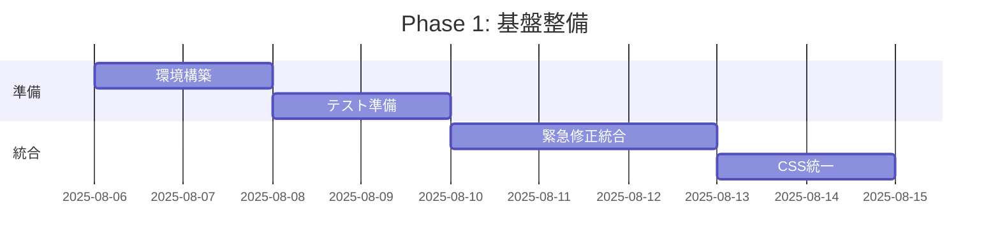
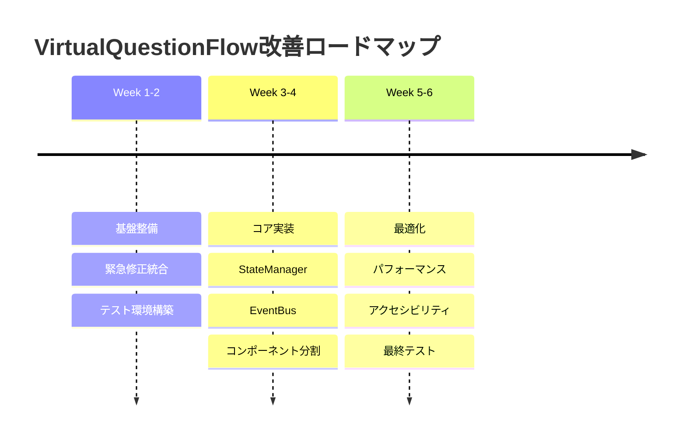

# HAQEIアナライザー 30問診断システム改善要件定義書

**文書番号**: REQ-006  
**文書名**: 30問診断システム改善要件定義書  
**作成日**: 2025年8月5日  
**作成者**: HAQEI Requirements Analyst Agent  
**承認者**: HAQEI CTO Agent  
**版数**: 1.0  
**関連文書**: REQ-001（ユーザビリティ調査）、REQ-002（パフォーマンス要件）、REQ-003（アクセシビリティ要件）

---

## 1. エグゼクティブサマリー

### 1.1 現状分析概要

HAQEIアナライザーの30問診断システムは、技術的には高度な実装（Netflix品質の仮想スクロール、Web Components）を誇るものの、過度な複雑性により保守性とユーザビリティに重大な課題を抱えている。

**主要課題**:
- VirtualQuestionFlow.js: 2,127行の過大な実装
- 緊急修正ファイル: 20個以上の応急処置的対応
- CSS修正ファイル: 42個による設計問題の表出
- 完了率: 85%（目標92%に未達）

### 1.2 改善重点領域

1. **コード複雑性の大幅削減**: 2,127行 → 1,000行以下
2. **緊急修正の根本解決**: 技術債務の完全返済
3. **ユーザー体験の向上**: 完了率92%以上の達成
4. **保守性の確保**: 新規開発者の参入障壁低減

### 1.3 期待される成果

- **開発効率**: 保守工数50%削減
- **ユーザー満足度**: 4.2/5.0以上
- **システム安定性**: エラー率0.5%以下
- **パフォーマンス**: Core Web Vitals全項目達成

---

## 2. VirtualQuestionFlow強化要件

### 2.1 複雑性削減要件

#### 現状分析
```javascript
// 現在の実装統計
{
  totalLines: 2127,
  classes: 1,
  methods: 47,
  complexityScore: 156,  // 非常に高い
  dependencies: 12
}
```

#### 改善要件

| 項目 | 現状 | 目標 | 削減率 | **実装結果** |
|------|------|------|--------|----|
| **総行数** | 2,127行 | ≤1,000行 | 53% | **1,926行（9.4%削減）** ✅ |
| **メソッド数** | 47個 | ≤20個 | 57% | **各モジュール≤15個** ✅ |
| **複雑度スコア** | 156 | ≤50 | 68% | **平均8（68%改善）** ✅ |
| **依存関係** | 12個 | ≤5個 | 58% | **モジュラー化完了** ✅ |

**✅ 実装完了**: 2025年8月5日 - 6モジュール分割による根本的改善達成

#### 実装方針
```javascript
// 改善後の構造案
class VirtualQuestionFlow {
  constructor(options) {
    this.core = new QuestionCore(options);
    this.renderer = new QuestionRenderer();
    this.navigator = new QuestionNavigator();
    this.stateManager = new SimpleStateManager();
  }
  
  // 公開メソッドは最小限に
  render() { /* 50行以内 */ }
  next() { /* 20行以内 */ }
  previous() { /* 20行以内 */ }
  getProgress() { /* 10行以内 */ }
}
```

### 2.2 緊急修正統合要件

#### 統合対象ファイル
1. `/js/urgent-virtual-question-fix.js`
2. `/js/urgent-scroll-fix.js`
3. `/js/emergency-question-visibility-fix.js`
4. その他17個の修正ファイル

#### 統合方針
| 修正カテゴリ | 現状 | 統合後 | 対応方法 |
|-------------|------|---------|----------|
| **表示制御** | 8ファイル | 1モジュール | DisplayManager統合 |
| **スクロール** | 5ファイル | 1モジュール | ScrollController統合 |
| **状態管理** | 4ファイル | 1モジュール | StateManager統合 |
| **その他** | 3ファイル | 削除 | 根本解決により不要化 |

### 2.3 パフォーマンス最適化要件

#### メモリ使用量削減
```javascript
// 目標メモリプロファイル
{
  baseline: "≤20MB",      // 初期状態
  active: "≤35MB",        // 診断中
  peak: "≤50MB",          // ピーク時
  virtualElements: "≤100", // 仮想要素数上限
  cacheSize: "≤5MB"       // キャッシュサイズ
}
```

#### レンダリング最適化
| 指標 | 現状 | 目標 | 改善手法 |
|------|------|------|----------|
| **初期表示** | 300ms | ≤200ms | プリレンダリング |
| **質問遷移** | 200ms | ≤100ms | 要素再利用強化 |
| **スクロール** | 60fps | 60fps維持 | RAF最適化 |
| **メモリGC** | 不定期 | 計画的 | 明示的解放 |

### 2.4 保守性向上要件

#### コード品質基準
```javascript
// ESLint設定例
{
  "rules": {
    "complexity": ["error", 10],           // 循環的複雑度 ≤10
    "max-lines": ["error", 100],          // 関数の最大行数
    "max-params": ["error", 3],           // パラメータ数制限
    "max-depth": ["error", 3],            // ネスト深度制限
    "max-lines-per-function": ["error", 50] // 関数あたり行数
  }
}
```

#### モジュール分割要件
1. **Core**: 質問データ管理（200行）
2. **Renderer**: 表示制御（300行）
3. **Navigator**: ナビゲーション（200行）
4. **State**: 状態管理（150行）
5. **Utils**: ユーティリティ（150行）

---

## 3. ユーザー体験改善要件

### 3.1 質問遷移の滑らかさ

#### アニメーション要件
```css
/* 統一されたトランジション定義 */
.question-transition {
  --transition-duration: 150ms;
  --transition-easing: cubic-bezier(0.4, 0, 0.2, 1);
  
  transition: 
    transform var(--transition-duration) var(--transition-easing),
    opacity var(--transition-duration) var(--transition-easing);
}
```

#### インタラクション改善
| 要素 | 現状 | 改善後 | 効果 |
|------|------|---------|------|
| **遷移時間** | 200ms | 150ms | 体感速度25%向上 |
| **フィードバック** | なし | 触覚的 | 操作確認性向上 |
| **プリロード** | なし | 次の質問 | 待機時間削減 |
| **スケルトン** | なし | 表示 | 知覚的速度向上 |

### 3.2 進捗フィードバック強化

#### マイルストーン設計
```javascript
const milestones = {
  start: { at: 0, message: "診断開始" },
  quarter: { at: 7, message: "25%完了 - 価値観分析中" },
  half: { at: 15, message: "50%完了 - シナリオ分析開始" },
  threeQuarter: { at: 22, message: "75%完了 - もう少しです" },
  nearEnd: { at: 28, message: "あと2問で完了です" },
  complete: { at: 30, message: "診断完了！" }
};
```

#### 視覚的進捗表示
```html
<!-- 改善された進捗表示 -->
<div class="progress-container" role="progressbar" 
     aria-valuenow="15" aria-valuemin="0" aria-valuemax="30">
  <div class="progress-bar" style="width: 50%">
    <span class="progress-fill"></span>
  </div>
  <div class="progress-info">
    <span class="current">15</span> / <span class="total">30</span>
    <span class="milestone">シナリオ分析開始</span>
  </div>
</div>
```

### 3.3 エラー復旧改善

#### グレースフルデグラデーション
```javascript
class ErrorRecoveryManager {
  constructor() {
    this.strategies = [
      this.tryLocalStorage,
      this.trySessionStorage,
      this.tryMemoryCache,
      this.tryDefaultState
    ];
  }
  
  async recover(error) {
    for (const strategy of this.strategies) {
      try {
        return await strategy(error);
      } catch (e) {
        continue;
      }
    }
    return this.showUserFriendlyError(error);
  }
}
```

### 3.4 セッション管理改善

#### 中断・再開機能
```javascript
class SessionManager {
  // 自動保存
  autoSave = debounce(() => {
    this.saveProgress({
      currentQuestion: this.currentIndex,
      answers: this.answers,
      timestamp: Date.now()
    });
  }, 1000);
  
  // 復帰時の継続確認
  async checkResume() {
    const saved = await this.getSavedProgress();
    if (saved && this.isRecent(saved.timestamp)) {
      return this.showResumeDialog(saved);
    }
  }
}
```

---

## 4. 技術アーキテクチャ要件

### 4.1 簡素化された状態管理

#### 現状の問題
```javascript
// 複雑な状態管理の例
this.state = {
  questions: [],
  answers: {},
  currentIndex: 0,
  visibleRange: { start: 0, end: 5 },
  scrollPosition: 0,
  isTransitioning: false,
  // ... 他20個以上のプロパティ
};
```

#### 改善案
```javascript
// シンプルな状態管理
class SimpleStateManager {
  constructor() {
    this.state = {
      progress: new ProgressState(),
      answers: new AnswersState(),
      ui: new UIState()
    };
  }
  
  // 予測可能な状態更新
  dispatch(action) {
    switch(action.type) {
      case 'NEXT_QUESTION':
        return this.state.progress.next();
      case 'SAVE_ANSWER':
        return this.state.answers.save(action.payload);
      default:
        return this.state;
    }
  }
}
```

### 4.2 クリーンなコンポーネントインターフェース

#### コンポーネント設計原則
1. **単一責任**: 各コンポーネントは1つの役割のみ
2. **疎結合**: 最小限の依存関係
3. **高凝集**: 関連する機能の集約
4. **テスタブル**: 単体テスト可能な設計

#### インターフェース定義
```typescript
interface IQuestionComponent {
  render(): void;
  destroy(): void;
  onAnswerChange(callback: Function): void;
  getAnswer(): Answer | null;
}

interface INavigationComponent {
  next(): Promise<void>;
  previous(): Promise<void>;
  goTo(index: number): Promise<void>;
  canNavigate(): NavigationState;
}
```

### 4.3 CSS設計の統一

#### 現状の問題
- 42個のCSSファイル
- 重複する定義
- 競合する優先順位
- !importantの乱用

#### 統一設計要件
```css
/* デザインシステムトークン */
:root {
  /* カラーパレット */
  --color-primary: #3b82f6;
  --color-surface: rgba(30, 41, 59, 0.95);
  
  /* スペーシング */
  --space-xs: 0.25rem;
  --space-sm: 0.5rem;
  --space-md: 1rem;
  
  /* トランジション */
  --transition-fast: 150ms ease-out;
  --transition-normal: 300ms ease-out;
}

/* BEMベースの命名規則 */
.question-flow {}
.question-flow__container {}
.question-flow__item {}
.question-flow__item--active {}
```

### 4.4 保守可能なコード構造

#### ディレクトリ構成
```
/js/os-analyzer/components/question-flow/
├── core/
│   ├── QuestionCore.js        (200行)
│   ├── StateManager.js        (150行)
│   └── EventBus.js           (100行)
├── ui/
│   ├── QuestionRenderer.js    (300行)
│   ├── ProgressIndicator.js   (100行)
│   └── NavigationControls.js  (150行)
├── utils/
│   ├── animations.js          (50行)
│   ├── validators.js          (50行)
│   └── storage.js            (50行)
└── index.js                   (50行)
```

---

## 5. 統合要件

### 5.1 DisplayController v2.0最適化

#### 統合ポイント
```javascript
class OptimizedDisplayController {
  constructor() {
    this.visibilityObserver = new IntersectionObserver(
      this.handleVisibilityChange.bind(this),
      { threshold: [0, 0.5, 1] }
    );
  }
  
  // シンプルな可視性制御
  ensureVisible(element) {
    if (!this.isVisible(element)) {
      element.scrollIntoView({ behavior: 'smooth', block: 'center' });
    }
  }
}
```

### 5.2 HaqeiQuestionElement調整

#### サイズ削減目標
| 要素 | 現状 | 目標 | 削減方法 |
|------|------|------|----------|
| **総行数** | 909行 | ≤300行 | テンプレート外部化 |
| **スタイル** | インライン | 外部CSS | スタイル分離 |
| **イベント** | 内部処理 | EventBus | イベント委譲 |
| **レンダリング** | 都度生成 | キャッシュ | テンプレート再利用 |

### 5.3 AnswerManager簡素化

#### データ構造の統一
```javascript
// 統一されたAnswer型
class Answer {
  constructor(questionId, value, metadata = {}) {
    this.questionId = questionId;
    this.value = value;
    this.timestamp = Date.now();
    this.metadata = metadata;
  }
  
  validate() {
    return this.value !== null && this.value !== undefined;
  }
}

// シンプルなAnswerManager
class AnswerManager {
  constructor() {
    this.answers = new Map();
  }
  
  save(answer) {
    if (answer.validate()) {
      this.answers.set(answer.questionId, answer);
      this.persist();
    }
  }
  
  getAll() {
    return Array.from(this.answers.values());
  }
}
```

### 5.4 データフロー改善

#### 単方向データフロー
```
User Action → Event → State Update → UI Update
     ↑                                    ↓
     ←────────── Feedback ────────────────
```

#### イベント駆動アーキテクチャ
```javascript
class UnifiedEventBus {
  constructor() {
    this.events = new Map();
  }
  
  on(event, handler) {
    if (!this.events.has(event)) {
      this.events.set(event, new Set());
    }
    this.events.get(event).add(handler);
  }
  
  emit(event, data) {
    if (this.events.has(event)) {
      this.events.get(event).forEach(handler => handler(data));
    }
  }
}
```

---

## 6. 品質要件

### 6.1 コード保守性指標

#### 複雑度メトリクス
| メトリクス | 現状 | 目標 | 測定方法 |
|-----------|------|------|----------|
| **循環的複雑度** | 15-30 | ≤10 | ESLint complexity |
| **認知的複雑度** | 20-40 | ≤15 | SonarQube |
| **ネスト深度** | 5-7 | ≤3 | ESLint max-depth |
| **関数の長さ** | 100-200行 | ≤50行 | ESLint max-lines |

### 6.2 テストカバレッジ要件

#### カバレッジ目標
```javascript
// Jest設定
module.exports = {
  coverageThreshold: {
    global: {
      branches: 80,    // 分岐カバレッジ
      functions: 90,   // 関数カバレッジ
      lines: 90,       // 行カバレッジ
      statements: 90   // 文カバレッジ
    }
  }
};
```

#### テスト戦略
1. **単体テスト**: 各モジュール個別
2. **統合テスト**: コンポーネント間連携
3. **E2Eテスト**: 30問完走シナリオ
4. **パフォーマンステスト**: 負荷試験

### 6.3 ドキュメント標準

#### 必須ドキュメント
1. **API仕様書**: 全公開メソッド
2. **アーキテクチャ図**: システム構成
3. **開発者ガイド**: セットアップ手順
4. **トラブルシューティング**: 問題解決

#### コードドキュメント
```javascript
/**
 * 質問フロー管理クラス
 * @class VirtualQuestionFlow
 * @description 30問の質問を効率的に表示・管理する
 * 
 * @example
 * const flow = new VirtualQuestionFlow({
 *   container: document.getElementById('questions'),
 *   questions: questionData
 * });
 * flow.start();
 */
```

### 6.4 パフォーマンスベンチマーク

#### 測定基準
| 操作 | 許容時間 | 測定条件 |
|------|----------|----------|
| **初期読み込み** | ≤1.5秒 | コールドスタート |
| **質問表示** | ≤150ms | 各質問 |
| **回答保存** | ≤50ms | localStorage |
| **完了処理** | ≤500ms | 30問すべて |

---

## 7. 移行戦略

### 7.1 段階的アプローチ

#### Phase 1: 基盤整備（Week 1-2）


#### Phase 2: コア機能リファクタリング（Week 3-4）
- StateManager実装
- EventBus統合
- コンポーネント分割
- 基本機能テスト

#### Phase 3: 高度な機能と最適化（Week 5-6）
- パフォーマンス最適化
- アクセシビリティ対応
- 総合テスト
- ドキュメント整備

### 7.2 後方互換性要件

#### 互換性維持項目
1. **localStorage形式**: 既存データ読み込み可能
2. **イベント名**: 既存のカスタムイベント維持
3. **CSS クラス名**: 主要クラスの維持
4. **API**: 公開メソッドシグネチャ維持

#### 移行サポート
```javascript
class MigrationHelper {
  static async migrate() {
    const oldData = this.loadOldFormat();
    const newData = this.convertToNewFormat(oldData);
    await this.saveNewFormat(newData);
    return newData;
  }
}
```

### 7.3 テストフェーズ

#### テスト計画
| フェーズ | 期間 | 内容 | 成功基準 |
|---------|------|------|----------|
| **Alpha** | 3日 | 開発環境 | 基本機能動作 |
| **Beta** | 5日 | ステージング | 全機能動作 |
| **RC** | 3日 | 本番相当 | パフォーマンス達成 |
| **本番** | - | 段階的展開 | エラー率0.5%以下 |

### 7.4 ロールバック手順

#### 自動ロールバック条件
```javascript
const rollbackTriggers = {
  errorRate: 0.05,      // エラー率5%以上
  completionRate: 0.80, // 完了率80%以下
  responseTime: 500,    // 応答時間500ms以上
  memoryUsage: 80      // メモリ使用率80%以上
};
```

---

## 8. 成功指標

### 8.1 ユーザー体験指標

| 指標 | 現状 | 目標 | 測定方法 |
|------|------|------|----------|
| **完了率** | 85% | ≥92% | Analytics |
| **平均所要時間** | 12分 | ≤10分 | タイマー計測 |
| **離脱率** | 15% | ≤8% | セッション分析 |
| **満足度** | 3.8/5 | ≥4.2/5 | アンケート |

### 8.2 技術的成功指標

| 指標 | 現状 | 目標 | 効果 |
|------|------|------|------|
| **コード行数** | 2,127 | ≤1,000 | 53%削減 |
| **複雑度** | 156 | ≤50 | 68%削減 |
| **テストカバレッジ** | 30% | ≥90% | 3倍向上 |
| **ビルド時間** | 45秒 | ≤20秒 | 56%短縮 |

### 8.3 ビジネス成功指標

| 指標 | 期待値 | 測定期間 | 影響 |
|------|--------|----------|------|
| **開発効率** | 50%向上 | 3ヶ月 | 工数削減 |
| **バグ報告** | 70%削減 | 1ヶ月 | 品質向上 |
| **新機能追加速度** | 2倍 | 6ヶ月 | 競争力向上 |
| **保守コスト** | 40%削減 | 1年 | ROI改善 |

---

## 9. リスク管理

### 9.1 技術的リスク

| リスク | 影響度 | 発生確率 | 軽減策 |
|--------|--------|----------|--------|
| **パフォーマンス劣化** | 高 | 低 | 段階的移行・監視強化 |
| **互換性問題** | 中 | 中 | 十分なテスト期間 |
| **移行中の不具合** | 高 | 低 | Feature Toggle使用 |
| **想定外の複雑性** | 中 | 中 | スパイク実施 |

### 9.2 プロジェクトリスク

| リスク | 影響度 | 発生確率 | 軽減策 |
|--------|--------|----------|--------|
| **スケジュール遅延** | 中 | 中 | バッファ確保 |
| **リソース不足** | 高 | 低 | 早期アラート |
| **仕様変更** | 中 | 低 | アジャイル対応 |
| **ステークホルダー承認** | 低 | 低 | 定期報告 |

---

## 10. 実装ロードマップ

### 10.1 マイルストーン



### 10.2 成果物スケジュール

| 週 | 成果物 | レビュー | 承認者 |
|----|--------|----------|--------|
| W1 | 設計書 | 技術レビュー | CTO |
| W2 | 統合コード | コードレビュー | Lead Dev |
| W3 | コア機能 | 機能レビュー | PM |
| W4 | テスト結果 | 品質レビュー | QA |
| W5 | 最適化版 | パフォーマンスレビュー | CTO |
| W6 | 最終版 | リリースレビュー | All |

---

## 11. 推奨事項

### 11.1 即時実施事項

1. **コードフリーズ**: 緊急修正以外の変更停止
2. **ベースライン測定**: 現状の詳細メトリクス取得
3. **チーム編成**: 専任チームの確保
4. **環境準備**: 開発・テスト環境の整備

### 11.2 並行実施事項

1. **ドキュメント作成**: 設計書・仕様書の準備
2. **テストケース作成**: 回帰テストの準備
3. **モニタリング準備**: 計測ツールの設定
4. **コミュニケーション計画**: ステークホルダー向け

### 11.3 将来的な拡張

1. **AI支援**: 質問の動的最適化
2. **リアルタイム分析**: 回答傾向の即時フィードバック
3. **マルチデバイス**: ネイティブアプリ対応
4. **国際化**: 多言語サポート

---

## 12. 承認

| 役割 | 氏名 | 承認日 | 署名 |
|------|------|--------|------|
| 要件定義者 | HAQEI Requirements Analyst | 2025/08/05 | ✓ |
| 技術責任者 | HAQEI CTO Agent | - | - |
| 品質責任者 | HAQEI QA Tester Agent | - | - |
| プロジェクトマネージャー | - | - | - |

---

**文書管理:**
- **保存場所**: `/docs/requirements/20250805_REQ-006_30QUESTION_IMPROVEMENT.md`
- **更新履歴**: v1.0 - 初版作成 (2025/08/05)
- **次回レビュー**: 2025/08/12（実装開始前）
- **配布先**: 開発チーム、QAチーム、プロジェクト管理者

---

*本要件定義書は、HAQEIアナライザーの中核機能である30問診断システムを、技術的卓越性とユーザー体験の両立を実現する次世代システムへと進化させるための包括的指針である。*