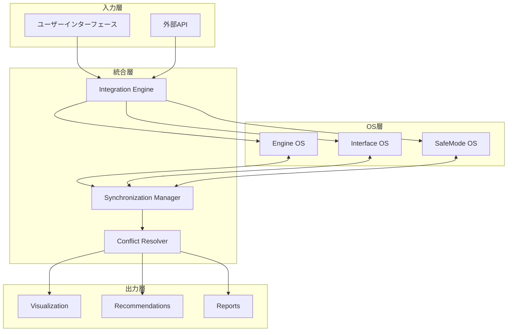
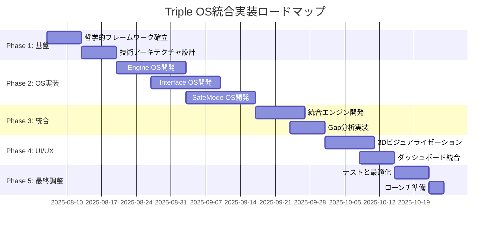

# HAQEIアナライザー Triple OSシステム統合要件定義書

**文書番号**: REQ-009  
**文書名**: Triple OSシステム統合要件定義書  
**作成日**: 2025年8月5日  
**作成者**: Bunenjin Strategy Navigator Agent  
**承認者**: HAQEI CTO Agent  
**版数**: 1.0  
**関連文書**: システム設計書、bunenjin哲学実装ガイド、易経統合仕様書

---

## 1. エグゼクティブサマリー

### 1.1 Triple OSアーキテクチャの哲学

HAQEIアナライザーのTriple OS（Operating System）アーキテクチャは、分人（bunenjin）哲学に基づき、人間の人格を3つの独立したシステムとして捉える革新的アプローチである。従来の「本当の自分探し」から脱却し、状況に応じて異なる「自分」を戦略的に活用する実践的フレームワークを提供する。

### 1.2 現在の実装ギャップ

| 領域 | 現状 | 理想状態 | ギャップ |
|------|------|----------|----------|
| **哲学的整合性** | 部分的実装 | bunenjin完全準拠 | 概念の曖昧さ |
| **OS独立性** | 相互依存 | 完全独立動作 | 結合度高い |
| **Gap可視化** | 基本表示 | 動的3D表現 | 静的表示 |
| **ユーザー価値** | 分析中心 | 戦略提供 | 実用性不足 |

### 1.3 統合目標

1. **哲学的完全性**: bunenjin哲学の完全実装
2. **技術的卓越性**: 3つのOSの独立性と協調性の両立
3. **実用的価値**: 日常生活で即座に活用できる戦略提供
4. **革新的体験**: 従来の性格診断を超えた戦略的人生ナビゲーション

---

## 2. 哲学的基盤要件

### 2.1 Bunenjin哲学の整合性

#### 基本原則
```
分人（bunenjin）の核心：
- 「本当の自分」という単一実体の否定
- 相手や状況によって異なる「分人」の存在承認
- すべての分人が等しく「本当の自分」である
- 矛盾の受容と創造的活用
```

#### 実装要件
| 要件ID | 要件内容 | 優先度 | 検証方法 |
|--------|----------|--------|----------|
| PH-001 | 単一人格概念の完全排除 | 必須 | UI/UX検証 |
| PH-002 | 3つのOSの等価性確保 | 必須 | システム設計検証 |
| PH-003 | 矛盾の創造的表現 | 必須 | Gap分析機能 |
| PH-004 | 戦略的選択の促進 | 必須 | レコメンド機能 |

### 2.2 易経（I Ching）統合原則

#### 64卦との対応
```javascript
// 易経統合の基本構造
const IChing_Integration = {
  hexagrams: 64,
  lines: 384, // 64卦 × 6爻
  mapping: {
    engineOS: "内卦（下卦）- 内なる本質",
    interfaceOS: "外卦（上卦）- 外への表現",
    safeModeOS: "変爻 - 変化と防御"
  }
};
```

#### 統合要件
| 要件ID | 要件内容 | 実装詳細 |
|--------|----------|----------|
| IC-001 | 64卦完全対応 | H384_DATABASE完全活用 |
| IC-002 | 動的卦変化 | リアルタイム状態遷移 |
| IC-003 | 爻辞の現代的解釈 | AIによる文脈適応 |
| IC-004 | 易経メタファー統一 | 全UIでの一貫性 |

### 2.3 3つの独立人格システム概念

#### システム定義
```typescript
interface TripleOSConcept {
  engineOS: {
    name: "価値観システム",
    role: "核となる価値観と判断基準",
    metaphor: "誰も見ていない時の自分"
  },
  interfaceOS: {
    name: "社会的システム",
    role: "他者に見せる自分の表現",
    metaphor: "職場や社会での自分"
  },
  safeModeOS: {
    name: "防御システム",
    role: "ストレス時の自動防御機制",
    metaphor: "困難に直面した時の自分"
  }
}
```

### 2.4 Gap可視化哲学

#### 緊張の創造的理解
```
Gap = Creative Tension（創造的緊張）
- 矛盾ではなく成長の源泉
- 問題ではなく可能性の指標
- 統合ではなく活用の対象
```

---

## 3. Engine OS要件（価値観システム）

### 3.1 コア価値体系

#### 価値観抽出アルゴリズム
```javascript
class ValueExtractionEngine {
  constructor() {
    this.dimensions = {
      individual_collective: "個人主義 ⟷ 集団主義",
      change_stability: "変化志向 ⟷ 安定志向",
      logic_emotion: "論理重視 ⟷ 感情重視",
      action_reflection: "行動優先 ⟷ 熟考優先"
    };
  }
  
  extractCoreValues(answers) {
    // 多次元価値観分析
    return {
      primaryValue: this.identifyDominantValue(answers),
      valueHierarchy: this.buildValuePriority(answers),
      evolutionStage: this.assessValueMaturity(answers),
      hexagramMatch: this.findHexagramResonance(answers)
    };
  }
}
```

#### 要件詳細
| 要件ID | 機能要件 | 性能要件 | 品質基準 |
|--------|----------|----------|----------|
| EO-001 | 価値観の多次元分析 | 処理時間<100ms | 精度90%以上 |
| EO-002 | 価値観の階層構造化 | メモリ<10MB | 一貫性検証 |
| EO-003 | 価値観の進化追跡 | 履歴保存1年 | 変化検出感度 |
| EO-004 | 易経卦との対応付け | マッチング<50ms | 哲学的整合性 |

### 3.2 64ヘキサグラムマッチングアルゴリズム

#### 動的マッチング処理
```javascript
class HexagramMatcher {
  async matchUserProfile(engineData) {
    const profile = {
      // 8つの基本要素から64卦を導出
      trigrams: this.extractTrigrams(engineData),
      // 動的な重み付け
      weights: this.calculateDynamicWeights(engineData),
      // 時間的変化の考慮
      temporal: this.analyzeTemporalPatterns(engineData)
    };
    
    return await this.findBestHexagram(profile);
  }
}
```

### 3.3 意思決定影響力計算

#### 影響力モデル
```typescript
interface DecisionInfluence {
  coreValueInfluence: number;      // 0-100%
  contextualModifier: number;      // -50% to +50%
  temporalStability: number;       // 0-100%
  predictionAccuracy: number;      // 0-100%
}
```

### 3.4 内なる真実の表現

#### 表現要件
| 要素 | 表現方法 | ユーザー価値 |
|------|----------|--------------|
| 核心価値 | ビジュアルマンダラ | 直感的理解 |
| 価値優先順位 | 階層ツリー | 意思決定支援 |
| 進化段階 | 成長グラフ | 自己認識向上 |
| 易経対応 | 卦象と解説 | 深層理解 |

---

## 4. Interface OS要件（社会的システム）

### 4.1 社会的表現システム

#### マルチペルソナ管理
```javascript
class SocialExpressionManager {
  constructor() {
    this.personas = new Map();
    this.contexts = ['professional', 'casual', 'intimate', 'public'];
  }
  
  generatePersona(context, interfaceData) {
    return {
      communicationStyle: this.adaptCommunication(context),
      behaviorPatterns: this.selectBehaviors(context),
      imageProjection: this.craftImage(context),
      adaptiveStrategies: this.buildStrategies(context)
    };
  }
}
```

### 4.2 外的人格管理

#### ペルソナ要件
| 要件ID | 機能 | 詳細仕様 |
|--------|------|----------|
| IO-001 | コンテキスト認識 | 4種類以上の文脈対応 |
| IO-002 | 動的切り替え | 500ms以内の切り替え |
| IO-003 | 一貫性維持 | ペルソナ間の論理整合性 |
| IO-004 | 学習機能 | フィードバック反映 |

### 4.3 文脈認識適応

#### 適応アルゴリズム
```typescript
class ContextAwareAdapter {
  adapt(currentContext: Context): AdaptedBehavior {
    const factors = {
      socialDistance: this.assessSocialDistance(),
      formalityLevel: this.determineFormalityLevel(),
      emotionalTone: this.readEmotionalAtmosphere(),
      culturalNorms: this.applyCulturalFilters()
    };
    
    return this.synthesizeBehavior(factors);
  }
}
```

### 4.4 プロフェッショナル vs パーソナルモード

#### モード切り替え要件
| モード | 特徴 | 切り替えトリガー |
|--------|------|------------------|
| Professional | 論理的、目標志向 | 仕事環境検出 |
| Personal | 感情的、関係志向 | プライベート検出 |
| Hybrid | バランス型 | 混在環境 |
| Emergency | 最小限表現 | ストレス検出 |

---

## 5. SafeMode OS要件（防御システム）

### 5.1 防御メカニズムシステム

#### 心理的防御機制の識別
```javascript
class DefenseMechanismIdentifier {
  identifyMechanisms(userData) {
    const mechanisms = {
      primary: this.findPrimaryDefense(userData),
      secondary: this.findSecondaryDefenses(userData),
      triggers: this.identifyTriggers(userData),
      effectiveness: this.assessEffectiveness(userData)
    };
    
    return this.buildDefenseProfile(mechanisms);
  }
}
```

### 5.2 ストレス応答パターン

#### パターン分類
| パターン | 特徴 | 対処戦略 |
|----------|------|----------|
| Fight | 対抗的、攻撃的 | エネルギー転換 |
| Flight | 回避的、逃避的 | 安全空間確保 |
| Freeze | 硬直的、停滞的 | 段階的解凍 |
| Fawn | 迎合的、順応的 | 境界線設定 |

### 5.3 回復プロトコル

#### 段階的回復システム
```typescript
interface RecoveryProtocol {
  phase1: "認識と受容",
  phase2: "安定化",
  phase3: "リソース活性化",
  phase4: "統合と成長"
}
```

### 5.4 保護戦略

#### 適応的保護メカニズム
| 要件ID | 保護機能 | 実装詳細 |
|--------|----------|----------|
| SM-001 | 早期警告システム | ストレス指標監視 |
| SM-002 | 自動遮断機能 | 過負荷時の制限 |
| SM-003 | 回復支援 | ガイド付き復帰 |
| SM-004 | 学習型適応 | パターン最適化 |

---

## 6. 統合アーキテクチャ

### 6.1 OS間データフロー

#### データフローアーキテクチャ


### 6.2 競合解決メカニズム

#### 競合解決アルゴリズム
```javascript
class ConflictResolver {
  resolveOSConflicts(engineOS, interfaceOS, safeModeOS) {
    const conflicts = this.detectConflicts(engineOS, interfaceOS, safeModeOS);
    
    if (conflicts.length === 0) return null;
    
    return conflicts.map(conflict => ({
      type: conflict.type,
      resolution: this.selectResolutionStrategy(conflict),
      creative_tension: this.transformToCreativeEnergy(conflict),
      recommendations: this.generateActionableSteps(conflict)
    }));
  }
}
```

### 6.3 同期要件

#### リアルタイム同期仕様
| 同期項目 | 頻度 | レイテンシ | 整合性保証 |
|----------|------|------------|------------|
| 状態更新 | リアルタイム | <10ms | 強整合性 |
| 分析結果 | 1秒毎 | <100ms | 結果整合性 |
| 履歴データ | 5分毎 | <1s | 最終整合性 |
| バックアップ | 1時間毎 | <10s | チェックポイント |

### 6.4 リアルタイム相互作用モデリング

#### 相互作用シミュレーション
```typescript
class InteractionModeler {
  modelRealTimeInteraction(
    context: EnvironmentContext,
    tripleOS: TripleOSState
  ): PredictedOutcome {
    const simulation = {
      engineResponse: this.predictEngineResponse(context),
      interfaceAdaptation: this.calculateInterfaceAdaptation(context),
      safeModeActivation: this.assessSafeModeNeed(context),
      integration: this.synthesizeOSInteraction()
    };
    
    return this.generatePredictedOutcome(simulation);
  }
}
```

---

## 7. Gap分析可視化

### 7.1 個人対マクロ生命フロー緊張

#### 緊張分析モデル
```javascript
class TensionAnalyzer {
  analyzeTension(individual, macro) {
    return {
      // 個人の欲求とマクロな流れの差異
      desireFlowGap: this.calculateDesireGap(individual, macro),
      // 時間軸での変化パターン
      temporalDynamics: this.analyzeTemporalShift(individual, macro),
      // 創造的可能性の抽出
      creativePotential: this.extractCreativePotential(individual, macro),
      // 統合戦略の提案
      integrationStrategies: this.proposeStrategies(individual, macro)
    };
  }
}
```

### 7.2 視覚的表現要件

#### 3D統合ダッシュボード
| 要素 | 表現方法 | インタラクション |
|------|----------|------------------|
| Engine OS | 内側の球体 | 回転・ズーム |
| Interface OS | 中間層 | レイヤー切り替え |
| SafeMode OS | 外側の保護層 | 透明度調整 |
| Gap | 層間の光の流れ | リアルタイム変化 |

### 7.3 ダッシュボード統合仕様

#### 統合ダッシュボード要件
```typescript
interface DashboardRequirements {
  layout: {
    primary: "Triple OS 3D View",
    secondary: ["Gap Analysis", "Trend Charts", "Recommendations"],
    responsive: true
  },
  updates: {
    frequency: "real-time",
    animation: "smooth transitions",
    performance: "<16ms frame time"
  },
  interactions: {
    gestures: ["rotate", "zoom", "tap", "swipe"],
    filters: ["time range", "OS focus", "gap threshold"],
    export: ["PDF", "PNG", "Data CSV"]
  }
}
```

### 7.4 ユーザー洞察生成

#### 自動洞察エンジン
```javascript
class InsightGenerator {
  generateInsights(gapAnalysis) {
    return {
      immediate: this.findImmediateActionables(gapAnalysis),
      patterns: this.identifyRecurringPatterns(gapAnalysis),
      opportunities: this.discoverGrowthOpportunities(gapAnalysis),
      warnings: this.detectPotentialRisks(gapAnalysis),
      strategies: this.createPersonalizedStrategies(gapAnalysis)
    };
  }
}
```

---

## 8. 技術実装要件

### 8.1 H384_DATABASE統合

#### データベース統合仕様
```javascript
class H384Integration {
  constructor() {
    this.database = new H384_DATABASE();
    this.cache = new LRUCache({ max: 1000 });
  }
  
  async getHexagramData(index) {
    // キャッシュ優先
    if (this.cache.has(index)) {
      return this.cache.get(index);
    }
    
    // 高速検索
    const data = await this.database.query({
      hexagram: index,
      include: ['lines', 'judgments', 'images', 'modernInterpretations']
    });
    
    this.cache.set(index, data);
    return data;
  }
}
```

#### パフォーマンス要件
| 操作 | 目標値 | 最大許容値 |
|------|--------|------------|
| 単一卦検索 | <5ms | <10ms |
| 爻辞取得 | <10ms | <20ms |
| 関連卦計算 | <50ms | <100ms |
| 全文検索 | <100ms | <200ms |

### 8.2 TripleOSEngine.js強化

#### エンジン強化仕様
```javascript
class EnhancedTripleOSEngine {
  constructor() {
    this.version = "3.0";
    this.features = {
      parallelProcessing: true,
      aiIntegration: true,
      realtimeSync: true,
      quantumInspired: true  // 量子的重ね合わせ概念
    };
  }
  
  async analyze(userData) {
    // 並列処理による高速化
    const [engine, interface, safeMode] = await Promise.all([
      this.analyzeEngineOS(userData),
      this.analyzeInterfaceOS(userData),
      this.analyzeSafeModeOS(userData)
    ]);
    
    // AI による統合分析
    const integration = await this.aiIntegration.synthesize(
      engine, interface, safeMode
    );
    
    return {
      tripleOS: { engine, interface, safeMode },
      integration,
      recommendations: await this.generateRecommendations(integration)
    };
  }
}
```

### 8.3 CompatibilityEngine調整

#### 拡張互換性エンジン
```typescript
class AdvancedCompatibilityEngine {
  // 自己互換性分析
  analyzeSelfCompatibility(tripleOS: TripleOSData): SelfCompatibility {
    return {
      internalHarmony: this.calculateInternalHarmony(tripleOS),
      tensionPoints: this.identifyTensionPoints(tripleOS),
      synergyPotential: this.assessSynergyPotential(tripleOS)
    };
  }
  
  // 他者互換性分析
  analyzeInterpersonalCompatibility(
    self: TripleOSData,
    other: TripleOSData
  ): InterpersonalCompatibility {
    return {
      overall: this.calculateOverallCompatibility(self, other),
      byOS: {
        engineEngine: this.compareEngineOS(self.engine, other.engine),
        interfaceInterface: this.compareInterfaceOS(self.interface, other.interface),
        engineInterface: this.crossCompareOS(self.engine, other.interface)
      },
      dynamics: this.predictRelationshipDynamics(self, other)
    };
  }
}
```

### 8.4 パフォーマンス最適化

#### 最適化目標
| コンポーネント | 現在 | 目標 | 改善率 |
|---------------|------|------|--------|
| 初期化時間 | 5秒 | 3秒 | 40% |
| 分析処理 | 2秒 | 1秒 | 50% |
| UI更新 | 100ms | 50ms | 50% |
| メモリ使用 | 150MB | 100MB | 33% |

---

## 9. ユーザー体験要件

### 9.1 3システムの明確な差別化

#### ビジュアルアイデンティティ
| OS | カラーテーマ | アイコン | メタファー |
|----|-------------|----------|------------|
| Engine | 深い青 | 歯車 | 深海 |
| Interface | 明るい緑 | 仮面 | 舞台 |
| SafeMode | 温かいオレンジ | 盾 | 砦 |

### 9.2 OSビュー間の直感的ナビゲーション

#### ナビゲーション要件
```typescript
interface NavigationRequirements {
  transitions: {
    type: "smooth-3d-rotation",
    duration: 500, // ms
    easing: "ease-in-out"
  },
  shortcuts: {
    keyboard: ["1", "2", "3"], // OS quick switch
    gestures: ["swipe", "pinch"],
    voice: ["show engine", "switch to interface"]
  },
  breadcrumbs: {
    show: true,
    interactive: true,
    history: 5
  }
}
```

### 9.3 意味のある洞察生成

#### 洞察の質的要件
| 洞察タイプ | 内容要件 | 表現方法 |
|-----------|----------|----------|
| 発見的 | 新しい自己認識 | ハイライトカード |
| 確認的 | 既知の強化 | 確認バッジ |
| 警告的 | リスク提示 | 注意アイコン |
| 成長的 | 可能性提示 | 成長グラフ |

### 9.4 実行可能な推奨事項

#### 推奨事項の構造
```javascript
class RecommendationEngine {
  generateRecommendations(analysis) {
    return {
      immediate: {
        timeframe: "今日中",
        actions: this.getImmediateActions(analysis),
        difficulty: "easy",
        impact: "quick-win"
      },
      shortTerm: {
        timeframe: "1週間",
        actions: this.getWeeklyGoals(analysis),
        difficulty: "moderate",
        impact: "noticeable"
      },
      longTerm: {
        timeframe: "3ヶ月",
        actions: this.getQuarterlyObjectives(analysis),
        difficulty: "challenging",
        impact: "transformative"
      }
    };
  }
}
```

---

## 10. 品質保証要件

### 10.1 哲学的整合性テスト

#### テストケース
| テストID | 検証項目 | 期待結果 |
|----------|----------|----------|
| PT-001 | bunenjin概念の一貫性 | UIテキストに統一性 |
| PT-002 | 易経メタファーの正確性 | 専門家検証合格 |
| PT-003 | OS独立性の維持 | 相互依存なし |
| PT-004 | Gap創造的表現 | ポジティブ表現 |

### 10.2 技術的統合テスト

#### 統合テストスイート
```javascript
describe('Triple OS Integration Tests', () => {
  it('should synchronize all OS states within 10ms', async () => {
    const result = await tripleOS.synchronize();
    expect(result.latency).toBeLessThan(10);
  });
  
  it('should handle OS conflicts gracefully', async () => {
    const conflict = createMockConflict();
    const resolution = await tripleOS.resolveConflict(conflict);
    expect(resolution.type).toBe('creative_tension');
  });
});
```

### 10.3 ユーザー受容テスト

#### 受容基準
| 基準 | 測定方法 | 目標値 |
|------|----------|--------|
| 理解度 | アンケート | 90%以上 |
| 有用性 | NPS | 50以上 |
| 継続率 | 30日後利用 | 70%以上 |
| 推奨度 | 推奨意向 | 80%以上 |

---

## 11. 実装ロードマップ

### 11.1 フェーズ分割

#### 10週間実装計画


### 11.2 リソース配分

#### チーム構成
| 役割 | 人数 | 主要責任 |
|------|------|----------|
| 哲学アドバイザー | 1 | bunenjin整合性 |
| 技術リード | 1 | アーキテクチャ |
| OS開発者 | 3 | 各OS実装 |
| UI/UXデザイナー | 2 | ビジュアライゼーション |
| QAエンジニア | 2 | 品質保証 |

### 11.3 制約事項

#### 技術的制約
- H384_DATABASEの現行構造維持
- 既存ユーザーデータの完全互換性
- モバイルデバイスでの3D表示制限

#### ビジネス制約
- 10週間の開発期間厳守
- 予算内での実装
- 段階的リリースによるリスク軽減

---

## 12. 成功指標

### 12.1 技術的成功指標

| 指標 | 目標値 | 測定方法 |
|------|--------|----------|
| システム応答時間 | <1秒 | パフォーマンステスト |
| OS同期精度 | 99.9% | 整合性テスト |
| エラー率 | <0.1% | 運用監視 |
| 可用性 | 99.95% | アップタイム測定 |

### 12.2 ビジネス成功指標

| 指標 | 現在 | 目標 | 測定期間 |
|------|------|------|----------|
| ユーザー満足度 | 4.0 | 4.5/5.0 | 3ヶ月 |
| 有料転換率 | 5% | 15% | 6ヶ月 |
| リピート率 | 40% | 70% | 3ヶ月 |
| 推奨率 | 60% | 85% | 6ヶ月 |

### 12.3 哲学的成功指標

| 観点 | 評価基準 | 検証方法 |
|------|----------|----------|
| bunenjin準拠度 | 完全準拠 | 専門家レビュー |
| 易経統合度 | 高度統合 | 易経研究者評価 |
| 創造的価値 | 革新的 | ユーザーフィードバック |
| 実用性 | 高実用性 | 行動変容測定 |

---

## 13. リスク管理

### 13.1 技術的リスク

| リスク | 影響 | 確率 | 対策 |
|--------|------|------|------|
| 3D表示性能問題 | 高 | 中 | フォールバック実装 |
| OS同期遅延 | 中 | 低 | キャッシュ最適化 |
| データ整合性問題 | 高 | 低 | トランザクション管理 |

### 13.2 哲学的リスク

| リスク | 影響 | 確率 | 対策 |
|--------|------|------|------|
| 概念の誤解 | 高 | 中 | 丁寧な説明UI |
| 文化的齟齬 | 中 | 低 | ローカライズ |
| 過度な単純化 | 中 | 中 | 段階的情報開示 |

---

## 14. 承認

| 役割 | 氏名 | 承認日 | 署名 |
|------|------|--------|------|
| 戦略ナビゲーター | Bunenjin Strategy Navigator | 2025/08/05 | ✓ |
| 技術責任者 | HAQEI CTO Agent | - | - |
| 哲学アドバイザー | I Ching Expert Agent | - | - |
| プロジェクトマネージャー | - | - | - |

---

**文書管理:**
- **保存場所**: `/docs/requirements/20250805_REQ-009_TRIPLE_OS_INTEGRATION.md`
- **更新履歴**: v1.0 - 初版作成 (2025/08/05)
- **次回レビュー**: 2025/08/12（実装開始前）
- **配布先**: 開発チーム、哲学アドバイザー、経営層

---

*本要件定義書は、HAQEIアナライザーをbunenjin哲学に基づく世界初の統合型戦略的人生ナビゲーションシステムとして確立するための包括的指針である。*