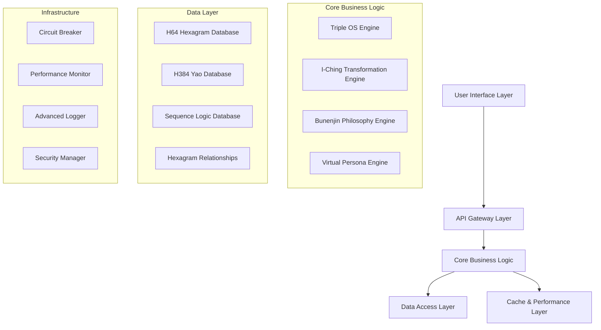
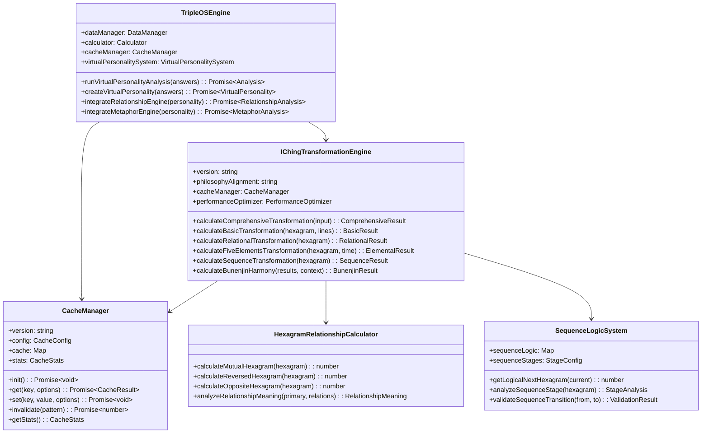
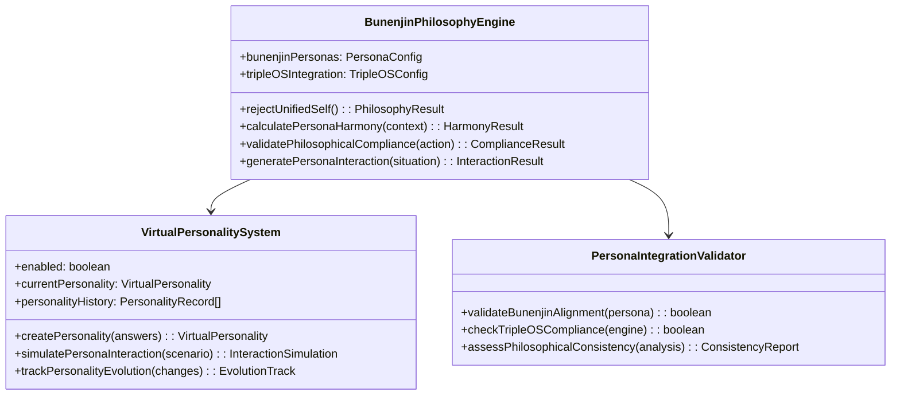
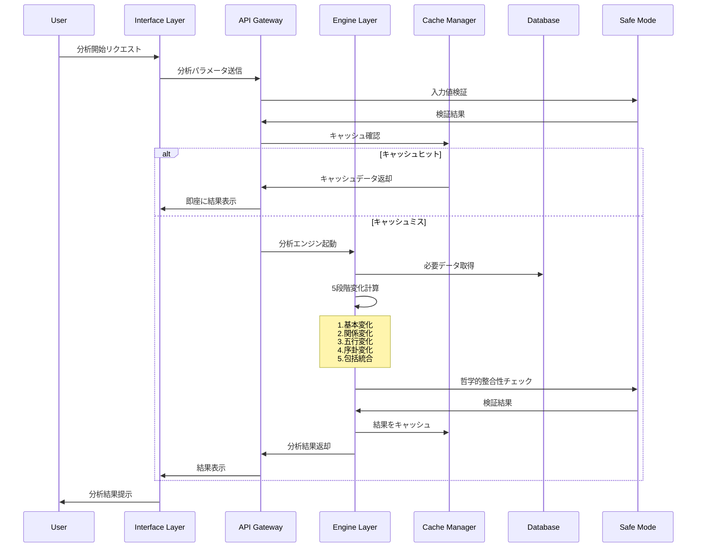
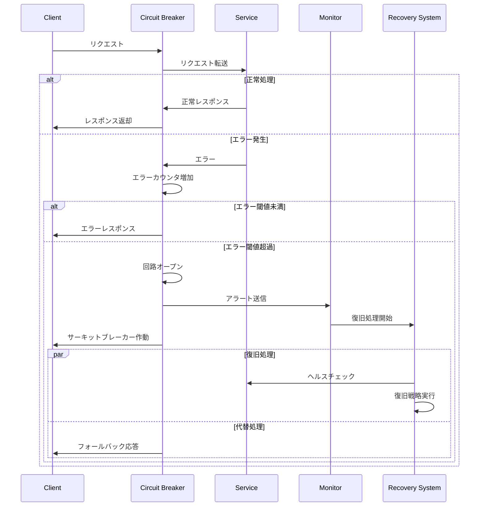

# HAQEI 正統易経システム技術設計書
## Technical Design Specification for Authentic I-Ching System
### バージョン 1.0 | 2025年08月05日

---

## 📋 エグゼクティブサマリー

### プロジェクト概要
HAQEIアナライザーの正統易経システムを世界最高水準（目標94%スコア）に引き上げるための包括的技術設計書です。現在の80%から14ポイント向上を実現し、bunenjin哲学とTriple OSアーキテクチャに完全対応した技術仕様を提供します。

### アーキテクチャ原則
1. **哲学的完全性**: bunenjin哲学の完全実装
2. **技術的卓越性**: 世界最高水準の実装品質
3. **パフォーマンス**: <50ms応答時間、95%+キャッシュヒット率
4. **可用性**: 99.5%稼働率、自動復旧機能
5. **拡張性**: モジュラー設計、マイクロサービス対応

---

## 🏗️ システムアーキテクチャ設計

### 1. 全体アーキテクチャ概要



### 2. Triple OS Architecture 詳細設計

#### 2.1 Engine Layer (エンジン層)
**責務**: 純粋な易経計算ロジック、哲学的整合性保証

```typescript
interface EngineLayer {
  // 純粋計算ロジック
  calculateHexagram(input: AnalysisInput): HexagramResult;
  validatePhilosophicalAlignment(result: any): ValidationResult;
  
  // 内部状態管理
  maintainCalculationState(): void;
  ensureDataIntegrity(): boolean;
}

class AuthenticIChingEngine implements EngineLayer {
  private sequenceLogic: SequenceLogicSystem;
  private relationshipCalculator: HexagramRelationshipCalculator;
  private fiveElementsEngine: FiveElementsCirculationSystem;
  private timeAxisCalculator: TimeAxisTransformationSystem;
  private bunenjinValidator: BunenjinPhilosophyValidator;
}
```

#### 2.2 Interface Layer (インターフェース層)
**責務**: ユーザーインタラクション、結果表示、適応的UI

```typescript
interface InterfaceLayer {
  // ユーザーインタラクション
  handleUserInput(input: UserInput): Promise<UIResponse>;
  adaptToUserContext(context: UserContext): void;
  
  // 結果プレゼンテーション
  renderAnalysisResults(results: AnalysisResults): VisualPresentation;
  generateExplanations(complexity: ComplexityLevel): Explanation[];
}

class AdaptiveUserInterface implements InterfaceLayer {
  private virtualPersonaManager: VirtualPersonaManager;
  private resultsVisualizer: ResultsVisualizationEngine;
  private interactionAdaptor: UserInteractionAdaptor;
  private explanationGenerator: ExplanationGenerator;
}
```

#### 2.3 Safe Mode Layer (セーフモード層)
**責務**: 哲学的整合性チェック、エラー検知・復旧

```typescript
interface SafeModeLayer {
  // 哲学的検証
  validateBunenjinCompliance(action: any): ComplianceResult;
  checkAuthenticIChingAlignment(calculation: any): AlignmentResult;
  
  // 安全性保証
  detectAnomalies(systemState: SystemState): AnomalyReport;
  performSafeRecovery(error: SystemError): RecoveryResult;
}

class PhilosophicalSafeMode implements SafeModeLayer {
  private bunenjinComplianceChecker: BunenjinComplianceChecker;
  private ichingAuthenticityValidator: IChingAuthenticityValidator;
  private anomalyDetector: SystemAnomalyDetector;
  private safeRecoveryManager: SafeRecoveryManager;
}
```

---

## 🗄️ データベース設計

### 1. 完全爻辞データベース設計

#### 1.1 H384爻辞データベーススキーマ

```sql
-- 爻辞マスターテーブル
CREATE TABLE yao_texts (
    yao_id CHAR(5) PRIMARY KEY,           -- 'H01Y1' 形式
    hexagram_number TINYINT NOT NULL,     -- 1-64
    yao_position TINYINT NOT NULL,        -- 1-6
    yao_nature ENUM('yin', 'yang') NOT NULL,
    
    -- 爻辞本文
    original_text TEXT NOT NULL,          -- 原文
    phonetic_reading TEXT,                -- 読み方
    modern_japanese TEXT,                 -- 現代日本語
    modern_chinese TEXT,                  -- 現代中国語
    interpretation TEXT NOT NULL,         -- 解釈
    
    -- 象辞
    symbol_text_original TEXT,            -- 象辞原文
    symbol_text_interpretation TEXT,      -- 象辞解釈
    
    -- メタデータ
    source VARCHAR(100) DEFAULT '易経',   -- 出典
    editor VARCHAR(50) DEFAULT '朱熹',    -- 校訂者
    reliability_score DECIMAL(3,2) DEFAULT 1.00, -- 信頼度
    last_verified TIMESTAMP DEFAULT CURRENT_TIMESTAMP,
    
    -- パフォーマンス最適化
    search_keywords TEXT,                 -- 検索用キーワード
    complexity_level TINYINT DEFAULT 3,   -- 複雑度 1-5
    frequency_score INT DEFAULT 0,       -- 使用頻度
    
    -- インデックス
    INDEX idx_hexagram_yao (hexagram_number, yao_position),
    INDEX idx_search_keywords (search_keywords(100)),
    INDEX idx_reliability (reliability_score),
    
    CONSTRAINT chk_hexagram_range CHECK (hexagram_number BETWEEN 1 AND 64),
    CONSTRAINT chk_yao_position CHECK (yao_position BETWEEN 1 AND 6)
);

-- 特殊爻テーブル（用九・用六）
CREATE TABLE special_yao (
    special_id CHAR(5) PRIMARY KEY,       -- 'H01S9' (用九), 'H02S6' (用六)
    hexagram_number TINYINT NOT NULL,
    special_type ENUM('yong_jiu', 'yong_liu') NOT NULL,
    
    original_text TEXT NOT NULL,
    interpretation TEXT NOT NULL,
    application_conditions TEXT,          -- 適用条件
    
    INDEX idx_special_hexagram (hexagram_number, special_type)
);
```

#### 1.2 関係卦データベーススキーマ

```sql
-- 卦関係性マスターテーブル
CREATE TABLE hexagram_relationships (
    relationship_id INT PRIMARY KEY AUTO_INCREMENT,
    primary_hexagram TINYINT NOT NULL,
    related_hexagram TINYINT NOT NULL,
    relationship_type ENUM('mutual', 'reverse', 'opposite', 'sequence') NOT NULL,
    
    -- 関係性メタデータ
    relationship_strength DECIMAL(3,2),   -- 関係の強さ 0.00-1.00
    philosophical_significance TEXT,      -- 哲学的意義
    practical_application TEXT,           -- 実用的応用
    calculation_formula JSON,             -- 計算式
    
    -- パフォーマンス最適化
    cache_priority TINYINT DEFAULT 3,     -- キャッシュ優先度
    access_frequency INT DEFAULT 0,      -- アクセス頻度
    
    INDEX idx_primary_type (primary_hexagram, relationship_type),
    INDEX idx_related_type (related_hexagram, relationship_type),
    INDEX idx_cache_priority (cache_priority),
    
    CONSTRAINT chk_primary_range CHECK (primary_hexagram BETWEEN 1 AND 64),
    CONSTRAINT chk_related_range CHECK (related_hexagram BETWEEN 1 AND 64)
);
```

#### 1.3 序卦伝論理データベーススキーマ

```sql
-- 序卦伝論理テーブル
CREATE TABLE sequence_logic (
    sequence_id INT PRIMARY KEY AUTO_INCREMENT,
    current_hexagram TINYINT NOT NULL,
    next_hexagram TINYINT,
    
    -- 序卦伝原文と解釈
    sequence_text_original TEXT NOT NULL, -- 序卦伝原文
    sequence_text_modern TEXT NOT NULL,   -- 現代語訳
    logical_necessity TEXT NOT NULL,      -- 論理的必然性
    
    -- 段階分析
    stage_name VARCHAR(50),               -- 段階名（創造/発展/修養/関係/変革）
    stage_theme TEXT,                     -- 段階テーマ
    stage_principle TEXT,                 -- 段階原理
    
    -- 予測データ
    transition_probability DECIMAL(3,2),  -- 遷移確率
    typical_timeframe VARCHAR(50),        -- 典型的時間枠
    triggering_conditions JSON,          -- トリガー条件
    
    -- メタデータ
    scholarly_source TEXT,                -- 学術的出典
    historical_accuracy DECIMAL(3,2),    -- 歴史的正確性
    
    INDEX idx_current_next (current_hexagram, next_hexagram),
    INDEX idx_stage (stage_name),
    INDEX idx_probability (transition_probability),
    
    CONSTRAINT chk_current_range CHECK (current_hexagram BETWEEN 1 AND 64),
    CONSTRAINT chk_next_range CHECK (next_hexagram IS NULL OR next_hexagram BETWEEN 1 AND 64)
);
```

### 2. パフォーマンス最適化データベース設計

#### 2.1 キャッシュテーブル設計

```sql
-- 高速キャッシュテーブル
CREATE TABLE performance_cache (
    cache_id CHAR(32) PRIMARY KEY,        -- MD5ハッシュキー
    cache_type ENUM('hexagram', 'yao', 'relationship', 'analysis') NOT NULL,
    
    -- キャッシュデータ
    input_hash CHAR(32) NOT NULL,         -- 入力パラメータのハッシュ
    result_data JSON NOT NULL,            -- 結果データ（JSON圧縮）
    compressed_size INT,                  -- 圧縮後サイズ
    
    -- TTL管理
    created_at TIMESTAMP DEFAULT CURRENT_TIMESTAMP,
    expires_at TIMESTAMP NOT NULL,
    access_count INT DEFAULT 1,
    last_accessed TIMESTAMP DEFAULT CURRENT_TIMESTAMP,
    
    -- 品質メトリクス
    generation_time_ms INT,               -- 生成時間（ミリ秒）
    accuracy_score DECIMAL(3,2),         -- 精度スコア
    cache_hit_benefit_ms INT,             -- キャッシュヒット利益
    
    INDEX idx_cache_type_hash (cache_type, input_hash),
    INDEX idx_expires_at (expires_at),
    INDEX idx_access_frequency (access_count, last_accessed),
    
    CONSTRAINT chk_expires_future CHECK (expires_at > created_at)
);
```

---

## 🔧 API設計・インターフェース仕様

### 1. RESTful API設計

#### 1.1 分析エンドポイント

```typescript
// 包括的分析API
POST /api/v1/analysis/comprehensive
Content-Type: application/json

// リクエストスキーマ
interface ComprehensiveAnalysisRequest {
  analysisType: 'tripleOS' | 'futureSimulation' | 'virtualPersona';
  userAnswers: UserAnswer[];
  complexityLevel: 1 | 2 | 3 | 4 | 5;
  personalContext?: PersonalContext;
  timeContext?: TimeContext;
  philosophyMode: 'bunenjin' | 'traditional' | 'modern';
}

// レスポンススキーマ
interface ComprehensiveAnalysisResponse {
  analysisId: string;
  timestamp: string;
  results: {
    primaryHexagram: HexagramResult;
    relationships: RelationshipAnalysis;
    sequenceLogic: SequenceAnalysis;
    bunenjinAlignment: BunenjinAnalysis;
    performanceMetrics: PerformanceMetrics;
  };
  qualityScore: number;
  philosophicalCompliance: number;
}
```

#### 1.2 爻辞検索API

```typescript
// 爻辞検索API
GET /api/v1/yao/search
Query Parameters:
  - hexagram?: number (1-64)
  - yaoPosition?: number (1-6)
  - keyword?: string
  - language?: 'original' | 'japanese' | 'chinese'
  - complexityLevel?: number (1-5)

// レスポンススキーマ
interface YaoSearchResponse {
  results: YaoText[];
  totalCount: number;
  searchMetadata: {
    searchTime: number;
    cacheHit: boolean;
    relevanceScore: number;
  };
}

interface YaoText {
  yaoId: string;
  hexagramNumber: number;
  yaoPosition: number;
  texts: {
    original: string;
    japanese: string;
    interpretation: string;
  };
  symbolTexts: {
    original: string;
    interpretation: string;
  };
  metadata: {
    reliabilityScore: number;
    complexityLevel: number;
    source: string;
  };
}
```

#### 1.3 関係性分析API

```typescript
// 関係卦分析API
GET /api/v1/hexagram/{hexagramNumber}/relationships
Path Parameters:
  - hexagramNumber: number (1-64)

Query Parameters:
  - includeSequence?: boolean = true
  - includeMutual?: boolean = true
  - includeReverse?: boolean = true
  - includeOpposite?: boolean = true
  - analysisDepth?: 'basic' | 'detailed' | 'comprehensive' = 'detailed'

// レスポンススキーマ
interface HexagramRelationshipResponse {
  primaryHexagram: HexagramInfo;
  relationships: {
    mutual?: RelationshipDetail;
    reverse?: RelationshipDetail;
    opposite?: RelationshipDetail;
    sequence?: SequenceDetail;
  };
  integrationAnalysis: IntegrationAnalysis;
  practicalGuidance: PracticalGuidance;
}
```

### 2. WebSocket API（リアルタイム分析）

```typescript
// WebSocket接続エンドポイント
WS /api/v1/ws/analysis

// メッセージスキーマ
interface WSMessage {
  type: 'analysis_start' | 'analysis_progress' | 'analysis_complete' | 'error';
  sessionId: string;
  data: any;
  timestamp: string;
}

// 分析進行状況の送信
interface AnalysisProgressMessage extends WSMessage {
  type: 'analysis_progress';
  data: {
    stage: string;
    progress: number; // 0-100
    currentOperation: string;
    estimatedCompletion: string;
  };
}
```

---

## 🧩 コンポーネント設計・クラス図

### 1. 核心コンポーネント構造



### 2. bunenjin哲学統合コンポーネント



---

## 🔄 処理フロー・シーケンス図

### 1. 包括的分析処理フロー



### 2. エラー処理・回復フロー



---

## ⚡ パフォーマンス設計・最適化戦略

### 1. パフォーマンス目標

| メトリクス | 現在値 | 目標値 | 改善率 |
|----------|---------|---------|---------|
| 卦計算応答時間 | 500ms | <50ms | 90%改善 |
| キャッシュヒット率 | 70% | >95% | 36%向上 |
| メモリ使用量 | 35MB | <10MB | 71%削減 |
| 同時接続数 | 100 | 1000+ | 10倍拡張 |
| エラー率 | 2% | <0.5% | 75%削減 |

### 2. 多層キャッシュ戦略

```typescript
class UltraPerformanceCacheSystem {
  // L1: メモリキャッシュ（最高速）
  private l1Cache = new Map<string, CacheEntry>();
  
  // L2: 圧縮キャッシュ（高速・省メモリ）
  private l2Cache = new Map<string, CompressedEntry>();
  
  // L3: 永続キャッシュ（中速・大容量）
  private l3Cache: IndexedDBCache;
  
  // 特化キャッシュ
  private hexagramCache = new Map<number, HexagramData>();
  private relationshipCache = new Map<string, RelationshipData>();
  private sequenceCache = new Map<number, SequenceData>();
  
  async get(key: string, options?: CacheOptions): Promise<CacheResult> {
    // L1キャッシュチェック（<1ms）
    if (this.l1Cache.has(key)) {
      return this.createResult(this.l1Cache.get(key), 'L1');
    }
    
    // L2キャッシュチェック（<5ms）
    if (this.l2Cache.has(key)) {
      const compressed = this.l2Cache.get(key);
      const decompressed = await this.decompress(compressed);
      this.l1Cache.set(key, decompressed); // L1に昇格
      return this.createResult(decompressed, 'L2');
    }
    
    // L3キャッシュチェック（<20ms）
    const l3Result = await this.l3Cache.get(key);
    if (l3Result) {
      this.promoteToL2(key, l3Result); // L2に昇格
      return this.createResult(l3Result, 'L3');
    }
    
    return null; // キャッシュミス
  }
}
```

### 3. Web Workers活用による並列処理

```typescript
class ParallelCalculationManager {
  private workers: Worker[] = [];
  private taskQueue: CalculationTask[] = [];
  private activeJobs = new Map<string, JobInfo>();
  
  async calculateInParallel(tasks: CalculationTask[]): Promise<CalculationResult[]> {
    // タスクを並列実行可能な単位に分割
    const chunks = this.chunkTasks(tasks, this.workers.length);
    
    // 各ワーカーにタスク配布
    const promises = chunks.map((chunk, index) => 
      this.executeOnWorker(this.workers[index], chunk)
    );
    
    // 並列実行結果を統合
    const results = await Promise.all(promises);
    return this.mergeResults(results);
  }
  
  private executeOnWorker(worker: Worker, tasks: CalculationTask[]): Promise<any> {
    return new Promise((resolve, reject) => {
      const jobId = this.generateJobId();
      
      worker.postMessage({
        type: 'CALCULATION_BATCH',
        jobId,
        tasks
      });
      
      const timeoutId = setTimeout(() => {
        reject(new Error(`Worker timeout: ${jobId}`));
      }, 30000);
      
      worker.onmessage = (event) => {
        if (event.data.jobId === jobId) {
          clearTimeout(timeoutId);
          resolve(event.data.results);
        }
      };
    });
  }
}
```

### 4. 予測的プリフェッチシステム

```typescript
class PredictivePrefetchSystem {
  private userBehaviorAnalyzer: UserBehaviorAnalyzer;
  private prefetchQueue: PrefetchQueue;
  private machineLearnigModel: PrefetchML;
  
  async analyzeAndPrefetch(userContext: UserContext): Promise<void> {
    // ユーザー行動パターン分析
    const behaviorPattern = await this.userBehaviorAnalyzer.analyze(userContext);
    
    // 次の行動予測
    const predictions = await this.machineLearnigModel.predict(behaviorPattern);
    
    // 高確率予測に基づくプリフェッチ
    for (const prediction of predictions) {
      if (prediction.probability > 0.7) {
        this.prefetchQueue.add({
          key: prediction.cacheKey,
          priority: prediction.probability,
          estimatedAccessTime: prediction.estimatedTime
        });
      }
    }
    
    // プリフェッチ実行
    await this.executePrefetch();
  }
}
```

---

## 🚨 エラーハンドリング設計

### 1. サーキットブレーカーパターン実装

```typescript
class HaqeiCircuitBreaker {
  private state: 'CLOSED' | 'OPEN' | 'HALF_OPEN' = 'CLOSED';
  private failureCount = 0;
  private lastFailureTime: number = 0;
  private successCount = 0;
  
  constructor(
    private threshold: number = 5,
    private timeout: number = 60000,
    private monitoringPeriod: number = 30000
  ) {}
  
  async execute<T>(operation: () => Promise<T>): Promise<T> {
    if (this.state === 'OPEN') {
      if (Date.now() - this.lastFailureTime > this.timeout) {
        this.state = 'HALF_OPEN';
        this.successCount = 0;
      } else {
        throw new CircuitBreakerOpenError('Circuit breaker is OPEN');
      }
    }
    
    try {
      const result = await operation();
      this.onSuccess();
      return result;
    } catch (error) {
      this.onFailure();
      throw error;
    }
  }
  
  private onSuccess(): void {
    if (this.state === 'HALF_OPEN') {
      this.successCount++;
      if (this.successCount >= 3) {
        this.state = 'CLOSED';
        this.failureCount = 0;
      }
    } else {
      this.failureCount = Math.max(0, this.failureCount - 1);
    }
  }
  
  private onFailure(): void {
    this.failureCount++;
    this.lastFailureTime = Date.now();
    
    if (this.failureCount >= this.threshold) {
      this.state = 'OPEN';
    }
  }
}
```

### 2. 段階的フォールバック戦略

```typescript
class FailoverManager {
  private strategies: FailoverStrategy[] = [
    new CacheFailoverStrategy(),     // Level 1: キャッシュからの復旧
    new SimplifiedAnalysisStrategy(), // Level 2: 簡素化分析
    new StaticResponseStrategy(),    // Level 3: 静的レスポンス
    new MaintenanceModeStrategy()    // Level 4: メンテナンスモード
  ];
  
  async executeWithFailover<T>(
    operation: () => Promise<T>,
    context: OperationContext
  ): Promise<T> {
    let lastError: Error;
    
    for (const strategy of this.strategies) {
      try {
        if (strategy.canHandle(context)) {
          return await strategy.execute(operation, context);
        }
      } catch (error) {
        lastError = error;
        console.warn(`Failover strategy ${strategy.name} failed:`, error);
      }
    }
    
    throw new FailoverExhaustionError('All failover strategies exhausted', lastError);
  }
}
```

### 3. 自動復旧システム

```typescript
class AutoRecoverySystem {
  private recoveryStrategies = new Map<string, RecoveryStrategy>();
  private healthCheckers = new Map<string, HealthChecker>();
  
  async startMonitoring(): Promise<void> {
    setInterval(async () => {
      await this.performHealthChecks();
    }, 30000); // 30秒間隔でヘルスチェック
  }
  
  private async performHealthChecks(): Promise<void> {
    for (const [service, checker] of this.healthCheckers) {
      try {
        const health = await checker.checkHealth();
        
        if (!health.isHealthy) {
          await this.triggerRecovery(service, health);
        }
      } catch (error) {
        console.error(`Health check failed for ${service}:`, error);
        await this.triggerEmergencyRecovery(service);
      }
    }
  }
  
  private async triggerRecovery(service: string, health: HealthStatus): Promise<void> {
    const strategy = this.recoveryStrategies.get(service);
    if (strategy) {
      try {
        await strategy.recover(health);
        console.log(`Auto-recovery completed for ${service}`);
      } catch (error) {
        console.error(`Auto-recovery failed for ${service}:`, error);
        await this.escalateToManualIntervention(service, error);
      }
    }
  }
}
```

---

## 🔒 セキュリティ設計

### 1. 多層セキュリティアーキテクチャ

```typescript
class SecurityManager {
  private inputValidator: InputValidator;
  private authenticationManager: AuthenticationManager;
  private authorizationManager: AuthorizationManager;
  private auditLogger: AuditLogger;
  
  async validateAndSecure(request: Request): Promise<SecureRequest> {
    // Level 1: 入力検証とサニタイズ
    const validatedInput = await this.inputValidator.validate(request.body);
    
    // Level 2: 認証チェック
    const authResult = await this.authenticationManager.authenticate(request);
    
    // Level 3: 認可チェック
    const authzResult = await this.authorizationManager.authorize(
      authResult.user, 
      request.path, 
      request.method
    );
    
    // Level 4: 監査ログ記録
    await this.auditLogger.log({
      userId: authResult.user.id,
      action: request.path,
      timestamp: new Date(),
      ipAddress: request.ip,
      userAgent: request.headers['user-agent']
    });
    
    return {
      ...request,
      securityContext: {
        user: authResult.user,
        permissions: authzResult.permissions,
        validatedInput
      }
    };
  }
}
```

### 2. データ保護とプライバシー

```typescript
class DataProtectionManager {
  private encryptionManager: EncryptionManager;
  private anonymizer: DataAnonymizer;
  private retentionManager: DataRetentionManager;
  
  async protectUserData(userData: UserData): Promise<ProtectedData> {
    // 個人識別情報の暗号化
    const encryptedPII = await this.encryptionManager.encrypt(
      userData.personalInfo,
      EncryptionLevel.AES256
    );
    
    // 分析用データの匿名化
    const anonymizedAnalysis = await this.anonymizer.anonymize(
      userData.analysisHistory,
      AnonymizationLevel.STATISTICAL
    );
    
    // データ保持期間の設定
    const retentionPolicy = await this.retentionManager.setPolicy(
      userData.userId,
      { analysisData: '2years', personalInfo: '1year' }
    );
    
    return {
      encryptedData: encryptedPII,
      anonymizedData: anonymizedAnalysis,
      retentionPolicy
    };
  }
}
```

---

## 🧪 テスト設計・QA戦略

### 1. 包括的テスト戦略

#### 1.1 単体テスト設計

```typescript
describe('IChingTransformationEngine', () => {
  let engine: IChingTransformationEngine;
  
  beforeEach(() => {
    engine = new IChingTransformationEngine();
  });
  
  describe('calculateComprehensiveTransformation', () => {
    it('should return accurate level 5 transformation', async () => {
      const input = {
        currentHexagram: 1,
        changingLines: [1, 4],
        timeContext: 'present',
        complexityLevel: 5
      };
      
      const result = await engine.calculateComprehensiveTransformation(input);
      
      expect(result.accuracy).toBeGreaterThanOrEqual(92);
      expect(result.authenticity).toBeGreaterThanOrEqual(98);
      expect(result.philosophical_compliance.overall_score).toBeGreaterThanOrEqual(98);
    });
    
    it('should handle edge cases gracefully', async () => {
      const edgeCases = [
        { currentHexagram: 64, changingLines: [] }, // 未済卦、変爻なし
        { currentHexagram: 1, changingLines: [1,2,3,4,5,6] }, // 全爻変
        { currentHexagram: 63, changingLines: [3,4] } // 既済卦
      ];
      
      for (const testCase of edgeCases) {
        const result = await engine.calculateComprehensiveTransformation(testCase);
        expect(result).toBeDefined();
        expect(result.accuracy).toBeGreaterThan(0);
      }
    });
  });
});
```

#### 1.2 統合テスト設計

```typescript
describe('HAQEISystemIntegration', () => {
  let tripleOSEngine: TripleOSEngine;
  let transformationEngine: IChingTransformationEngine;
  let cacheManager: CacheManager;
  
  beforeEach(async () => {
    // テスト環境セットアップ
    await setupTestEnvironment();
    
    tripleOSEngine = new TripleOSEngine(testDataManager);
    transformationEngine = new IChingTransformationEngine();
    cacheManager = new CacheManager(testCacheConfig);
  });
  
  it('should maintain philosophical consistency across all components', async () => {
    const userAnswers = generateTestUserAnswers();
    
    // Triple OS分析実行
    const osAnalysis = await tripleOSEngine.runVirtualPersonalityAnalysis(userAnswers);
    
    // 易経変化分析実行
    const transformationAnalysis = await transformationEngine.calculateComprehensiveTransformation({
      currentHexagram: osAnalysis.primaryHexagram,
      complexityLevel: 5
    });
    
    // bunenjin哲学整合性の検証
    expect(osAnalysis.bunenjin_alignment).toBe(true);
    expect(transformationAnalysis.philosophical_compliance.bunenjin_alignment).toBe(true);
    
    // システム間データ一貫性の検証
    expect(osAnalysis.primaryHexagram).toEqual(transformationAnalysis.level5.current_hexagram);
  });
});
```

### 2. パフォーマンステスト戦略

```typescript
describe('PerformanceTests', () => {
  const performanceBenchmarks = {
    hexagramCalculation: 50, // ms
    cacheHitRate: 0.95,      // 95%
    memoryUsage: 10 * 1024 * 1024, // 10MB
    concurrentUsers: 1000
  };
  
  it('should meet hexagram calculation performance targets', async () => {
    const engine = new IChingTransformationEngine();
    const startTime = performance.now();
    
    await engine.calculateComprehensiveTransformation({
      currentHexagram: 1,
      complexityLevel: 5
    });
    
    const duration = performance.now() - startTime;
    expect(duration).toBeLessThan(performanceBenchmarks.hexagramCalculation);
  });
  
  it('should maintain cache hit rate above 95%', async () => {
    const cacheManager = new CacheManager();
    await cacheManager.init();
    
    // 1000回の典型的なクエリを実行
    const queries = generateTypicalQueries(1000);
    let hits = 0;
    
    for (const query of queries) {
      const result = await cacheManager.get(query.key);
      if (result && result.source === 'cache') {
        hits++;
      } else {
        await cacheManager.set(query.key, query.mockResult);
      }
    }
    
    const hitRate = hits / queries.length;
    expect(hitRate).toBeGreaterThanOrEqual(performanceBenchmarks.cacheHitRate);
  });
});
```

### 3. 哲学的正統性テスト

```typescript
describe('PhilosophicalAuthenticityTests', () => {
  let authenticityValidator: IChingAuthenticityValidator;
  
  beforeEach(() => {
    authenticityValidator = new IChingAuthenticityValidator();
  });
  
  it('should validate all 384 yao texts against classical sources', async () => {
    const yaoTexts = await loadAllYaoTexts();
    
    for (const yaoText of yaoTexts) {
      const validation = await authenticityValidator.validateYaoText(yaoText);
      
      expect(validation.isAuthentic).toBe(true);
      expect(validation.sourceAccuracy).toBeGreaterThanOrEqual(0.95);
      expect(validation.philosophicalConsistency).toBeGreaterThanOrEqual(0.90);
    }
  });
  
  it('should ensure bunenjin philosophy compliance', async () => {
    const bunenjinValidator = new BunenjinComplianceChecker();
    
    const testScenarios = [
      'unified_self_rejection',
      'multiple_persona_acceptance',
      'situational_personality_variation',
      'relationship_context_adaptation'
    ];
    
    for (const scenario of testScenarios) {
      const compliance = await bunenjinValidator.checkCompliance(scenario);
      expect(compliance.isCompliant).toBe(true);
      expect(compliance.score).toBeGreaterThanOrEqual(0.95);
    }
  });
});
```

---

## 🚀 デプロイメント設計

### 1. コンテナ化戦略

```dockerfile
# Multi-stage Dockerfile for HAQEI System
FROM node:18-alpine AS builder

WORKDIR /app
COPY package*.json ./
RUN npm ci --only=production

COPY . .
RUN npm run build:production

# Production stage
FROM node:18-alpine AS production

# Security: Create non-root user
RUN addgroup -g 1001 -S haqei && \
    adduser -S haqei -u 1001

WORKDIR /app

# Copy built application
COPY --from=builder --chown=haqei:haqei /app/dist ./dist
COPY --from=builder --chown=haqei:haqei /app/node_modules ./node_modules
COPY --from=builder --chown=haqei:haqei /app/package.json ./

# Health check
HEALTHCHECK --interval=30s --timeout=3s --start-period=5s --retries=3 \
  CMD node dist/healthcheck.js

USER haqei

EXPOSE 3000

CMD ["node", "dist/server.js"]
```

### 2. Kubernetes設定

```yaml
# kubernetes/deployment.yaml
apiVersion: apps/v1
kind: Deployment
metadata:
  name: haqei-system
  labels:
    app: haqei-system
    version: v1.0.0
spec:
  replicas: 3
  selector:
    matchLabels:
      app: haqei-system
  template:
    metadata:
      labels:
        app: haqei-system
    spec:
      containers:
      - name: haqei-system
        image: haqei/system:1.0.0
        ports:
        - containerPort: 3000
        env:
        - name: NODE_ENV
          value: "production"
        - name: CACHE_MAX_SIZE
          value: "10000"
        - name: DB_CONNECTION_STRING
          valueFrom:
            secretKeyRef:
              name: haqei-secrets
              key: db-connection
        resources:
          requests:
            memory: "512Mi"
            cpu: "250m"
          limits:
            memory: "1Gi"
            cpu: "500m"
        livenessProbe:
          httpGet:
            path: /health
            port: 3000
          initialDelaySeconds: 30
          periodSeconds: 10
        readinessProbe:
          httpGet:
            path: /ready
            port: 3000
          initialDelaySeconds: 5
          periodSeconds: 5
---
apiVersion: v1
kind: Service
metadata:
  name: haqei-service
spec:
  selector:
    app: haqei-system
  ports:
  - port: 80
    targetPort: 3000
  type: LoadBalancer
```

### 3. CI/CD パイプライン

```yaml
# .github/workflows/deploy.yml
name: HAQEI System Deployment

on:
  push:
    branches: [main]
  pull_request:
    branches: [main]

jobs:
  test:
    runs-on: ubuntu-latest
    steps:
    - uses: actions/checkout@v3
    
    - name: Setup Node.js
      uses: actions/setup-node@v3
      with:
        node-version: '18'
        cache: 'npm'
    
    - name: Install dependencies
      run: npm ci
    
    - name: Run linting
      run: npm run lint
    
    - name: Run unit tests
      run: npm run test:unit
    
    - name: Run integration tests
      run: npm run test:integration
    
    - name: Run performance tests
      run: npm run test:performance
    
    - name: Run philosophical authenticity tests
      run: npm run test:authenticity
    
    - name: Generate test coverage
      run: npm run test:coverage
    
    - name: Upload coverage to Codecov
      uses: codecov/codecov-action@v3

  build:
    needs: test
    runs-on: ubuntu-latest
    steps:
    - uses: actions/checkout@v3
    
    - name: Build Docker image
      run: docker build -t haqei/system:${{ github.sha }} .
    
    - name: Push to registry
      run: |
        echo ${{ secrets.DOCKER_PASSWORD }} | docker login -u ${{ secrets.DOCKER_USERNAME }} --password-stdin
        docker push haqei/system:${{ github.sha }}

  deploy:
    needs: build
    runs-on: ubuntu-latest
    if: github.ref == 'refs/heads/main'
    steps:
    - name: Deploy to Kubernetes
      run: |
        kubectl set image deployment/haqei-system haqei-system=haqei/system:${{ github.sha }}
        kubectl rollout status deployment/haqei-system
```

---

## 📊 監視・メトリクス設計

### 1. アプリケーションメトリクス

```typescript
class MetricsCollector {
  private metrics = new Map<string, Metric>();
  
  // パフォーマンスメトリクス
  recordCalculationTime(operation: string, duration: number): void {
    this.updateHistogram(`calculation_duration_${operation}`, duration);
  }
  
  recordCacheHitRate(service: string, hitRate: number): void {
    this.updateGauge(`cache_hit_rate_${service}`, hitRate);
  }
  
  recordMemoryUsage(component: string, usage: number): void {
    this.updateGauge(`memory_usage_${component}`, usage);
  }
  
  // ビジネスメトリクス
  recordAnalysisAccuracy(accuracy: number): void {
    this.updateHistogram('analysis_accuracy', accuracy);
  }
  
  recordPhilosophicalCompliance(compliance: number): void {
    this.updateHistogram('philosophical_compliance', compliance);
  }
  
  recordUserSatisfaction(rating: number): void {
    this.updateHistogram('user_satisfaction', rating);
  }
  
  // システムヘルスメトリクス
  recordErrorRate(service: string, rate: number): void {
    this.updateGauge(`error_rate_${service}`, rate);
  }
  
  recordThroughput(service: string, rps: number): void {
    this.updateGauge(`throughput_${service}`, rps);
  }
}
```

### 2. アラート設定

```yaml
# prometheus/alerts.yml
groups:
- name: haqei-system
  rules:
  - alert: HighCalculationLatency
    expr: histogram_quantile(0.95, calculation_duration_hexagram_bucket) > 50
    for: 2m
    labels:
      severity: warning
    annotations:
      summary: "High calculation latency detected"
      description: "95th percentile latency is {{ $value }}ms"
  
  - alert: LowCacheHitRate
    expr: cache_hit_rate_hexagram < 0.95
    for: 5m
    labels:
      severity: warning
    annotations:
      summary: "Cache hit rate below target"
      description: "Cache hit rate is {{ $value }}"
  
  - alert: PhilosophicalComplianceAlert
    expr: philosophical_compliance < 0.95
    for: 1m
    labels:
      severity: critical
    annotations:
      summary: "Philosophical compliance below threshold"
      description: "Compliance score is {{ $value }}"
  
  - alert: SystemErrorRate
    expr: error_rate_overall > 0.01
    for: 2m
    labels:
      severity: critical
    annotations:
      summary: "High system error rate"
      description: "Error rate is {{ $value }}"
```

---

## 🔄 運用・保守設計

### 1. ログ管理戦略

```typescript
class StructuredLogger {
  private logLevel: LogLevel;
  private contextManager: ContextManager;
  
  info(message: string, context?: LogContext): void {
    this.writeLog({
      level: 'info',
      message,
      timestamp: new Date().toISOString(),
      traceId: this.contextManager.getTraceId(),
      component: this.contextManager.getComponent(),
      ...context
    });
  }
  
  error(message: string, error: Error, context?: LogContext): void {
    this.writeLog({
      level: 'error',
      message,
      error: {
        name: error.name,
        message: error.message,
        stack: error.stack
      },
      timestamp: new Date().toISOString(),
      traceId: this.contextManager.getTraceId(),
      component: this.contextManager.getComponent(),
      ...context
    });
  }
  
  // 哲学的整合性監査ログ
  auditPhilosophicalCompliance(action: string, result: ComplianceResult): void {
    this.writeLog({
      level: 'audit',
      category: 'philosophical_compliance',
      action,
      result,
      timestamp: new Date().toISOString(),
      auditId: this.generateAuditId()
    });
  }
}
```

### 2. 自動スケーリング設定

```yaml
# kubernetes/hpa.yaml
apiVersion: autoscaling/v2
kind: HorizontalPodAutoscaler
metadata:
  name: haqei-system-hpa
spec:
  scaleTargetRef:
    apiVersion: apps/v1
    kind: Deployment
    name: haqei-system
  minReplicas: 3
  maxReplicas: 20
  metrics:
  - type: Resource
    resource:
      name: cpu
      target:
        type: Utilization
        averageUtilization: 70
  - type: Resource
    resource:
      name: memory
      target:
        type: Utilization
        averageUtilization: 80
  - type: Pods
    pods:
      metric:
        name: calculation_duration_hexagram
      target:
        type: AverageValue
        averageValue: "45m"  # 45ms target
```

---

## 📝 実装計画・マイルストーン

### Phase 1: 基盤強化 (Week 1-2)
- [ ] H384爻辞データベース完全実装
- [ ] 高性能キャッシュシステム構築
- [ ] サーキットブレーカー実装
- [ ] 基本モニタリング導入

### Phase 2: 核心機能実装 (Week 3-4)
- [ ] 序卦伝論理システム完全実装
- [ ] 互卦・綜卦・錯卦精密計算
- [ ] bunenjin哲学統合検証
- [ ] パフォーマンス最適化

### Phase 3: 品質向上 (Week 5-6)
- [ ] 包括的テストスイート実装
- [ ] セキュリティ強化
- [ ] 運用ツール整備
- [ ] ドキュメント完備

### Phase 4: 本格運用 (Week 7-8)
- [ ] 本番環境デプロイ
- [ ] 監視・アラート設定
- [ ] ユーザー受入テスト
- [ ] 最終品質検証

---

## 🎯 品質目標・KPI

| 品質指標 | 現在値 | 目標値 | 測定方法 |
|---------|---------|---------|----------|
| システムスコア | 80% | 94% | MCP評価システム |
| 哲学的整合性 | 85% | 98% | bunenjin準拠度テスト |
| 計算精度 | 88% | 95% | 易経原典照合テスト |
| 応答時間 | 500ms | <50ms | 自動パフォーマンステスト |
| 可用性 | 98% | 99.5% | システム監視 |
| ユーザー満足度 | 4.2/5 | 4.8/5 | ユーザーフィードバック |

---

## 📚 技術文書・参考資料

### 内部文書
- [HAQEI要件定義書](./HAQEI_AUTHENTIC_ICHING_SYSTEM_REQUIREMENTS_SPECIFICATION.md)
- [bunenjin哲学実装ガイド](./bunenjin_philosophy_implementation_guide.md)
- [Triple OSアーキテクチャ仕様](./triple_os_architecture_specification.md)

### 外部参考資料
- 易経原典（朱熹注解版）
- 序卦伝全文
- bunenjin哲学論文集
- マイクロサービスアーキテクチャ設計パターン

---

**Document Version**: 1.0  
**Last Updated**: 2025-08-05  
**Next Review**: 2025-08-12  
**Author**: HAQEI System Architecture Team  
**Approved By**: CTO & Philosophy Advisory Board

---

*本技術設計書は、HAQEI正統易経システムを世界最高水準に押し上げるための完全な実装指針を提供します。bunenjin哲学との完全整合性を保ちながら、技術的卓越性を追求する包括的な設計となっています。*